<p align="center">
  
</p>

<h1 align="center">BigBlueBam</h1>

<p align="center">
  <strong>The work suite built for human-AI teams.</strong><br/>
  Your team sets the strategy. AI agents handle the routine. Everyone works in the same place.
</p>

<p align="center">
  <a href="#the-vision">Vision</a> &bull;
  <a href="#the-suite-at-a-glance">At a Glance</a> &bull;
  <a href="#product-tour">Tour</a> &bull;
  <a href="#for-teams">For Teams</a> &bull;
  <a href="#for-ai-agents">For AI Agents</a> &bull;
  <a href="#banter">Banter</a> &bull;
  <a href="#helpdesk">Helpdesk</a> &bull;
  <a href="#beacon">Beacon</a> &bull;
  <a href="#brief">Brief</a> &bull;
  <a href="#bolt">Bolt</a> &bull;
  <a href="#bearing">Bearing</a> &bull;
  <a href="#board">Board</a> &bull;
  <a href="#bond">Bond</a> &bull;
  <a href="#blast">Blast</a> &bull;
  <a href="#bench">Bench</a> &bull;
  <a href="#book">Book</a> &bull;
  <a href="#blank">Blank</a> &bull;
  <a href="#bill">Bill</a> &bull;
  <a href="#quick-start">Quick Start</a> &bull;
  <a href="#architecture">Architecture</a> &bull;
  <a href="#documentation">Docs</a>
</p>

<p align="center">
  
  
  
  
</p>

---

## The Vision

Most work platforms are built for humans talking to humans. Bolt an AI agent onto one and you get a bot poking at a UI it was never meant to touch. BigBlueBam starts from the other end: it is built for **human-AI collaboration** from the ground up - a world where your team and AI agents plan projects, message each other, close deals, write docs, track goals, automate workflows, and support customers in the same suite, at the same time, with the same permissions.

**Humans** own the strategy: setting priorities, defining epics, closing deals, reviewing deliverables, talking to customers.

**AI agents** own the routine: triaging helpdesk tickets, writing knowledge base articles, drafting documents, updating CRM pipelines, generating sprint reports, firing workflow automations, and keeping the board organized.

The **suite** is the shared workspace. When an AI agent creates a task, replies to a customer, updates a deal, or posts to a Banter channel, it shows up in real time, right alongside everything your team is doing. No separate dashboards. No hidden automation. Full transparency.

This is made possible by **865 MCP tools** that give AI assistants (Claude, Claude Code, custom agents) full read-write access to project boards, sprints, team messaging (with scheduled posts and pattern subscriptions), helpdesk tickets, knowledge base, collaborative docs, workflow automations with runtime observability, goals and OKRs, whiteboards, CRM pipelines with dedupe, email campaigns, analytics dashboards, scheduling with mixed human-and-agent rosters, forms, invoicing, plus cross-cutting platform capabilities (cross-app search, composite subject views, entity linking, durable proposal queues, per-agent kill switches, HMAC-signed outbound webhooks). Service-account agents run behind a fail-closed policy gate with confirm-action tokens backed by Redis so destructive flows survive rolling deploys.

---

## The Suite at a Glance

23 apps, one workspace. If you've used the tools on the right you already know most of how each app works - the twist is that all 23 live under the same auth, the same org and project permissions, and the same 865-tool MCP surface. No integration glue, no per-tool API keys, no glue-code tax: an agent that can move a card can also close a deal, publish an article, and send an invoice.

| App | What it is | Comparable to |
|-----|------------|---------------|
| **Bam** | Project management - Kanban board, sprints, five views (board/list/timeline/calendar/workload) | Trello, Linear, Jira, Asana |
| **Banter** | Team chat with LiveKit voice/video, transcripts, and AI agents as spoken call participants | Slack or Microsoft Teams, with Zoom-style voice/video built in |
| **Bay** | Media review and approval - frame/timecode/region annotations, per-reviewer decisions, token-gated guest links, and 3D/FBX model review | Frame.io, Ziflow |
| **Beacon** | AI knowledge base with semantic search (Qdrant) and a graph explorer | Notion or Confluence, with an Obsidian-style graph view |
| **Bearing** | Goals and OKRs with key results linked to Bam tasks for automatic progress | Lattice, 15Five, Quantive |
| **Basis** | Governed metric layer - one certified definition per number, immutable version lineage, and an AI "why did it change" decomposition | dbt Semantic Layer, Cube, Looker's LookML |
| **Bench** | Analytics dashboards, widgets, ad-hoc queries, scheduled reports, anomaly detection | Metabase, Tableau, Looker |
| **Bill** | Invoicing, expenses, recurring billing, PDF generation, profitability reports | FreshBooks, QuickBooks, Wave |
| **Bin** | Digital asset management - object-storage backbone plus a structured-data (CSV/JSON/YAML) grid/tree editor with live co-editing | Dropbox/Box, plus an Airtable-style data grid |
| **Blank** | Forms with conditional logic routing, submissions export, AI-generated form definitions | Typeform, Google Forms, Tally |
| **Blast** | Email campaigns with templates, segments, tracking pixel, click redirect, engagement analytics | Mailchimp, ConvertKit, ActiveCampaign |
| **Blip** | App telemetry - log ingest, live viewer, saved views, watches/alerts, transforms, retention, and scheduled reports | Datadog Logs, Grafana Loki, Papertrail |
| **Blueprint** | Structured diagrams - typed graph nodes and edges (flowcharts, org charts, ERDs, mindmaps) with ELK auto-layout and Mermaid import/export | Lucidchart, draw.io |
| **Board** | Infinite-canvas whiteboard with shapes, stickies, and audio conferencing | Miro, Mural, FigJam |
| **Bolt** | Workflow automation - both a form-based trigger/condition/action builder and a visual node-graph editor | Zapier or Make (form side); n8n or Node-RED (graph side) |
| **Bond** | CRM - contacts, companies, deals, pipeline stages, activity log, dedupe | HubSpot, Pipedrive, Attio |
| **Book** | Scheduling with public booking pages and mixed human-plus-agent availability | Calendly, Cal.com |
| **Braid** | Identity resolution - clusters each app's copy of a person or company into one confidence-scored golden profile with human-in-the-loop merge review | Amperity, LiveRamp |
| **Brief** | Real-time collaborative documents with versioning and inline comments | Google Docs, Notion, Dropbox Paper |
| **Bulwark** | AI contract-obligation monitor - clause-cited obligation ledger, deadline radar, and drafted (never auto-sent) notices and vendor-compliance chases | Ironclad, ContractWorks |
| **Bureau** | Virtual office - a spatial floor map with rooms, live presence, knock-to-enter, teleport/summons, and LiveKit conferencing | Gather, Teamflow |
| **Burn** | Contract scope and margin monitor - reads a signed SOW into a priced deliverable ledger and attributes every unit of work against it in dollars | (SOW burn-down / margin tracking) |
| **Helpdesk** | Customer support portal with ticket tracking, similar-ticket dedupe, and auto task creation | Zendesk, Intercom, Help Scout |

**What the comparison table doesn't show:** every one of these apps is wired into the same MCP surface, so an AI agent triaging a Helpdesk ticket can upsert the requester in Bond, create a Bam task, post a Banter update to the engineering channel, and schedule a Book meeting with the customer - in one cross-app flow, with visibility preflight and a durable approval queue gating anything destructive.

---

## Product Tour

<p align="center">
  
</p>
<p align="center"><em>The Kanban board - the central hub where human and AI work converges.</em></p>

<br/>

<table>
  <tr>
    <td width="50%">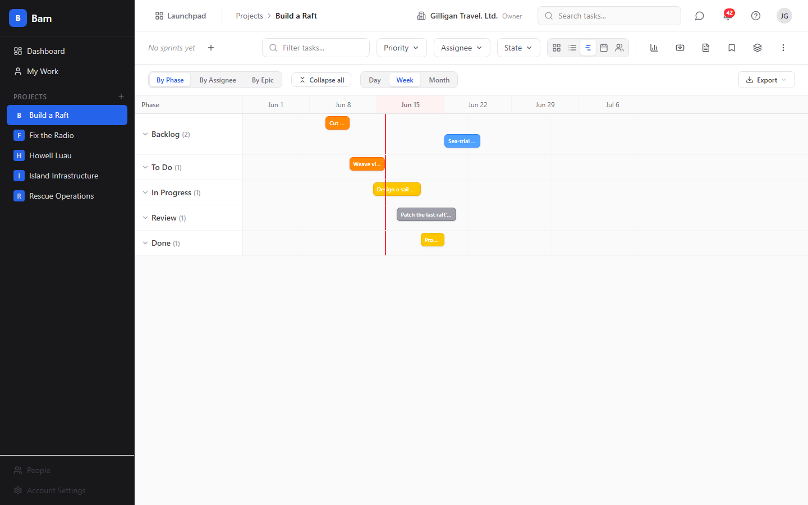</td>
    <td width="50%">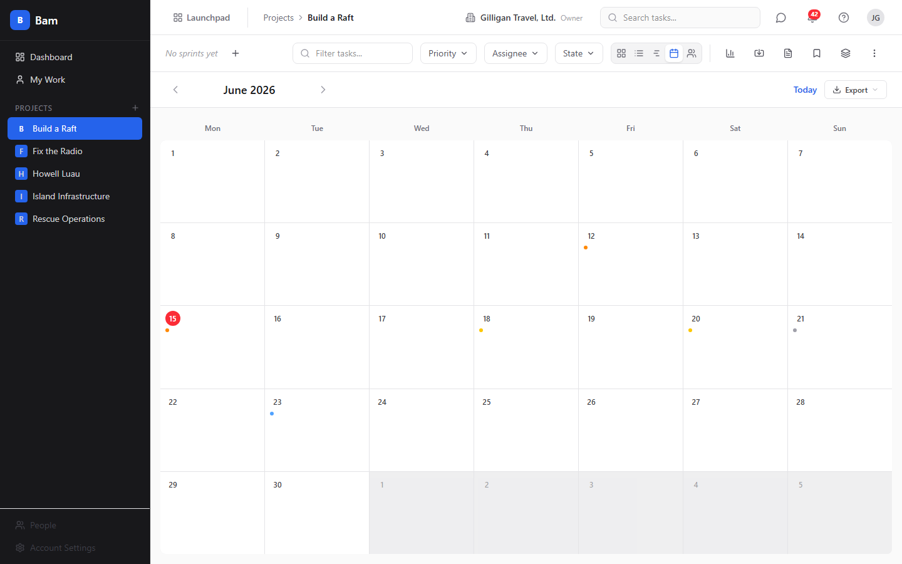</td>
  </tr>
  <tr>
    <td align="center"><em>Timeline / Gantt view</em></td>
    <td align="center"><em>Calendar view</em></td>
  </tr>
  <tr>
    <td width="50%"></td>
    <td width="50%"></td>
  </tr>
  <tr>
    <td align="center"><em>List / table view</em></td>
    <td align="center"><em>Project analytics dashboard</em></td>
  </tr>
  <tr>
    <td width="50%">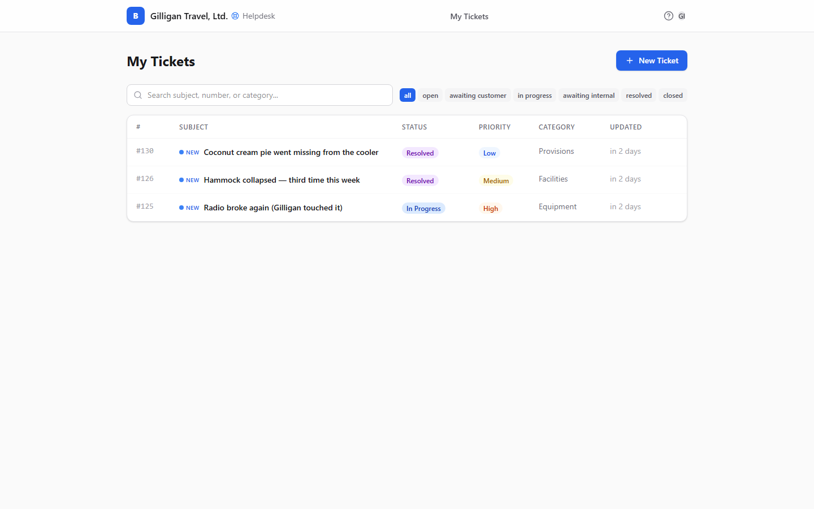</td>
    <td width="50%"></td>
  </tr>
  <tr>
    <td align="center"><em>Helpdesk ticket list</em></td>
    <td align="center"><em>Command palette (Ctrl+K)</em></td>
  </tr>
</table>

---

## For Teams

### Kanban Board

Drag-and-drop cards across 5 configurable phases with WIP limits. Each card shows priority, assignee, story points, due date, and comment count at a glance. Motion spring physics make the interactions feel natural.

<p align="center">
  
</p>
<p align="center"><em>Every screen is theme-aware - light for daytime, dark for late-night deploys (see the Theme-aware UI section below).</em></p>

### Swimlanes

Group tasks by assignee, priority, or epic. Collapsible rows show task count and total story points per group, making it easy to spot bottlenecks and unbalanced workloads.

<p align="center">
  
</p>

### Five Views, One Board

Every project supports five views - switch between them without losing your filters or context:

| View | What it shows |
|------|--------------|
| **Board** | Kanban columns with drag-and-drop cards |
| **List** | Sortable, filterable table with inline editing |
| **Timeline** | Gantt-style horizontal bars from start to due date |
| **Calendar** | Monthly calendar with tasks on their due dates |
| **Workload** | Team member capacity and allocation |

<table>
  <tr>
    <td width="50%"></td>
    <td width="50%"></td>
  </tr>
  <tr>
    <td align="center"><em>List view with sortable columns</em></td>
    <td align="center"><em>Timeline / Gantt view with today marker</em></td>
  </tr>
</table>

<p align="center">
  
</p>
<p align="center"><em>Calendar view - monthly navigation with task due dates</em></p>

### Task Detail

Click any card to open the detail drawer. Full rich-text description with image support, assignee, priority, phase, sprint, story points, start and due dates, subtasks, file attachments, comments with emoji reactions, and a complete activity feed.

<p align="center">
  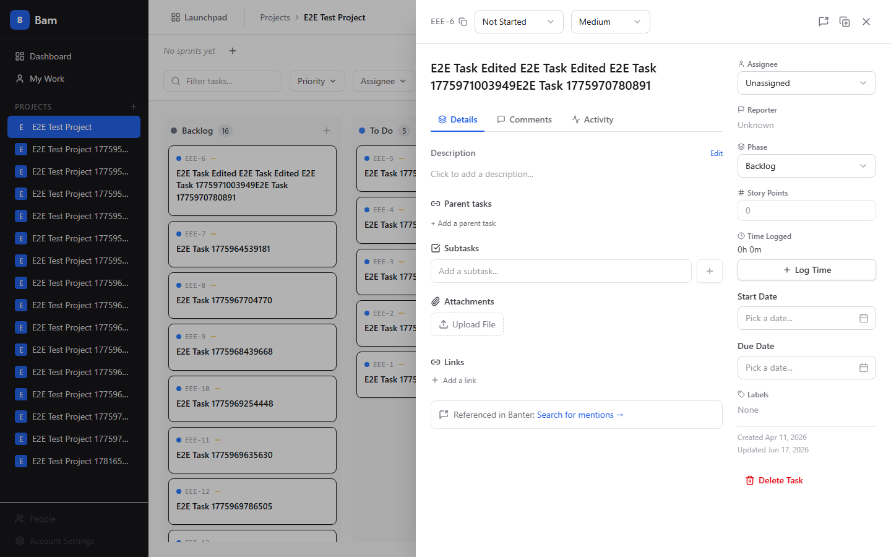
</p>

### Sprint Management

Create sprints, assign tasks, track velocity. When a sprint ends, the carry-forward ceremony moves incomplete work to the next sprint automatically. Sprint reports show burndown, velocity trends, and completion rates.

### Project Dashboard

Charts and widgets for sprint progress, priority breakdown, overdue tasks, task distribution by phase, and team workload - all in one place.

<p align="center">
  
</p>

### My Work

A cross-project view of everything assigned to you, grouped by project. One place to see your full plate.

<p align="center">
  
</p>

### Command Palette

Press **Ctrl+K** to open the command palette. Search tasks, switch projects, navigate views, and trigger actions without touching the mouse.

<p align="center">
  
</p>

### Organization Management

BigBlueBam ships a dedicated **People** surface (not buried under Settings) that covers the full identity lifecycle - invite, edit, assign, disable - with strict role-based gating.

<p align="center">
  
</p>

Filter by role or status, search by name or email, and act on individual members or in bulk.

#### Per-user detail, four tabs

<table>
  <tr>
    <td width="50%"></td>
    <td width="50%"></td>
  </tr>
  <tr>
    <td align="center"><em>Overview - identity, membership, disable toggle</em></td>
    <td align="center"><em>Projects - per-project roles, bulk assign</em></td>
  </tr>
  <tr>
    <td width="50%"></td>
    <td width="50%"></td>
  </tr>
  <tr>
    <td align="center"><em>Access - API keys, password reset, force change</em></td>
    <td align="center"><em>Activity - per-user audit trail</em></td>
  </tr>
</table>

Admins can reset passwords (manual or auto-generated), mint API keys on behalf of users with scoped permissions, force a password change on next login, or sign the user out of every device.

<table>
  <tr>
    <td width="50%"></td>
    <td width="50%"></td>
  </tr>
  <tr>
    <td align="center"><em>Reset password - auto-generate or set manually</em></td>
    <td align="center"><em>Create API key on behalf of a user (one-time token reveal)</em></td>
  </tr>
</table>

#### Bulk operations

Select multiple members to disable, enable, change role, remove from org, or export as CSV - all with rank-gating that mirrors the server:

<p align="center">
  
</p>

#### Multi-org membership

Users can belong to multiple organizations. The header shows the current org + role, and the org switcher lets multi-org users hop between them in one click - the session rotates and every query is invalidated, so the rest of the app instantly reflects the new org's data.

<p align="center">
  
</p>

A persistent banner warns when an org has no active owner, so operators can promote a replacement before the situation becomes invisible:

<p align="center">
  
</p>

#### SuperUser console

A separate SuperUser namespace at `/b3/superuser` gives platform operators cross-org visibility without impersonation. See every org on the server, context-switch into any of them, and manage users globally.

<p align="center">
  
</p>

**Cross-org user management** - one view of every user regardless of org:

<p align="center">
  
</p>

<table>
  <tr>
    <td width="50%"></td>
    <td width="50%"></td>
  </tr>
  <tr>
    <td align="center"><em>Every org the user belongs to - add, remove, change role, set default</em></td>
    <td align="center"><em>Every active session with IP, device, and revoke controls</em></td>
  </tr>
</table>

<p align="center">
  
</p>
<p align="center"><em>Audit log - every SuperUser action against this user with expandable details</em></p>

When a SuperUser is context-switched into a non-native org, a red banner and chip in the header make the privileged state impossible to miss:

<p align="center">
  
</p>

#### Forced password change

Admins can flag a user to require a password change on their next login. On sign-in, the user is bounced to a dedicated form that blocks every other page until a new password is set:

<p align="center">
  
</p>

#### Theme-aware UI

Every screen adapts to light and dark mode. Most of the shots in this README are dark; here's the same People list in light mode:

<p align="center">
  
</p>

#### Integrations

Configure calendar feeds, API keys, and webhooks under Settings:

<p align="center">
  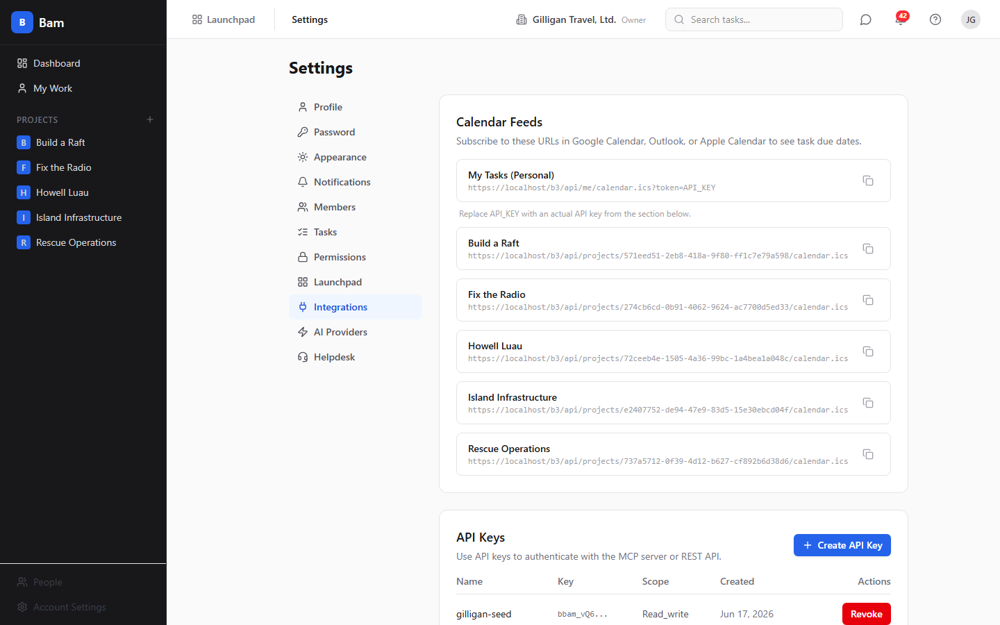
</p>

---

## For AI Agents

This is the part most work suites bolt on as an afterthought. BigBlueBam exposes **865 MCP (Model Context Protocol) tools** that give AI assistants first-class, read-write access to every app in the suite plus cross-cutting platform capabilities - the same operations a human gets through the UI, gated by the same permissions. Connect Claude, Claude Code, or any MCP-compatible agent and let it work alongside your team.

### What AI Agents Can Do

- **Create and manage tasks** - create tasks, set priority and assignee, move cards across phases, add subtasks, and upsert by external id for idempotent webhook/import flows
- **Run sprints** - create sprints, assign tasks, start/complete sprints, generate sprint reports
- **Triage helpdesk tickets** - when a customer submits a ticket, a task is auto-created; AI agents can then triage by adjusting priority, upserting the requester by email, checking for similar open tickets via the dedupe primitives, setting timelines, assigning to the right engineer, and posting responses to customers
- **Generate reports** - velocity reports, burndown charts, cumulative flow, workload distribution, overdue task alerts, plus phrase-count trend queries across helpdesk tickets and Bam tasks
- **Collaborate** - post comments, log time, bulk update tasks, suggest branch names
- **Message the team via Banter** - post messages immediately or schedule for later while respecting per-channel quiet hours, manage channels, react, search conversations and call transcripts, subscribe to message patterns, and participate in voice calls as spoken participants
- **Manage the knowledge base via Beacon** - create, publish, upsert-by-slug, search with semantic plus graph retrieval, verify content freshness, link related knowledge, manage governance policies, and save reusable queries
- **Author collaborative documents via Brief** - create, edit, upsert-by-slug, search documents, manage version history, leave inline comments, apply templates, and graduate finished documents into Beacons
- **Automate workflows with Bolt** - create trigger-condition-action rules, inspect executions, trace why each rule fired or skipped, browse templates, and orchestrate cross-product automations against the full 865-tool catalog
- **Track goals and OKRs with Bearing** - create time-boxed periods, define goals with key results, link KRs to Bam tasks for automatic progress, post status updates, and generate at-risk reports
- **Collaborate visually on Board** - create and manage whiteboard rooms, add and arrange shapes, read canvas content for AI analysis, manage participants, embed cross-product content, and run sticky-to-task pipelines
- **Manage CRM pipeline with Bond** - create, update, upsert-by-email, merge contacts, advance deals through pipeline stages, detect likely duplicates with confidence scores, log activities, and generate pipeline reports
- **Run email campaigns with Blast** - draft campaigns, build segments, generate templates and subject lines, schedule sends, and pull engagement analytics
- **Bill clients with Bill** - create invoices from deals or time entries, add line items, record payments, send reminders, and surface profitability and revenue summaries
- **Collect with Blank forms** - generate form definitions from a prompt, publish forms, export submissions, and summarize free-text responses
- **Schedule with Book** - create, update, cancel, and RSVP to events, and find meeting times across mixed human-plus-agent rosters
- **Analyze with Bench** - create dashboards, run ad-hoc queries, schedule reports, detect anomalies, and compare metrics across time periods
- **Find anything with cross-app platform tools** - `search_everything` fans out across seven searchable apps with normalized scoring; `resolve_references` turns free text into ranked entity candidates; `account_view` / `project_view` / `user_view` compose full subject-centric pictures; `entity_links_list` exposes durable cross-app relationships; `activity_query` and `activity_by_actor` read a unified activity log
- **Run responsibly** - `can_access` preflights visibility before surfacing entities to askers; `proposal_create` / `proposal_list` / `proposal_decide` drive a durable approval queue; `agent_heartbeat` tracks runner liveness; `agent_policy_set` gives operators kill switches and per-agent tool allowlists that fail closed; `agent_webhook_configure` pushes events to external runners with HMAC-signed retries, SSRF guards, and a dead-letter queue

### Example: AI-Powered Helpdesk Triage

> A customer submits a bug report through the helpdesk portal. BigBlueBam automatically creates a `FRND-` prefixed task on the board. An AI agent picks up the new task, analyzes the description, sets priority to High, assigns it to the right engineer based on the related epic, adjusts the timeline, and posts a response to the customer: *"Thanks for reporting this - we've assigned task FRND-247 to the team and it's been prioritized. We'll update you when there's a fix."*
>
> The engineer sees the triaged card on their board. The customer sees the response in their portal. The task was created automatically; the AI handled the triage.

### Example: AI Gathering Details from Vague Reports

> A customer submits a ticket: *"The app isn't working."* BigBlueBam auto-creates a task, and an AI agent picks it up. Recognizing the report lacks actionable detail, the agent responds to the customer through the helpdesk portal:
>
> *"Sorry to hear that! To help us investigate, could you provide a few details?*
> - *What were you trying to do when the issue occurred?*
> - *What device and browser are you using? (e.g., iPhone 14 / Safari, Windows / Chrome)*
> - *Does the issue happen every time or intermittently?*
> - *If possible, a screenshot of any error message would be very helpful."*
>
> The agent sets the task to `waiting_on_customer` and adds an internal note for the engineering team: *"Vague report - asked customer for repro steps, device info, and screenshots. Will re-triage once details come in."* When the customer replies with specifics, the agent updates the task description, sets the appropriate priority, and assigns it to the right engineer - all before a human touches it.

### MCP Tools Reference

**865 tools** across the 23 apps plus cross-cutting agentic platform surfaces:

| Category | Count | What they cover |
|----------|------:|-----------------|
| **Task Management** | 12 | CRUD, move, bulk update, duplicate, time logging, task-by-human-id, upsert-by-external-id |
| **Sprints** | 5 | CRUD, start, complete, report |
| **Projects** | 5 | List, get, create, test Slack webhook, disconnect GitHub |
| **Reports** | 8 | Velocity, burndown, CFD, cycle time, time tracking, overdue, workload, status distribution |
| **Comments** | 2 | List, add |
| **Members** | 4 | List, get my tasks, find user by name/email |
| **Bam Resolvers** | 4 | Phases, labels, states, epics |
| **Templates** | 2 | List, create from template |
| **Import** | 2 | CSV import, GitHub Issues import |
| **User Profile & Notifications** | 10 | Profile CRUD, org switching, password, logout, notification feed management |
| **User Resolver** | 3 | find_user_by_email, find_user_by_name, list_users |
| **Platform Admin** | 5 | Platform settings toggle, beta signups, public config (SuperUser-gated) |
| **Banter Messaging** | 53 | Channels, DMs, messages, threads, reactions, calls, search, scheduled posts, quiet-hours deferrals, admin, presence, preferences |
| **Banter Subscriptions** | 3 | Agent pattern-match subscribe / unsubscribe / list |
| **Beacon Knowledge Base** | 30 | CRUD, upsert-by-slug, search, verification, graph, policies, saved queries |
| **Brief Documents** | 18 | CRUD, upsert-by-slug, collaboration, versions, search, graduation, templates |
| **Bolt Automation** | 13 | Rule CRUD, execution management, templates, triggers, conditions, actions, get-by-name |
| **Bolt Observability** | 2 | bolt_event_trace, bolt_recent_events |
| **Bearing Goals** | 12 | Periods, goals, key results, progress, links, reports, at-risk detection |
| **Board Whiteboard** | 14 | Room CRUD, shapes, assets, canvas reading, participants, embeds, sticky-to-task |
| **Bond CRM** | 23 | Contacts (with upsert-by-email), companies, deals, pipeline stages, activities, notes, search, reports |
| **Blast Email Campaigns** | 14 | Campaigns, templates, segments, analytics, subject-line generation |
| **Bill Invoicing** | 16 | Invoices, line items, payments, expenses, clients, profitability, revenue summary |
| **Bench Analytics** | 11 | Dashboards, widgets, ad-hoc queries, scheduled reports, anomaly detection, period compare |
| **Book Scheduling** | 11 | Events, RSVPs, booking pages, availability (including mixed human-and-agent rosters) |
| **Blank Forms** | 11 | Forms, submissions, analytics, AI generation, response summarization |
| **Helpdesk** | 11 | Ticket operations, public/admin settings, user upsert-by-email |
| **Agent Identity** | 3 | agent_heartbeat, agent_audit, agent_self_report |
| **Agent Proposals** | 3 | proposal_create, proposal_list, proposal_decide |
| **Agent Policies** | 3 | agent_policy_get / set / list (per-agent kill switches and allowlists) |
| **Agent Webhooks** | 4 | Configure, rotate-secret, deliveries list, redeliver |
| **Visibility Preflight** | 1 | can_access |
| **Unified Activity** | 2 | activity_query, activity_by_actor |
| **Cross-App Search** | 1 | search_everything |
| **Fuzzy Entity Resolver** | 1 | resolve_references |
| **Composite Views** | 3 | account_view, project_view, user_view |
| **Entity Links** | 3 | entity_links_list / create / remove |
| **Attachments** | 2 | attachment_get, attachment_list (federated across apps) |
| **Dedupe** | 4 | bond_find_duplicates, helpdesk_find_similar_tickets, dedupe_record_decision, dedupe_list_pending |
| **Trend Queries** | 2 | helpdesk_ticket_count_by_phrase, bam_task_count_by_phrase |
| **Expertise** | 1 | expertise_for_topic (ranked across Beacon, Bam, Brief, Bond) |
| **Ingest Fingerprint** | 1 | ingest_fingerprint_check (Redis-backed intake dedup) |
| **Utility** | 2 | Server info, action confirmation (Redis-backed tokens with dynamic TTL) |

### MCP Setup

The canonical MCP endpoint is `/mcp/` on the public ingress (Streamable HTTP transport). Add this to your Claude Desktop or Claude Code configuration:

```json
{
  "mcpServers": {
    "bigbluebam": {
      "url": "http://localhost/mcp/",
      "headers": {
        "Authorization": "Bearer YOUR_API_KEY"
      }
    }
  }
}
```

Or from the Claude Code CLI:

```sh
claude mcp add --transport http bigbluebam https://YOUR_DOMAIN/mcp/ \
  --header "Authorization: Bearer YOUR_API_KEY"
```

Generate an API key from **Settings > Integrations** in the BigBlueBam UI. For server-to-server integrations, mint a `bbam_svc_`-prefixed service-account key instead (see the Provision the internal MCP service account section below). `/mcp/health` returns a liveness JSON with no auth; see [docs/reference/mcp-server.md](docs/reference/mcp-server.md#endpoint-paths) for the full endpoint map.

---

<!-- AUTODOCS:APP_SECTIONS:START -->
### Bam - Sprint-based Kanban project and task management

Bam is the BigBlueBam flagship: a multi-user Kanban planner where teams run projects on configurable boards, plan and close sprints, track tasks with rich detail, and report on delivery. Reach for it when a team needs to organize work into phases and time-boxed iterations.

66 routes, 54 schemas, 128 MCP tools


[Help](docs/apps/bam/help.md) | [Guide](docs/apps/bam/guide.md) | [Overview](docs/apps/bam/marketing.md) | [MCP Tools](docs/apps/bam/mcp-tools.md)

### Banter - Team chat for your organization

Banter is the chat layer of BigBlueBam. It gives your team channels, direct messages, threads, reactions, pins, and bookmarks so conversations live alongside the rest of the suite. Reach for it when work needs a back-and-forth instead of a ticket or a task.

22 routes, 23 schemas, 80 MCP tools


[Help](docs/apps/banter/help.md) | [Guide](docs/apps/banter/guide.md) | [Overview](docs/apps/banter/marketing.md) | [MCP Tools](docs/apps/banter/mcp-tools.md)

### Basis - Governed Metric Layer

Basis gives the whole suite one trusted definition per number, and an AI core that explains, in plain language, why a certified metric moved. Define a metric like "MRR" or "Pipeline" once, certify it, and every app, chart, and agent reads the same definition. Reach for Basis when different apps disagree about what a number means.

1 routes, 7 schemas, 16 MCP tools

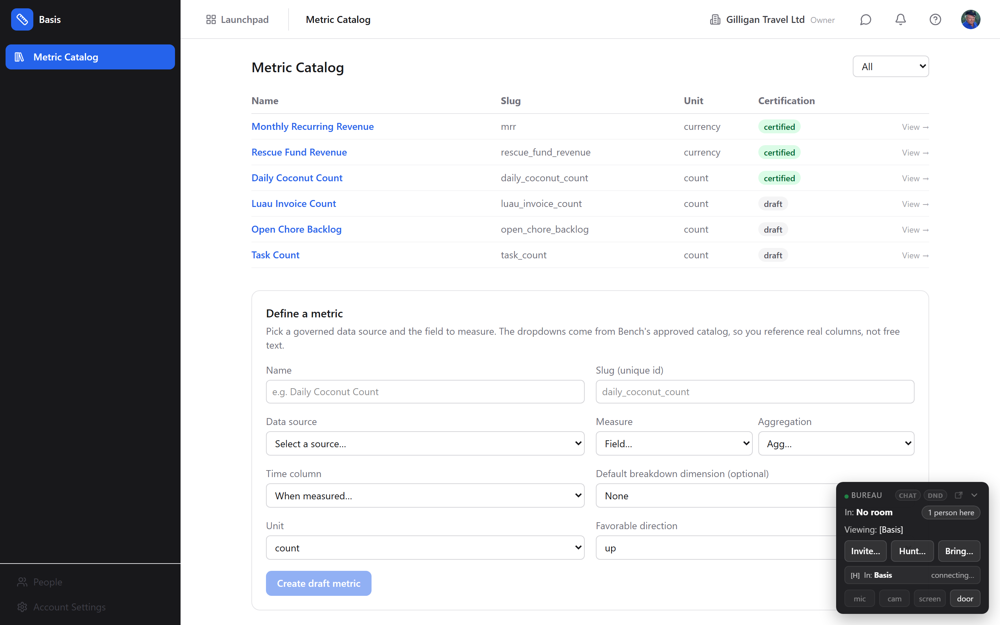

[Help](docs/apps/basis/help.md) | [Guide](docs/apps/basis/guide.md) | [MCP Tools](docs/apps/basis/mcp-tools.md)

### Bay - Media review and approval

Bay is the BigBlueBam media review and approval app. It turns a file sitting in Bin into a reviewable asset: a version stack, coordinate-anchored annotations, per-reviewer decisions, and a token-gated link you can hand to an outside client. It reviews stills, video, audio, and now interactive 3D models in the same place, and an AI agent reviews through the exact same tools, identity, and audit trail as a person.

6 routes, 8 schemas, 14 MCP tools

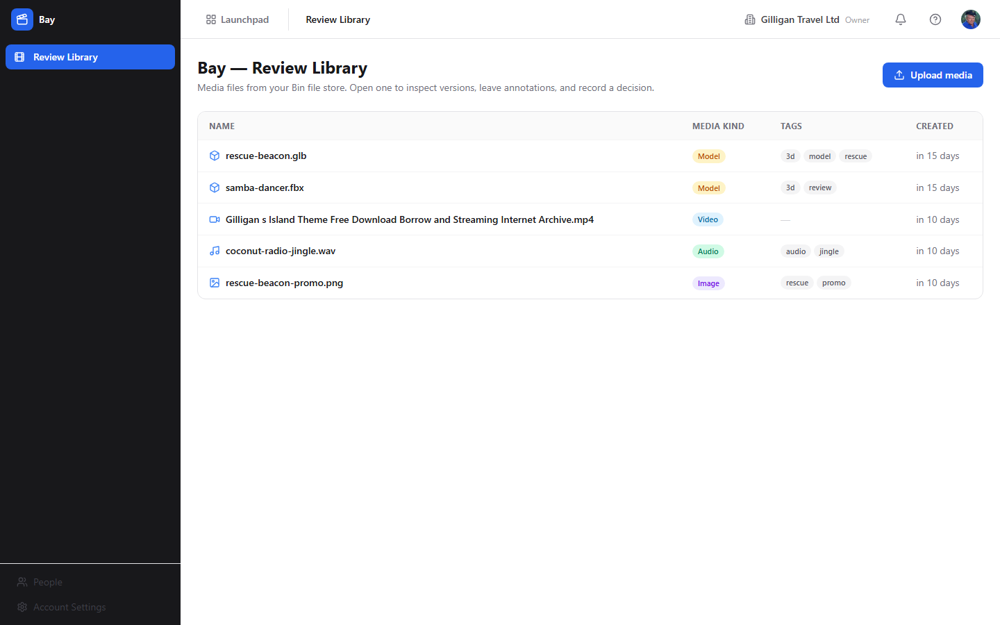

[Help](docs/apps/bay/help.md) | [Guide](docs/apps/bay/guide.md) | [Overview](docs/apps/bay/marketing.md) | [MCP Tools](docs/apps/bay/mcp-tools.md)

### Beacon - Knowledge base with freshness governance

Beacon is your team's knowledge base: a place to write, search, link, and keep articles current. It is the app you reach for when knowledge needs to stay accurate over time, not just get written once and forgotten.

9 routes, 12 schemas, 38 MCP tools


[Help](docs/apps/beacon/help.md) | [Guide](docs/apps/beacon/guide.md) | [Overview](docs/apps/beacon/marketing.md) | [MCP Tools](docs/apps/beacon/mcp-tools.md)

### Bearing - Goals and OKRs

Bearing is the goals and OKR tracker for BigBlueBam. Teams use it to set objectives for a time period, attach measurable key results, check in on progress, and surface the goals that are falling behind before the period ends.

4 routes, 9 schemas, 30 MCP tools


[Help](docs/apps/bearing/help.md) | [Guide](docs/apps/bearing/guide.md) | [Overview](docs/apps/bearing/marketing.md) | [MCP Tools](docs/apps/bearing/mcp-tools.md)

### Bench - Analytics and dashboards for the BigBlueBam suite

Bench builds shared analytics dashboards and ad-hoc queries across the other BigBlueBam apps. Reach for it when you want one place to chart deals, campaigns, goals, knowledge-base activity, and other suite data, then share or schedule those views for your team.

7 routes, 7 schemas, 32 MCP tools


[Help](docs/apps/bench/help.md) | [Guide](docs/apps/bench/guide.md) | [Overview](docs/apps/bench/marketing.md) | [MCP Tools](docs/apps/bench/mcp-tools.md)

### Bill - Invoicing and billing for client work

Bill turns the work your team does into invoices, tracks who has paid and who is overdue, captures project expenses, and reports on revenue and profitability. Reach for it when you need to bill a client, record a payment, or close out a billing period.

10 routes, 12 schemas, 47 MCP tools


[Help](docs/apps/bill/help.md) | [Guide](docs/apps/bill/guide.md) | [Overview](docs/apps/bill/marketing.md) | [MCP Tools](docs/apps/bill/mcp-tools.md)

### Bin - Digital asset manager and structured-data editor

Bin is BigBlueBam's file store and object-storage backbone. It holds your files and datasets, organizes them into folders, versions every change, gates access behind a security scan, and lets you edit CSV, JSON, and YAML data directly in the browser. Other apps stand on Bin: media hands off to Bay for review, and Blip stores its capture bytes here.

5 routes, 6 schemas, 19 MCP tools


[Help](docs/apps/bin/help.md) | [MCP Tools](docs/apps/bin/mcp-tools.md)

### Blank - Forms and surveys

Blank is the forms and surveys app in BigBlueBam. Build a form with drag-and-drop fields, publish it to a public URL, and collect and review responses without writing any code.

4 routes, 5 schemas, 20 MCP tools


[Help](docs/apps/blank/help.md) | [Guide](docs/apps/blank/guide.md) | [Overview](docs/apps/blank/marketing.md) | [MCP Tools](docs/apps/blank/mcp-tools.md)

### Blast - Email campaigns

Blast is the email campaign tool in the BigBlueBam suite. Marketers and operators use it to design HTML emails, target groups of Bond CRM contacts, send to those contacts, and track opens, clicks, bounces, and unsubscribes.

8 routes, 9 schemas, 28 MCP tools


[Help](docs/apps/blast/help.md) | [Guide](docs/apps/blast/guide.md) | [Overview](docs/apps/blast/marketing.md) | [MCP Tools](docs/apps/blast/mcp-tools.md)

### Blip - Telemetry, log, and profiling intake

Blip is the BigBlueBam intake and inspection layer for runtime telemetry coming from your own running software. Declare an app to track, embed an ingest key in your client, POST JSON reports, then watch them stream in live or query the accumulated history. Reach for it when you need logs, crash dumps, function timings, or custom counters from a shipped app collected inside the suite.

12 routes, 12 schemas, 38 MCP tools

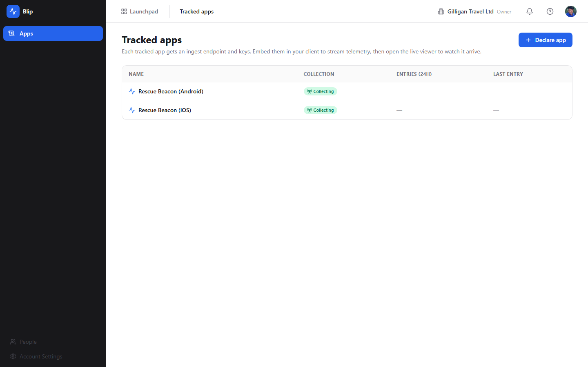

[Help](docs/apps/blip/help.md) | [Guide](docs/apps/blip/guide.md) | [Overview](docs/apps/blip/marketing.md) | [MCP Tools](docs/apps/blip/mcp-tools.md)

### Blueprint - Structured diagrams backed by a typed graph

Blueprint is a diagram editor whose diagrams are a typed relational graph of nodes and edges, not an opaque drawing. Reach for it when you want a flowchart, graph, org chart, mind map, or system map that every teammate, and every AI agent, can read, edit, version, and turn into Bam tasks with a full audit trail.

6 routes, 11 schemas, 36 MCP tools


[Help](docs/apps/blueprint/help.md) | [Guide](docs/apps/blueprint/guide.md) | [Overview](docs/apps/blueprint/marketing.md) | [MCP Tools](docs/apps/blueprint/mcp-tools.md)

### Board - Visual collaboration whiteboards

Board gives your team an infinite canvas for sketching ideas, running retros, mapping architecture, and brainstorming together. Reach for it when a list or a document is not enough and you need to draw, group, and arrange thoughts in space.

9 routes, 11 schemas, 40 MCP tools


[Help](docs/apps/board/help.md) | [Guide](docs/apps/board/guide.md) | [Overview](docs/apps/board/marketing.md) | [MCP Tools](docs/apps/board/mcp-tools.md)

### Bolt - Workflow automation for the BigBlueBam suite

Bolt watches for events across the BigBlueBam apps and reacts to them automatically. When something happens in one app (a task is created, a deal goes stale, a ticket breaches its SLA), Bolt runs a rule you defined and carries out one or more actions. Reach for it when you want work to happen without a person clicking a button.

7 routes, 10 schemas, 26 MCP tools


[Help](docs/apps/bolt/help.md) | [Guide](docs/apps/bolt/guide.md) | [Overview](docs/apps/bolt/marketing.md) | [MCP Tools](docs/apps/bolt/mcp-tools.md)

### Bond - CRM for contacts, companies, and deals

Bond is the BigBlueBam CRM. It tracks the people and companies you sell to, moves deals through a configurable pipeline, and reports on forecast, win rate, and stale deals. Reach for it when you need to manage relationships and close revenue.

13 routes, 16 schemas, 69 MCP tools


[Help](docs/apps/bond/help.md) | [Guide](docs/apps/bond/guide.md) | [Overview](docs/apps/bond/marketing.md) | [MCP Tools](docs/apps/bond/mcp-tools.md)

### Book - Scheduling and calendar for your team

Book is the BigBlueBam scheduling app. Use it to keep personal and team calendars, view what is happening across the suite on a timeline, set the working hours that drive availability, and publish public links that let outside people book time with you.

9 routes, 10 schemas, 25 MCP tools


[Help](docs/apps/book/help.md) | [Guide](docs/apps/book/guide.md) | [Overview](docs/apps/book/marketing.md) | [MCP Tools](docs/apps/book/mcp-tools.md)

### Braid - Identity Resolution and Golden Records

Braid braids every app's copy of a person or company into one confidence-scored golden profile, with a human-in-the-loop review queue for the merges it is not sure about. Reach for Braid when the same customer exists as a Bond contact, a Bill client, and a handful of Book attendees, and nothing in the suite decides they are one person.

1 routes, 11 schemas, 13 MCP tools

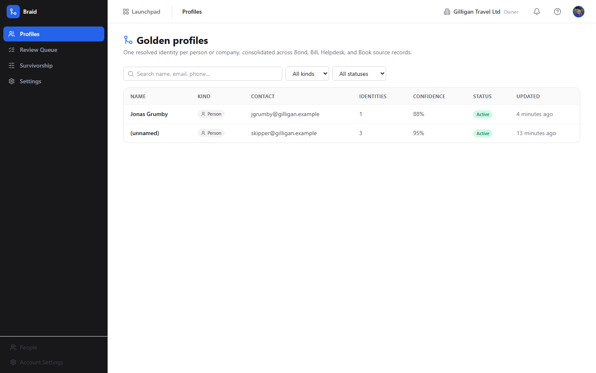

[Help](docs/apps/braid/help.md) | [Guide](docs/apps/braid/guide.md) | [MCP Tools](docs/apps/braid/mcp-tools.md)

### Brief - Collaborative documents with real-time editing

Brief is your team's collaborative document editor: a place to write, format, co-edit, comment on, and organize documents, then promote the ones that matter into your knowledge base. Reach for it when you need a shared, structured document that more than one person works on at once.

10 routes, 10 schemas, 48 MCP tools


[Help](docs/apps/brief/help.md) | [Guide](docs/apps/brief/guide.md) | [Overview](docs/apps/brief/marketing.md) | [MCP Tools](docs/apps/brief/mcp-tools.md)

### Bulwark - AI contract-obligation monitor

Bulwark reads your executed contracts, builds a clause-cited ledger of what each party owes and by when, arms a live clock on the obligations that matter, and drafts (never auto-sends) the notices and vendor-compliance chases a human then approves. Reach for it when a missed notice window or a lapsed insurance certificate would cost you a claim.

8 routes, 13 schemas, 16 MCP tools

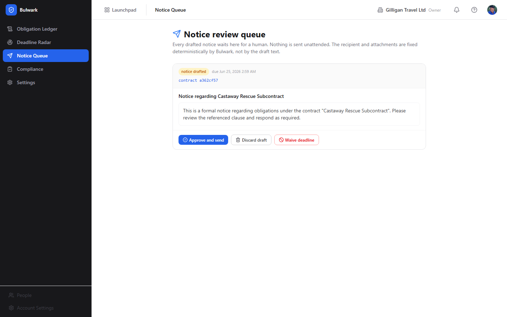

[Help](docs/apps/bulwark/help.md) | [Guide](docs/apps/bulwark/guide.md) | [MCP Tools](docs/apps/bulwark/mcp-tools.md)

### Bureau - Virtual office and presence

Bureau is a virtual office layer that stays open around everything else you do in the suite, so that "who is around right now" and "let's all go look at this together" are one click away no matter which app you are in. Reach for it when you want a sense of presence, a quick huddle, or a way to pull your teammates onto the same screen.

15 routes, 4 schemas, 37 MCP tools


[Help](docs/apps/bureau/help.md) | [Guide](docs/apps/bureau/guide.md) | [Overview](docs/apps/bureau/marketing.md) | [MCP Tools](docs/apps/bureau/mcp-tools.md)

### Burn - Contract Scope and Margin Monitor

Burn reads a signed proposal or SOW into a priced ledger of what was sold, then watches every unit of work against that ledger in dollars, so you can see the work nobody sold before it turns into an unbilled surprise. Reach for Burn when you deliver against fixed-scope contracts and need to know, continuously, whether the work matches the money.

9 routes, 18 schemas, 18 MCP tools

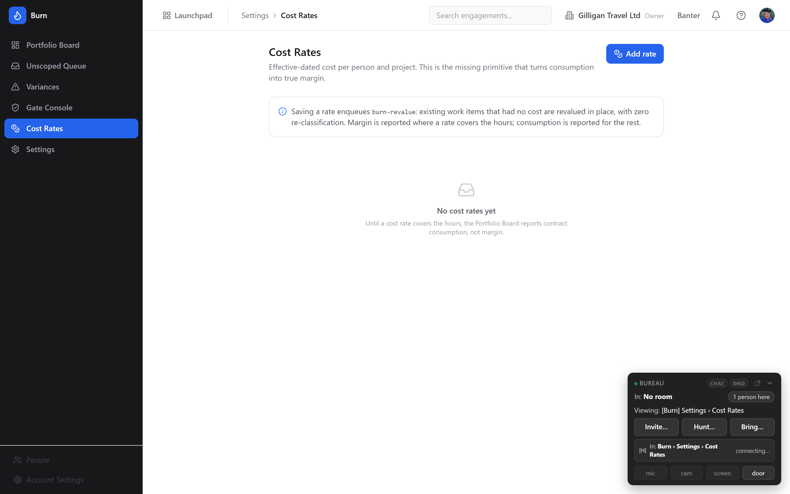

[Help](docs/apps/burn/help.md) | [Guide](docs/apps/burn/guide.md) | [MCP Tools](docs/apps/burn/mcp-tools.md)

### Bursar - Vendor-side procurement and absence detection

Bursar reads a request into a scope tree, then measures every vendor offer against it and tells you, in plain terms, what each offer leaves out. Reach for Bursar when you take in competing quotes and need to know which one quietly omits the thing you actually require.

undefined routes, undefined schemas


[Help](docs/apps/bursar/help.md) | [Guide](docs/apps/bursar/guide.md)

### Helpdesk - Support tickets and customer portal

Helpdesk is the public-facing support portal where your customers register, file tickets, track replies, and close out issues. Behind the scenes every ticket spawns a Bam task so your support staff can work it from the project board.

10 routes, 13 schemas, 11 MCP tools


[Help](docs/apps/helpdesk/help.md) | [Guide](docs/apps/helpdesk/guide.md) | [Overview](docs/apps/helpdesk/marketing.md) | [MCP Tools](docs/apps/helpdesk/mcp-tools.md)

### Introduction to BigBlueBam

An overview of the whole suite: the 24 apps, how they connect, and how AI agents work alongside your team.

[Help](docs/apps/introduction/help.md) | [Guide](docs/apps/introduction/guide.md) | [Overview](docs/apps/introduction/marketing.md) | [MCP Tools](docs/apps/introduction/mcp-tools.md)
<!-- AUTODOCS:APP_SECTIONS:END -->
---

## AI Provider Configuration

BigBlueBam features a hierarchical LLM provider configuration system that powers AI features across the suite - including Bolt's AI-assisted automation authoring, future summarization, and content generation features.

### How It Works

Providers are configured at three levels, with the most specific taking precedence:

| Scope | Who Configures | Applies To |
|-------|---------------|-----------|
| **System** | SuperUser | All organizations (fallback default) |
| **Organization** | Org Admin/Owner | All projects in the org |
| **Project** | Project Admin | Only that project |

### Supported Providers

| Provider | Type | Notes |
|----------|------|-------|
| **Anthropic** | `anthropic` | Claude models. Uses default API endpoint. |
| **OpenAI** | `openai` | GPT models. Uses default API endpoint. |
| **OpenAI-Compatible** | `openai_compatible` | Any endpoint implementing the OpenAI Chat Completions API - Azure OpenAI, Together AI, Ollama, vLLM, local LLMs, etc. Requires custom `api_endpoint`. |

### Security

- API keys are **encrypted at rest** using AES-256-GCM with the server's `SESSION_SECRET`
- Keys are **never returned in full** - always redacted to `sk-•••XXXX` (last 4 characters only)
- Scope-based authorization ensures only the right roles can configure each level
- Test Connection verifies credentials work before saving

### Setup

Configure providers in **Settings → AI Providers** in the Bam frontend. If no provider is configured, AI-dependent features (like Bolt's "Describe your automation" dialog) show a helpful message directing admins to the setup page.

---

## Quick Start

> **📖 Full deployment guide:** [docs/guides/deployment.md](docs/guides/deployment.md) - step-by-step walkthrough with interactive setup wizard, password generation, platform selection (Docker Compose for self-hosted; Railway for managed cloud - both fully automated), and tier progression from single-machine to Kubernetes.

### Guided Setup (Recommended)

The interactive deploy script handles everything - installs dependencies, generates secrets, provisions infrastructure, and creates your admin account:

```bash
git clone https://github.com/eoffermann/BigBlueBam.git
cd BigBlueBam

# Linux / macOS
./scripts/deploy.sh

# Windows (PowerShell)
.\scripts\deploy.ps1
```

### Manual Setup with Docker Compose

If you prefer to set things up manually:

```bash
# Clone the repo
git clone https://github.com/eoffermann/BigBlueBam.git
cd BigBlueBam

# Set up environment
cp .env.example .env
# Edit .env with your secrets (passwords, session secret)

# Start all services
docker compose up -d

# Create your admin account
docker compose exec api node dist/cli.js create-admin \
  --email admin@example.com \
  --password YourPassword123 \
  --name "Admin User" \
  --org "My Organization"
```

#### Provision the internal MCP service account

Bolt automations and the background worker invoke MCP tools over an internal HTTP path (`POST /mcp/tools/call`) instead of holding a persistent MCP session. That path is authenticated two ways: a shared secret (`INTERNAL_SERVICE_SECRET`, already generated by `cp .env.example .env` or the deploy script) plus a bearer token tied to a dedicated service-account user that `mcp-server` uses to talk to the rest of the stack on behalf of internal callers.

If `MCP_INTERNAL_API_TOKEN` is blank in your `.env`, `mcp-server` still boots and external MCP clients (Claude Desktop, Claude Code) work fine - but every call to `POST /mcp/tools/call` returns HTTP 503 with `INTERNAL_NOT_CONFIGURED`, which means **Bolt automations that invoke MCP tools will fail** and any worker job relying on the internal path won't be able to call MCP tools either. For a self-hosted single-operator setup you can leave it blank; for anything that needs Bolt-to-MCP integration, provision the token once:

```bash
# 1. Mint a service account + API key (prefix bbam_svc_). The --org-slug
#    is the one you created with create-admin above; slugify() lowercases
#    and hyphenates the --org value (e.g. "My Organization" becomes
#    "my-organization"). Run `docker compose exec api node dist/cli.js list-orgs`
#    if you're not sure.
docker compose exec api node dist/cli.js create-service-account \
  --name mcp-internal \
  --org-slug my-organization

# 2. The command prints a token once:
#       Token:      bbam_svc_abcdef0123456789...
#    Copy that value (not the command output around it) and paste it into .env:
#       MCP_INTERNAL_API_TOKEN=bbam_svc_abcdef0123456789...

# 3. Restart mcp-server so it picks up the new env var.
docker compose up -d --force-recreate mcp-server
```

You only need to do this once per stack. If you wipe the postgres volume you will need to re-mint the token because the service-account user lives in the database. The token is not rotated automatically; to rotate, mint a new service account with a different `--name`, swap the env var, restart, then delete the old service-account user via `docker compose exec api node dist/cli.js revoke-api-key --prefix bbam_svc`.

Open **http://localhost/b3/** to access BigBlueBam, **http://localhost/banter/** for Banter, **http://localhost/beacon/** for Beacon, **http://localhost/brief/** for Brief, **http://localhost/bolt/** for Bolt, **http://localhost/bearing/** for Bearing, **http://localhost/board/** for Board, **http://localhost/bond/** for Bond CRM, or **http://localhost/helpdesk/** for the helpdesk portal.

<p align="center">
  
</p>
<p align="center"><em>The login page - clean and branded.</em></p>

After login, you land on the project dashboard:

<p align="center">
  
</p>

### Services

All services are accessed through a single nginx container on port 80:

| URL Path | Backend | Description |
|----------|---------|-------------|
| `/` | redirect | Redirects to `/helpdesk/` |
| `/b3/` | nginx | Bam React SPA |
| `/b3/api/` | Fastify `:4000` | Bam REST API |
| `/b3/ws` | Fastify `:4000` | WebSocket (real-time updates) |
| `/banter/` | nginx | Banter team messaging SPA |
| `/banter/api/` | Fastify `:4002` | Banter REST API |
| `/banter/ws` | Fastify `:4002` | Banter WebSocket (real-time messaging) |
| `/helpdesk/` | nginx | Helpdesk portal SPA |
| `/helpdesk/api/` | Fastify `:4001` | Helpdesk API (auth, tickets, messages) |
| `/files/` | MinIO `:9000` | Uploaded files (shared) |
| `/beacon/` | nginx | Beacon knowledge base SPA |
| `/beacon/api/` | Fastify `:4004` | Beacon REST API |
| `/brief/` | nginx | Brief collaborative document editor SPA |
| `/brief/api/` | Fastify `:4005` | Brief REST API |
| `/brief/ws` | Fastify `:4005` | Brief WebSocket (real-time co-editing) |
| `/bolt/` | nginx | Bolt workflow automation SPA |
| `/bolt/api/` | Fastify `:4006` | Bolt REST API |
| `/bearing/` | nginx | Bearing Goals & OKRs SPA |
| `/bearing/api/` | Fastify `:4007` | Bearing REST API |
| `/board/` | nginx | Board visual collaboration SPA |
| `/board/api/` | Fastify `:4008` | Board REST API |
| `/board/ws` | Fastify `:4008` | Board WebSocket (real-time canvas sync) |
| `/bond/` | nginx | Bond CRM SPA |
| `/bond/api/` | Fastify `:4009` | Bond REST API |
| `/blast/` | nginx | Blast email campaigns SPA |
| `/blast/api/` | Fastify `:4010` | Blast REST API |
| `/t/` | Fastify `:4010` | Blast open/click tracking (pixel + redirect) |
| `/unsub/` | Fastify `:4010` | Blast unsubscribe endpoint |
| `/bench/` | nginx | Bench analytics SPA |
| `/bench/api/` | Fastify `:4011` | Bench REST API |
| `/book/` | nginx | Book scheduling SPA |
| `/book/api/` | Fastify `:4012` | Book REST API |
| `/blank/` | nginx | Blank forms SPA |
| `/blank/api/` | Fastify `:4013` | Blank REST API |
| `/bill/` | nginx | Bill invoicing SPA |
| `/bill/api/` | Fastify `:4014` | Bill REST API |
| `/blueprint/` | nginx | Blueprint structured-diagrams SPA |
| `/blueprint/api/` | Fastify `:4015` | Blueprint REST API |
| `/blueprint/ws` | Fastify `:4015` | Blueprint WebSocket |
| `/bureau/` | nginx | Bureau virtual-office SPA |
| `/bureau/api/` | Fastify `:4015` | Bureau REST API (distinct container; shares port :4015) |
| `/bureau/ws` | Fastify `:4015` | Bureau WebSocket (presence, knocks, summons) |
| `/bin/` | nginx | Bin DAM / structured-data SPA |
| `/bin/api/` | Fastify `:4016` | Bin REST API |
| `/bin/ws` | Fastify `:4016` | Bin WebSocket (live structured-data edits + presence) |
| `/bay/` | nginx | Bay media-review SPA |
| `/bay/api/` | Fastify `:4017` | Bay REST API (incl. token-gated guest review) |
| `/bay/ws` | Fastify `:4017` | Bay WebSocket (live annotations/decisions) |
| `/blip/` | nginx | Blip telemetry SPA |
| `/blip/api/` | Fastify `:4018` | Blip REST API |
| `/blip/ws` | Fastify `:4018` | Blip WebSocket (live log stream) |
| `/blip/ingest/` | Fastify `:4018` | Blip telemetry ingest (bearer-token) |
| `/mcp/` | MCP Server `:3001` | Model Context Protocol (865 tools) |

Infrastructure services (internal, not exposed via nginx):

| Service | Port | Description |
|---------|------|-------------|
| PostgreSQL | `:5432` | Primary database |
| Redis | `:6379` | Cache, PubSub, queues |
| MinIO | `:9000` | S3-compatible file storage |
| Worker | -- | BullMQ background job processor |
| LiveKit | `:7880` | Voice/video SFU (WebRTC media server) |
| Qdrant | `:6333` | Vector search engine (semantic embeddings) |
| Voice Agent | `:4003` | AI voice call participation (Python/FastAPI) |

### Development Mode

```bash
pnpm install
pnpm --filter @bigbluebam/shared build
docker compose -f docker-compose.yml -f docker-compose.dev.yml up
```

### Run Tests

```bash
pnpm test  # 900+ tests across all packages
```

---

## Architecture

```
┌──────────────────────────────────────────────────────────────────────┐
│                       Clients (Browser / AI)                         │
└────────────────────────┬──────────────────────┬──────────────────────┘
                         │ HTTP :80              │ WebRTC
┌────────────────────────▼──────────────────────┐│
│               nginx (single container, :80)    ││
│  /b3/          → Bam SPA (static)               ││
│  /b3/api/      → Fastify API :4000             ││
│  /b3/ws        → WebSocket :4000               ││
│  /banter/      → Banter SPA (static)           ││
│  /banter/api/  → Banter API :4002              ││
│  /banter/ws    → Banter WebSocket :4002        ││
│  /beacon/      → Beacon SPA (static)           ││
│  /beacon/api/  → Beacon API :4004              ││
│  /brief/       → Brief SPA (static)            ││
│  /brief/api/   → Brief API :4005               ││
│  /brief/ws     → Brief WebSocket :4005         ││
│  /bolt/        → Bolt SPA (static)             ││
│  /bolt/api/    → Bolt API :4006                ││
│  /bearing/     → Bearing SPA (static)          ││
│  /bearing/api/ → Bearing API :4007             ││
│  /board/       → Board SPA (static)            ││
│  /board/api/   → Board API :4008               ││
│  /board/ws     → Board WebSocket :4008         ││
│  /bond/        → Bond SPA (static)             ││
│  /bond/api/    → Bond API :4009                ││
│  /helpdesk/    → Helpdesk SPA (static)         ││
│  /helpdesk/api/→ Helpdesk API :4001            ││
│  /files/       → MinIO :9000                   ││
│  /mcp/         → MCP Server :3001              ││
│  + Bay, Bin, Blip, Blast, Bench, Book, Blank,  ││
│    Bill, Blueprint, Bureau (see Services table)││
└──────┬──────────┬──────────┬───────────────────┘│
       │          │          │                     │
┌──────▼────┐ ┌──▼───────┐ ┌▼──────────┐ ┌──────────┐ ┌───────▼──────┐ ┌──────────┐
│ Bam API   │ │ Banter   │ │ MCP Server│ │ Brief    │ │ Bolt API │ │ LiveKit SFU  │ │ Worker   │
│ :4000     │ │ API :4002│ │ :3001     │ │ API :4005│ │ :4006    │ │ :7880 (voice)│ │ BullMQ   │
│ +WebSocket│ │ +WS      │ │ 865 tools │ │ +WS      │ │          │ │ +voice-agent │ │ jobs     │
└─────┬─────┘ └────┬─────┘ └─────┬─────┘ └────┬─────┘ └──────────────┘ └────┬─────┘
      │             │             │            │                  │
┌─────▼─────────────▼─────────────▼────────────▼───────────────────▼───┐
│  PostgreSQL 16  │  Redis 7        │  MinIO (S3)   │  Qdrant (vectors)    │
│  40+ tables     │  PubSub + cache │  File storage │  Semantic search     │
└──────────────────────┴──────────────────────┴────────────────────────┘
```

### Tech Stack

| Layer | Technology |
|-------|-----------|
| **Frontend** | React 19, TailwindCSS v4, Motion, TanStack Query, Zustand, dnd-kit, Radix UI, three.js (Bay 3D viewer) |
| **API** | Node.js 22, Fastify v5, Drizzle ORM, Zod |
| **Realtime** | WebSocket + Redis PubSub |
| **MCP** | @modelcontextprotocol/sdk (Streamable HTTP + SSE) |
| **Voice/Video** | LiveKit SFU, WebRTC, Python voice agent (STT/TTS) |
| **Database** | PostgreSQL 16, Redis 7, MinIO, Qdrant |
| **Worker** | BullMQ, Nodemailer |
| **Build** | Turborepo, pnpm workspaces, tsup, Vite |
| **Testing** | Vitest (900+ tests) |
| **Deploy** | Docker Compose, multi-stage Dockerfiles |

### Monorepo Structure

```
apps/
  api/              → Bam Fastify REST API + WebSocket (project management core)
  frontend/         → Every React SPA under one container
  mcp-server/       → MCP protocol server (865 tools, Redis-backed confirm tokens)
  worker/           → BullMQ background jobs (emails, notifications, scheduled Banter posts, webhook dispatch + DLQ)
  helpdesk-api/     → Helpdesk Fastify API (tickets, messages, similar-tickets lookup, user upsert)
  banter-api/       → Banter Fastify API + WebSocket (channels, threads, calls, quiet hours, scheduled posts, agent subscriptions)
  beacon-api/       → Beacon Fastify API (knowledge base, search, graph, policies, upsert-by-slug)
  brief-api/        → Brief Fastify REST API + WebSocket (collaborative docs with upsert-by-slug)
  bolt-api/         → Bolt Fastify REST API (workflow automation, rules, executions, event trace, drift detection)
  bearing-api/      → Bearing Fastify REST API (goals, key results, progress, reporting)
  board-api/        → Board Fastify REST API + WebSocket (whiteboard rooms, shapes, conferencing)
  bond-api/         → Bond Fastify REST API (CRM with upsert-by-email and dedupe primitives)
  blast-api/        → Blast Fastify REST API (email campaigns, templates, segments, analytics)
  bench-api/        → Bench Fastify REST API (analytics dashboards, ad-hoc queries, scheduled reports)
  book-api/         → Book Fastify REST API (scheduling with mixed human/agent availability)
  blank-api/        → Blank Fastify REST API (forms, submissions, conditional routing)
  bill-api/         → Bill Fastify REST API (invoicing, expenses, PDF generation, recurring billing)
  blueprint-api/    → Blueprint Fastify REST API + WebSocket (typed graph diagrams, ELK auto-layout, Mermaid I/O)
  bureau-api/       → Bureau Fastify API + WebSocket (virtual office: floors, rooms, presence, knocks, LiveKit tokens)
  bin-api/          → Bin Fastify API + WebSocket (DAM / object storage + structured-data editor)
  bay-api/          → Bay Fastify API + WebSocket (media review & approval, incl. FBX/3D; token-gated guest links)
  blip-api/         → Blip Fastify API + WebSocket + ingest (app telemetry / log-ingest & observability)
  voice-agent/      → AI voice agent (Python/FastAPI, LiveKit Agents SDK)
  integration-tests/→ Cross-app integration harness (Vitest + mock service clients)
  e2e/              → Playwright end-to-end suite
packages/
  shared/           → Zod schemas, TypeScript types, mention-syntax, publishBoltEvent helper
  ui/               → Shared React component library
  logging/          → Pino-based structured logger shared across services
  service-health/   → /healthz + /readyz Fastify plugin
  db-stubs/         → Drizzle stubs and test bootstraps
  livekit-tokens/   → LiveKit access-token minting
  storage/          → Pluggable S3/MinIO storage driver (shared by api, bin-api, bay-api, worker)
  permissions/      → Fastify permissions plugin + resolver (app.resource.verb catalog)
  structured-data/  → CSV/JSONL/YAML codecs + Yjs CRDT for Bin's structured-data editor
  smtp-resolver/    → Shared SMTP-config precedence resolver (api + worker)
  bureau-client/    → Suite-wide LiveKit "docked box" client (calls, presence, knock/summon)
  docs-capture/     → Recipe-driven populated-screenshot capture engine (gilligan cast)
infra/
  postgres/         → 187 idempotent numbered migrations (tip 0225)
  nginx/            → Reverse proxy config (single nginx serves every SPA)
  livekit/          → LiveKit SFU configuration
  helm/             → Kubernetes Helm chart
docs/               → Hand-authored plus generated per-app docs
scripts/            → Deploy adapters, seeders, drift guards, screenshot generators
site/               → Marketing site (served at /)
```

### Key Numbers

| Metric | Count |
|--------|-------|
| Apps | 23 (Bam, Banter, Basis, Bay, Beacon, Bearing, Bench, Bill, Bin, Blank, Blast, Blip, Blueprint, Board, Bolt, Bond, Book, Braid, Brief, Bulwark, Bureau, Burn, Helpdesk) |
| MCP tools | 865 across 53 modules (128 Bam + 80 Banter + 69 Bond + 48 Brief + 47 Bill + 40 Board + 38 Blip + 38 Beacon + 37 Bureau + 36 Blueprint + 32 Bench + 30 Bearing + 28 Blast + 26 Bolt + 25 Book + 20 Blank + 19 Bin + 18 Burn + 16 Basis + 16 Bulwark + 14 Bay + 13 Braid + 11 Helpdesk + 36 cross-cutting platform) |
| Bolt event catalog | 122 registered events across app and platform sources |
| Test cases | 900+ |
| Migrations | 187 (tip 0225, additive + idempotent) |

---

## Documentation
<!-- AUTODOCS:DOCS_INDEX:START -->

| Document | Description |
|----------|-------------|
| [Getting Started](docs/guides/getting-started.md) | Setup, first run, troubleshooting |
| [Deployment](docs/guides/deployment.md) | Quickstart wizard, tiers, scaling, Docker Compose + Railway |
| [Operations](docs/guides/operations.md) | Updates, backups, maintenance, troubleshooting |
| [Development](docs/guides/development.md) | Contributing, testing, code style, monorepo workflow |
| [Architecture](docs/reference/architecture.md) | System design, data flow, components |
| [Database](docs/reference/database.md) | ER diagrams, table descriptions, indexing |
| [API Reference](docs/reference/api-reference.md) | All REST endpoints with examples |
| [MCP Server](docs/reference/mcp-server.md) | Tools, resources, prompts, configuration |
| [Permissions](docs/reference/permissions.md) | Permission model, roles, scoping |
| [Agent Conventions](docs/reference/agent-conventions.md) | Rules agents must follow (visibility preflight, audit) |
| | |
| **Per-App Guides** | |
| [Bam (Project Management) Guide](docs/apps/bam/guide.md) | User guide and MCP tool reference |
| [Banter (Team Messaging) Guide](docs/apps/banter/guide.md) | User guide and MCP tool reference |
| [Basis Guide](docs/apps/basis/guide.md) | User guide and MCP tool reference |
| [Bay Guide](docs/apps/bay/guide.md) | User guide and MCP tool reference |
| [Beacon (Knowledge Base) Guide](docs/apps/beacon/guide.md) | User guide and MCP tool reference |
| [Bearing (Goals & OKRs) Guide](docs/apps/bearing/guide.md) | User guide and MCP tool reference |
| [Bench (Analytics) Guide](docs/apps/bench/guide.md) | User guide and MCP tool reference |
| [Bill (Invoicing) Guide](docs/apps/bill/guide.md) | User guide and MCP tool reference |
| [Bin Guide](docs/apps/bin/guide.md) | User guide and MCP tool reference |
| [Blank (Forms) Guide](docs/apps/blank/guide.md) | User guide and MCP tool reference |
| [Blast (Email Campaigns) Guide](docs/apps/blast/guide.md) | User guide and MCP tool reference |
| [Blip Guide](docs/apps/blip/guide.md) | User guide and MCP tool reference |
| [Blueprint Guide](docs/apps/blueprint/guide.md) | User guide and MCP tool reference |
| [Board (Visual Collaboration) Guide](docs/apps/board/guide.md) | User guide and MCP tool reference |
| [Bolt (Workflow Automation) Guide](docs/apps/bolt/guide.md) | User guide and MCP tool reference |
| [Bond (CRM) Guide](docs/apps/bond/guide.md) | User guide and MCP tool reference |
| [Book (Scheduling) Guide](docs/apps/book/guide.md) | User guide and MCP tool reference |
| [Braid Guide](docs/apps/braid/guide.md) | User guide and MCP tool reference |
| [Brief (Documents) Guide](docs/apps/brief/guide.md) | User guide and MCP tool reference |
| [Bulwark Guide](docs/apps/bulwark/guide.md) | User guide and MCP tool reference |
| [Bureau Guide](docs/apps/bureau/guide.md) | User guide and MCP tool reference |
| [Burn Guide](docs/apps/burn/guide.md) | User guide and MCP tool reference |
| [Bursar Guide](docs/apps/bursar/guide.md) | User guide and MCP tool reference |
| [Helpdesk (Support Portal) Guide](docs/apps/helpdesk/guide.md) | User guide and MCP tool reference |
| [Introduction to BigBlueBam Guide](docs/apps/introduction/guide.md) | User guide and MCP tool reference |

<!-- AUTODOCS:DOCS_INDEX:END -->
---

## License

MIT -- see [LICENSE](LICENSE).

---

<p align="center">
  Built with <a href="https://claude.ai/code">Claude Code</a>
</p>
