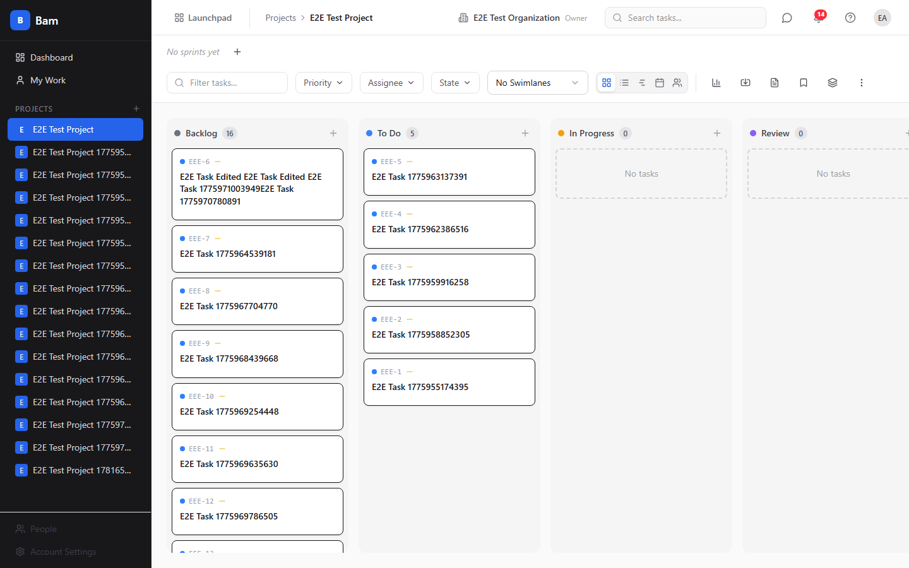
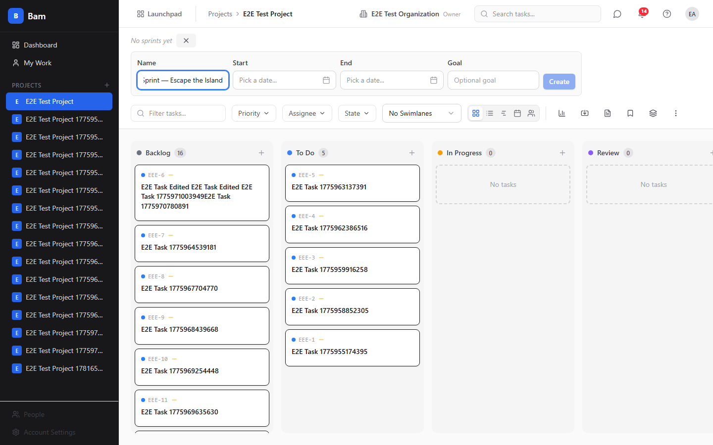
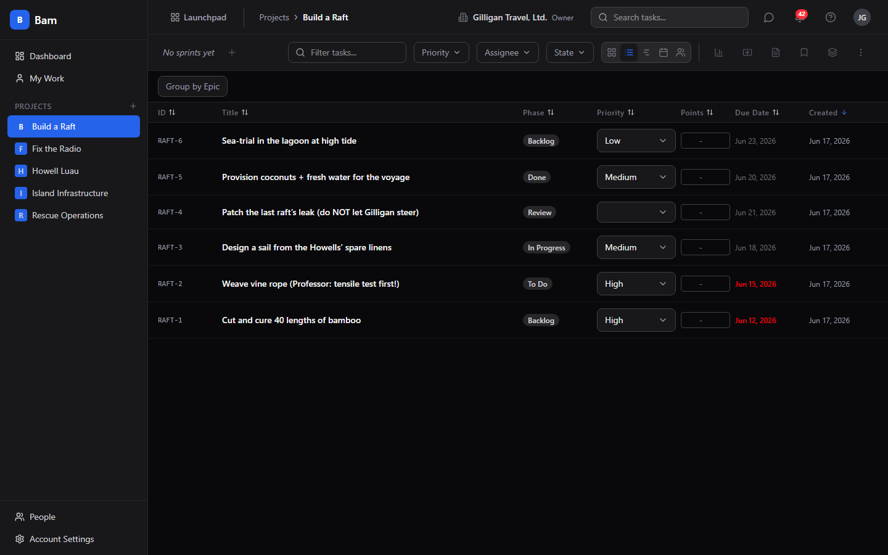
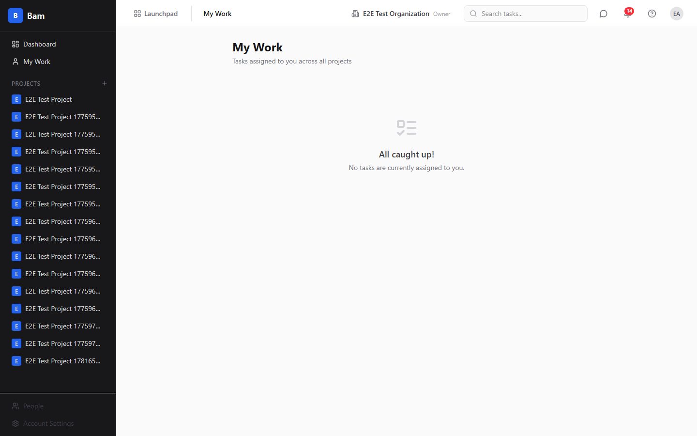
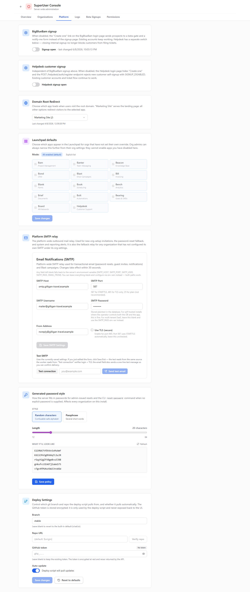
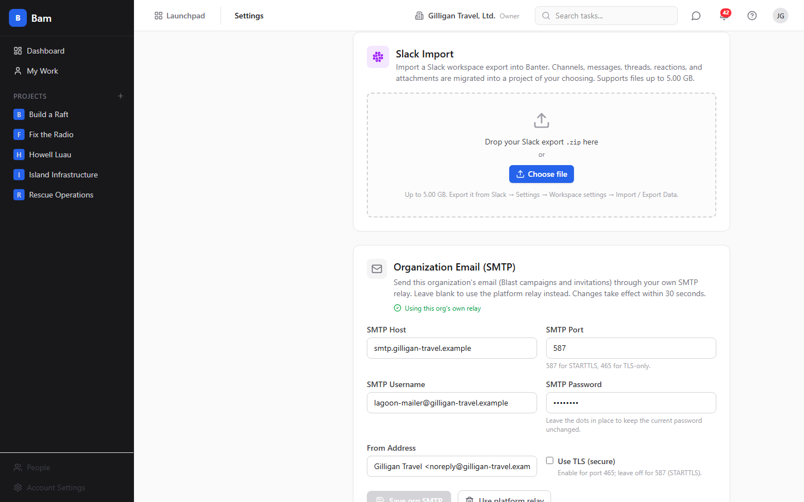

# Bam (Project Management) Guide

# Bam - Project Management

Bam is the flagship project management app in BigBlueBam: Kanban boards with
sprint-based task tracking, configurable per project, built for small-to-medium
teams.

## Key Features

- **Kanban board** with drag-and-drop task cards, configurable phase columns, and
  swimlanes by assignee, priority, or epic
- **Sprints** with carry-forward mechanics that route unfinished work to the next
  sprint, the backlog, or cancellation while preserving history for reporting
- **Rich tasks** with subtasks and multiple parents, start and due dates, story
  points, custom fields (seven types), comments with reactions and revision
  history, time entries, attachments, and a done-gate that blocks closing a task
  with open subtasks
- **Five views** - Board, List, Timeline (Gantt, driven by start and due dates),
  Calendar, and Workload - plus saved views that persist a filter, sort, swimlane,
  and view-type preset
- **My Work** showing only the tasks assigned to you across every project, grouped
  into Overdue, Due This Week, In Progress, and All My Tasks
- **Reports** for velocity, burndown, cumulative flow, cycle time, overdue,
  workload, time tracking, and status distribution
- **Import** from CSV, Trello, Jira, or GitHub Issues, and **export** to JSON or
  CSV, with an iCal feed for task due dates
- **Agent-ready** - nearly every board action is available as an MCP tool, so an
  AI agent can plan a sprint, create and move tasks, or run a report

## Integrations

Bam shares authentication and org context with every other BigBlueBam app.
Helpdesk tickets can spawn Bam tasks (a Helpdesk tab then appears on the task),
GitHub commits and pull requests link back to tasks, Slack receives sprint and
task notifications, tasks can be shared into Banter channels and deep-linked back
by human id, and task, sprint, epic, and comment changes emit events to Bolt for
automation. The command palette (Cmd+K) and Launchpad provide quick navigation
across the suite.

Outbound email resolves through a two-level relay. A platform SuperUser sets a
platform-wide SMTP relay in the SuperUser Console (the system and fallback sender
for org invitations, password resets, and system reports), and any organization
can set its own relay in Settings > Integrations to override it for that org's
mail. Resolution runs org override first, then platform relay, then the server's
environment default.

## Getting Started

After logging in, create your first project from the dashboard and pick a template
(kanban_standard, scrum, bug_tracking, or minimal) so phases and states arrive
seeded. Add tasks to the board, assign them to anyone in your org (assignment is
not limited to project members), and group them into a sprint. Invite teammates
through the People page. Use keyboard shortcuts (press ? for help, N to create a
task, Cmd+K for the command palette) to move fast. Sprint reports and project
dashboards give you visibility into velocity, burndown, and workload.

## Working together

A presence strip on the task drawer shows who else is on a task, and you can ring them into a huddle from the card; your location in Bam shows in the Bureau virtual office.

## Walkthrough

### Board

### Task Detail

### Sprint Create

### List View

### My Work

### Settings Integrations

### Platform Smtp

### Org Smtp

## MCP Tools

# bam MCP Tools

| Tool | Description | Parameters |
|------|-------------|------------|
| `add_comment` | Add a comment to a task. Accepts either a task UUID or human_id (e.g.  | `task_id`, `body` |
| `add_project_member` | Add an existing org member to a project with the given project role. Requires project admin (or org owner/admin). The user must already belong to the org. | `project_id`, `user_id`, `role` |
| `archive_project` | Archive a project (destructive — the project disappears from active lists). Requires project admin (or org owner/admin). Requires confirm:true — the first call without it returns a confirmation prompt and changes nothing. | `project_id`, `confirm` |
| `bam_add_member_to_projects` | Org-admin: add an existing org member to one or more projects in the caller | `user_id`, `assignments`, `project_id`, `role` |
| `bam_add_task_parent` | Attach an existing task as a parent of another task. Establishes a many-to-many parent/subtask link in the task_parent_links join table, so a subtask can serve multiple parents (each genuinely dependent on it). Idempotent: re-adding an existing link returns { already_linked: true } without changing state. Refuses self-loops (400 SELF_LOOP) and cycles up to depth 16 (409 CYCLE). Bumps the parent | `task_id`, `parent_task_id` |
| `bam_admin_reset_password` | Org-admin: reset another user | `user_id`, `password` |
| `bam_find_user` | Fuzzy-search users by display name or email (scoped to the caller | `query` |
| `bam_find_user_by_email` | Find a user by their exact email address (case-insensitive, scoped to the caller | `email` |
| `bam_get_member_activity` | Org-admin: read a member | `user_id`, `cursor`, `limit` |
| `bam_get_org_member` | Org-admin: fetch one member of the caller | `user_id` |
| `bam_get_task_by_human_id` | Look up a task by its human-readable reference (e.g.  | `human_id` |
| `bam_import_csv` | Import tasks from CSV rows into a Bam project (spreadsheet round-trip). Supports value_maps (per-field cell translation), link_mappings (URL columns -> task Links), custom_field_mapping (opt-in custom fields), and options.duplicate_strategy:  | `project_id`, `rows`, `mapping`, `value_maps`, `link_mappings`, `custom_field_mapping`, `options`, `duplicate_strategy`, `date_locale`, `dry_run`, `confirm_token` |
| `bam_invite_member` | Invite a user to the caller | `email`, `role`, `display_name`, `project_ids` |
| `bam_list_epics` | List all epics for a project, with task counts and status. | `project_id` |
| `bam_list_labels` | List labels. If project_id is given, lists labels for that project; otherwise lists labels for every project the caller can see in their org. | `project_id` |
| `bam_list_member_projects` | Org-admin: list the projects a given member belongs to within the caller | `user_id` |
| `bam_list_people` | List people across EVERY org the caller belongs to (a SuperUser sees all non-deleted orgs), deduped, with per-(person, org) capability flags. This is the People Manager v2 surface — broader than  | `search`, `is_active`, `role`, `org_id`, `user_id`, `cursor`, `limit` |
| `bam_list_phases` | List all phases (board columns) for a project, ordered by position | `project_id` |
| `bam_list_states` | List all task states for a project, ordered by position. Each state has a category in { todo, active, blocked, review, done, cancelled }. | `project_id` |
| `bam_list_task_parents` | List every parent task of the given task. Unions the legacy tasks.parent_task_id self-FK with the task_parent_links join table, so a subtask backfilled from before the many-to-many feature still shows its parent. | `task_id` |
| `bam_list_task_subtasks` | List every subtask of the given task. Unions the legacy tasks.parent_task_id self-FK with the task_parent_links join table, so subtasks attached either way show up. Each entry includes completion state so the caller can pre-check the Done-gate before attempting to move the parent into a terminal phase (the API will reject with 409 INCOMPLETE_SUBTASKS if any child is still open). | `task_id` |
| `bam_remove_member_from_org` | Org-admin: remove a member from the caller | `user_id`, `confirm_action` |
| `bam_remove_task_parent` | Remove a parent/child link between two tasks. Drops the row from task_parent_links and, if the legacy tasks.parent_task_id pointer matched this link, nulls it out too. Decrements the parent | `task_id`, `parent_task_id` |
| `bam_send_password_reset_link` | Org-admin: mint a one-time password-reset token for another user and email them a 60-minute reset link. The caller must outrank the target (or be a SuperUser). The response reports  | `user_id` |
| `bam_update_member_role` | Org-admin: change a member | `user_id`, `role`, `version` |
| `bulk_update_tasks` | Perform a bulk operation on multiple tasks at once. Each task_ids entry may be a UUID or a human_id (e.g. FRND-42). | `task_ids`, `operation`, `fields` |
| `cancel_sprint` | Cancel a planned or active sprint. All tasks in the sprint are returned to the backlog (sprint_id set to null) and the sprint is marked cancelled. Rejects with INVALID_STATE if the sprint is already completed or cancelled. | `sprint_id` |
| `change_my_password` | Change the authenticated user | `current_password`, `new_password` |
| `complete_sprint` | Complete an active sprint | `sprint_id`, `carry_forward`, `target_sprint_id`, `tasks`, `task_id`, `action`, `retrospective_notes` |
| `confirm_action` | Confirm a destructive action using a confirmation token. First call without a token to stage the action and receive a token. Then call again with the token to execute. TTL is 60 seconds by default; if approver_user_id is supplied and resolves to a human user, TTL is extended to 5 minutes so async human review is feasible (AGENTIC_TODO §9 Wave 2). | `action`, `resource_id`, `token`, `approver_user_id` |
| `create_custom_field` | Create a custom-field definition on a project. For select / multi_select types, pass the choices in  | `project_id`, `field_type`, `options`, `is_required`, `is_visible_on_card`, `position` |
| `create_from_template` | Create a task from a template, optionally overriding specific fields. Accepts project name and template name in addition to UUIDs. | `project_id`, `template_id`, `overrides` |
| `create_label` | Create a label in a project. | `project_id`, `color`, `position` |
| `create_phase` | Create a phase (board column) in a project at the given position. Existing phases at or after that position shift down to make room. | `project_id`, `position`, `color`, `wip_limit`, `is_start`, `is_terminal`, `auto_state_on_enter` |
| `create_project` | Create a new project | `task_id_prefix`, `slug`, `icon`, `color`, `template` |
| `create_sprint` | Create a new sprint for a project | `project_id`, `start_date`, `end_date`, `goal` |
| `create_task` | Create a new task in a project. Accepts natural identifiers (project name, phase name, sprint name, label name, user email) in addition to UUIDs. | `project_id`, `title`, `phase_id`, `sprint_id`, `assignee_id`, `priority`, `story_points`, `label_ids`, `epic_id`, `parent_task_id` |
| `create_template` | Create a reusable task template in a project. A template captures a title pattern, default description/priority/story points, labels, a default phase, and an ordered list of subtask titles that are auto-generated when the template is applied (via create_from_template). Accepts a project name or UUID. | `project_id`, `title_pattern`, `priority`, `labels`, `phase_id`, `subtasks`, `story_points` |
| `create_view` | Create a saved view (a named filter/sort/swimlane configuration) in a project. Set is_shared:true to make it visible to the whole project. | `project_id`, `filters`, `sort`, `view_type`, `swimlane`, `is_shared` |
| `delete_comment` | Delete one of your OWN comments (destructive). Decrements the parent task | `comment_id`, `confirm` |
| `delete_custom_field` | Delete a custom-field definition (destructive). Requires confirm:true — the first call without it returns a confirmation prompt and changes nothing. | `custom_field_id`, `confirm` |
| `delete_label` | Delete a label (destructive). Requires confirm:true — the first call without it returns a confirmation prompt and changes nothing. | `label_id`, `confirm` |
| `delete_phase` | Delete a phase (destructive). Optionally migrate any tasks in it to another phase first via migrate_to (strongly recommended — tasks left orphaned will reference a missing phase). Requires confirm:true. | `phase_id`, `migrate_to`, `confirm` |
| `delete_task` | Delete a task (destructive action - will ask for confirmation) | `task_id`, `confirm` |
| `delete_template` | Delete a task template by UUID (destructive). Tasks previously created from it are unaffected. Requires confirm:true — the first call without it returns a confirmation prompt and changes nothing. | `template_id`, `confirm` |
| `delete_view` | Delete one of your OWN saved views (destructive). The API rejects deleting another user\ | `view_id`, `confirm` |
| `disconnect_github_integration` | Remove the GitHub integration from a project. This is destructive — it deletes the webhook config and all linked commit/PR references. Requires project admin or org admin role. | `project_id`, `confirm` |
| `duplicate_task` | Duplicate an existing task, optionally including its subtasks | `task_id`, `include_subtasks` |
| `edit_comment` | Edit one of your OWN comments. The prior body is preserved as a revision (history is queryable via list_comment_revisions) and the comment is flagged edited. A no-op edit (body unchanged) does not burn a revision. The API rejects editing another author | `comment_id`, `body` |
| `find_user_by_email` | Find a user by exact email address (case-insensitive) within the caller\ | `email` |
| `find_user_by_name` | Fuzzy-search active users by name or email within the caller\ | `query` |
| `get_board` | Get the full Kanban board for a project: the project record, every phase (board column) with its tasks, and the active sprint (or a specific sprint when sprint_id is supplied). This is the one-shot read an agent uses to understand the current shape of a board before reasoning about moves. | `project_id`, `sprint_id` |
| `get_burndown` | Get burndown chart data for a specific sprint | `sprint_id` |
| `get_cumulative_flow` | Get cumulative flow diagram data for a project over a date range | `project_id`, `from_date`, `to_date` |
| `get_cycle_time_report` | Get cycle time metrics (created_at → completed_at) for completed tasks in a project. | `project_id` |
| `get_launchpad_apps` | Get the resolved Launchpad app list for the caller\ | none |
| `get_me` | Get the authenticated user profile (display name, email, avatar, timezone, notification preferences, active org, superuser flag). | none |
| `get_my_org` | Read the caller | none |
| `get_my_tasks` | Get tasks assigned to the current authenticated user, optionally filtered by project | `project_id`, `state_category`, `sprint_id`, `cursor`, `limit` |
| `get_my_time_entries` | List the calling user | `start_date`, `end_date` |
| `get_overdue_tasks` | Get a report of all overdue tasks in a project | `project_id` |
| `get_platform_settings` | SuperUser only. Fetch platform-wide settings. As of B3 Frndo Launch the response contains two independent signup kill switches:  | none |
| `get_project` | Get detailed information about a specific project | `project_id` |
| `get_public_config` | SuperUser only (MCP gate). Read the unauthenticated /public/config — currently returns whether public signup is disabled. The underlying endpoint is public, but we gate MCP access to SuperUsers since this is part of the platform-admin surface. | none |
| `get_server_info` | Get information about this MCP server including version, available tools, authenticated user, and rate limit status | none |
| `get_sprint` | Get a single sprint by UUID, including its status, dates, goal, and (after completion) velocity. | `sprint_id` |
| `get_sprint_report` | Get a sprint report with velocity, completion stats, and burndown data | `sprint_id` |
| `get_status_distribution` | Get status distribution report showing task counts per phase/status | `project_id` |
| `get_task` | Get detailed information about a specific task | `task_id` |
| `get_time_tracking_report` | Get aggregated time entries per user for a project, optionally bounded by a date range. | `project_id`, `from`, `to` |
| `get_velocity_report` | Get velocity report showing story points completed across recent sprints | `project_id`, `last_n_sprints` |
| `get_workload` | Get workload distribution report showing task counts and story points per team member | `project_id` |
| `import_csv` | Import tasks from CSV data into a project | `project_id`, `rows`, `mapping` |
| `import_github_issues` | Import GitHub issues into a project as tasks | `project_id`, `issues`, `number`, `title`, `body`, `state`, `labels`, `assignee` |
| `import_jira` | Import Jira-export rows into a project as tasks. Each row is a flat object of Jira CSV column -> value (e.g. Summary, Description, Status, Priority, Assignee). Unmatched statuses/labels are auto-created. Returns { imported, skipped, errors }. | `project_id`, `rows` |
| `import_trello` | Import a Trello board export (JSON) into a project as tasks. Each list becomes a phase (auto-created if missing); each card becomes a task, with Trello labels mapped to project labels and checklist items mapped to subtasks. Returns { imported, skipped, errors }. | `project_id`, `lists`, `cards`, `desc`, `labels`, `color`, `due`, `checklists`, `checkItems`, `state`, `idMembers` |
| `list_beta_signups` | SuperUser only. List notify-me submissions from the public beta-gate form, newest first. | none |
| `list_comment_reactions` | List all reactions on a comment, grouped by emoji with the reacting users named. | `comment_id` |
| `list_comment_revisions` | List the edit history of a comment — every superseded body, newest first, with who revised it and when. Readable by anyone who can read the comment. | `comment_id` |
| `list_comments` | List all comments on a task | `task_id`, `cursor`, `limit` |
| `list_custom_fields` | List the custom-field definitions for a project, ordered by display position. | `project_id` |
| `list_members` | List members of a project or the entire organization | `project_id`, `cursor`, `limit` |
| `list_my_notifications` | Fetch the caller | `cursor`, `limit`, `unread_only`, `category`, `source_app` |
| `list_my_orgs` | List organizations the authenticated user is a member of, including role in each. | none |
| `list_project_members` | List the members of a project, with their per-project role. | `project_id` |
| `list_projects` | List all projects the current user has access to | `cursor`, `limit` |
| `list_sprints` | List all sprints for a project | `project_id`, `status` |
| `list_task_time_entries` | List all logged time entries for a task, ordered by date ascending. Pairs with log_time (the writer). | `task_id` |
| `list_templates` | List available task templates for a project. Accepts project name or UUID. | `project_id` |
| `list_users` | List users in the caller\ | `active_only`, `limit` |
| `list_views` | List the saved views in a project visible to the caller: their own views plus any shared views. | `project_id` |
| `log_time` | Log time spent on a task | `task_id`, `minutes`, `date` |
| `logout` | Invalidate the current session cookie. Note: API-key callers are not affected — this only logs out cookie sessions. | none |
| `mark_all_notifications_read` | Mark every notification in the caller | none |
| `mark_notification_read` | Mark a single notification as read. | `notification_id` |
| `mark_notifications_read` | Mark several notifications as read in one call. | `notification_ids` |
| `move_task` | Move a task to a different phase and/or position on the board. Accepts natural identifiers for task and phase. | `task_id`, `phase_id`, `position`, `sprint_id` |
| `platform_create_org` | SuperUser only. Create a brand-new organization. The slug is auto-derived from the name (lowercased, non-alphanumeric collapsed to  | `plan` |
| `platform_delete_org` | SuperUser only. Soft-delete an organization: it is stamped deleted and hidden from every read path (list, get, the org switcher), its memberships are dropped and member sessions revoked so no one can access it, but the org row and all authored content are kept for audit (a hard delete is impossible — the FK web into users.id is NO ACTION/RESTRICT). Requires confirm_action=true to proceed. | `org_id`, `confirm_action` |
| `platform_get_org` | SuperUser only. Fetch a single organization by id, including live member count. Differs from account_view in that it is platform-admin-scoped and returns raw org fields without aggregation across apps. | `org_id` |
| `platform_list_orgs` | SuperUser only. List every organization on the server with live member counts. Supports server-wide name search and paging. Use platform_create_org to provision a new one. | `search`, `limit`, `offset` |
| `platform_update_org` | SuperUser only. Update an organization. Renaming regenerates the slug. settings is a shallow JSONB replacement — pass the full object you want stored. | `org_id`, `plan`, `settings` |
| `reorder_phases` | Reorder all phases in a project. Pass the complete ordered array of phase UUIDs; positions are reassigned to match the array order. | `project_id`, `phase_ids` |
| `search_tasks` | Search and filter tasks in a project | `project_id`, `q`, `phase_id`, `sprint_id`, `assignee_id`, `priority`, `state_category`, `cursor`, `limit` |
| `set_helpdesk_signup_disabled` | SuperUser only. Toggle the Helpdesk customer signup kill switch. When true, POST /helpdesk/auth/register returns 403 SIGNUP_DISABLED and the Helpdesk login page hides  | `helpdesk_signup_disabled` |
| `set_org_launchpad_apps` | Org admin/owner only. Set or clear the active org | `apps` |
| `set_platform_launchpad_defaults` | SuperUser only. Set or clear the server-wide Launchpad default. Pass  | `apps` |
| `set_public_signup_disabled` | SuperUser only. Toggle the BigBlueBam (internal) public signup kill switch. When true, POST /auth/register returns 403 SIGNUP_DISABLED and the /b3/login page | `public_signup_disabled` |
| `start_sprint` | Start a planned sprint | `sprint_id` |
| `submit_beta_signup` | SuperUser only (MCP gate). Create a notify-me submission via the public /public/beta-signup endpoint. The HTTP endpoint is public-by-anyone, but we only allow SuperUsers to invoke it through MCP (typically for testing or manual entry on behalf of a prospect). | `email`, `phone`, `message` |
| `suggest_branch_name` | Generate a git branch name suggestion based on a task. Fetches the task and returns a name like  | `task_id` |
| `switch_active_org` | Switch the active organization for the current session. Affects which projects/members/tickets are returned by downstream calls. | `org_id` |
| `task_upsert_by_external_id` | Idempotent create-or-update of a task by (project_id, external_id). Natural key is the partial unique index on (project_id, external_id). On insert, allocates a new human_id and accepts the full create payload. On update, patches the supplied fields; human_id is preserved. Returns { data, created, idempotency_key } —  | `project_id`, `external_id`, `title`, `phase_id`, `state_id`, `sprint_id`, `epic_id`, `assignee_id`, `priority`, `story_points`, `time_estimate_minutes`, `start_date`, `due_date`, `labels`, `custom_fields`, `parent_task_id` |
| `test_slack_webhook` | Send a test message to the Slack webhook configured for a project. Requires project admin or org admin role. | `project_id` |
| `toggle_comment_reaction` | Toggle an emoji reaction on a comment for the calling user. If the user has already reacted with this emoji it is removed; otherwise it is added. Returns the updated per-emoji counts for the comment. | `comment_id`, `emoji` |
| `update_custom_field` | Update a custom-field definition. Only the supplied fields change. | `custom_field_id`, `field_type`, `options`, `is_required`, `is_visible_on_card`, `position` |
| `update_label` | Update a label. Only the supplied fields change. | `label_id`, `color`, `position` |
| `update_me` | Update the authenticated user | `display_name`, `avatar_url`, `timezone`, `notification_prefs` |
| `update_phase` | Update a phase. Only the supplied fields change. | `phase_id`, `color`, `position`, `wip_limit`, `is_start`, `is_terminal`, `auto_state_on_enter` |
| `update_project` | Update a project\ | `project_id`, `slug`, `icon`, `color`, `default_sprint_duration_days` |
| `update_sprint` | Update a sprint\ | `sprint_id`, `goal`, `start_date`, `end_date` |
| `update_task` | Update an existing task. Accepts natural identifiers for task, assignee, state, and sprint in addition to UUIDs. | `task_id`, `title`, `assignee_id`, `priority`, `story_points`, `sprint_id`, `state_id`, `epic_id`, `start_date`, `due_date` |
| `update_view` | Update one of your OWN saved views. Only the supplied fields change. The API rejects editing another user\ | `view_id`, `filters`, `sort`, `view_type`, `swimlane`, `is_shared` |

## Related Apps

- [Banter (Team Messaging)](../banter/guide.md)
- [Beacon (Knowledge Base)](../beacon/guide.md)
- [Bearing (Goals & OKRs)](../bearing/guide.md)
- [Bench (Analytics)](../bench/guide.md)
- [Bill (Invoicing)](../bill/guide.md)
- [Blank (Forms)](../blank/guide.md)
- [Blast (Email Campaigns)](../blast/guide.md)
- [Blueprint](../blueprint/guide.md)
- [Board (Visual Collaboration)](../board/guide.md)
- [Bolt (Workflow Automation)](../bolt/guide.md)
- [Bond (CRM)](../bond/guide.md)
- [Book (Scheduling)](../book/guide.md)
- [Brief (Documents)](../brief/guide.md)
- [Bureau](../bureau/guide.md)
- [Helpdesk (Support Portal)](../helpdesk/guide.md)
- [Introduction to BigBlueBam](../introduction/guide.md)
