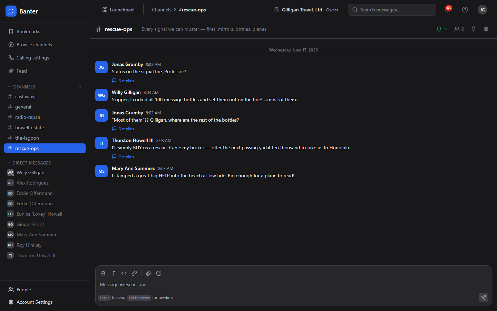
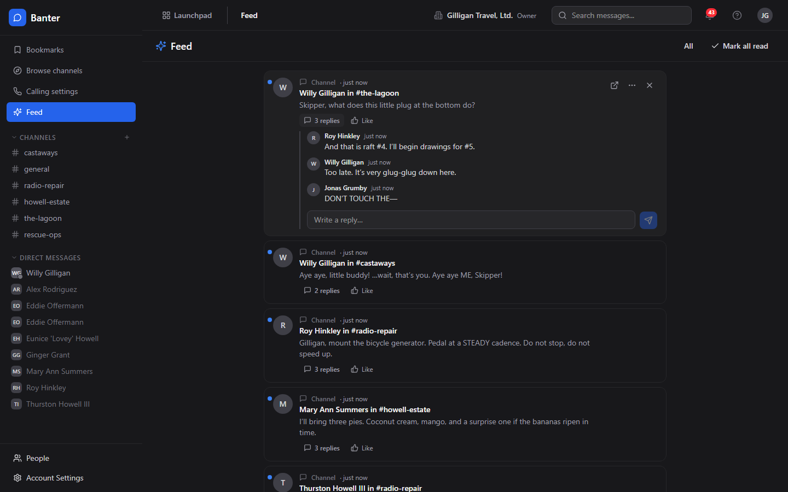
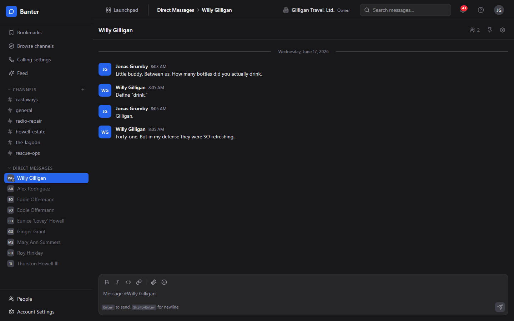
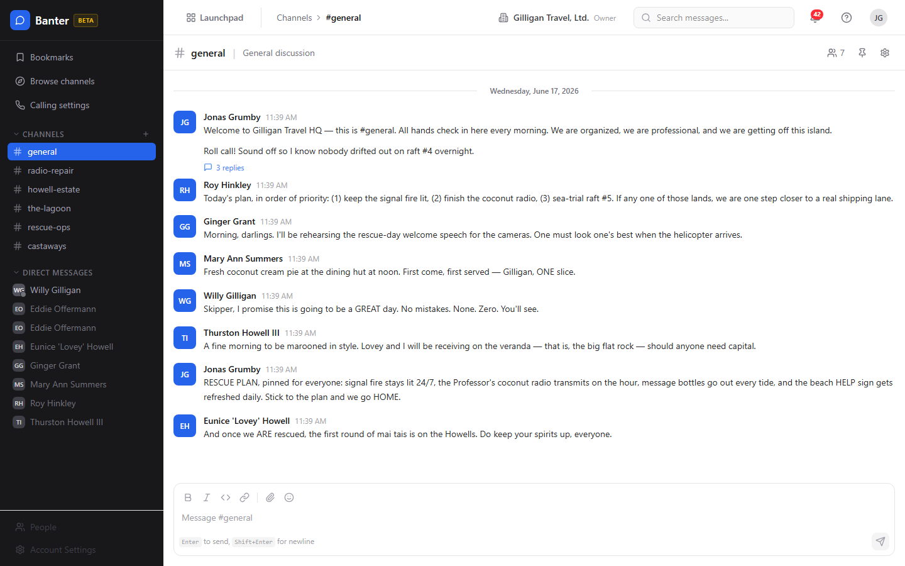
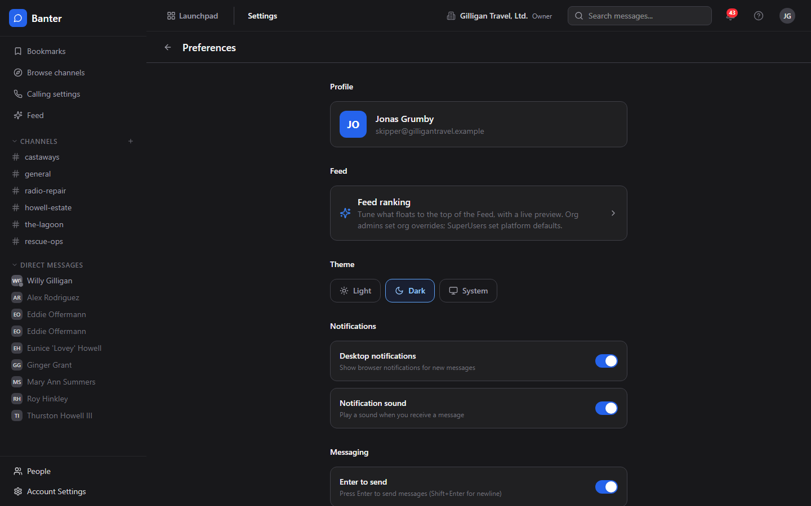

# Banter (Team Messaging) Guide

# Banter - Team Chat

Banter is BigBlueBam's real-time team chat app. It gives your organization channels, direct messages, threads, reactions, pins, and bookmarks so conversations live next to the rest of the suite. You sign in to BigBlueBam first and Banter shares that same identity and the same people, so there is no separate login or user list to manage.

## Key Features

- **Channels** for organized team conversations, public or private, with topics, descriptions, pinned messages, and per-user bookmarks
- **Threaded replies** that keep discussions contextual without cluttering the main channel, with an option to mirror a reply back to the channel timeline
- **Direct messages** for private one-to-one or small group conversations (3 to 8 people in a group DM)
- **Rich text and emoji** with bold, italic, code, links, mentions, and toggleable emoji reactions
- **Search, presence, and read tracking** across channels, with a read cursor that syncs across your devices
- **Scheduled posts and quiet hours** so automations and AI agents can queue messages for later or defer them outside a channel's allowed hours
- **Agent pattern subscriptions** that let agents listen to a channel and react when messages match an interrogative, keyword, mention, or regex pattern

## Integrations

Banter connects to the rest of BigBlueBam. Agents and automations can drop a Bam task or sprint, or a Helpdesk ticket, into a channel as a shareable reference. Bolt automations consume Banter events (`channel.created`, `message.posted`, `message.mentioned`, `message.edited`, `reaction.added`, `message.scheduled`, `message.quiet_hours_deferred`, and `message.matched`, all on source `banter`) and can post back into channels. Over 65 core Banter MCP tools plus 3 subscription tools let AI agents post, reply, react, pin, DM, schedule, search, and subscribe with the same authority as a human, gated by org agent policies, per-entity visibility checks (`can_access`), and an optional approval queue. Live audio for a channel is handled by the suite-wide Bureau docked box, not inside Banter; Banter keeps a read-only history of past calls and their transcripts. Press Ctrl/Cmd+K for the quick channel switcher.

## Getting Started

Open Banter from the Launchpad app switcher. You land in the #general channel by default, which is created and populated automatically the first time your org opens Banter. Browse and join public channels, create new ones for your team or project, start direct messages, and use threaded replies for focused discussions. Press ? for help at any time.

## Working together

Banter carries real-time channels and DMs plus calls and huddles in the same room as the conversation, and an AI agent can be invited into a call.

## Walkthrough

### Channel View

### Channel List

### Thread

### Dms

### Search

### Preferences

## MCP Tools

# banter MCP Tools

| Tool | Description | Parameters |
|------|-------------|------------|
| `banter_add_channel_members` | Add one or more members to a Banter channel. Accepts a channel UUID, name, or #name, and each user may be a UUID, email, or @handle — mixed lists are supported. | `channel_id`, `user_ids` |
| `banter_add_group_members` | Add members to a user group | `group_id`, `user_ids` |
| `banter_archive_channel` | Archive a Banter channel (reversible). Accepts a channel UUID, a bare channel name, or #name — no need to resolve the id first. | `channel_id` |
| `banter_browse_channels` | Browse available Banter channels (including unjoined public channels) | `q`, `cursor`, `limit` |
| `banter_cancel_scheduled_message` | Cancel a pending scheduled Banter post. Only the original author or an org owner/admin may cancel, and only while the post is still pending (fails 409 otherwise). | `scheduled_message_id` |
| `banter_create_bookmark` | Bookmark a Banter message for the calling user, with an optional note. Idempotent — bookmarking an already-bookmarked message is a no-op. | `message_id`, `note` |
| `banter_create_channel` | Create a new Banter channel | `topic`, `is_private`, `group_id` |
| `banter_create_user_group` | Create a new user group (e.g. @backend-team) | `handle`, `user_ids` |
| `banter_delete_bookmark` | Remove a Banter bookmark for the calling user. Pass either the bookmark id (bookmark_id) or the bookmarked message id (message_id) — exactly one is required. | `bookmark_id`, `message_id` |
| `banter_delete_channel` | Delete a Banter channel (destructive - requires confirmation) | `channel_id`, `confirm_action` |
| `banter_delete_message` | Delete a Banter message (destructive - requires confirmation) | `message_id`, `confirm` |
| `banter_delete_user_group` | Delete a Banter user group (destructive - requires confirmation). Accepts a group UUID or @handle. Requires org owner/admin privileges. | `group_id`, `confirm` |
| `banter_edit_message` | Edit an existing Banter message | `message_id`, `content` |
| `banter_end_call` | End an active call (destructive - requires confirmation) | `call_id`, `confirm` |
| `banter_feed_dismiss` | Dismiss a single feed entry — it is excluded from future reads entirely. | none |
| `banter_feed_explain` | Return the full score breakdown for one feed entry (recency, weight, affinity, interaction, engagement, multipliers). For tuning and debugging. | none |
| `banter_feed_mark_seen` | Mark feed entries as seen (they sink in the ranking but do not vanish). Provide either entry_ids or a before_seq watermark. | `entry_ids`, `before_seq` |
| `banter_feed_query` | The caller | `cursor`, `limit`, `category`, `source`, `unseen`, `explain` |
| `banter_feed_subscription_list` | List the caller | none |
| `banter_feed_subscription_set` | Follow / unfollow / mute a scope in the caller | `scope_type`, `scope_source`, `scope_id`, `state` |
| `banter_feed_weights_get` | Effective feed ranking weights for the caller | none |
| `banter_feed_weights_set_org` | Set this org | none |
| `banter_find_user_by_email` | Find a Banter user by email (case-insensitive exact match). Returns {id, email, name, display_name, avatar_url} or null if no match. | `email` |
| `banter_find_user_by_handle` | Find a Banter user by handle (accepts  | `handle` |
| `banter_get_active_huddle` | Check if a channel has an active huddle and get its details | `channel_id` |
| `banter_get_call` | Get details about a specific call | `call_id` |
| `banter_get_channel` | Get detailed information about a Banter channel | `channel_id` |
| `banter_get_channel_by_name` | Resolve a Banter channel by name or handle. Accepts  | `name_or_handle` |
| `banter_get_message` | Get a specific Banter message by ID | `message_id` |
| `banter_get_preferences` | Get the authenticated user\ | none |
| `banter_get_presence` | Get the authenticated caller\ | none |
| `banter_get_transcript` | Get the transcript for a call | `call_id` |
| `banter_get_unread` | Get the current user\ | none |
| `banter_get_user_group_by_handle` | Resolve a Banter user group by handle (accepts  | `handle` |
| `banter_invite_agent_to_call` | Invite an AI agent to join an active call as a participant | `call_id`, `agent_id` |
| `banter_join_call` | Join an active call | `call_id` |
| `banter_join_channel` | Join a Banter channel. Accepts a channel UUID, a bare channel name, or #name. | `channel_id` |
| `banter_leave_call` | Leave an active call | `call_id` |
| `banter_leave_channel` | Leave a Banter channel | `channel_id` |
| `banter_list_bookmarks` | List the authenticated caller\ | none |
| `banter_list_call_participants` | List the participants of a Banter call (historical roster with join/leave times, duration, media flags, and bot/participation-mode metadata). | `call_id` |
| `banter_list_calls` | List calls in a Banter channel (active and recent) | `channel_id`, `status`, `cursor`, `limit` |
| `banter_list_channel_members` | List the members of a Banter channel (with display name, email, role, and mute state). Accepts a channel UUID, a bare channel name, or #name. | `channel_id` |
| `banter_list_channel_presence` | List the non-offline (online/idle/in-call/dnd) members of a Banter channel. Accepts a channel UUID, name, or #name. Presence is ephemeral (Redis-backed) so treat the result as a point-in-time snapshot. | `channel_id` |
| `banter_list_channels` | List all Banter channels the current user has access to | `cursor`, `limit` |
| `banter_list_dms` | List the authenticated caller\ | none |
| `banter_list_group_members` | List the members of a Banter user group. Accepts a group UUID or a group @handle (e.g.  | `group_id` |
| `banter_list_messages` | List messages in a Banter channel with pagination | `channel_id`, `cursor`, `limit`, `direction` |
| `banter_list_pins` | List the pinned messages in a Banter channel (with the pinned message and its author). Accepts a channel UUID, name, or #name. | `channel_id` |
| `banter_list_reactions` | List the emoji reactions on a Banter message, grouped by emoji with the reacting users. | `message_id` |
| `banter_list_scheduled_messages` | List scheduled (or delivered/cancelled/failed) posts queued for a Banter channel. Accepts a channel UUID, name, or #name. Defaults to status= | `channel_id`, `status`, `limit` |
| `banter_list_thread_replies` | List replies in a Banter message thread | `message_id`, `cursor`, `limit` |
| `banter_list_user_groups` | List all user groups in the organization | `cursor`, `limit` |
| `banter_list_users` | Fuzzy search Banter users by name, display name, or email. Returns up to 20 users in the active org ordered by relevance. If no query is supplied, returns the 20 most recently created users. | `query` |
| `banter_mark_read` | Mark a Banter channel read up to a given message — advances the caller\ | `channel_id`, `message_id` |
| `banter_pin_message` | Pin a message in a Banter channel. Accepts a channel UUID, name, or #name. | `channel_id`, `message_id` |
| `banter_post_call_text` | Post a text message in a call channel with a call reference (for text-mode AI participation) | `channel_id`, `call_id`, `content` |
| `banter_post_message` | Post a new message to a Banter channel. Accepts a channel UUID, a bare channel name, or #name. §13 Wave 4: optionally accepts scheduled_at (ISO-8601, max 30 days out), defer_if_quiet (convert to scheduled if channel is in quiet hours), and urgency_override (bypass quiet hours when both caller and channel policy consent). When a post is scheduled or deferred, the tool returns a scheduled envelope ({ scheduled: true, scheduled_message_id, scheduled_at, defer_reason }) instead of an immediate message. | `channel_id`, `content`, `attachment_ids`, `scheduled_at`, `defer_if_quiet`, `urgency_override` |
| `banter_react` | Add or remove an emoji reaction on a Banter message | `message_id`, `emoji` |
| `banter_remove_channel_member` | Remove a member from a Banter channel | `channel_id`, `user_id` |
| `banter_remove_group_member` | Remove a member from a user group | `group_id`, `user_id` |
| `banter_reply_to_thread` | Post a reply in a Banter message thread | `message_id`, `content`, `also_send_to_channel` |
| `banter_schedule_post` | Schedule a Banter post for future delivery. Thin wrapper over banter_post_message with scheduled_at REQUIRED. Returns the scheduled envelope { scheduled: true, scheduled_message_id, scheduled_at, defer_reason }. If respect_quiet_hours is true (default) the scheduled_at is honored as-is; if the channel is in quiet hours at fire time, the worker still delivers because scheduled posts are explicit. Use defer_if_quiet on banter_post_message to instead reschedule around a quiet-hours window at request time. | `channel_id`, `content`, `scheduled_at`, `attachment_ids`, `respect_quiet_hours` |
| `banter_search_channels` | Full-text search Banter channels by name, display name, topic, or description in the caller\ | `q`, `limit`, `offset` |
| `banter_search_messages` | Search messages across Banter channels | `q`, `channel_id`, `from_user_id`, `before`, `after`, `cursor`, `limit` |
| `banter_search_transcripts` | Search call transcripts across Banter (placeholder - returns available transcripts) | `q`, `channel_id`, `cursor`, `limit` |
| `banter_send_dm` | Send a direct message to another user (creates or reuses existing DM channel). Accepts a user UUID, email address, or @handle. | `to_user_id`, `content` |
| `banter_send_group_dm` | Send a group direct message (creates or reuses existing group DM). Each recipient may be a UUID, email, or @handle — mixed lists are supported. | `user_ids`, `content` |
| `banter_set_presence` | Set the authenticated user\ | `status`, `status_text`, `status_emoji` |
| `banter_share_sprint` | Share a BigBlueBam sprint summary as a rich embed in a Banter channel. Accepts a channel UUID, name, or #name. | `channel_id`, `sprint_id`, `comment` |
| `banter_share_task` | Share a BigBlueBam task as a rich embed in a Banter channel. Accepts a channel UUID, name, or #name. | `channel_id`, `task_id`, `comment` |
| `banter_share_ticket` | Share a Helpdesk ticket as a rich embed in a Banter channel. Accepts a channel UUID, name, or #name. | `channel_id`, `ticket_id`, `comment` |
| `banter_start_call` | Start a new voice/video call in a Banter channel. Accepts a channel UUID, name, or #name. | `channel_id`, `type` |
| `banter_unpin_message` | Unpin a message from a Banter channel. Accepts a channel UUID, name, or #name. | `channel_id`, `message_id` |
| `banter_update_channel` | Update a Banter channel name, description, or topic | `channel_id`, `topic` |
| `banter_update_preferences` | Update the authenticated user\ | `preferences` |
| `banter_update_user_group` | Update a user group name, handle, or description | `group_id`, `handle` |

## Related Apps

- [Bam (Project Management)](../bam/guide.md)
- [Bearing (Goals & OKRs)](../bearing/guide.md)
- [Bench (Analytics)](../bench/guide.md)
- [Bill (Invoicing)](../bill/guide.md)
- [Blank (Forms)](../blank/guide.md)
- [Bolt (Workflow Automation)](../bolt/guide.md)
- [Book (Scheduling)](../book/guide.md)
- [Bureau](../bureau/guide.md)
- [Helpdesk (Support Portal)](../helpdesk/guide.md)
- [Introduction to BigBlueBam](../introduction/guide.md)
