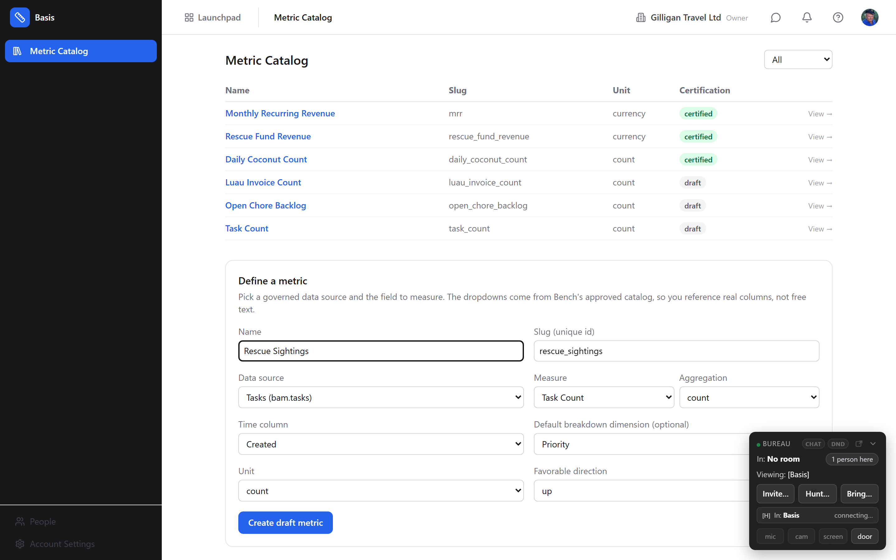
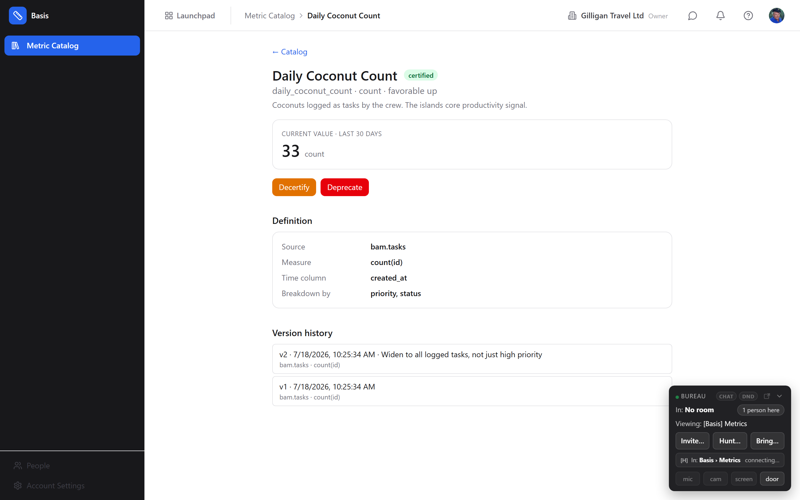

# Basis - Governed Metric Layer

> Basis gives the whole suite one trusted definition per number, and an AI core that explains, in plain language, why a certified metric moved. Define a metric like "MRR" or "Pipeline" once, certify it, and every app, chart, and agent reads the same definition. Reach for Basis when different apps disagree about what a number means.

## Overview

Basis is the suite's governed metric layer. A business metric (revenue, active users, average handle time) usually gets recomputed slightly differently in every app that shows it, so the same word ends up meaning three different numbers. Basis fixes that by making a metric a first-class, owned, versioned object: you define it once, certify it, and from then on it is the org-wide source of truth.

Basis does two jobs. First, **governance**: a metric has an owner, an immutable version history, and a certification state, so everyone can see exactly how "MRR" is defined today and how it was defined last quarter. Second, **explanation**: when a certified metric moves between two periods, Basis decomposes the change across a dimension (an exact, shared breakdown for additive measures) and, as a separate per-viewer aid, surfaces the concrete cross-app activity that may have contributed, each item scoped to what you are allowed to see.

Basis deliberately does not render charts and does not own the underlying data. It defines metrics over data that already lives in Bond, Bill, Bam, Blast, and the rest, and it reaches that data through Bench's governed query builder. Bench draws the picture; Basis decides what the number means and why it changed.

The objects you work with are **metrics** (the named number), their **definitions** (how the number is computed) captured as immutable **versions**, and the **certification state** that says whether a metric is trusted.

### Key concepts

- **Metric** - a named business number (for example `mrr`, `daily_coconut_count`) owned by one person, with a unit and a favorable direction. The thing you certify and read everywhere.
- **Definition** - how a metric is computed: a source product and entity (where the data lives), a measure (a field plus an aggregation), optional filters, candidate decomposition dimensions, and the time column periods are measured against. Basis does not store the data; the definition is resolved against Bench at read time.
- **Version** - every definition change writes a new immutable version and bumps the version number. You can always see how a metric was defined at any point. Changing a definition never rewrites history; it appends.
- **Certification state** - one of **draft**, **certified**, or **deprecated**. Only a certified metric is the org-wide source of truth. New metrics always start as draft.
- **Unit** - `currency`, `count`, `percent`, `ratio`, or `duration_ms`. Controls how the value is read.
- **Favorable direction** - `up`, `down`, or `neutral`. Whether a rising number is good, bad, or neither. Used when explaining a move.
- **Driver** - one dimension value's contribution to a change (for example "Enterprise segment: -3.2k"). For additive measures the drivers sum exactly to the total delta.
- **Class A vs Class B dimension** - a Class A dimension is a bounded, org-global enum (status, stage, priority and similar) whose values are safe to label for everyone. Any other dimension is Class B (entity-derived) and its per-value breakdown is access-scoped per viewer and deliberately non-invertible.
- **Snapshot** - a captured value of a certified metric at a point in time. A background job captures snapshots on a schedule so movement and thresholds can be evaluated.
- **Target and threshold breach** - an optional goal on a metric (for example "keep >= 100"). When a snapshot crosses it, Basis emits a `metric.threshold_breached` event to Bolt.
- **Resolve status** - `ok` or `resolve_failed`. A metric whose definition no longer resolves against its source (for example a renamed field) is flagged `resolve_failed` so you know the number is stale.

### Where to find it

Basis is served at `/basis/`. Reach it from the **Launchpad** in the top bar of any app (it is listed alphabetically as **Basis**), or go straight to `/basis/`. Basis shares your BigBlueBam session, so if you are signed in to the suite you are signed in to Basis.

Before Basis is useful you need an organization with some source data an app already holds (Bond deals, Bill invoices, Bam tasks, and so on), because a metric is defined over that data through Bench. Defining and reading metrics needs the `basis.metric.read` and `basis.metric.define` permissions; certifying, deprecating, and versioning are gated by their own `basis.metric.*` permissions and, for agents, a confirmation step.

## Feature reference

Two pages ship: the **Metric Catalog** (the list plus a definition builder) and the **metric detail** page (the current value, the full definition, the lifecycle actions, and version history). The define form is a real builder that pulls Bench's governed data-source catalog, so you pick a source and its real fields from dropdowns. The **Why-Did-It-Change Explorer** and a dedicated **Settings** page are the remaining planned UI; the explanation and settings capabilities are fully available through the API and MCP tools in the meantime, and are called out where relevant below.

### The Metric Catalog

The catalog is the Basis home page. It lists every metric in your organization in a table with **Name**, **Slug**, **Unit**, and **Certification** columns. The certification cell shows a colored badge: green for **certified**, grey for **draft**, red for **deprecated**.

To browse and filter metrics:

1. Open `/basis/`. The catalog loads with all metrics.
2. Use the filter dropdown at the top right (it reads **All** by default) to narrow to **Certified**, **Draft**, or **Deprecated**.
3. Click any row to open that metric's detail page.

A metric whose definition has stopped resolving against its source is flagged with a resolve-failed state so you can tell a stale number from a healthy one before you trust it.

### Defining a metric

New metrics are created from the **Define a metric** panel below the catalog table. It is a guided builder: the **Data source**, **Measure**, **Aggregation**, **Time column**, and **Default breakdown dimension** dropdowns are populated from Bench's governed data-source catalog, so you reference real approved columns rather than typing raw field names.

To define a metric:

1. On `/basis/`, scroll to **Define a metric**.
2. Type a **Name** (for example `Daily Coconut Count`). A snake_case **Slug** is suggested automatically; edit it if you want a different stable id.
3. Choose a **Data source** from the dropdown (for example `Tasks (bam.tasks)` or `Invoices (bill.invoices)`).
4. Choose a **Measure** field from that source (the list is the source's real measurable fields), then an **Aggregation** (only the aggregations valid for that field are offered).
5. Choose a **Time column** (the source's date/time fields) - the column periods are measured against.
6. Optionally choose a **Default breakdown dimension** (a categorical field of the source) used when explaining a change.
7. Choose a **Unit** (currency, count, percent, ratio, or duration_ms) and a **Favorable direction** (up, down, or neutral).
8. Click **Create draft metric**. You land on the new metric's detail page.

The new metric is created as a **draft** and its first immutable version is written. You land on its detail page. If the definition cannot be created (for example an invalid source), an error appears under the form rather than creating a broken metric.

### The metric detail page

Clicking a catalog row (or the **View** link) opens the detail page. It shows the metric name with its certification badge, a summary line (`slug - unit - favorable <direction>`), the current value over the last 30 days, the full definition (source, measure, time column, breakdown, filters), the lifecycle action buttons, and the version history. Use the **Catalog** link at the top to go back.

### The certification lifecycle

Certification is the trust boundary. The action buttons on the detail page change with the current state:

- **Certify** - promotes a draft (or a decertified) metric to the org-wide source of truth. Shown when the metric is not already certified.

  To certify a metric:
  1. Open the metric from the catalog.
  2. Click **Certify**.
  3. The badge flips to **certified** and the metric becomes the trusted definition everywhere.

- **Decertify** - returns a certified metric to draft, for example while you rework it. Shown only when the metric is certified.

  To decertify: open the metric and click **Decertify**. The badge returns to **draft**.

- **Deprecate** - soft-retires a metric you no longer want anyone to use. Shown when the metric is not already deprecated.

  To deprecate: open the metric and click **Deprecate**. The badge turns to **deprecated**.

Certify, decertify, and deprecate are truth-changing actions. When an agent performs them through MCP they require an explicit confirmation step (see Working with AI agents); in the UI they take effect on click.

### Versions and version history

Every change to a definition writes a new immutable version and increments the version number; nothing is overwritten. The **Version history** list on the detail page shows each version with its number, timestamp, and change note, so you can always answer "how was this defined back then". Adding a new version to a certified metric re-baselines its movement history and, for agents, is treated as a truth change that needs confirmation.

### Metric values and snapshots

The current scalar value of a metric over a period is computed on demand by resolving the definition through Bench's governed query route (Basis never queries source data directly). Separately, a background job captures **snapshots** of every certified metric on a schedule (hourly and daily grains) so that movement over time and threshold breaches can be evaluated without recomputing history. A retention sweep ages snapshots out per your org's retention window.

The metric detail page shows the current value over a trailing 30-day window; it degrades gracefully to a note if Bench is briefly unavailable or the definition no longer resolves. Agents read the same value with the `basis_metric_value` MCP tool (`GET /metrics/:id/value`).

### Why did it change (explanation)

When a certified metric moves between two periods, Basis explains the move in two clearly separated parts:

1. **Certified drivers** - the exact per-dimension-value contributions to the change (for example "Howell party: +4, Rescue crew: +2"). For additive measures these reconcile exactly to the total delta. Class A dimensions carry concrete labels for everyone; Class B dimensions are resolved per viewer.
2. **Possibly related activity** - a separate, lower-ranked, per-viewer list of concrete cross-app events that may have contributed, shown only for entities you are allowed to see.

The two are never merged: the certified number is shared and exact, while the per-entity breakdown is access-scoped and deliberately non-invertible. A viewer who cannot see some entities gets a k-anonymous breakdown that will not let them back out any hidden entity's amount.

Explanation is available today through `POST /metrics/:id/explain` and the `basis_explain_change` / `basis_rank_drivers` MCP tools. The dedicated Why-Did-It-Change Explorer page is planned.

### Targets and movement alerts

A metric can carry an optional **target** (a value plus a comparison such as "at least 100"). A background movement scan compares the latest snapshot against the target and, on a fresh crossing, emits a `metric.threshold_breached` event to Bolt exactly once per crossing (it re-arms when the metric recovers). The event payload carries only the magnitude and direction of the move, never any entity references, so an alert can never leak restricted data. Wire a Bolt rule to that event to route the alert into Banter, email, or a webhook.

### Binding a metric to a Bench widget

Because Basis owns the definition and Bench owns the chart, a Bench widget can bind to a Basis metric (via the widget's `basis_metric_id`). The KPI labeled "MRR" on a dashboard then resolves to the same certified definition as everywhere else, so the number on the chart and the number an agent reads are guaranteed to match.

### Per-org settings

Three per-organization settings govern Basis behavior: the **default decomposition dimension** (used when an explanation request does not name one), the **explanation cache TTL** (how long a computed explanation is reused), and the **snapshot retention window** (how long snapshots are kept). Shortening the retention window only affects your own org's data. These are configurable today through `GET`/`PUT /settings`; the Settings page is planned.

### The suite shell

Basis wears the same chrome as every other app. The left sidebar carries the Basis badge, the **Metric Catalog** nav, and the shared account footer (Account Settings, People, and the SuperUser console where you have access). The top bar has the **Launchpad**, a breadcrumb showing where you are (**Metric Catalog**, then the metric name on a detail page), your current organization and its switcher, a Banter quick link, the alerts bell, the **?** help button (which opens this help; you can also press `?`), and your user menu. The Bureau presence and calling widget is docked in the corner, the same as everywhere in the suite.

### Working with AI agents

Basis exposes 16 MCP tools so agents read and manage the same certified metrics you do. The read tools are `basis_list_metrics`, `basis_search_metrics`, `basis_get_metric`, `basis_list_versions`, `basis_metric_value`, `basis_metric_lineage`, and `basis_get_settings`. The explanation tools are `basis_explain_change` and `basis_rank_drivers`; both require the human's `asker_user_id` so the per-entity, access-scoped visibility rules are enforced for the person the agent is acting on behalf of. The write tools are `basis_define_metric`, `basis_update_metric`, `basis_add_metric_version`, `basis_certify_metric`, `basis_decertify_metric`, `basis_deprecate_metric`, and `basis_update_settings`. Every REST endpoint and every action in the UI has an equivalent tool, so an agent can do everything a human can.

Two guardrails apply to agents. First, the truth-changing tools (certify, decertify, deprecate, and versioning) use the platform two-step confirmation: the first call returns a preview of exactly what will change, and only a second call with `confirm_action: true` performs the change, so a reviewer can catch an unintended flip. Second, every `basis.*` tool is fail-closed under agent policies: a service account cannot call any Basis tool until an operator has allowlisted `basis.*` for it. For the full catalog and argument shapes see the Basis MCP-tools reference.

## User Stories

### Story: Define your first metric

**Who:** Skipper, an org owner setting up a shared number for Gilligan Travel Ltd.
**Goal:** Create a trusted "Daily Coconut Count" metric the whole crew can read.
**Before you start:** You are signed in, you have the `basis.metric.define` permission, and you know where the underlying data lives (here, Bam tasks).

**Steps**

1. Open the **Launchpad** in the top bar and choose **Basis** (or go to `/basis/`).
2. Scroll to the **Define a metric** builder below the catalog.
3. In **Name** type `Daily Coconut Count`. A snake_case **Slug** (`daily_coconut_count`) is filled in for you.
4. Open the **Data source** dropdown and choose **Tasks (bam.tasks)**.
5. In **Measure** pick **Task Count**, and in **Aggregation** pick **count**.
6. In **Time column** pick **Created**. Optionally set **Default breakdown dimension** to **Priority**.
7. Set **Unit** to `count` and **Favorable direction** to `up`.
8. Click **Create draft metric**.

**Result:** The metric is created as a **draft**, its first version is recorded, and you land on the Daily Coconut Count detail page - which shows the current value over the last 30 days and the definition you just built - with a grey **draft** badge.

**Related:** Certify a metric so the whole org trusts it. An agent can do the same with `basis_define_metric`.

### Story: Certify a metric so the whole org trusts it

**Who:** Skipper, ready to make Daily Coconut Count official.
**Goal:** Promote the draft to the org-wide source of truth.
**Before you start:** The draft metric exists and you have the `basis.metric.certify` permission.

**Steps**

1. From `/basis/`, click the **Daily Coconut Count** row to open it.
2. Confirm the definition summary line reads as you expect (`daily_coconut_count - count - favorable up`).
3. Click **Certify**.

**Result:** The badge flips to green **certified**. Any Bench widget or agent that binds to this metric now resolves the same certified definition. The catalog's **Certified** filter now lists it.

**Related:** Revise a certified metric's definition; Bind a metric to a Bench widget.

### Story: Revise a certified metric's definition

**Who:** The Professor, who realizes the count should exclude cancelled tasks.
**Goal:** Change the definition without losing the history of how it was defined before.
**Before you start:** The metric is certified and you have the `basis.metric.version` permission.

**Steps**

1. Open the metric from the catalog.
2. Add a new version with the corrected definition. The builder creates new metrics; there is no on-page version editor yet, so revising an existing metric's definition is done with the `basis_add_metric_version` MCP tool (confirming the change), or by an agent on your behalf.
3. Return to the detail page and check **Version history**.

**Result:** A new version appears at the top of the version history with its number and timestamp; the previous version is preserved unchanged. Movement history re-baselines from the new definition.

**Related:** Ask why a certified metric moved.

### Story: Deprecate a metric you no longer trust

**Who:** Skipper, retiring a metric that was superseded.
**Goal:** Stop anyone from treating an old metric as current, without deleting its history.
**Before you start:** The metric exists and you have the `basis.metric.deprecate` permission.

**Steps**

1. Open the metric from the catalog.
2. Click **Deprecate**.

**Result:** The badge turns red **deprecated**, and the metric drops out of the everyday **Certified** view (it is still visible under the **Deprecated** filter, with its full version history intact).

**Related:** Define your first metric.

### Story: Ask why a certified metric moved

**Who:** Mary Ann, who noticed the coconut count jumped this week.
**Goal:** See which dimension drove the change and any related activity she is allowed to see.
**Before you start:** The metric is certified and has snapshots for both periods; you know the two periods to compare.

**Steps**

1. Request an explanation for the metric between last week and this week (today through `POST /metrics/:id/explain`, or ask an agent to run `basis_explain_change` with your `asker_user_id`; the Why-Did-It-Change Explorer page is planned).
2. Read the **Certified drivers** first: the exact per-dimension contributions that sum to the total change.
3. Read **Possibly related activity** second: the per-viewer, access-scoped list of concrete events that may have contributed.

**Result:** You see the exact, shared breakdown of the move plus a separate list of related activity scoped to what you can access, and you understand what drove the number.

**Related:** Targets and movement alerts.

### Story: Read the certified number from an agent

**Who:** An AI assistant answering "what is our current coconut count".
**Goal:** Return the one certified number, not a re-derived guess.
**Before you start:** The agent's service account has been allowlisted for `basis.*` in agent policies.

**Steps**

1. The agent calls `basis_get_metric` (or `basis_list_metrics`) to find the certified metric by slug.
2. The agent calls `basis_metric_value` for the period in question.
3. The agent reports the value, citing that it is the certified Basis metric.

**Result:** The human and the agent quote the same number, because both resolve the same certified definition. If the agent instead tries to certify or deprecate a metric, the tool returns a preview first and waits for a confirmed second call.

**Related:** Working with AI agents.

## Related

- **Bench** - renders the charts and dashboards. A Bench widget binds to a Basis metric so the KPI on the dashboard uses the certified definition. Basis reaches source data through Bench's governed query builder.
- **Bond, Bill, Bam, Blast** - where the underlying data lives. Basis defines metrics over these apps' entities; it never owns or copies their data.
- **Bolt** - receives the `metric.threshold_breached` event when a metric with a target crosses it, so you can route alerts to Banter, email, or a webhook.
- **Basis MCP-tools reference** - the full catalog of `basis_*` tools, arguments, and confirmation behavior for agents. See the surface map in `docs/reference/mcp-endpoint-mapping.md`.
