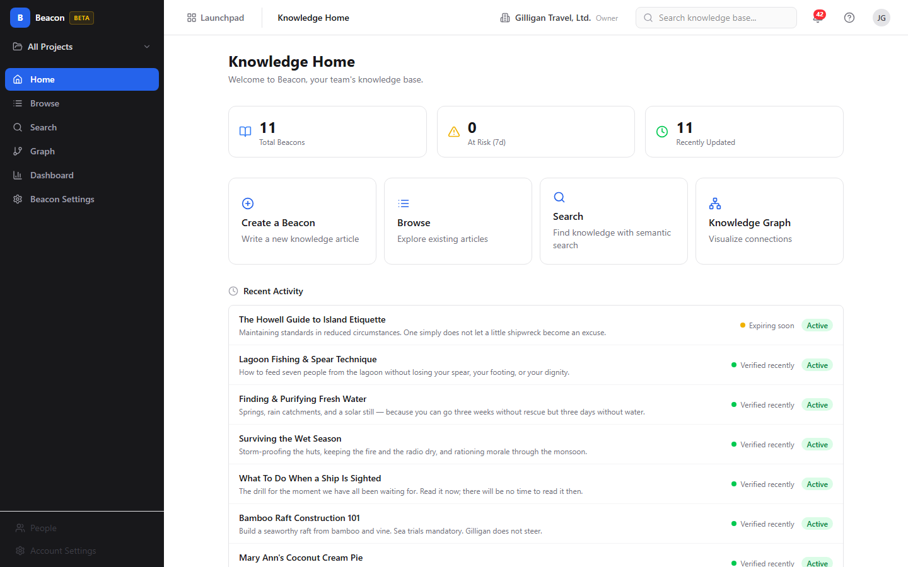
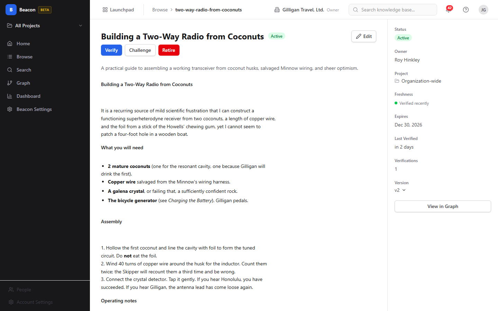
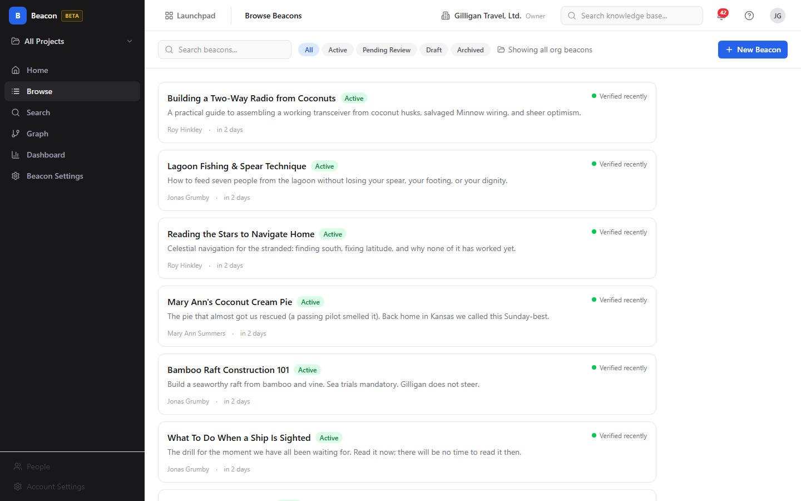
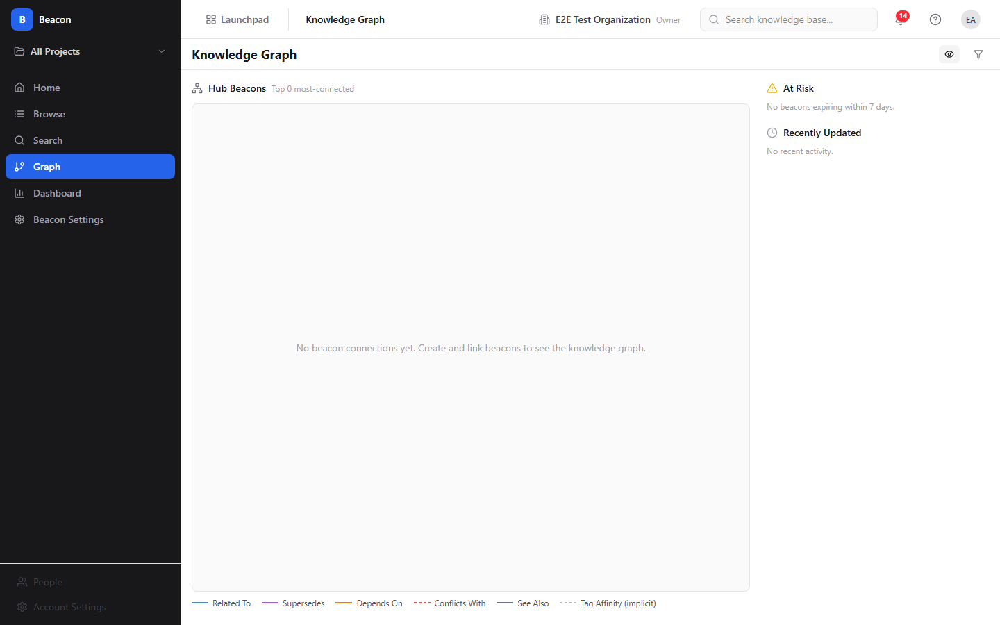
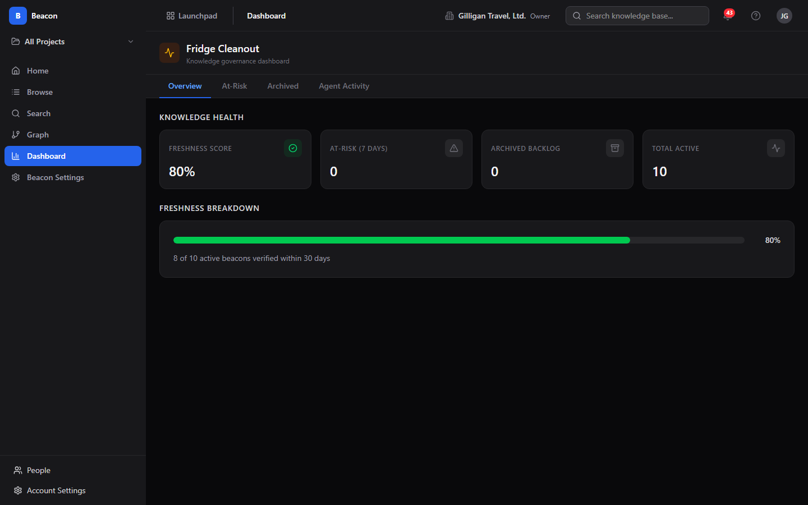
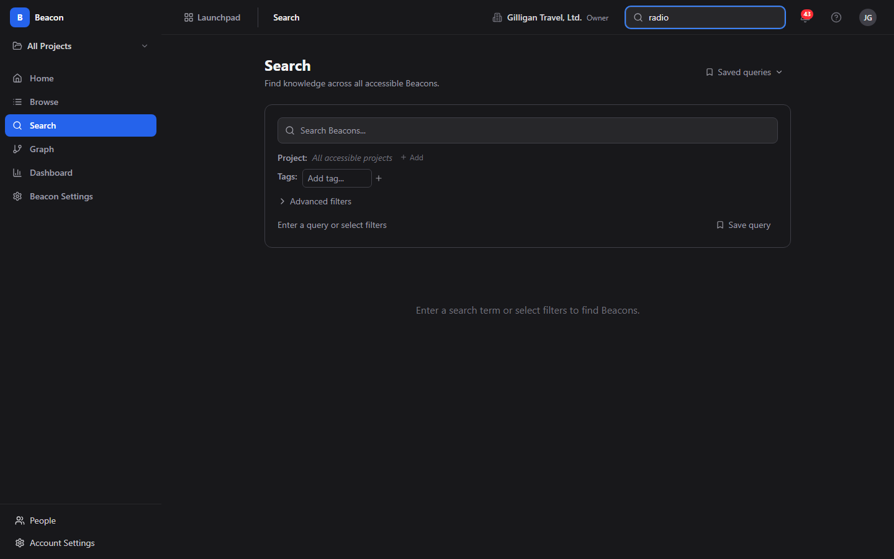

# Beacon (Knowledge Base) Guide

# Beacon - Knowledge Base

Beacon is BigBlueBam's knowledge base app for writing, searching, linking, and
keeping team knowledge current. Every article is a "Beacon" with its own
lifecycle, freshness signal, and expiry date, so the library does not quietly
rot as facts change. Beacon is currently in BETA.

## Key Features

- **Articles with a lifecycle** - Write knowledge in a Markdown editor. Each
  article moves through Draft, Active, Pending Review, Archived, and Retired, and
  carries a version history with a snapshot on every edit.
- **Freshness and verification** - Every article has an expiry date and a
  freshness signal (Verified recently, Content is stale, Expiring soon, Needs
  verification). Verifying an article resets its expiry and raises its
  verification count; challenging it flags it for review.
- **Hybrid search** - Find knowledge by meaning, not just keywords. Search
  blends semantic vector retrieval (Qdrant) with tag expansion, link traversal,
  and a keyword fallback, and labels each result with the source that matched.
  Searches can be named and reused as saved queries.
- **Knowledge Graph** - Explore how articles connect through typed links
  (Related To, Supersedes, Depends On, Conflicts With, See Also) and implicit
  Tag Affinity edges. Walk neighbors out to three hops, inspect hubs, and see
  what changed recently.
- **Fridge Cleanout governance dashboard** - A freshness-focused console with
  Overview, At-Risk, Archived, and Agent Activity tabs for verifying what is
  about to expire and retiring stale articles in bulk.
- **Expiry policies** - Set how long knowledge stays trusted per System,
  Organization, and Project scope (min, max, and default expiry days plus a
  grace period), resolved hierarchically.

## Integrations

Beacon shares the platform login and pulls its project list from Bam. It
publishes lifecycle events to Bolt (source `beacon`: created, updated,
published, verified, challenged, the upsert event, comment and attachment
events, and the retire event) so automations can react when knowledge changes.

Beacon is fully agent-operable through the MCP server. Its 30 tools let agents
create, update, publish, verify, challenge, and retire articles; run grounding
retrieval (`beacon_search`, `beacon_search_context`); idempotently ingest
knowledge by slug (`beacon_upsert_by_slug`); and build or query the graph and
policy. Beacon plugs into the suite-wide agentic platform: agents are tracked by
identity and heartbeat, their writes appear in the unified activity view,
cross-app `search_everything` and mention resolution surface Beacon articles,
agent policies (the `beacon.*` allowlist) and signed outbound webhooks gate and
notify agent runners, and a `can_access` visibility preflight keeps agents from
citing articles a reader is not allowed to see.

## Getting Started

Sign in to BigBlueBam, then open Beacon at `/beacon/`. From Knowledge Home,
click **Create a Beacon** to write your first article in Markdown, then
**Publish** it to make it Active. Use **Search** to find knowledge by meaning,
**Graph** to explore connections, and **Dashboard** (Fridge Cleanout) to keep
the library verified. Org admins set freshness rules under **Beacon Settings**.

## Working together

A presence strip on the article view shows who else is on a knowledge page, with a one-tap huddle.

## Walkthrough

### Knowledge Home

### Article Detail

### Browse List

### Graph Explorer

### Governance Dashboard

### Search Results

## MCP Tools

# beacon MCP Tools

| Tool | Description | Parameters |
|------|-------------|------------|
| `beacon_attachment_delete` | Delete an attachment from a Beacon.  | `id`, `attachment_id` |
| `beacon_attachments_list` | List a Beacon | `id` |
| `beacon_challenge` | Flag a Beacon for review (challenge its accuracy or relevance). | `id`, `reason` |
| `beacon_comment_add` | Add a comment to a Beacon, optionally as a reply to another comment.  | `id`, `body_markdown`, `parent_id` |
| `beacon_comment_delete` | Delete a comment from a Beacon (author or admin).  | `id`, `comment_id` |
| `beacon_comment_edit` | Edit a comment | `id`, `comment_id`, `body_markdown` |
| `beacon_comments_list` | List all comments on a Beacon (threaded).  | `id` |
| `beacon_create` | Create a new Beacon (Draft). Provide title, body_markdown, visibility, and optional project scope. | `title`, `summary`, `body_markdown`, `visibility`, `project_id` |
| `beacon_get` | Retrieve a single Beacon by ID or slug. | `id` |
| `beacon_graph_hubs` | Get the most-connected Beacons in scope (hub nodes for Knowledge Home). | `scope`, `project_id`, `top_k` |
| `beacon_graph_neighbors` | Get nodes and edges within N hops of a focal Beacon for graph exploration. | `beacon_id`, `hops`, `include_implicit`, `tag_affinity_threshold`, `status` |
| `beacon_graph_recent` | Get recently modified or verified Beacons. | `scope`, `project_id`, `days` |
| `beacon_link_create` | Create a typed link between two Beacons. | `id`, `target_id`, `link_type` |
| `beacon_link_remove` | Remove a link from a Beacon. | `id`, `link_id` |
| `beacon_links_list` | List a Beacon | `id` |
| `beacon_list` | List Beacons with optional filters and pagination. | `status`, `project_id`, `tags`, `cursor`, `limit`, `sort` |
| `beacon_policy_get` | Get the effective Beacon governance policy for the current scope. | `project_id` |
| `beacon_policy_resolve` | Preview the resolved effective policy (merging org + project levels). | `project_id` |
| `beacon_policy_set` | Set or update the Beacon governance policy at a given scope level. | `project_id`, `verification_interval_days`, `grace_period_days`, `auto_archive`, `tag_affinity_threshold` |
| `beacon_publish` | Transition a Beacon from Draft to Active. | `id` |
| `beacon_query_delete` | Delete a saved query (owner only). | `id` |
| `beacon_query_get` | Retrieve a saved query by ID. | `id` |
| `beacon_query_list` | List saved queries (own + shared in scope). | `scope`, `project_id` |
| `beacon_query_save` | Save a named search query configuration for reuse. | `query_body`, `scope`, `project_id` |
| `beacon_restore` | Restore an Archived Beacon back to Active status. | `id` |
| `beacon_retire` | Retire (soft-delete) a Beacon. | `id` |
| `beacon_search` | Hybrid semantic + keyword + graph search across Beacons. | `query`, `filters`, `project_ids`, `tags`, `status`, `visibility_max`, `expires_after`, `options`, `include_graph_expansion`, `include_tag_expansion`, `include_fulltext_fallback`, `top_k`, `cursor` |
| `beacon_search_context` | Structured retrieval optimized for agent consumption — richer metadata, linked Beacons pre-fetched. | `query`, `filters`, `project_ids`, `tags`, `status`, `top_k` |
| `beacon_stats` | Org-wide Beacon statistics (counts by status, staleness, verification) for the active scope. | `project_id` |
| `beacon_suggest` | Typeahead suggestions from the Beacon title/tag index. | `q`, `limit` |
| `beacon_tag_add` | Add one or more tags to a Beacon. | `id`, `tags` |
| `beacon_tag_remove` | Remove a tag from a Beacon. | `id`, `tag` |
| `beacon_tags_list` | List all tags in scope with usage counts. | `project_id`, `cursor`, `limit` |
| `beacon_update` | Update a Beacon (creates a new version). Provide only the fields to change. | `id`, `title`, `summary`, `body_markdown`, `visibility`, `change_note` |
| `beacon_upsert_by_slug` | Idempotent create-or-update of a Beacon entry by slug. Natural key is the globally-unique slug. On update, bumps version and writes a beacon_versions snapshot. Returns { data, created, idempotency_key } —  | `slug`, `title`, `summary`, `body_markdown`, `body_html`, `visibility`, `project_id`, `metadata`, `change_note` |
| `beacon_verify` | Record a verification event on a Beacon (confirms content is still accurate). | `id`, `verification_type`, `outcome`, `confidence_score`, `notes` |
| `beacon_version_get` | Get a specific version of a Beacon. | `id`, `version` |
| `beacon_versions` | List the version history of a Beacon. | `id` |

## Related Apps

- [Bench (Analytics)](../bench/guide.md)
- [Blueprint](../blueprint/guide.md)
- [Bolt (Workflow Automation)](../bolt/guide.md)
- [Brief (Documents)](../brief/guide.md)
- [Helpdesk (Support Portal)](../helpdesk/guide.md)
- [Introduction to BigBlueBam](../introduction/guide.md)
