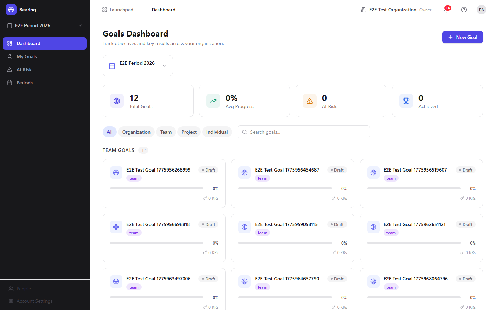
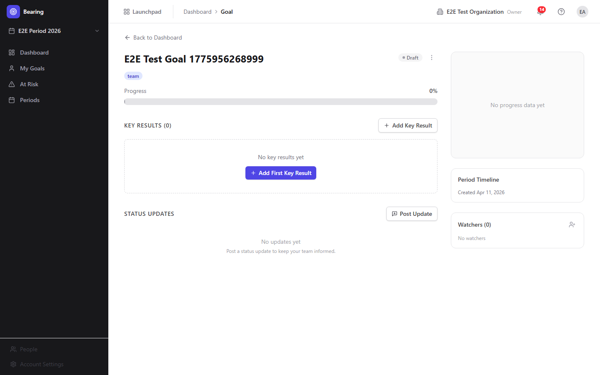
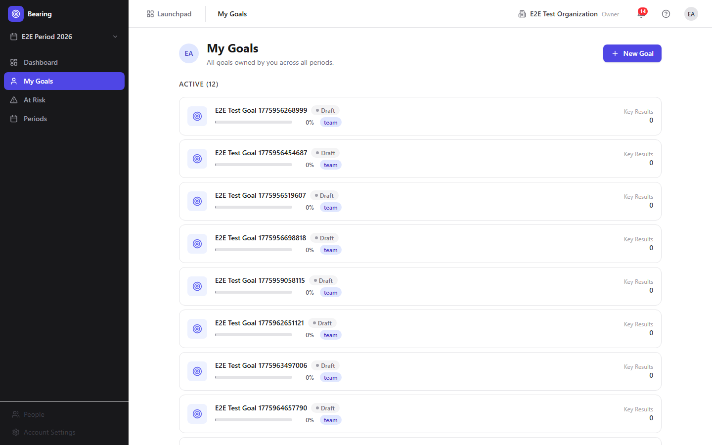
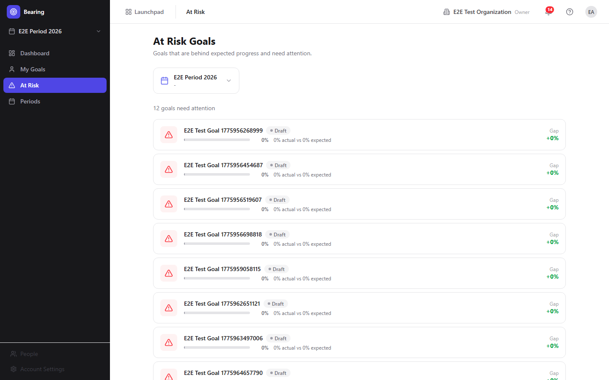
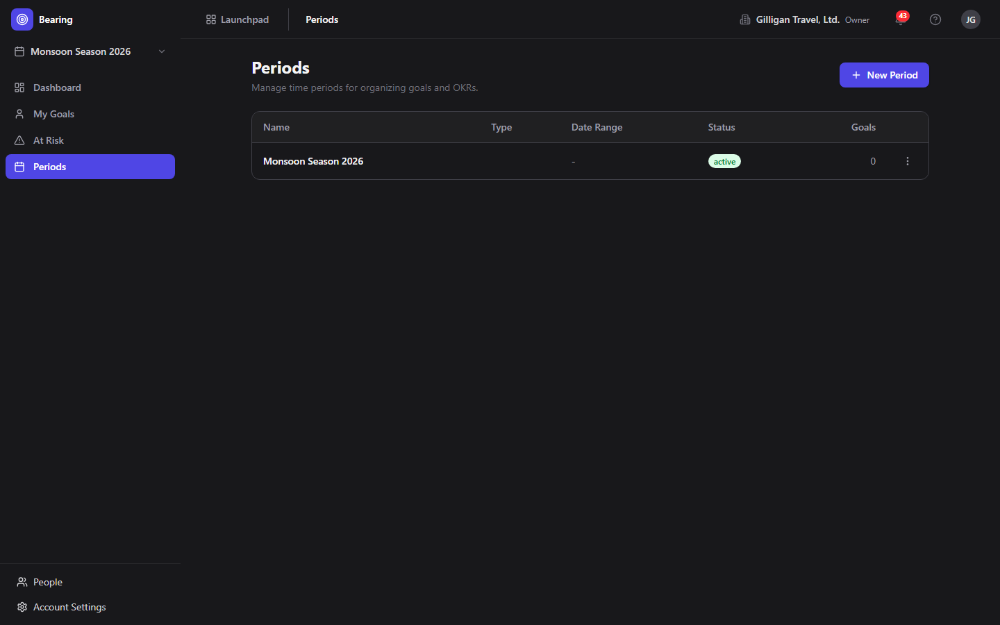

# Bearing (Goals & OKRs) Guide

# Bearing - Goals & OKRs

Bearing is BigBlueBam's goals and OKR tracker. Teams set objectives for a time period, attach measurable key results, check in on progress, and surface the goals that are falling behind before the period ends.

## Key Features

- **Objectives and Key Results** where every goal carries measurable key results (Number, Percentage, Currency, or Yes/No) with start, target, and current values, and the goal's progress is the average of its key results
- **Time Periods** for organizing goals into quarters, halves, years, or custom date ranges, with a lifecycle of draft, active, completed, and archived
- **Automatic status** that compares a goal's actual progress against where it should be by now and flags it on track, at risk, or behind, with an At Risk view that lists the goals slipping furthest
- **My Goals** view that shows each owner their goals across every period, split into active and completed
- **Check-ins and status updates** that record new key-result values and post status narratives to the team, snapshotting progress at the time of each post
- **Watchers and email notifications** so stakeholders are told when a watched goal's status changes

## Integrations

Bearing key results can be linked to Bam epics, projects, sprints, and tasks (through the MCP tools or REST) so progress tracks real delivery as tasks reach a done state. Bolt automations can fire when goals are achieved, change status, or fall behind. Agent-generated period and at-risk reports flow into Banter posts and Brief documents, and goal progress can be surfaced in Bench analytics dashboards.

## Getting Started

Open Bearing from the BigBlueBam app switcher. Create a time period (such as Q2 2026) on the Periods page and select it in the sidebar, then add objectives on the Dashboard with measurable key results. Record progress with check-ins and post status updates regularly. The At Risk view flags goals that need attention, and the period can be completed to close out the cadence.

## Walkthrough

### Dashboard

### Goal Detail

### My Goals

### At Risk

### Periods

## MCP Tools

# bearing MCP Tools

| Tool | Description | Parameters |
|------|-------------|------------|
| `bearing_at_risk` | Quick check: list all at-risk or behind goals across the organization. | none |
| `bearing_goal_create` | Create a new OKR goal within a period.  | `period_id`, `title`, `scope`, `project_id`, `team_name`, `icon`, `color`, `owner_id` |
| `bearing_goal_delete` | Delete a goal and its key results.  | `id` |
| `bearing_goal_get` | Get a single goal with its key results and progress details. | `id` |
| `bearing_goal_history` | Get the progress history (point-in-time snapshots) for a goal.  | `id` |
| `bearing_goal_status_override` | Manually override a goal\ | `id`, `status` |
| `bearing_goal_unwatch` | Remove a watcher from a goal.  | `id`, `user_id` |
| `bearing_goal_update` | Update an existing goal. Provide only the fields to change.  | `id`, `title`, `scope`, `owner_id`, `icon`, `color` |
| `bearing_goal_updates` | List the status updates posted on a goal.  | `id` |
| `bearing_goal_watch` | Add the calling user as a watcher on a goal (subscribe to its updates).  | `id` |
| `bearing_goal_watchers` | List the users watching a goal.  | `id` |
| `bearing_goals` | List OKR goals with optional filters by period, scope, owner, and status. | `period_id`, `scope`, `owner_id`, `status`, `limit` |
| `bearing_kr_create` | Create a key result under a goal.  | `goal_id`, `title`, `metric_type`, `target_value`, `start_value`, `unit`, `direction`, `progress_mode`, `owner_id` |
| `bearing_kr_delete` | Delete a key result.  | `id` |
| `bearing_kr_get` | Get a single key result.  | `id` |
| `bearing_kr_history` | Get the value/progress snapshot history for a key result.  | `id` |
| `bearing_kr_link` | Link a key result to a Bam entity (epic, project, or task query) for automatic progress tracking.  | `key_result_id`, `link_type`, `target_type`, `target_id`, `metadata` |
| `bearing_kr_links` | List the Bam-entity links attached to a key result.  | `key_result_id` |
| `bearing_kr_list` | List the key results for a goal.  | `goal_id` |
| `bearing_kr_unlink` | Remove a link from a key result.  | `key_result_id`, `link_id` |
| `bearing_kr_update` | Update a key result value or metadata. When current_value is provided, also records a value check-in.  | `id`, `current_value`, `title`, `target_value` |
| `bearing_period_activate` | Activate an OKR period (mark it the current/live planning window).  | `id` |
| `bearing_period_complete` | Complete an OKR period (close it out at end of cadence).  | `id` |
| `bearing_period_create` | Create a new OKR period (planning window such as a quarter). Dates are YYYY-MM-DD. | `period_type`, `starts_at`, `ends_at`, `status` |
| `bearing_period_delete` | Delete an OKR period.  | `id` |
| `bearing_period_get` | Get a single OKR period with aggregated stats. | `id` |
| `bearing_period_update` | Update an OKR period.  | `id`, `period_type`, `starts_at`, `ends_at`, `status` |
| `bearing_periods` | List OKR periods with optional filters by status and year. | `status`, `year` |
| `bearing_report` | Generate a period summary, at-risk, or owner report. | `report_type`, `period_id`, `user_id`, `format` |
| `bearing_update_post` | Post a status update on a goal.  | `goal_id`, `status`, `body` |

## Related Apps

- [Bench (Analytics)](../bench/guide.md)
- [Blueprint](../blueprint/guide.md)
- [Bolt (Workflow Automation)](../bolt/guide.md)
