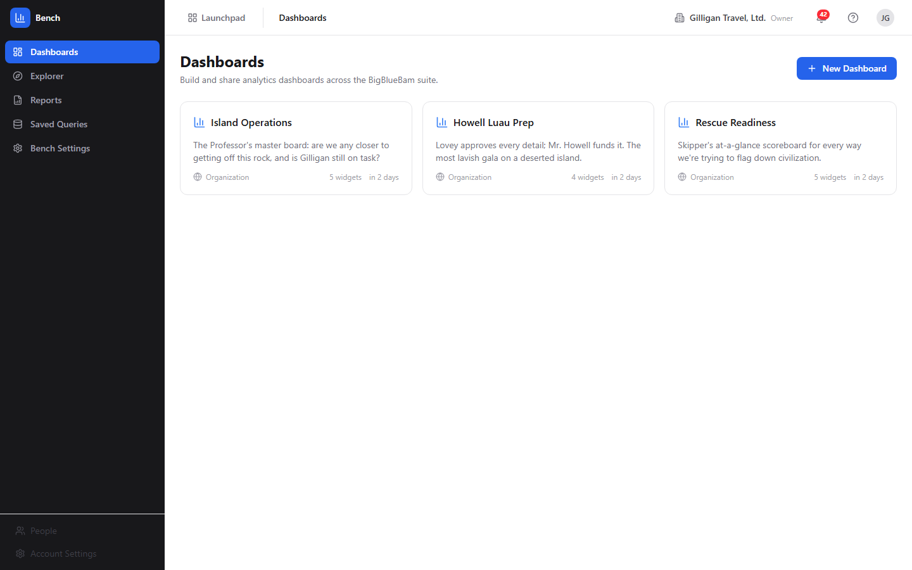
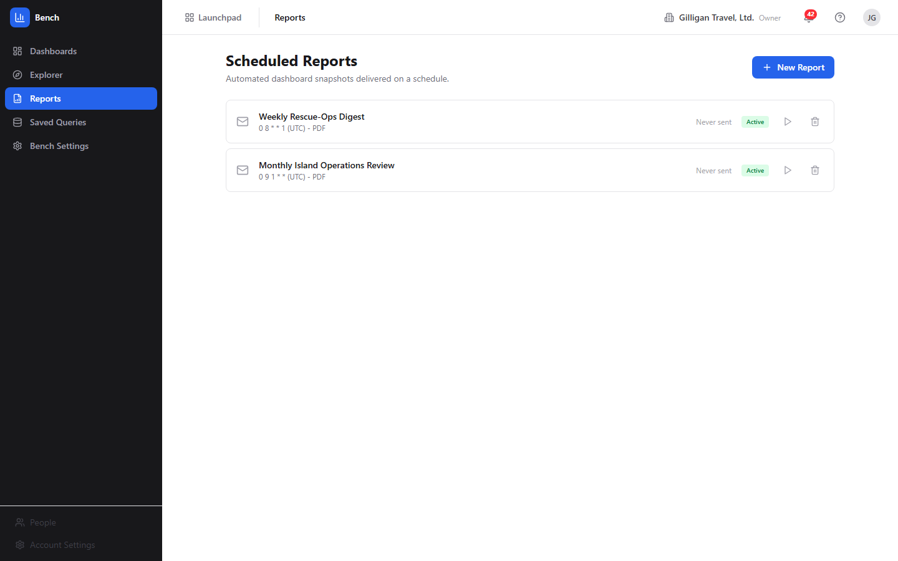
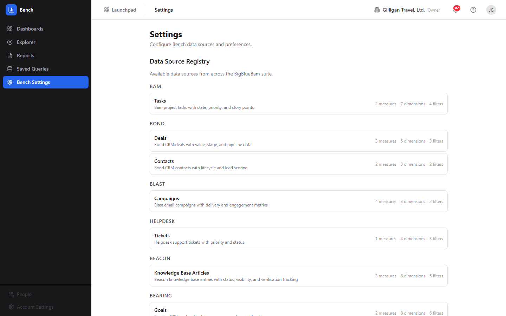

# Bench - Analytics and dashboards for the BigBlueBam suite

> Bench builds shared analytics dashboards and ad-hoc queries across the other BigBlueBam apps. Reach for it when you want one place to chart deals, campaigns, goals, knowledge-base activity, and other suite data, then share or schedule those views for your team.

## Overview

Bench is a read-and-visualize layer on top of the rest of the suite. You assemble **dashboards** out of **widgets**, where each widget runs a query against an approved **data source** (a product plus an entity, such as Bond deals or Blast campaigns) and renders the result as a chart, KPI card, or table. You can also explore a source interactively in the **Ad-Hoc Explorer**, save query definitions, and schedule recurring report deliveries.

Bench does not store your business data. It queries other products' tables through a compile-time **data source registry** that allowlists exactly which tables and columns Bench is allowed to read, and always scopes every query to your active organization. Because the registry is an allowlist, you can only chart sources and fields that have been registered.

Bench sits between the operational apps (Bam, Bond, Blast, Beacon, Bearing, and others) and the people who need a roll-up view of them. Operators and leads build dashboards in the UI. AI agents can do the same work through MCP tools: they read and summarize dashboards, run ad-hoc queries, build dashboards and widgets, manage saved queries and scheduled reports, and run anomaly and period-comparison checks.

### Key concepts

- **Dashboard** - A named container of widgets with a saved layout. Each dashboard has a **visibility** of Private, Project, or Organization, an optional linked project, and an optional auto-refresh interval. One dashboard per org can be the default.
- **Widget** - One visualization on a dashboard. A widget has a name, a chart type, a data source and entity, and a query configuration. The renderer draws bar, line, area, pie, donut, KPI card, counter, and table widgets distinctly; any other type falls back to a table.
- **Data source** - A registered `(product, entity)` pair that maps to one underlying table with declared measures, dimensions, and filters. Bench can only query registered sources and columns, and every query is automatically scoped to your organization.
- **Measure** - A numeric aggregation in a query: count, sum, avg, min, or max of a field. A query needs at least one measure.
- **Dimension** - A field to group by (for example, deal stage or campaign).
- **Filter** - A condition on a field. Operators include equals, not equals, greater/less than (and -or-equal), in, is null, is not null, between, and like.
- **Saved query** - A reusable query definition (data source, entity, and query config) you can keep and re-run later.
- **Scheduled report** - A cron-driven dashboard snapshot delivered to a target on a schedule. Delivery methods are Email, Banter Channel, and Brief Document; export formats are PDF, PNG, and CSV.
- **Materialized view** - A pre-computed rollup that the worker refreshes automatically. Three are exposed to you as queryable `bench:` data sources: Daily Task Throughput, Pipeline Snapshot, and Campaign Engagement.

### Where to find it

Bench lives at `/bench/`. You must be logged in to BigBlueBam first. If you open Bench while signed out, you will see a "Bench Analytics" screen with the message "Please log in to BigBlueBam first to access Bench." and a "Go to BigBlueBam Login" button that sends you to `/b3/`.

Once you are in, the left sidebar has five destinations: **Dashboards**, **Explorer**, **Reports**, **Saved Queries**, and **Bench Settings**. The header carries the Launchpad app switcher, breadcrumbs, an organization switcher, a notifications bell, and your user menu. Bench reads your active organization from the auth store; use the organization switcher in the header to change which org's data you are charting. Pressing the `?` key anywhere outside a text input opens the in-app Help.

Some write actions require a higher API-key scope. Creating dashboards and widgets needs `read_write`; creating, sending, and deleting scheduled reports needs admin scope plus the matching report permission.

## Feature reference

### Dashboards list

The landing view at `/bench/`. It shows every dashboard you can see as a grid of cards.

Each card shows the dashboard name, an optional description, a visibility pill (Private with a lock icon, Project with a people icon, or Organization with a globe icon), the widget count ("N widgets"), and the relative time it was last updated. A kebab menu (the horizontal dots that appear on hover) holds **View**, **Duplicate**, and **Delete** (Delete is destructive).

To create a dashboard:

1. Click **New Dashboard** (the button with the plus icon, top right).
2. Bench creates a dashboard named "Untitled Dashboard" with Private visibility and immediately opens it in the edit view.
3. Set its name, description, and visibility there, then add widgets.

To open, duplicate, or delete a dashboard:

1. Click a card (or its kebab menu **View**) to open the read view.
2. Choose **Duplicate** from the kebab menu to clone the dashboard and its widgets into a new copy. The copy is forced to Private visibility.
3. Choose **Delete** from the kebab menu to remove the dashboard and its widgets. This is permanent.

If you have no dashboards yet, the page shows "No dashboards yet" with the hint "Create your first dashboard to start visualizing data."

### Dashboard view

The read-only view of one dashboard at `/dashboards/:id`. Each widget renders its chart along with the query's execution time in milliseconds.

The toolbar (top right) has:

- A date-range picker. You can pick a preset (Today, Last 7 days, Last 30 days, Last 90 days, This month, This quarter, This year) or a custom From/To range and click **Apply**.
- **Refresh** (circular-arrow icon), which re-runs every widget query.
- A fullscreen toggle (the expand icon, no text label), which fills the screen for a wall-board display.
- **Edit**, which opens the edit view.

To view a dashboard:

1. Open it from the Dashboards list.
2. Read each widget; the small clock and number under a widget is how long that widget's query took.
3. Pick a date range from the picker to scope the time-based widgets, or click **Refresh** to re-pull the data, or the fullscreen toggle for a kiosk display.

If the dashboard has a saved auto-refresh interval, the view re-fetches on that schedule on its own.

If a dashboard has no widgets, the view shows "This dashboard has no widgets yet." with an **Add widgets** link to the edit view.

The date-range picker scopes the dashboard's widgets: the selected preset or custom From/To range is passed into each widget's query, so changing the range re-filters the widgets that have a time field. Widgets with no time dimension run their own stored query unchanged.

### Dashboard edit

The edit view at `/dashboards/:id/edit`, titled **Edit Dashboard**. Use it to rename a dashboard, set its visibility, and manage its widgets.

The metadata block has three fields: **Name**, **Description**, and a **Visibility** select (Private, Project, Organization). Click **Save** (the disk icon, top right) to persist them.

The **Widgets** section has two buttons:

- **Templates** (sparkles icon) toggles the Widget Templates gallery inline.
- **Custom Widget** (plus icon) opens the Widget Wizard.

Each existing widget appears as a row with a drag handle, its name, a "data_source / entity - type" subline, an **Edit** link to the Widget Edit page, and a trash icon that deletes the widget.

To edit a dashboard:

1. Open the dashboard and click **Edit**.
2. Change **Name**, **Description**, or **Visibility** and click **Save**.
3. Add widgets with **Templates** or **Custom Widget**, edit a widget with its **Edit** link, or remove one with its trash icon.
4. To reorder widgets, drag a widget row by its drag handle and drop it where you want it. The new order is saved to the dashboard layout and survives a reload.

### Widget Templates gallery

A gallery of prebuilt widget presets, shown inline in the Dashboard edit view when you click **Templates**. It is titled **Widget Templates** and has a **Close** action.

Category filter pills across the top (All, Project Management, CRM, Email Marketing, Support, Cross-Product) narrow the grid. Each preset card shows a type icon, a type pill, the preset name, a short description, and its category.

To add a preset widget:

1. In the Dashboard edit view, click **Templates**.
2. Optionally click a category pill to filter.
3. Click a preset card. Bench instantiates it as a working widget on the dashboard (carrying a full query config that maps to registered sources and fields) and closes the gallery.

The presets in the Project Management, CRM, Email Marketing, and Cross-Product categories build widgets against registered sources that return data. The **Support** presets (Open Tickets, Tickets by Priority) build cleanly but query the Tickets source, which does not return data in this release (see "Sources that do not return data"), so those widgets show "No data".

### Widget Wizard

A four-step builder for a custom widget, reached from a dashboard's edit view via **Custom Widget**, at `/dashboards/:id/widgets/new`. Titled **New Widget**.

The step indicator names the four steps: **Data Source**, **Measures & Dimensions**, **Chart Type**, **Name & Style**.

To build a widget with the wizard:

1. Step 1 (**Data Source**): pick a registered source from the list. Each entry shows the product pill, the source label, and its description.
2. Step 2 (**Measures & Dimensions**): check the measures to aggregate and the dimensions to group by. Each measure lists its allowed aggregations; each dimension lists its type.
3. Step 3 (**Chart Type**): pick one of the eleven types: Bar Chart, Line Chart, Area Chart, Pie Chart, Donut Chart, KPI Card, Counter, Table, Funnel, Gauge, Progress Bar.
4. Step 4 (**Name & Style**): type a **Widget Name**, then confirm the summary panel (Source, Measures, Dimensions, Type).
5. Click **Create Widget**. Bench builds the query config (using the first allowed aggregation for each chosen measure and your dimensions as group-bys) and returns you to the Dashboard edit view.

Use **Back** to revisit a step, or **Cancel** on the first step to leave without creating.

### Widget Edit (live preview)

The full widget editor at `/widgets/:id/edit`, titled **Edit Widget**. It has two columns: configuration on the left, a live preview on the right.

On the left you can change **Widget Name**, the **Data Source** select, the **Chart Type** grid (the same eleven types as the wizard), the **Measures** and **Dimensions** checkboxes, and the **Display Options** checkboxes (**Show legend** and **Stacked**).

On the right, the **Preview** panel renders live query results. A **Refresh** button re-runs the preview query, and a line below it reads "Query took Nms" with the row count.

To edit a widget:

1. From the Dashboard edit view, click a widget's **Edit** link.
2. Adjust the name, data source, chart type, measures, dimensions, or display options.
3. Watch the Preview update; click its **Refresh** to re-pull.
4. Click **Save**. Bench writes the change and returns you to the Dashboard edit view.

### Ad-Hoc Explorer

An interactive query view at `/explorer`, titled **Ad-Hoc Explorer**, with the subtitle "Query any data source interactively."

The left panel has a **Data Source** dropdown (each option is shown as "[product] Label"), read-only **Measures** and **Dimensions** lists for the selected source, and a **Run Query** button. The right panel shows an error banner when a query fails, the generated SQL (in non-production builds only), a "N rows in Xms" line, and the results table.

To explore a source:

1. Choose a source from the **Data Source** dropdown.
2. Review its Measures and Dimensions.
3. Click **Run Query**.
4. Read the results table, plus the row count and timing.

When you open the Explorer from a saved query's **Run** button, it loads that saved query's source and full configuration and runs it for you (a "Loaded saved query: <name>" note appears). When you open the Explorer directly and pick a source yourself, **Run Query** runs one fixed shape per source: the first measure with its first aggregation, plus the first two dimensions, limited to 50 rows.

> Known limitation: when you pick a source manually in the Explorer there are no measure, dimension, or filter controls; it runs the fixed shape described above. For arbitrary measures, dimensions, and filters without going through a saved query, an agent can use the `bench_query_ad_hoc` MCP tool.

### Scheduled Reports

The reports list at `/reports`, titled **Scheduled Reports**, with the subtitle "Automated dashboard snapshots delivered on a schedule."

Each row has a delivery-method icon (envelope for Email, speech bubble for Banter Channel, document for Brief Document), the report name, a "cron (timezone) - FORMAT" subline, a last-sent line ("Last sent X" or "Never sent"), an optional delivery-status pill, an **Active**/**Paused** pill, a **Send now** play button, and a delete trash icon.

To create a scheduled report:

1. Click **New Report**. A dialog titled **New Scheduled Report** opens.
2. Fill in **Report Name**.
3. Choose a **Dashboard** to render.
4. Choose a **Schedule** preset (Every day at 9 AM, Every Monday at 9 AM, First of every month at 9 AM, Every Friday at 5 PM, or Custom). For Custom, type a cron expression. The detected timezone is shown below.
5. Choose a **Delivery Method** (Email, Banter Channel, or Brief Document). The target field relabels to **Email Address**, **Channel**, or **Document** accordingly, and you enter the destination.
6. Choose an **Export Format** (PDF, PNG, or CSV).
7. Leave **Enable immediately** checked to activate the schedule now, or uncheck it to create it paused.
8. Click **Create Report**.

To run a report immediately, click its **Send now** play button. To remove one, click its trash icon. Creating a report needs admin API-key scope plus the report-create permission; Send now and Delete need their matching permissions.

> Known limitation: report delivery is a stub in this release. The worker logs "simulating delivery (stub)" and stamps the row's status; it does not produce or send an actual PDF, email, Banter post, or Brief document. On success the worker writes a `delivered` status, but the row's status pill only colors `sent`, `queued`, and `failed`, so a delivered report shows the neutral gray pill rather than a green one. Treat Send now and the schedule as wiring that updates status, not as confirmed delivery.

### Saved Queries

The saved-query list at `/saved-queries`, titled **Saved Queries**, with the subtitle "Reusable query definitions you can run from the ad-hoc explorer."

Each row has the query name, an optional description, a "data_source/entity - Created DATE" subline, a **Run** button, an **Edit** pencil, and a **Delete** trash icon.

To save a query:

1. Click **New Query**. A dialog titled **New Saved Query** opens.
2. Fill in **Name**, an optional **Description**, and choose a **Data Source**.
3. Check the **Measures** to aggregate and the **Dimensions** to group by (at least one measure is required).
4. Click **Create**. Bench saves the query with a real configuration built from your measures and dimensions.

To edit or run a saved query:

1. Click the **Edit** pencil to change the name, description, data source, measures, or dimensions (dialog titled **Edit Saved Query**), then click **Update**. Editing reloads the saved configuration so you keep its definition.
2. Click **Run** to open the Explorer with that saved query loaded and executed.

If you have none yet, the page shows "No saved queries" with the hint "Create a query to save and re-run later from the explorer."

### Bench Settings

A read-only settings view at `/settings`, titled **Settings**, with the subtitle "Configure Bench data sources and preferences."

It has three sections, none of them editable:

- **Data Source Registry** - every registered source grouped by product, each showing its label, description, and counts of measures, dimensions, and filters.
- **Cache** - the Default Cache TTL (60 seconds).
- **Query Execution** - the Statement Timeout (10,000 ms).

To review what Bench can query:

1. Open **Bench Settings** from the sidebar.
2. Scroll the **Data Source Registry** to see which products and entities are available and how many measures, dimensions, and filters each exposes.

### Registered data sources

These are the sources Bench can query, from the data source registry. Each query is automatically scoped to your organization.

| Product | Entity | Label | Backing table |
|---|---|---|---|
| bam | tasks | Tasks | tasks |
| bond | deals | Deals | bond_deals |
| bond | contacts | Contacts | bond_contacts |
| blast | campaigns | Campaigns | blast_campaigns |
| helpdesk | tickets | Tickets | tickets |
| beacon | articles | Knowledge Base Articles | beacon_entries |
| bearing | goals | Goals | bearing_goals |
| bureau | floor_analytics | Bureau Floor Analytics (Daily) | bureau_floor_analytics |
| bench | daily_task_throughput | Daily Task Throughput | bench_mv_daily_task_throughput |
| bench | pipeline_snapshot | Pipeline Snapshot | bench_mv_pipeline_snapshot |
| bench | campaign_engagement | Campaign Engagement | bench_mv_campaign_engagement |

Notes on specific sources:

- The Bam tasks source, the Bond, Blast, Beacon, and Bearing sources, and the Pipeline Snapshot and Campaign Engagement materialized views all return data and back the working dashboard widgets and Explorer queries. The Bam tasks source is org-scoped by its `org_id` column.
- The Bureau Floor Analytics source is a nightly rollup, not a live feed. Its rows are written once per floor per day for the previous day, so a one-day window is usually empty during the day. Use a Last 7 days window for Bureau widgets. The agent anomaly and period-comparison tools do not work against this source, because it has no `created_at` column.

### Sources that do not return data

Two registered sources do not return data in this release, because their backing tables have no organization column and the query builder scopes every query by `organization_id`:

- **helpdesk:tickets (Tickets)** - the `tickets` table is scoped by `project_id` with no org column, so the org filter fails and the query returns nothing. The Support gallery presets (Open Tickets, Tickets by Priority) are affected. Fixing this needs a schema change to give the table an org column (or an org-scoping join), not a registry tweak.
- **bench:daily_task_throughput (Daily Task Throughput)** - this materialized view is grouped by project and day with no organization column, unlike the Pipeline Snapshot and Campaign Engagement views, so the org filter fails and it returns nothing. The Daily Task Throughput gallery preset works around this by charting the org-scoped Bam tasks source with a daily time bucket instead.

If you need task analytics today, use the **bam: Tasks** source (now org-scoped) or build a daily-throughput widget from the Bam tasks source with a day time bucket, as the gallery preset does.

### Working with AI agents

Agents drive Bench through the Model Context Protocol. The Bench MCP tools call the same bench-api routes the UI uses, with the caller's bearer token, so an agent sees only data its token is allowed to see and every query is org-scoped. The full Bench tool surface lives in `apps/mcp-server/src/tools/bench-tools.ts` and is summarized in this app's MCP-tools reference.

What agents commonly do in Bench:

- **Discover what can be queried** - `bench_list_data_sources` lists every source with its schema. Agents should call this first to learn valid field names.
- **Run ad-hoc queries** - `bench_query_ad_hoc` runs a structured query (measures, dimensions, filters, limit) against any registered source. This is the freeform query path the Explorer UI does not expose for manually-picked sources.
- **Read dashboards and widgets** - `bench_list_dashboards`, `bench_get_dashboard`, `bench_list_widgets`, and `bench_query_widget` read a dashboard and run its widget queries. `bench_summarize_dashboard` is the canonical "read this dashboard for me" entry point: it fetches the dashboard and runs every widget query, returning the bundle for summarization. Widgets backed by a non-returning source come back as a per-widget error rather than failing the whole call.
- **Manage and trigger reports** - `bench_list_scheduled_reports` lists schedules; `bench_generate_report` triggers an immediate delivery (the same Send now path, still a delivery stub).
- **Detect anomalies and compare periods** - `bench_detect_anomalies` compares the most recent period against the previous one and flags a change over 30% with a severity of high, medium, or low. `bench_compare_periods` compares two arbitrary date ranges and returns both values, the percent change, and the direction. There is no UI for either; both are agent-only. Both filter on a `created_at` column, so they work only for sources that have one with a valid org column (Bond, Blast, Beacon, Bearing) and not for the helpdesk:tickets, Bureau, or materialized-view sources.

When you review agent work in Bench, the things to confirm are that the agent queried a source that actually returns data, that visibility on any dashboard it created matches your intent (the default is Private), and that a report it created or triggered points at the right delivery target. Note again that triggering a report does not yet send anything.

Bench also participates in the cross-cutting agentic platform. Every agent action carries an agent or service identity that is recorded in the unified activity log, and agents send periodic `agent_heartbeat` calls so operators can see which runners are live. High-impact or cross-app steps an agent is unsure about can be routed to a human approval queue with the platform `proposal_create` and `proposal_decide` tools. Per-agent kill switches and tool allowlists in `agent_policies` gate which tools a service account may call, and outbound webhooks can push Bench Bolt events (such as `report.delivered`, source `bench`) to subscribed agent runners. Before an agent reposts Bench results into another app's shared surface, it should run the platform `can_access` visibility check for each cited entity and drop anything the asking user is not allowed to see. Cross-app reads (`search_everything`, `activity_query`) let an agent pull context from other apps to frame a Bench summary.

## User Stories

### Story: Open and read a dashboard

**Who:** Anyone with access to Bench.
**Goal:** See the current numbers on an existing dashboard.
**Before you start:** You are logged in to BigBlueBam and at least one dashboard exists in your organization.

**Steps**

1. Go to `/bench/`. The **Dashboards** list shows the dashboards you can see.
2. Click a dashboard card.
3. Read each widget's chart or KPI; the clock and number under a widget is its query time.
4. Pick a date range from the picker to scope the time-based widgets, or click **Refresh** (circular-arrow icon) to re-pull the data.
5. Click the fullscreen toggle (the expand icon) if you want a kiosk display.

**Result:** You are on the dashboard read view with current data for your active organization, scoped to the range you chose.

**Related:** The `bench_get_dashboard` and `bench_summarize_dashboard` tools let an agent read the same dashboard.

### Story: Build a dashboard from scratch

**Who:** An operator or lead with `read_write` API-key scope.
**Goal:** Create a new dashboard and add widgets to it.
**Before you start:** You are logged in and know which sources you want to chart.

**Steps**

1. On the **Dashboards** list, click **New Dashboard**.
2. Bench creates "Untitled Dashboard" and opens it in the **Edit Dashboard** view.
3. Set **Name**, **Description**, and **Visibility**, then click **Save**.
4. Click **Templates** to add a prebuilt widget, or **Custom Widget** to open the Widget Wizard.
5. Add the widgets you want, drag their rows to order them, then click the back arrow to return to the read view.

**Result:** A new dashboard with your widgets in the order you set, visible according to the visibility you chose.

**Related:** An agent can do this with `bench_create_dashboard` plus `bench_add_widget`.

### Story: Add a custom widget with the wizard

**Who:** An operator or lead with `read_write` scope.
**Goal:** Add a widget that charts a specific measure grouped by a dimension.
**Before you start:** You are in a dashboard's **Edit Dashboard** view.

**Steps**

1. Click **Custom Widget** to open the **New Widget** wizard.
2. Step 1: pick a **Data Source** that returns data (for example Bond Deals or Bam Tasks).
3. Step 2: check one or more **Measures** and the **Dimensions** to group by.
4. Step 3: pick a **Chart Type**.
5. Step 4: type a **Widget Name** and confirm the summary.
6. Click **Create Widget**.

**Result:** The widget is added to the dashboard and you are back in the **Edit Dashboard** view.

**Related:** `bench_add_widget` does the same from an agent, with full control over the query config.

### Story: Drop in a prebuilt widget from Templates

**Who:** An operator or lead with `read_write` scope.
**Goal:** Add a common widget quickly without building a query.
**Before you start:** You are in a dashboard's **Edit Dashboard** view.

**Steps**

1. Click **Templates** to open the **Widget Templates** gallery.
2. Optionally click a category pill (for example CRM or Email Marketing) to filter.
3. Click a preset card.

**Result:** Bench instantiates the preset as a working widget and closes the gallery. Presets in the Project Management, CRM, Email Marketing, and Cross-Product categories return data; the Support presets build cleanly but show "No data" because the Tickets source is not org-scoped in this release.

### Story: Reorder a dashboard's widgets

**Who:** An operator or lead with `read_write` scope.
**Goal:** Change the order widgets appear in.
**Before you start:** The dashboard has at least two widgets.

**Steps**

1. Open the dashboard and click **Edit**.
2. Grab a widget row by its drag handle (the grip icon at the left of the row).
3. Drag it above or below another widget and drop it.

**Result:** The widgets reorder, and the new order is saved to the dashboard layout, so it survives a reload and shows the same way in the read view.

### Story: Tune a widget with the live preview

**Who:** An operator or lead with `read_write` scope.
**Goal:** Adjust a widget's source, chart type, or fields and confirm the result before saving.
**Before you start:** The dashboard already has the widget you want to change.

**Steps**

1. In the **Edit Dashboard** view, click the widget's **Edit** link.
2. Change the **Data Source**, **Chart Type**, **Measures**, **Dimensions**, or **Display Options** (**Show legend**, **Stacked**).
3. Watch the **Preview** panel; click its **Refresh** to re-pull.
4. Click **Save**.

**Result:** The widget is updated and you are back in the **Edit Dashboard** view.

**Related:** `bench_update_widget` makes the same change from an agent.

### Story: Explore a source ad hoc

**Who:** Anyone with access to Bench.
**Goal:** Pull a quick aggregate from a source without building a dashboard.
**Before you start:** You are logged in.

**Steps**

1. Open **Explorer** from the sidebar.
2. Choose a source from the **Data Source** dropdown (pick one that returns data, such as Knowledge Base Articles).
3. Review the **Measures** and **Dimensions** for the source.
4. Click **Run Query**.
5. Read the results table and the row count and timing.

**Result:** A table of the fixed query shape (first measure, first two dimensions, up to 50 rows) for that source.

**Related:** For arbitrary measures, dimensions, and filters, save a query with the configuration you want and run it here, or use the `bench_query_ad_hoc` tool from an agent.

### Story: Save a query and run it later

**Who:** Anyone with `read_write` scope.
**Goal:** Keep a reusable query definition and re-run it.
**Before you start:** You are logged in.

**Steps**

1. Open **Saved Queries** from the sidebar.
2. Click **New Query**.
3. Enter a **Name**, an optional **Description**, and pick a **Data Source**.
4. Check the **Measures** and **Dimensions** you want, then click **Create**.
5. Later, click **Run** on the saved row to open the Explorer with the query loaded and executed, or the **Edit** pencil to change it.

**Result:** The query appears in the Saved Queries list with a real configuration, and **Run** opens the Explorer showing its results.

**Related:** An agent can save a query with `bench_create_saved_query`.

### Story: Schedule a recurring report

**Who:** An admin (admin API-key scope plus the report-create permission).
**Goal:** Have a dashboard snapshot delivered on a schedule.
**Before you start:** The dashboard you want to send already exists.

**Steps**

1. Open **Reports** from the sidebar and click **New Report**.
2. Enter a **Report Name** and pick a **Dashboard**.
3. Choose a **Schedule** preset, or pick Custom and type a cron expression.
4. Choose a **Delivery Method** (Email, Banter Channel, or Brief Document) and enter the target.
5. Choose an **Export Format** (PDF, PNG, or CSV).
6. Leave **Enable immediately** checked, then click **Create Report**.
7. Optionally click the report's **Send now** play button.

**Result:** The report appears in the list with an **Active** pill and its schedule. Note that delivery is a stub in this release: status is stamped but no artifact is actually sent, and a successful run shows the neutral status pill rather than a colored one.

**Related:** `bench_generate_report` triggers the same Send now path from an agent.

### Story: Duplicate a dashboard as a starting template

**Who:** An operator or lead with `read_write` scope.
**Goal:** Reuse an existing dashboard's layout and widgets as the basis for a new one.
**Before you start:** A dashboard you want to copy exists.

**Steps**

1. On the **Dashboards** list, open the source dashboard's kebab menu.
2. Click **Duplicate**. Bench clones the dashboard and its widgets; the copy is Private.
3. Open the copy and click **Edit** to rename it and adjust its widgets and visibility.

**Result:** A new Private dashboard that mirrors the original's widgets.

**Related:** `bench_duplicate_dashboard` clones a dashboard from an agent.

### Story: Have an agent summarize a dashboard and flag anomalies

**Who:** An AI agent acting for a user, plus the user reviewing the result.
**Goal:** Get a written summary of a dashboard and a heads-up on metrics that moved sharply.
**Before you start:** The agent has a token scoped to the org and the dashboard ID (it can find it with `bench_list_dashboards`).

**Steps**

1. The agent calls `bench_summarize_dashboard` with the dashboard ID to fetch the dashboard and run every widget query.
2. The agent calls `bench_detect_anomalies` for the metrics it cares about, on a source that has a `created_at` column and a valid org column (for example Bond Deals or Blast Campaigns).
3. The agent composes a summary, noting any metric flagged as an anomaly and its severity.
4. Before reposting the summary into another app's shared surface, the agent runs the platform `can_access` check for each cited entity and drops anything the asking user cannot see.
5. You review the summary and confirm the cited dashboard and metrics.

**Result:** A summary of the dashboard with anomalies flagged, safe to share.

**Related:** `bench_compare_periods` for an explicit before/after comparison; the platform `proposal_create` tool to route an uncertain action to a human queue.

## Related

- **Bam, Bond, Blast, Beacon, Bearing, Bureau, Helpdesk** - the products whose data Bench charts. Bench reads their tables through the registry; it does not write to them.
- **Banter** - a report delivery method (Banter Channel) and a target for cross-app agent posts.
- **Brief** - a report delivery method (Brief Document).
- **Bolt** - Bench emits the `report.delivered` event (source `bench`) that Bolt automations and outbound webhooks can subscribe to.
- See this app's MCP-tools reference in `docs/apps/bench/` for the full Bench tool catalog, and `docs/apps/bench/guide.md` for the narrative guide.
