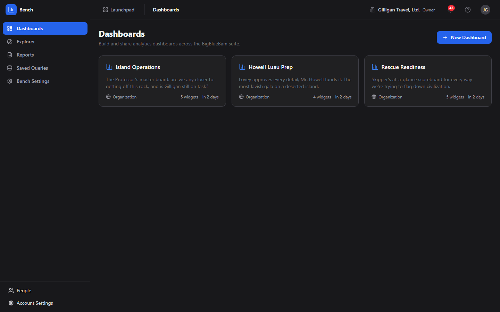
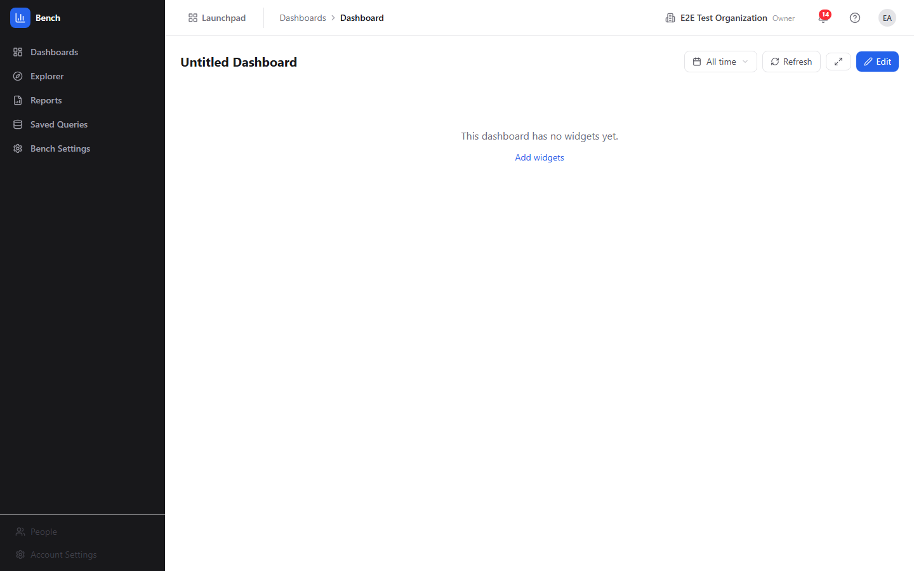
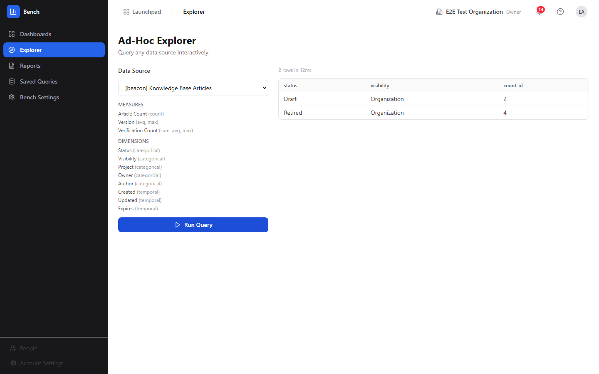

# Bench (Analytics)

Bench turns the data your team already creates across the suite into shared dashboards, ad-hoc queries, and scheduled reports - no warehouse, no copy-paste.

- Chart deals, campaigns, goals, and more from a curated cross-app data source registry, with every query automatically scoped to your organization.
- Build dashboards from a four-step Widget Wizard or a gallery of prebuilt templates, then share them Private, by Project, or Org-wide.
- Explore any source on demand, save reusable queries, and schedule dashboard snapshots to Email, a Banter channel, or a Brief document.
- Built for AI agents too: through MCP, agents discover sources, run queries, build dashboards, summarize a whole board in one call, and flag anomalies, all under per-agent policy and visibility controls.
- Your presence travels with you across the suite via the Bureau virtual office

## See It in Action

---

Part of the [BigBlueBam](/) productivity suite.
