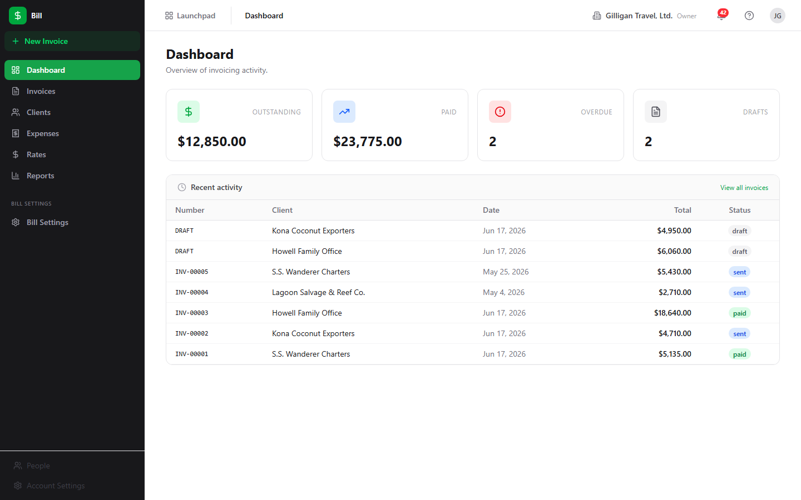
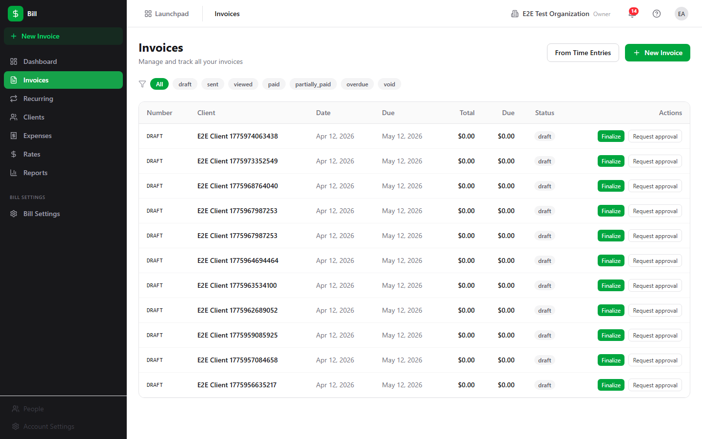
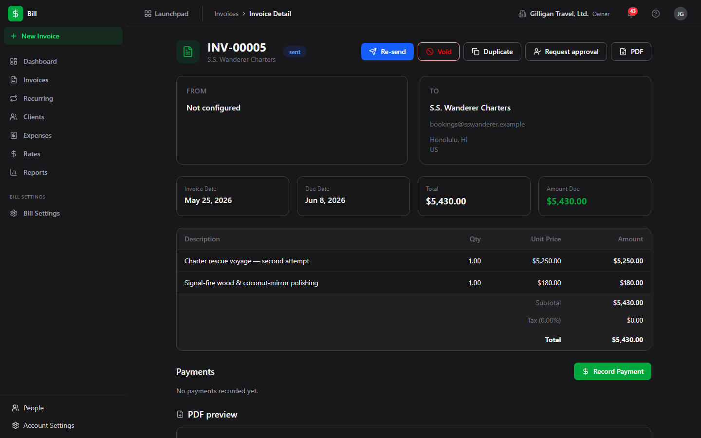
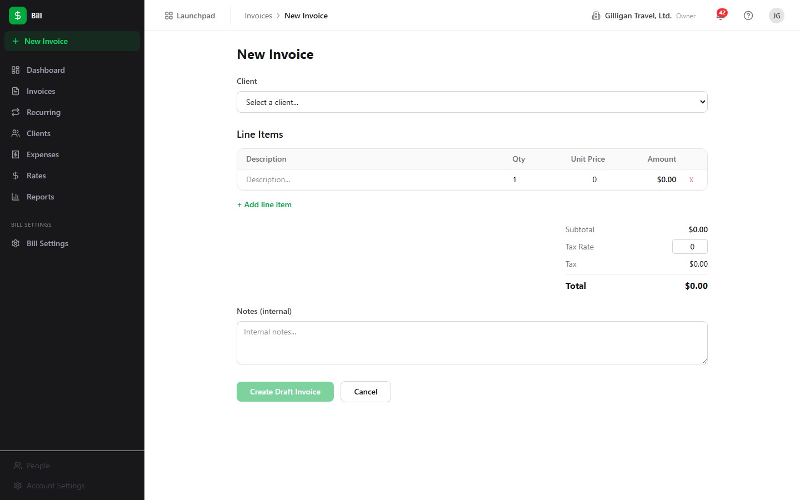
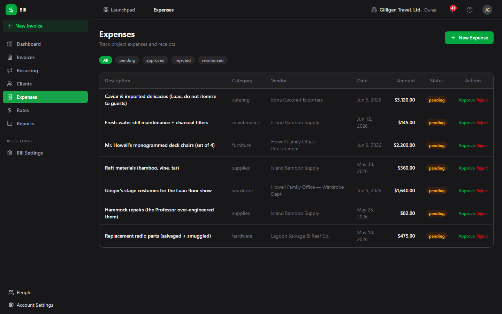
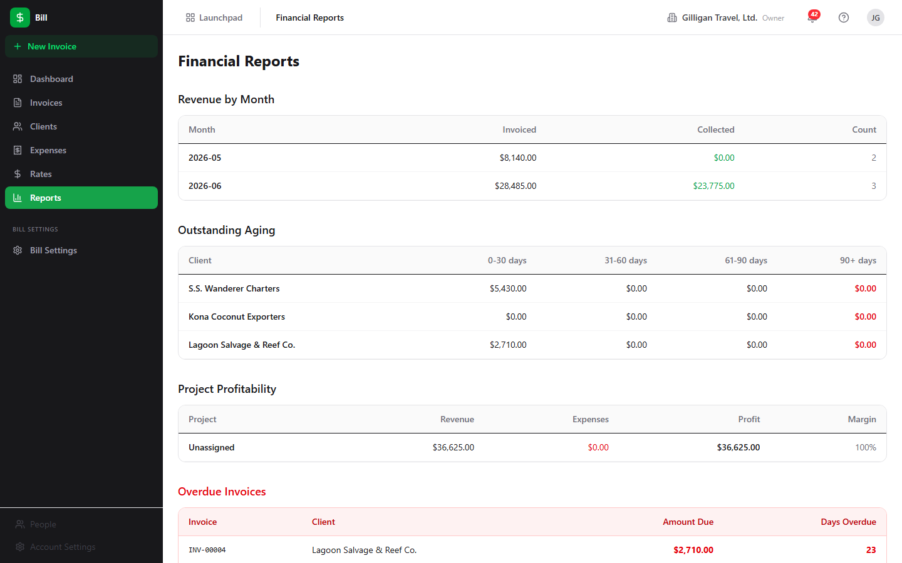

# Bill (Invoicing) Guide

# Bill - Invoicing & Billing

Bill is BigBlueBam's invoicing and billing app for creating invoices, recording payments, tracking expenses, managing client accounts, and reporting on revenue and profitability. It is org-scoped: clients, invoices, expenses, rates, and settings all belong to your active organization.

## Key Features

- **Invoice Creation** with editable line items, a tax rate, discounts, due dates, and a one-way finalize step that assigns a permanent invoice number and locks edits
- **Payment Tracking** with per-payment method, reference, and date; invoices move through draft, sent, viewed, partially paid, and paid as receipts are recorded
- **Client Management** with contact details, billing address, tax ID, default payment terms, and per-client billed/paid/outstanding summaries
- **Expense Tracking** for logging project costs with a category, vendor, billable flag, and a pending to approved or rejected review step, plus a Mark reimbursed action for paying the submitter back
- **Rate Configuration** for hourly, daily, or fixed rates scoped to the org, a project, a user, or a user on a project, with most-specific-wins resolution
- **Financial Reports** covering revenue by month, outstanding aging, project profitability, and a due-date-computed overdue list, which also feeds the Dashboard Overdue tile and the Invoices Overdue filter
- **PDF Generation** for any invoice on demand, plus an unauthenticated public view token for sharing a sent invoice
- **Invoice from a Bond deal** that pulls a deal's value into a draft, and an Invoice from Time Entries wizard that turns Bam time entries over a date range into priced line items

## Integrations

Bill connects to Bam for projects, tasks, and time entries that drive rate resolution and time-based invoicing, and routes invoice approvals through Bam's approval queue. It generates draft invoices from Bond deals and can link a billing client to a Bond company. It emits events (`invoice.created`, `invoice.finalized`, `invoice.sent`, `invoice.paid`, `payment.recorded`, `invoice.overdue`, and more) on the `bill` source for Bolt automation rules to consume. Approval requests reach the approver as a Banter DM. A daily worker sweep emails clients whose invoices are past due. There is no recurring or subscription billing; each invoice is created on its own. Public invoice pages are view-and-PDF only; they do not collect online payment.

## Getting Started

Open Bill from the Launchpad at `/bill/`. Set up your company identity and invoice defaults in Bill Settings, then create a client under Clients. Create an invoice manually with line items, generate a draft from a Bond deal, or use the Invoice from Time Entries wizard to bill tracked Bam time over a date range. Finalize the invoice to assign its number (an admin or owner step), send it, and record payments as they arrive. Track status on the Dashboard and use Reports to monitor revenue, aging, profitability, and overdue balances.

## Walkthrough

### Dashboard

### Invoice List

### Invoice Detail

### Invoice New

### Expenses

### Reports

## MCP Tools

# bill MCP Tools

| Tool | Description | Parameters |
|------|-------------|------------|
| `bill_add_line_item` | Add a line item to a draft invoice. | `invoice_id`, `quantity`, `unit_price`, `unit` |
| `bill_approve_expense` | Approve a pending expense. | `expense_id` |
| `bill_create_client` | Create a new billing client for the organization. | `email`, `phone`, `address_line1`, `address_line2`, `city`, `state_region`, `postal_code`, `country`, `tax_id`, `bond_company_id`, `default_payment_terms_days`, `default_payment_instructions`, `notes` |
| `bill_create_expense` | Log a new expense, optionally linked to a project. | `amount`, `category`, `vendor`, `project_id`, `billable` |
| `bill_create_invoice` | Create a new blank draft invoice for a billing client. | `client_id`, `project_id`, `tax_rate`, `notes` |
| `bill_create_invoice_from_deal` | Generate a draft invoice from a Bond CRM deal, pulling deal value and contact info.  | `deal_id`, `client_id` |
| `bill_create_invoice_from_time` | Generate a draft invoice from Bam time entries for a project over a date range.  | `project_id`, `client_id`, `date_from`, `date_to` |
| `bill_create_rate` | Create a billing rate, optionally scoped to a project and/or user with an effective date range. | `project_id`, `user_id`, `rate_amount`, `rate_type`, `currency`, `effective_from`, `effective_to` |
| `bill_delete_client` | Delete a billing client by UUID. | `client_id` |
| `bill_delete_expense` | Delete an expense by UUID. | `expense_id` |
| `bill_delete_invoice` | Delete an invoice by UUID (draft invoices only). | `invoice_id` |
| `bill_delete_line_item` | Delete a line item from a draft invoice. | `invoice_id`, `item_id` |
| `bill_delete_payment` | Delete a recorded payment by UUID, reverting the invoice balance. | `payment_id` |
| `bill_delete_rate` | Delete a billing rate by UUID. | `rate_id` |
| `bill_duplicate_invoice` | Duplicate an existing invoice into a new draft, copying line items. | `invoice_id` |
| `bill_finalize_invoice` | Finalize a draft invoice — assigns an invoice number and locks edits. | `invoice_id` |
| `bill_get_client` | Get a single billing client by UUID, including address and billing defaults. | `client_id` |
| `bill_get_invoice` | Get full invoice detail including line items and payments. | `invoice_id` |
| `bill_get_invoice_jobs` | Get the latest async PDF-generation and email-send job state for an invoice. | `invoice_id` |
| `bill_get_outstanding` | Outstanding-balance report: invoices with an unpaid balance and the amount still owed. | none |
| `bill_get_overdue` | List all overdue invoices with days overdue and amount due. | none |
| `bill_get_profitability` | Get project profitability: invoiced revenue vs. logged expenses per project. | none |
| `bill_get_revenue_summary` | Get revenue summary by month, showing total invoiced and collected. | `date_from`, `date_to` |
| `bill_get_settings` | Get the organization billing settings (company info, default currency, tax rate, payment terms, invoice prefix). | none |
| `bill_list_clients` | List billing clients for the organization, with optional fuzzy search across name, email, and linked Bond company name. Returns id, name, email, company_id, company_name, currency (org default), and default_payment_terms_days — the resolver surface every  | `search` |
| `bill_list_expenses` | List expenses, optionally filtered by project, category, or status. | `project_id`, `category`, `status` |
| `bill_list_invoices` | List invoices, optionally filtered by status, client, project, or date range. | `status`, `client_id`, `project_id`, `date_from`, `date_to` |
| `bill_list_rates` | List billing rates, optionally filtered by project or user. | `project_id`, `user_id` |
| `bill_record_payment` | Record a payment against an invoice. | `invoice_id`, `amount`, `payment_method`, `reference` |
| `bill_reject_expense` | Reject a pending expense. | `expense_id` |
| `bill_resolve_rate` | Resolve the effective billing rate for a given project + user + date. | `project_id`, `user_id`, `date` |
| `bill_send_invoice` | Mark invoice as sent (triggers email delivery if configured). | `invoice_id` |
| `bill_update_client` | Update a billing client. Provide only the fields to change. | `client_id`, `email`, `phone`, `address_line1`, `address_line2`, `city`, `state_region`, `postal_code`, `country`, `tax_id`, `bond_company_id`, `default_payment_terms_days`, `default_payment_instructions`, `notes` |
| `bill_update_expense` | Update an expense. Provide only the fields to change. | `expense_id`, `project_id`, `amount`, `currency`, `category`, `vendor`, `expense_date`, `billable` |
| `bill_update_invoice` | Update a draft invoice. Provide only the fields to change. | `invoice_id`, `client_id`, `project_id`, `invoice_date`, `due_date`, `tax_rate`, `discount_amount`, `payment_terms_days`, `payment_instructions`, `notes`, `footer_text`, `terms_text`, `bond_deal_id` |
| `bill_update_line_item` | Update a line item on a draft invoice. Provide only the fields to change. | `invoice_id`, `item_id`, `quantity`, `unit`, `unit_price`, `sort_order` |
| `bill_update_rate` | Update a billing rate. Provide only the fields to change. | `rate_id`, `rate_amount`, `rate_type`, `effective_from`, `effective_to` |
| `bill_update_settings` | Update the organization billing settings. Provide only the fields to change. | `company_name`, `company_email`, `company_phone`, `company_address`, `company_logo_url`, `company_tax_id`, `default_currency`, `default_tax_rate`, `default_payment_terms_days`, `default_payment_instructions`, `default_footer_text`, `default_terms_text`, `invoice_prefix` |
| `bill_void_invoice` | Void a finalized invoice — marks it void without deleting the record. | `invoice_id` |

## Related Apps

- [Bolt (Workflow Automation)](../bolt/guide.md)
- [Bond (CRM)](../bond/guide.md)
