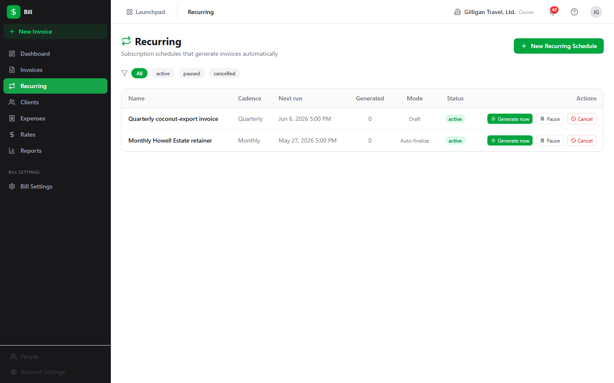

# Bill - Invoicing and billing for client work

> Bill turns the work your team does into invoices, tracks who has paid and who is overdue, captures project expenses, and reports on revenue and profitability. Reach for it when you need to bill a client, record a payment, or close out a billing period.

## Overview

Bill is the invoicing and billing app in the BigBlueBam suite. You create an **invoice** for a **client**, fill it with **line items**, finalize it to assign a permanent number, send it, and record **payments** until it is fully paid. Alongside invoices, Bill tracks **expenses** (with an approval step), **rates** that drive time-based billing, and a set of financial **reports**.

Bill is org-scoped: every client, invoice, expense, rate, and setting belongs to your active organization. It connects to the rest of the suite in several places. It can pull billable time from Bam projects and tasks, generate an invoice from a won Bond deal, route an invoice for approval through Bam's approval queue, and emit events that Bolt automation rules can react to.

A few conventions to know up front. All money in Bill is stored and entered in **integer cents**, not dollars. The amount, rate, and payment inputs in the UI are labeled "(cents)" and take whole numbers, so typing `150` means one dollar and fifty cents. Invoices are only editable while they are in `draft`; once you finalize an invoice, its number and line items are locked.

Roles matter for the money-sensitive steps. Any member who can write to Bill can build a draft invoice, add line items, manage clients, log expenses, record payments, and configure rates and settings. But the steps that commit money or sign off on it - **Finalize**, **Re-send / Send**, **Approve** or **Reject** an expense, and **Mark reimbursed** - require an admin or owner role. A member can prepare the work; an admin or owner approves and sends it.

### Key concepts

- **Invoice** - A billable document addressed to one client. It snapshots your company details (the "from" side) and the client details (the "to" side) when it is created, and carries an invoice date, due date, line items, tax, totals, and payment history. Its number is literally `DRAFT` until you finalize it.
- **Invoice status** - The lifecycle of an invoice. The values that the app actually sets are `draft` (editable, no number yet), `sent` (finalized, number assigned, edits locked), `viewed` (a client opened the public link), `partially_paid` (some payment recorded, balance remains), `paid` (paid in full), and `void` (cancelled). **Overdue** is not a stored status: it is computed from the due date as any unpaid, finalized invoice that is past due. The Invoices list **Overdue** filter pill and the Dashboard **Overdue** tile both draw from that computed set, so they populate correctly.
- **Line item** - One row on an invoice: a description, quantity, unit (default `hours`), and unit price in cents. The amount is quantity times unit price. Line items can only be added, edited, or removed while the invoice is a draft.
- **Client** - The recipient of an invoice. Carries name, email, phone, address, tax ID, default payment terms (in days), default payment instructions, and notes. A Bill client is separate from a Bond contact or company, though it can be linked to a Bond company.
- **Payment** - A recorded receipt against an invoice: an amount in cents, a method (Bank Transfer, Credit Card, Check, Cash, Stripe, PayPal, or Other), an optional reference, and a date.
- **Expense** - A project cost: description, amount in cents, category, vendor, date, and a billable flag. Expenses start as `pending`, a reviewer moves them to `approved` or `rejected`, and an approved expense can be moved on to `reimbursed`.
- **Rate** - A billing rate scoped to your org, a project, a user, or a user-on-a-project, with an amount in cents and a type (hourly, daily, or fixed). When Bill bills tracked time, it resolves the most specific rate that applies.
- **Settings** - Your company identity and the defaults new invoices inherit: invoice prefix, default tax rate, payment terms, payment instructions, footer text, and terms text.
- **Recurring schedule** - A subscription that bills one client on a cadence (weekly, monthly, quarterly, or annually) from a saved line-item template. It carries a status (`active`, `paused`, or `cancelled`), a next-run date, a count of invoices generated so far, and a mode: auto-finalize (each generated invoice gets a number and is marked sent) or draft (each generated invoice is left as a draft to review). A daily worker sweep materializes invoices from schedules whose next-run date has arrived, and you can also generate one on demand.
- **Public view token** - A long opaque token on each invoice that grants read-only access (and a PDF) without logging in. It is how a sent invoice can be viewed by someone outside your org.

### Where to find it

Bill is served at `/bill/`. You must be logged in to BigBlueBam first; if you are not, Bill shows a "Please log in to BigBlueBam first to access Bill." screen with a "Go to BigBlueBam Login" link to `/b3/`. Everything is scoped to your active organization, and mutating actions require the matching Bill permission on your account.

The left sidebar carries a fixed **New Invoice** quick-action button, then the nav items **Dashboard**, **Invoices**, **Recurring**, **Clients**, **Expenses**, **Rates**, and **Reports**, and under a **Bill Settings** subheading the **Bill Settings** item. Press `?` anywhere in Bill to open the embedded Help viewer.

## Feature reference

### Dashboard

The Dashboard is the default view at `/bill/`, titled **Dashboard** with the subtitle "Overview of invoicing activity." It shows four stat tiles - **Outstanding**, **Paid**, **Overdue**, and **Drafts** - and a **Recent activity** table listing recent invoices (Number, Client, Date, Total, Status) with a **View all invoices** link.

The **Outstanding**, **Paid**, and **Drafts** numbers are computed in the browser from your full invoice list. The **Overdue** tile is different: it counts the invoices returned by the overdue report (unpaid, finalized invoices whose due date has passed), so it reflects what is actually past due. Clicking the **Overdue** tile opens the Invoices list pre-filtered to overdue. Clicking the other tiles or **View all invoices** returns you to the Dashboard.

To open an invoice from the Dashboard:

1. Go to `/bill/` from the sidebar **Dashboard** item.
2. In the **Recent activity** table, click any row.
3. You land on that invoice's detail page.

To jump straight to overdue invoices:

1. Click the **Overdue** tile.
2. The Invoices list opens with the **Overdue** filter applied, showing every past-due unpaid invoice.

### Invoice list

The Invoices list at `/bill/invoices` is titled **Invoices** with the subtitle "Manage and track all your invoices." It is the main place to scan, filter, and act on invoices.

The columns are Number, Client, Date, Due (the due date), Total, Due (the remaining balance, which is total minus amount paid), Status, and Actions. The two "Due" columns are a date and a balance respectively. Above the table is a row of status filter pills; the empty pill is labeled **All**. Per-row actions include **PDF**, **Finalize** (drafts only), and **Request approval**.

To filter the list:

1. Open **Invoices** in the sidebar.
2. Click a status pill (**All**, or a specific status such as **Draft**, **Sent**, or **Paid**).
3. The table reloads with only invoices in that status.

The **Overdue** pill shows every invoice that is unpaid, finalized, and past its due date. Unlike the other pills, which match a stored status, the **Overdue** pill draws from the overdue report, so it computes past-due invoices from each invoice's due date. The Dashboard's **Overdue** tile deep-links here.

To finalize a draft from the list:

1. Find a draft row.
2. Click **Finalize** in its Actions cell. Finalize requires an admin or owner role.
3. The invoice is assigned a number and moves to `sent`; it can no longer be edited.

To download a PDF from the list:

1. Click **PDF** on any row.
2. The invoice PDF opens inline.

To request approval from the list:

1. Click **Request approval** on a row.
2. In the **Request approval for {number}** modal, choose an **Approver** from the select (the list is active Bam users), optionally type a **Message (optional)**, and click **Send request**.
3. The helper text reads "Sends a Banter DM to the approver via Bolt." The request is posted to Bam's approval queue with subject type `bill.invoice`; the approver acts on it inside Bam.

The two entry points for creating invoices live at the top of this view: **From Time Entries** (see "Invoice from time entries") and **New Invoice** (see "Create an invoice").

### Create an invoice

The New Invoice form at `/bill/invoices/new` (titled **New Invoice**) builds a draft invoice manually. Reach it from the sidebar **New Invoice** button, the Invoices list **New Invoice** button, or a client's **+ New Invoice** link. Any member with write access can create a draft.

To create an invoice:

1. Click **New Invoice**.
2. Choose a **Client** from the select. The **Create Draft Invoice** button stays disabled until a client is chosen.
3. In the **Line Items** table, fill in Description, Qty, and Unit Price (in cents) for each row. The Amount column is computed. Click **+ Add line item** to add another row, or the **X** at the end of a row to remove it.
4. In the totals box, review the **Subtotal**, edit the **Tax Rate** if needed (the **Tax** and **Total** update automatically).
5. Optionally add **Notes (internal)**.
6. Click **Create Draft Invoice**. Bill creates the draft, adds each line item, and opens the new invoice's detail page. Use **Cancel** to return to the Dashboard instead.

### Invoice from time entries

The page at `/bill/invoices/from-time` is titled **Invoice from Time Entries** with the subtitle "Generate an invoice from Bam time tracking data." It turns billable hours logged in Bam into a draft invoice in one pass.

To generate an invoice from tracked time:

1. From the Invoices list, click **From Time Entries** (or go to `/bill/invoices/from-time`).
2. Pick a Bam project in the **Project** select.
3. Pick the recipient in the **Bill to client** select.
4. Set the **Date From** and **Date To** range.
5. Click **Generate Invoice**.

Every billable time entry on that project between the two dates is grouped by team member and task, priced with the configured billing rate, and added as a line item on a new draft invoice. Each contributing user needs a billing rate configured for the project (set one under Rates or through the API), or generation fails with an error explaining which rate is missing. When generation succeeds you land on the new draft's detail page, where you can review the line items, then Finalize and send. Use **Create Manually Instead** to switch to the blank New Invoice form.

This flow is backed by `POST /bill/api/v1/invoices/from-time-entries`, which accepts either a `date_from`/`date_to` range (what the wizard sends) or an explicit list of `time_entry_ids`. The `bill_create_invoice_from_time` MCP tool drives the same range form for agents; see "Working with AI agents."

### Invoice detail

The detail page at `/bill/invoices/:id` shows everything about one invoice: header with number, client, and a status badge; From and To panels; Invoice Date, Due Date, Total, and Amount Due tiles; the read-only line items with a Subtotal / Tax / Discount / Total footer; the payments section; and an inline **PDF preview** iframe once a PDF exists.

The header actions vary by status:

- **Edit** appears on drafts and opens the edit form.
- **Finalize** appears on drafts; it assigns the number and locks the invoice. Admin or owner only.
- **Re-send** appears on sent or viewed invoices; it marks the invoice sent again and queues an email if email is configured. Admin or owner only.
- **Void** appears on any non-draft, non-void invoice; it cancels the invoice.
- **Duplicate** is always available; it clones the invoice (and its line items) into a new draft and opens that draft.
- **Request approval** opens an inline form that posts to Bam's approval queue, the same flow as the list view.
- **PDF** opens the invoice PDF.

To record a payment from the detail page:

1. Open the invoice. The **Record Payment** control appears when the status is not draft, void, or paid.
2. Enter the **Amount (cents)**.
3. Choose a **Method** (Bank Transfer, Credit Card, Check, Cash, Stripe, PayPal, or Other).
4. Click **Save Payment**.
5. The payment appears in the list (Date, Method, Amount). When recorded payments reach the total, the invoice flips to `paid`; a partial payment shows `partially_paid`. Bill rejects a payment that would exceed the remaining balance.

To void an invoice:

1. Open a sent, viewed, or paid invoice (void is blocked on drafts; delete a draft instead).
2. Click **Void** in the header.
3. The invoice moves to `void` and drops out of revenue reports.

To duplicate an invoice:

1. Click **Duplicate** in the header.
2. Bill creates a new draft with the same line items and opens it for editing.

### Edit an invoice

The edit form at `/bill/invoices/:id/edit` is titled **Edit Invoice {number}** and is available only for drafts. A non-draft shows "Only draft invoices can be edited." with a "Back to Invoice" link.

The editable fields are **Tax Rate (%)**, **Internal Notes**, **Footer Text (on invoice)**, and **Terms & Conditions (on invoice)**. The edit form cannot add or remove line items and cannot change the client. To change line items, do it on the New Invoice form before creating, or duplicate the invoice and rebuild it.

To edit a draft:

1. On the invoice detail page, click **Edit**.
2. Adjust **Tax Rate (%)**, **Internal Notes**, **Footer Text (on invoice)**, or **Terms & Conditions (on invoice)**.
3. Click **Save Changes** (or **Cancel** to discard).

### Clients

The Clients list at `/bill/clients` is titled **Clients** with the subtitle "Manage billing clients." Columns are Name, Email, Phone, and Terms (shown as "{n} days").

To add a client:

1. Open **Clients** in the sidebar.
2. Click **New Client** to reveal the inline form.
3. Enter **Name** and **Email**.
4. Click **Create Client**.

To open and edit a client:

1. Click a client row to open `/bill/clients/:id`.
2. Click **Edit** to enable inline editing of Contact Information (Name, Email, Phone) and Address & Tax (Address Line 1, Address Line 2, City, State, ZIP, Tax ID) plus Notes.
3. Click **Save** (or **Cancel**).

The client detail page also shows **Total Billed**, **Total Paid**, and **Outstanding Balance** summary cards computed from this client's invoices, the read-only address, tax ID, payment terms, and notes, and an **Invoices** table (Invoice #, Date, Status, Total, Paid, Due). The **+ New Invoice** link opens the New Invoice form; note that it does not pre-select this client, so choose the client again on the form.

### Expenses

The Expenses list at `/bill/expenses` is titled **Expenses** with the subtitle "Track project expenses and receipts." Columns are Description, Category, Vendor, Date, Amount, Status, and Actions. A row of status pills filters the list: **All** (empty), **pending**, **approved**, **rejected**, and **reimbursed**. The **reimbursed** pill shows expenses you have paid back to the submitter.

To log an expense:

1. Open **Expenses** and click **New Expense** to go to `/bill/expenses/new` (titled **New Expense**).
2. Fill in **Description**, **Amount (cents)**, and **Date**.
3. Choose a **Category** (Software, Travel, Hardware, Contractor, Office, Meals, or Other) and optionally a **Vendor**.
4. Tick **Billable to client** if the cost should be invoiceable.
5. Click **Submit Expense**. The expense is created as `pending`.

To approve or reject an expense:

1. On the Expenses list, find a `pending` row.
2. Click **Approve** or **Reject** in its Actions cell. Approving and rejecting require an admin or owner role.
3. The status changes to `approved` or `rejected`. Only pending expenses can be approved or rejected; once approved, an expense is locked from edits.

To mark an approved expense reimbursed:

1. On the Expenses list, find an `approved` row.
2. Click **Mark reimbursed** in its Actions cell. This is an admin or owner action.
3. The status changes to `reimbursed`, the terminal step of the expense lifecycle (`pending` to `approved` to `reimbursed`). Only approved expenses can be marked reimbursed.

Editing an expense, deleting one, and attaching a receipt are supported by the API but have no button in the current UI. To attach a receipt or edit an expense, use the API (`POST /bill/api/v1/expenses/:id/receipt`, `PATCH /bill/api/v1/expenses/:id`) or the matching MCP tools.

### Rates

The Rates list at `/bill/rates` is titled **Billing Rates** with the subtitle "Configure hourly, daily, or fixed rates per org/project/user." Columns are Rate, Type, Scope (derived as User + Project, User, Project, or Organization), Effective From, and Actions.

To add a rate:

1. Open **Rates** and click **New Rate** to reveal the inline form.
2. Enter **Rate (cents)** (the form defaults to 15000) and choose a **Type** (Hourly, Daily, or Fixed).
3. Click **Create Rate**.

To delete a rate, click **Delete** in its Actions cell.

The inline form only sets amount and type, so rates created in the UI are organization-scoped. Project-specific, user-specific, and date-bounded rates are supported by the data model and the resolver but must be created through the API (`POST /bill/api/v1/rates` with `project_id`, `user_id`, `effective_from`, or `effective_to`) or the `bill_create_rate` MCP tool, which accepts those scopes. When Bill bills time, it resolves the most specific rate that applies, preferring a user-and-project rate, then a user rate, then a project rate, then the organization rate, restricted to rates whose date range covers the work date.

### Reports

The Reports view at `/bill/reports` is titled **Financial Reports**. It renders four tables:

- **Revenue by Month** (Month, Invoiced, Collected, Count).
- **Outstanding Aging** (Client, with 0-30, 31-60, 61-90, and 90+ day buckets).
- **Project Profitability** (Project, Revenue, Expenses, Profit, Margin). Only approved expenses count against profit.
- **Overdue Invoices** (Invoice, Client, Amount Due, Days Overdue). Each row links to the invoice. It computes overdue from each invoice's due date; the Dashboard tile and the Invoices list **Overdue** filter draw from the same set.

Revenue and profitability exclude draft, void, and written-off invoices. Outstanding and overdue also exclude paid invoices. Report views require Bill report permissions.

To read your reports:

1. Open **Reports** in the sidebar.
2. Review the four tables in place.
3. Click any **Overdue Invoices** row to jump to that invoice.

### Settings

The Settings view at `/bill/settings` is titled **Billing Settings**. It has two sections.

**Company Information** holds Company Name, Email, Phone, Tax ID, and Address. These are snapshotted onto each invoice's "from" side at creation time.

**Invoice Defaults** holds Invoice Prefix, Default Tax Rate (%), Payment Terms (days), Default Payment Instructions, Default Footer Text, and Default Terms & Conditions. New invoices inherit these defaults.

To update your billing identity and defaults:

1. Open **Bill Settings** in the sidebar.
2. Edit any field under **Company Information** or **Invoice Defaults**.
3. Click **Save Settings**. The button shows "Saved!" on success.

The settings record also stores a company logo URL and a default currency, both reachable through the API and the `bill_update_settings` MCP tool, but neither has a field in the current Settings form.

### Recurring billing

The Recurring page at `/bill/recurring` is titled **Recurring** with the subtitle "Subscription schedules that generate invoices automatically." It is where you set up standing fees that bill a client on a cadence without re-drafting the invoice each cycle.

The table columns are Name, Cadence, Next run, Generated (the count of invoices produced so far), Mode (Auto-finalize or Draft), Status, and Actions. A row of filter pills above it filters by status: **All** (empty), **active**, **paused**, and **cancelled**. Each schedule carries a client, a cadence (weekly, monthly, quarterly, or annually), a saved line-item template, an optional tax rate, a start date, an optional end date, and a mode.

The **Mode** determines what each run produces. With **Auto-finalize** on, every generated invoice is assigned a number and marked sent automatically. With it off (**Draft**), each run produces a draft for you to review, finalize, and send by hand. Schedules generate on their own through a daily worker sweep that materializes invoices from every active schedule whose next-run date has arrived; you can also force one immediately with **Generate now**.

To create a recurring schedule:

1. Open **Recurring** in the sidebar and click **New Recurring Schedule**.
2. Give the schedule a **Schedule name** and pick a **Client**.
3. Choose a **Cadence** (weekly, monthly, quarterly, or annually) and a **Start date**; optionally set an **End date** and a **Tax rate (%)**.
4. Tick **Auto-finalize generated invoices** to bill automatically, or leave it unchecked to generate drafts for review.
5. In the **Line items (template)** table, add a Description, Qty, and Unit price (cents) for each row. The Subtotal updates as you type.
6. Optionally add **Notes (internal)**, then click **Create schedule**. The schedule starts `active`.

The per-row actions depend on status:

- **Generate now** materializes an invoice immediately from the template (available on active and paused schedules). A banner reports the generated invoice number, or "draft" when the schedule is in draft mode.
- **Pause** stops generation on an active schedule; **Resume** restarts a paused one.
- **Cancel** stops all future generation permanently. It is an admin or owner action; existing invoices the schedule already produced are kept. Cancelling prompts for confirmation and cannot be undone.

Creating, updating, pausing, resuming, and generating-now follow the same write permission as drafting an invoice, so any member who can create invoices can run these. Cancelling a schedule is restricted to an admin or owner, mirroring invoice deletion. When a run produces an invoice, Bill emits a `recurring.invoice_generated` event on the `bill` source for Bolt rules to consume.

### PDF generation

Every invoice can be downloaded as a PDF. The **PDF** action on the list, the **PDF** action in the detail header, and the inline **PDF preview** iframe all render the invoice through Bill's PDF service (`GET /bill/api/v1/invoices/:id/pdf`). A draft's PDF is named `DRAFT.pdf`; a finalized invoice's PDF is named after its number.

When you finalize an invoice, Bill enqueues a background PDF job; when you send one, it enqueues an email job. While those run, the detail page can show a "PDF generating..." state. You do not need to trigger PDF generation manually; the PDF action always renders on demand.

### Public invoice view

Each invoice carries a public view token. Anyone with the token URL can read a safe subset of the invoice and fetch its PDF without logging in, through `GET /bill/api/v1/invoice/:token` and `GET /bill/api/v1/invoice/:token/pdf`. The first open of the token URL marks a sent invoice as `viewed`. The public response omits internal fields such as the organization ID, the creator, the linked Bond deal, and tax IDs.

There is no Bill SPA page for the public view and no client-facing payment action on it. The public page is view-and-PDF only: the client cannot pay through it, so you record payments yourself from the invoice detail page. The token URL is intended to be shared with a client, typically from a sent-invoice email.

### Working with AI agents

Bill exposes 47 MCP tools (catalogued in `apps/mcp-server/src/tools/bill-tools.ts`), which together cover the full invoicing and recurring-billing lifecycle from chat or a Bolt automation rule. Many tools resolve fuzzy identifiers: a client can be named by name or email, and a Bam project by name, and the tool resolves it to an ID. Mutating tools run under the same per-action permissions as the UI, so an agent acting as a member can build drafts but cannot finalize, send, or approve expenses unless its account has the admin or owner grant.

What agents commonly do:

- **List and inspect:** `bill_list_invoices`, `bill_get_invoice`, `bill_get_invoice_jobs`, `bill_list_clients`, `bill_get_client`, `bill_list_expenses`, `bill_list_rates`, `bill_get_settings`.
- **Build a draft:** `bill_create_invoice` (blank draft for a client), then `bill_add_line_item`, `bill_update_line_item`, and `bill_delete_line_item` per line. `bill_update_invoice` adjusts a draft's dates, tax, discount, terms, notes, and footer. For a Bond-deal handoff, `bill_create_invoice_from_deal` pulls the deal value into one line item; in a Bolt rule the deal ID is passed as `{{ event.deal.id }}` from a `deal.*` event, and it must be a UUID.
- **Bill tracked time:** `bill_create_invoice_from_time` takes a project, a billing client, and a `date_from`/`date_to` range, and the Bill API resolves the matching time entries, groups them by user and task, prices each group with the resolved rate, and builds one line item per group. This is the same range form the in-app wizard uses.
- **Finish and collect:** `bill_finalize_invoice` to assign the number and lock the invoice, `bill_send_invoice` to mark it sent, `bill_record_payment` to log receipts, and `bill_delete_payment` to reverse one. `bill_void_invoice`, `bill_duplicate_invoice`, and `bill_delete_invoice` cover the rest of the invoice lifecycle.
- **Clients:** `bill_create_client`, `bill_update_client`, and `bill_delete_client` manage the recipient records.
- **Expenses and rates:** `bill_create_expense`, `bill_update_expense`, `bill_delete_expense`, `bill_approve_expense`, and `bill_reject_expense` for costs; `bill_create_rate`, `bill_update_rate`, `bill_delete_rate`, and `bill_resolve_rate` for billing rates (the create tool accepts project, user, and effective-date scoping that the UI form does not). Marking an approved expense reimbursed is a UI and REST action (`POST /bill/api/v1/expenses/:id/reimburse`) with no dedicated MCP tool.
- **Recurring schedules:** `bill_list_recurring_invoices` and `bill_get_recurring_invoice` to read schedules and their line-item template; `bill_create_recurring_invoice` to stand one up (client, cadence, mode, and template line items); `bill_update_recurring_invoice` to adjust it; `bill_pause_recurring_invoice`, `bill_resume_recurring_invoice`, and `bill_cancel_recurring_invoice` to control its lifecycle (cancel is admin or owner); and `bill_generate_recurring_invoice_now` to materialize an invoice on demand.
- **Reporting:** `bill_get_overdue`, `bill_get_revenue_summary`, `bill_get_profitability`, and `bill_get_outstanding` back the Reports view's data.
- **Settings:** `bill_get_settings` and `bill_update_settings` read and write the org billing identity and invoice defaults, including the logo URL and default currency the UI form omits.

A typical agent flow is: an agent drafts an invoice from a deal or from logged time, fills line items, and records a payment when one lands, while leaving the **Finalize** and **Send** steps for an admin or owner to approve. For high-stakes actions, route the work through the platform approval queue (the `proposal_create` / `proposal_list` / `proposal_decide` tools) so a human signs off before money moves.

One caution for agent-driven invoicing: the invoice number format the live finalizer produces is `{prefix}-{number:05d}` (for example `INV-00001`). Year-based forms like `INV-2026-0042` that appear in some seed data and examples are not what finalize generates.

Bill participates in the cross-cutting agentic platform that every BigBlueBam app shares:

- **Identity and heartbeat.** Agent and service accounts carry `users.kind` (`agent` or `service`), which is mirrored onto each activity row's `actor_type`, so Bill writes made by an agent are attributable. Agent runners report liveness with `agent_heartbeat`.
- **Approvals.** Beyond the in-app **Request approval** flow (which posts to Bam's queue), agents can stage any decision in the durable proposal queue with `proposal_create` and let a human resolve it with `proposal_decide`.
- **Unified activity.** Bill invoice and payment activity is queryable across apps through `activity_query` and `activity_by_actor`, and surfaces in the unified activity view alongside the other apps.
- **Policies and webhooks.** Per-agent kill switches and tool allowlists (the `bill.*` glob) gate which Bill tools a given agent may call. Subscribed Bill events can be pushed to agent runners over HMAC-signed outbound webhooks.
- **Visibility.** Before an agent surfaces Bill data (an invoice total, a client balance) into a shared surface in another app, it should run the platform `can_access` check for each cited `bill.invoice` entity and drop anything the asker is not allowed to see, per `docs/reference/agent-conventions.md`.

For the full tool catalog, see the MCP-tools reference in `docs/apps/bill/`.

## Working together (live presence)

Like every BigBlueBam app, Bill carries the persistent Bureau presence dock, so collaboration is ambient rather than scheduled. From anywhere in Bill you can see who is around and ring, knock, or invite a teammate into a live voice or video huddle that follows you in a floating window as you both move through the suite. Voice and video here are the digital equivalent of bumping into someone in the hallway or stopping by their desk, not a booked meeting. The deeper per-record collaboration (a presence strip showing who is on a specific item, and real-time co-editing of the same record) lives on the document, board, diagram, and task surfaces, described in the Introduction; in Bill, the shared layer is the always-on Bureau dock.

## User Stories

### Story: Set up your billing identity

**Who:** An org admin or owner setting up Bill for the first time.
**Goal:** Make new invoices carry your company details and sensible defaults.
**Before you start:** You are logged in to BigBlueBam and have Bill settings permission.

**Steps**

1. Open Bill at `/bill/` and click **Bill Settings** in the sidebar.
2. Under **Company Information**, fill in Company Name, Email, Phone, Tax ID, and Address.
3. Under **Invoice Defaults**, set the Invoice Prefix, Default Tax Rate (%), Payment Terms (days), Default Payment Instructions, Default Footer Text, and Default Terms & Conditions.
4. Click **Save Settings** and wait for the "Saved!" confirmation.

**Result:** Your company identity is stored. Every new invoice snapshots these details onto its "from" side and inherits the defaults you set.

**Related:** Add your first client next (Story: Add a client and send your first invoice). An agent can set the same fields, including the logo URL and default currency, with `bill_update_settings`.

### Story: Add a client and send your first invoice

**Who:** Anyone who bills clients. (A member can build the draft; an admin or owner finalizes and sends.)
**Goal:** Create a client, invoice them, and send it.
**Before you start:** Billing identity is set in Bill Settings. You have permission to create clients and invoices.

**Steps**

1. Click **Clients** in the sidebar, then **New Client**.
2. Enter the client **Name** and **Email** and click **Create Client**.
3. Click **New Invoice** (sidebar or Invoices list).
4. Choose your new client in the **Client** select.
5. In **Line Items**, enter a Description, Qty, and Unit Price (in cents) for each row, using **+ Add line item** for more rows.
6. Set the **Tax Rate** if needed and review **Subtotal**, **Tax**, and **Total**.
7. Click **Create Draft Invoice**. You land on the draft's detail page.
8. Click **Finalize** in the header (admin or owner). The invoice gets its number and locks.
9. Click **Re-send** to dispatch it (this queues an email if email is configured).

**Result:** The client has a finalized, sent invoice with a permanent number. It appears in the Invoices list as `sent`.

**Related:** Record the payment when it arrives (Story: Record a payment to close out). An agent can do the same with `bill_create_client`, `bill_create_invoice`, `bill_add_line_item`, `bill_finalize_invoice`, and `bill_send_invoice`.

### Story: Record a payment to close out

**Who:** Anyone tracking receivables.
**Goal:** Log payments against an invoice and watch it reach paid.
**Before you start:** The invoice is finalized (status is sent, viewed, or partially_paid).

**Steps**

1. Open **Invoices** and click the invoice row.
2. In the payments section, find **Record Payment**.
3. Enter the **Amount (cents)** received.
4. Choose a **Method** (for example, Bank Transfer).
5. Click **Save Payment**.
6. Repeat for additional payments until the recorded total reaches the invoice total.

**Result:** A partial payment shows the invoice as `partially_paid`; when payments reach the total it becomes `paid`. The Dashboard **Paid** and **Outstanding** tiles reflect the change.

**Related:** Bill rejects a payment larger than the remaining balance. An agent can record payments with `bill_record_payment` and reverse one with `bill_delete_payment`.

### Story: Capture, approve, and reimburse an expense

**Who:** A team member logging a project cost, and an admin or owner reviewing it.
**Goal:** Record an expense and move it through approval and reimbursement.
**Before you start:** You have permission to create expenses; the reviewer has the admin or owner role needed to approve and reimburse.

**Steps**

1. Click **Expenses** in the sidebar, then **New Expense**.
2. Fill in **Description**, **Amount (cents)**, and **Date**.
3. Choose a **Category** and optionally a **Vendor**.
4. Tick **Billable to client** if it should be invoiceable, then click **Submit Expense**. The expense is `pending`.
5. The reviewer opens the Expenses list, finds the pending row, and clicks **Approve** (or **Reject**).
6. After paying the submitter back, the reviewer clicks **Mark reimbursed** on the approved row.

**Result:** The expense moves to `approved` (or `rejected`), and an approved expense can be moved on to `reimbursed`. Approved expenses count against project profit in the Project Profitability report and can no longer be edited.

**Related:** Receipt upload and expense edits are available through the API and the `bill_update_expense` tool. An agent can log expenses with `bill_create_expense`, list them with `bill_list_expenses`, and decide them with `bill_approve_expense` / `bill_reject_expense`. Marking reimbursed is a UI and REST action with no dedicated MCP tool.

### Story: Send an invoice for approval before billing

**Who:** Someone who needs sign-off before an invoice goes out.
**Goal:** Route an invoice to a colleague for approval.
**Before you start:** The invoice exists. You know which Bam user should approve it.

**Steps**

1. On the Invoices list, click **Request approval** on the invoice row (or use **Request approval** on the invoice detail page).
2. In the **Request approval for {number}** dialog, pick an **Approver** from the select.
3. Optionally type a **Message (optional)**.
4. Click **Send request**.

**Result:** A request is posted to Bam's approval queue (subject type `bill.invoice`) and a Banter DM goes to the approver via Bolt. The approver reviews and decides inside Bam.

**Related:** After approval, finalize and send the invoice (Story: Add a client and send your first invoice). An agent can stage a comparable sign-off in the platform proposal queue with `proposal_create`.

### Story: Turn a won Bond deal into an invoice

**Who:** An account owner, or a Bolt rule, converting closed-won revenue into a bill.
**Goal:** Generate a draft invoice from a Bond deal with the deal value as a line item.
**Before you start:** The deal exists in Bond and you have its UUID. A matching Bill client exists (or you know its name/email).

**Steps**

1. Have an agent call `bill_create_invoice_from_deal` with the deal's UUID and the billing client. In a Bolt rule, pass `{{ event.deal.id }}` from the triggering `deal.*` event.
2. The tool creates a draft invoice with the deal value as one line item and emits `invoice.created`.
3. In Bill, open the new draft, adjust line items or tax if needed, and click **Finalize** (admin or owner).
4. Click **Re-send** to send it.

**Result:** A draft invoice tied to the deal becomes a finalized, sent invoice. A human stays in control of finalize and send.

**Related:** This is the canonical Bond-to-Bill handoff. See "Working with AI agents" for the tool details.

### Story: Bill tracked time from a project

**Who:** Anyone billing logged hours.
**Goal:** Generate an invoice from Bam time entries over a date range.
**Before you start:** A rate exists that covers the work (set one under Rates, via the API, or with `bill_create_rate` for project/user scope). You know the project, the client, and the date range to bill.

**Steps**

1. Confirm a rate applies by checking Rates, or have an agent call `bill_resolve_rate` for the project, user, and date.
2. From the Invoices list, click **From Time Entries**.
3. Pick the **Project**, the **Bill to client**, and the **Date From** / **Date To** range.
4. Click **Generate Invoice**. Bill groups every billable entry on that project in the range by user and task, prices each group with the resolved rate, and builds one line item per group on a new draft.
5. Review the generated line items on the draft, click **Finalize**, then **Re-send**.

**Result:** A draft invoice built from real tracked time, ready to finalize and send.

**Related:** Configure rates first (the Rates feature). An agent can do the same with `bill_create_invoice_from_time` (project, client, and a `date_from`/`date_to` range), and resolve a rate with `bill_resolve_rate`.

### Story: Put a standing fee on a recurring schedule

**Who:** Anyone who bills the same client the same amount on a regular cadence (a retainer, a subscription, a quarterly standing order).
**Goal:** Bill a client automatically on a cadence without re-drafting the invoice each cycle.
**Before you start:** The client exists in Bill. You have permission to create invoices (creating a schedule uses the same write permission).

**Steps**

1. Click **Recurring** in the sidebar, then **New Recurring Schedule**.
2. Enter a **Schedule name** and pick the **Client**.
3. Choose a **Cadence** (weekly, monthly, quarterly, or annually) and a **Start date**; set an **End date** and a **Tax rate (%)** if needed.
4. Decide the mode: tick **Auto-finalize generated invoices** to bill and send automatically, or leave it unchecked to generate drafts you review first.
5. Fill in the **Line items (template)** table with the descriptions, quantities, and unit prices (cents) to bill each cycle.
6. Click **Create schedule**. It starts `active` with a next-run date on the start date.

**Result:** The schedule appears in the Recurring list as `active`. A daily worker sweep generates an invoice from the template whenever the next-run date arrives, advancing the next run by the cadence. Auto-finalize schedules send each invoice automatically; draft schedules leave each one for you to finalize and send.

**Related:** Use **Generate now** to produce an invoice immediately, **Pause** / **Resume** to stop and restart generation, and **Cancel** (admin or owner) to end the schedule while keeping the invoices it already produced. An agent can do all of this with `bill_create_recurring_invoice`, `bill_pause_recurring_invoice`, `bill_resume_recurring_invoice`, `bill_cancel_recurring_invoice`, and `bill_generate_recurring_invoice_now`. Build a Bolt rule on the `recurring.invoice_generated` event to react when a schedule bills.

### Story: Close out a billing period

**Who:** A finance owner reviewing the month.
**Goal:** See revenue, aging, profitability, and what is overdue.
**Before you start:** You have Bill report permissions.

**Steps**

1. Click **Reports** in the sidebar.
2. Read **Revenue by Month** for invoiced and collected totals.
3. Read **Outstanding Aging** to see balances by client and age bucket.
4. Read **Project Profitability** to compare revenue against approved expenses per project.
5. Read **Overdue Invoices**, and click any row to open and chase that invoice.

**Result:** A complete financial snapshot for the period, with overdue invoices computed from due dates.

**Related:** An agent can pull the same data with `bill_get_revenue_summary`, `bill_get_profitability`, `bill_get_outstanding`, and `bill_get_overdue`. The Dashboard's **Overdue** tile and the Invoices list **Overdue** filter draw from the same overdue set.

### Story: Chase overdue invoices automatically

**Who:** A finance owner who wants overdue reminders to send themselves.
**Goal:** Have Bill email clients whose invoices are past due, and let automation escalate.
**Before you start:** Invoices have due dates; SMTP is configured for real email (otherwise reminders are logged).

**Steps**

1. Finalize and send invoices as usual so they have due dates.
2. Each day at 09:00 UTC, Bill's reminder sweep finds invoices past their due date that are not paid or void, and that were not reminded in the last 7 days.
3. The sweep emails the client (or logs the reminder if SMTP is not set), records the reminder timestamp and count, and emits an `invoice.overdue` event on the `bill` source.
4. Build a Bolt rule on `invoice.overdue` to escalate or notify the account owner.

**Result:** Overdue clients get periodic reminders without manual effort, and downstream automation can react to the `invoice.overdue` event.

**Related:** Bill also emits `invoice.created`, `invoice.finalized`, `invoice.sent`, `invoice.paid`, and `payment.recorded`, all on the `bill` source, for Bolt rules to consume.

## Related

- **Bam** (`/b3/`) - Projects, tasks, and time entries feed time-based invoicing and rate resolution; invoice approvals route through Bam's approval queue.
- **Bond** (`/bond/`) - Won deals convert into draft invoices via `bill_create_invoice_from_deal`; a Bill client can link to a Bond company.
- **Bolt** (`/bolt/`) - Automation rules consume Bill events such as `invoice.paid`, `invoice.overdue`, `payment.recorded`, and `recurring.invoice_generated`, and can trigger `bill_create_invoice_from_deal`.
- **Banter** (`/banter/`) - Approval requests reach the approver as a Banter DM.
- Bill's own docs in `docs/apps/bill/`: the MCP-tools reference (the full 47-tool catalog) and `guide.md`.
