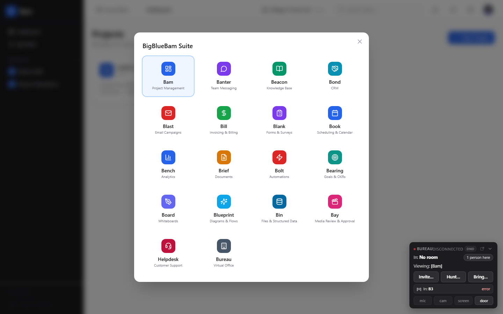
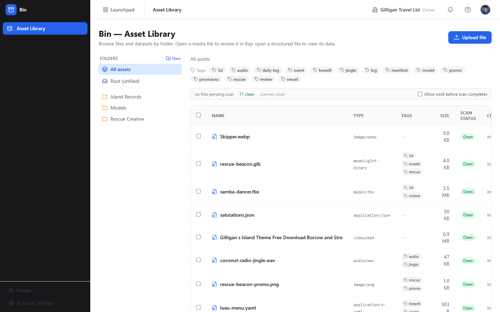
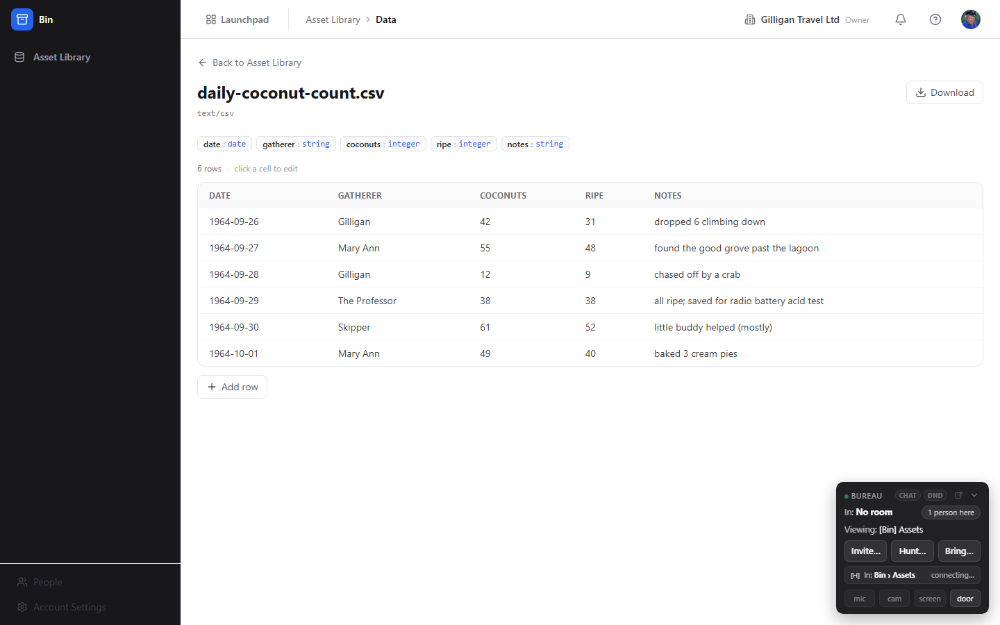
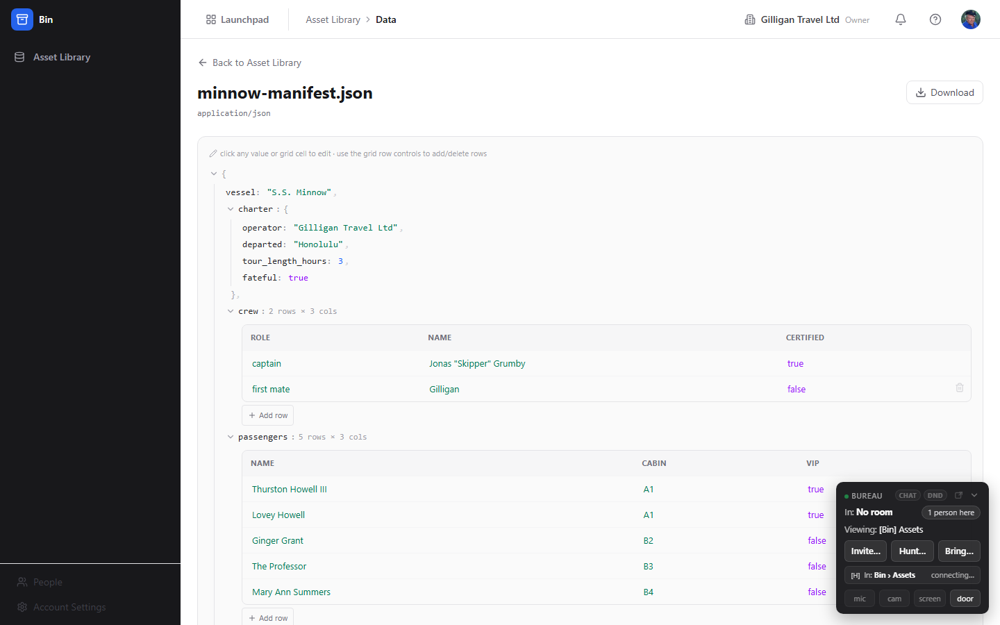
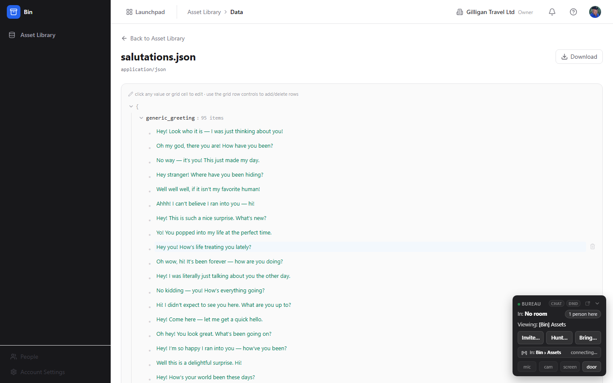

# Bin - Digital asset manager and structured-data editor

> Bin is BigBlueBam's file store and object-storage backbone. It holds your files and datasets, organizes them into folders, versions every change, gates access behind a security scan, and lets you edit CSV, JSON, and YAML data directly in the browser. Other apps stand on Bin: media hands off to Bay for review, and Blip stores its capture bytes here.

## Overview

Bin is where bytes live. When you upload a file, Bin writes it straight to object storage and creates an **asset**: a catalog entry that carries the file's name, type, size, tags, folder, scan status, and version history. Uploading again or editing a dataset never overwrites the old bytes; each change mints a new immutable **version**, so you always keep the history of what a file used to be.

Two kinds of asset behave differently when you open them. A media file (image, video, audio, or a 3D model) opens in **Bay**, the review app, because Bin stores the bytes but Bay owns the review layer on top of them. A structured-data file (CSV, TSV, JSON, JSONL, YAML) opens in Bin's own **data editor**, where you can read and edit the rows or the tree in place. Anything else is stored and downloadable but has no in-app viewer.

Bin also enforces a security posture. Every uploaded file lands with a scan status of `pending` and is scanned in the background; until it comes back `clean` (or `skipped`), serving is gated. Org admins and owners control whether people may work with a file before its scan finishes, and can clear a false-positive block on a single file.

Bin is org-scoped and requires a BigBlueBam platform login. It does not emit Bolt automation events. AI agents are first-class users here through 19 MCP tools, editing datasets with the same permissions and audit trail as a person.

### Key concepts

- **Asset** - a catalog entry for one stored object, either a file or a dataset. Carries its name, content type, size, scan status, visibility, tags, folder, project, and the id of its current version.
- **Version** - an immutable snapshot of an asset's bytes. Every upload and every structured-data edit mints a new, monotonically numbered version. Bytes are never edited in place.
- **Folder** - a container you nest to any depth. A folder can be scoped to a project. The folder tree is built from your folder list.
- **Tag** - an arbitrary string label on an asset. Editing an asset's tags replaces its whole tag list. Distinct tags across the org drive the filter chips.
- **Structured-data asset** - an asset whose format is CSV, TSV, JSON, JSONL, or YAML. It opens in the data editor instead of handing off to Bay.
- **Shape** - how a dataset is displayed: a **record** (grid of rows and columns) or a **tree** (nested JSON or YAML). The shape is auto-detected from the parsed data, not from the file extension.
- **Schema** - the per-column field types (string, integer, number, boolean, date, datetime, enum) inferred from a sample of the data. Shown read-only as chips above a grid.
- **Dialect** - the serialization details of a dataset (delimiter, indentation, newline style, header row). Bin captures the dialect and replays it on every commit so round-trips preserve the file's surface form.
- **Scan status** - `pending`, `clean`, `infected`, `error`, or `skipped`. It gates whether a file can be served or read.
- **Scan override** - a persistent, per-file clear of a scan block, set by an admin, owner, or SuperUser to resolve a false positive.
- **Visibility** - an asset's scope (`organization`, `project`, or `private`), stored at creation time. There is no in-app control to change it; assets are org-scoped in practice.

### Where to find it

Bin lives at `/bin/`. Reach it from the Launchpad app switcher in the header, or go straight to the URL.

You must be signed in to BigBlueBam. If you open Bin while signed out you see a **Bin Asset Library** screen reading "Please log in to BigBlueBam first" with a **Go to BigBlueBam Login** link back to `/b3/`. Bin is org-scoped, so use the org switcher in the header to change which organization's assets you see.

Roles: any member can upload, organize, download, and edit datasets, subject to the standard read/write permission model (each mutating action is gated by a named `bin.*` capability). Setting the org scan policy and clearing a per-file scan block are restricted to admins, owners, and SuperUsers.

## Feature reference

The Bin SPA has exactly two pages: the **Asset Library** and the **Asset Data** editor, plus an in-app Help view. The sidebar has a single nav item, **Asset Library**.

### Browsing the Asset Library

The Asset Library is the home page, titled **Bin - Asset Library** with the subtitle "Browse files and datasets by folder. Open a media file to review it in Bay; open a structured file to view its data."

The left **Folders** panel narrows what the table shows. Two synthetic scopes sit at the top: **All assets** shows everything, and **Root (unfiled)** shows only assets not in any folder. Below them is your folder tree, indented by depth. A breadcrumb row above the table shows your current scope and folder path.

The assets table has these columns: a select-all checkbox, **Name**, **Type** (the content type, shown as code), **Tags**, **Size** (human-readable bytes), **Scan status**, **Created** (relative time), and **Actions**. When a folder or scope has nothing in it you see **No assets here** with contextual guidance.

### Uploading a file

Uploading always creates a brand-new asset. There is no in-app control to upload a new version over an existing asset; new versions come only from editing a dataset or from the API.

To upload a file:

1. Click **Upload file** at the top right of the Asset Library.
2. Pick a file in the system file dialog.
3. The button shows **Uploading...** with a spinner while the bytes stream up. Bin creates the asset's metadata, then stores the bytes and mints version 1.
4. The new asset appears in the table with a scan status of `pending`. If the upload fails you see inline **Upload failed** text.

If a folder is selected when you upload, the new asset is not automatically filed into it; use **Move to folder** afterward (see below).

### Organizing with folders

To create a folder:

1. In the **Folders** panel header, click **New** (the folder-plus icon).
2. An inline input appears with the placeholder **Folder name...**, or **Subfolder name...** when a folder is already selected (the new folder nests under it).
3. Type a name and press Enter to create it, or press Escape to cancel. On failure you see **Could not create folder**.

To move an asset into a folder:

1. In the asset's row, open the **Move to folder** select in the **Actions** cell.
2. Choose **Root (unfiled)** to unfile it, or pick any folder (folders are indented to show nesting).
3. The asset moves immediately.

### Tagging and tag filters

Tags are free-form labels. Editing them replaces the asset's whole tag list.

To edit an asset's tags:

1. Click the **Edit tags** button (the tag icon) in the asset's **Actions** cell.
2. A prompt appears reading `Tags for "<name>" (comma-separated):`.
3. Enter a comma-separated list and confirm. The new list replaces the old one.

To filter by tag:

1. When any assets carry tags, a **Tags:** row of pill chips appears above the table.
2. Click a chip to filter the table to assets with that tag; the active chip fills in.
3. Click the **clear** control (the X) to remove the active tag filter.

### Opening an asset

Clicking an asset's row routes by kind:

- **Media** (an image, video, audio, or 3D-model file, by MIME type or a 3D extension such as `fbx`, `obj`, `stl`, `glb`, `gltf`, `ply`, `dae`, `usd`) navigates to Bay for review. The row tooltip reads **Open in Bay for review**.
- **Structured data** (`csv`, `tsv`, `json`, `jsonl`, `ndjson`, `yaml`, `yml`) opens Bin's own data editor at `/bin/assets/:id`. The row tooltip reads **Open data view**.
- **Any other type** does nothing on click, but you can still download it from the **Actions** cell.

### Downloading and the serving gate

A file can be served only when its scan has cleared. In the **Actions** cell, the serve controls change with scan status:

- When the file is servable (scan `clean` or `skipped`, or a per-file override is set), a **Download** icon link streams the current version.
- When the file is not yet servable but you are allowed to accept the risk, an amber **Open anyway** link appears; it downloads the file with the risk acknowledged.
- Otherwise the download glyph is disabled.

The **Scan status** badge shows the status word, or **allowed** with a shield-check icon when a per-file override is in effect.

### Scan progress and the scan policy

A scan progress strip runs above the table. It shows either **scanning: N pending** with a spinner or **no files pending scan**, followed by counts like **N clean**, **N infected**, and **N errored**, the active scanner as **scanner: <mode>**, and, for recent failures, **failed: <names>**.

Scanning is asynchronous: uploads land `pending` and clear when the background scan finishes. The active scanner depends on how the environment is configured.

Admins, owners, and SuperUsers see an extra right-aligned checkbox on the strip, **Allow work before scan completes**. Toggling it sets the org-wide policy for whether people may open files that have not finished scanning.

### Clearing a false-positive block (admins)

When a file is blocked and you are an admin, owner, or SuperUser, the serve controls offer per-file overrides:

1. On a blocked row, click the shield-check button labeled **Allow this file for everyone (clear a false-positive block)**.
2. The file becomes servable for everyone and its badge changes to **allowed**.
3. To undo it, click the X button labeled **Revoke the override for this file (re-apply the scan block)**.

### Deleting assets

To delete one or more assets:

1. Select rows using the per-row checkboxes (or the header select-all).
2. A bulk action bar appears showing **N selected**, a red **Delete** button, and a **Clear** link.
3. Click **Delete**. Confirm the prompt: "Permanently delete N file(s)? This removes the files and all their contents and versions, and cannot be undone."
4. The assets and all their bytes and versions are hard-deleted.

Deletion is irreversible. Archiving (a soft-delete that hides an asset but keeps its versions) is available through the API and MCP tools rather than the library UI.

### Editing a dataset: the grid (record shape)

When a structured file parses to rows and columns, the data editor shows it as a grid. The page header has a **Back to Asset Library** link, the asset name, and its content type. A **Download** button appears when the scan status is `clean` or `skipped`.

Above the grid is a read-only row of schema chips (each showing a column name and its inferred type) and a line reading "N rows (showing M) - click a cell to edit". A **saving...** indicator shows during commits.

To edit the grid:

1. Click a cell. It becomes an input (a pencil appears on hover).
2. Type the new value and press Enter or click away to commit; press Escape to cancel. Each commit mints a new immutable version and preserves the file's dialect.
3. To remove a row, hover it and click **Delete row**.
4. To append a row, click **Add row** at the bottom.

If a commit fails you see **Edit failed.**

### Editing a dataset: the tree, embedded grids, and string lists

When a structured file parses to nested JSON or YAML, the editor shows a collapsible, type-colored tree. A helper line reads "click any value or grid cell to edit - use the grid row controls to add/delete rows". Objects and arrays expand (they auto-open at shallow depth) and show summaries like "N fields", "N items", or "N rows x M cols".

To edit within the tree:

1. Click any scalar value to edit it inline. Values are coerced to the existing leaf's type. Press Enter to commit, Escape to cancel.
2. An array of similar objects renders as an **embedded grid** with editable cells, a per-row **Delete row**, and an **Add row** button, exactly like the top-level grid.
3. An array of scalars renders as a **string list**: full-width editable fields with a **Delete item** control on each and an **Add item** button.

Each edit mints a new version and shows an inline **saving...** or **Edit failed.** state.

If a dataset cannot load you see a friendly error: **Not available yet** (the scan has not cleared), **Not a structured-data file** (the format is not editable here), or **Could not load data**.

### Live presence while editing

When more than one person has the same dataset open, the data page header shows a presence avatar stack: colored initials with a **+N** overflow and a tooltip listing who else is here ("<names> also here"). When anyone commits an edit, the other open editors refetch and show the new data. This is collaborative editing with presence and auto-refresh, not simultaneous cursor-level co-editing.

### Working with AI agents

Agents work in Bin as first-class users: they edit datasets with the same permissions and audit trail as a person, and every structured edit they make mints a new immutable version (with the dialect preserved) authored under the agent's identity. A human and an agent share the same editing session on an asset, and the live human editor refetches whenever the agent commits.

Bin exposes 19 MCP tools. Raw byte upload and download are intentionally not MCP paths; agents reference Bin bytes through the platform-wide `attachment_get` and `attachment_list` tools instead of moving binary over MCP.

Asset and folder management:

- `bin_asset_list`, `bin_asset_get` - browse and read asset metadata.
- `bin_asset_create` - create a metadata-only asset.
- `bin_asset_update` - rename, move folder, or replace tags.
- `bin_tag_list` - list the distinct tags.
- `bin_asset_archive` - soft-delete an asset (two-step `confirm_action`).
- `bin_asset_delete` - hard-delete an asset and its bytes (two-step `confirm_action`, irreversible).
- `bin_version_list` - list an asset's versions.
- `bin_folder_list`, `bin_folder_create` - browse and create folders.

Structured-data editing:

- `bin_data_read` - read a dataset as records or as a tree.
- `bin_data_open_session` - open or resume the shared editing session.
- `bin_data_append_rows` - append rows.
- `bin_data_patch` - patch cells in a grid.
- `bin_data_patch_tree` - set values at a path in a tree.
- `bin_data_array_op` - append, insert, or delete a row in any grid, including embedded ones.
- `bin_data_comment_list`, `bin_data_comment_create`, `bin_data_comment_resolve` - list, add, and resolve anchored review comments. These comments currently have no library UI and are driven by agents.

For the full tool list and the REST/MCP mapping, see the Bin MCP-tools reference in `docs/apps/bin/`.

## User Stories

### Story: Upload and organize a file

**Who:** Any org member storing a file.
**Goal:** Get a file into Bin, filed in a folder and tagged, and confirm it is safe to use.
**Before you start:** You are signed in with read/write access.

**Steps**

1. Open Bin at `/bin/`. In the **Folders** panel, click **New**, type a name in the **Folder name...** input, and press Enter.
2. Click **Upload file** at the top right and pick your file. The button shows **Uploading...** while it stores the bytes; the asset appears with scan status `pending`.
3. Watch the scan strip. It reads **scanning: 1 pending** and then updates the counts; wait for the file to become `clean`.
4. In the asset's row, open **Move to folder** and choose the folder you created.
5. Click **Edit tags**, and in the `Tags for "<name>" (comma-separated):` prompt enter your tags.

**Result:** The file is stored, filed, tagged, and marked `clean`, and you can download it from the **Download** control in its row.

**Related:** See "Uploading a file" and "Organizing with folders". An agent does the same with `bin_asset_create`, `bin_asset_update`, and `bin_folder_create`.

### Story: View and edit a dataset in the grid

**Who:** A member correcting values in a CSV or JSON table.
**Goal:** Fix cell values and add or remove rows without leaving the browser.
**Before you start:** The dataset is uploaded, has cleared its scan, and parses to a record shape.

**Steps**

1. In the Asset Library, click the dataset's row (tooltip **Open data view**) to open it at `/bin/assets/:id`.
2. Read the schema chips and the "N rows (showing M) - click a cell to edit" line to understand the columns.
3. Click a cell, type a new value, and press Enter. A **saving...** indicator shows while Bin commits a new version.
4. Hover a row and click **Delete row** to remove it, or click **Add row** at the bottom to append one.

**Result:** Each change is a new immutable version with the file's original dialect preserved, so the CSV or JSON round-trips cleanly.

**Related:** Agents make the same edits with `bin_data_patch`, `bin_data_append_rows`, and `bin_data_array_op`.

### Story: Edit a nested config file (tree and string list)

**Who:** A member editing a nested JSON or YAML configuration.
**Goal:** Change deep values, edit a list of records, and edit a list of plain strings.
**Before you start:** The file is a structured-data asset that parses to a tree shape and has cleared its scan.

**Steps**

1. Open the file's data view. It renders as a collapsible tree with the helper line "click any value or grid cell to edit - use the grid row controls to add/delete rows".
2. Expand nodes to reach the value you want. Click a scalar, edit it, and press Enter; the value is coerced to the existing leaf's type.
3. For an array of similar objects, edit it as the **embedded grid** it renders as, using **Add row** and **Delete row**.
4. For an array of plain strings, edit each **string list** field in place, and use **Add item** or **Delete item** to change the list.

**Result:** The nested file is updated and re-serialized in its original YAML or JSON form, one new version per edit.

**Related:** Agents drive the tree with `bin_data_patch_tree` and `bin_data_array_op`.

### Story: Co-edit a dataset with a teammate

**Who:** Two or more members working on the same dataset.
**Goal:** See each other present and pick up each other's changes without reloading.
**Before you start:** Both of you have the same dataset open and read/write access.

**Steps**

1. Both members open the dataset at `/bin/assets/:id`.
2. Each person appears in the other's presence avatar stack in the page header (tooltip "<names> also here").
3. When one person commits an edit, the other's view refetches and shows the new data.

**Result:** You share an accurate, current view of the dataset. This is presence plus auto-refresh on commit, not character-level live co-editing.

**Related:** See "Live presence while editing".

### Story: Maintain a dataset with an agent

**Who:** An AI agent (or the engineer who wired it).
**Goal:** Locate a dataset, read it, and apply structured edits under the agent's own identity.
**Before you start:** The agent has a Bin-scoped identity and read/write permission.

**Steps**

1. The agent calls `bin_asset_list` (optionally `bin_tag_list` or `bin_folder_list`) to find the asset, then `bin_data_read` to read it.
2. It calls `bin_data_open_session` to join the shared editing session.
3. It applies edits with `bin_data_append_rows`, `bin_data_patch`, `bin_data_patch_tree`, or `bin_data_array_op`.
4. Optionally it leaves an anchored note with `bin_data_comment_create`.

**Result:** Each edit lands as a new immutable version authored by the agent, in the same audit trail as human edits. A human editor with the file open refetches and sees the changes arrive.

**Related:** See "Working with AI agents".

### Story: Handle a scan block (admins)

**Who:** An org admin, owner, or SuperUser.
**Goal:** Let people work with files that have not finished scanning, or clear a single false-positive block.
**Before you start:** You have admin, owner, or SuperUser role.

**Steps**

1. To set the org policy, toggle **Allow work before scan completes** on the scan strip. This controls whether members may open files that are still `pending`.
2. To clear one file's block, find its row and click **Allow this file for everyone (clear a false-positive block)** (the shield-check button). The file becomes servable and its badge changes to **allowed**.
3. To reverse that, click **Revoke the override for this file (re-apply the scan block)** (the X button).

**Result:** Either the whole org can work ahead of scans, or one specific file is permanently allowed (or re-blocked), all recorded per file.

**Related:** See "Scan progress and the scan policy" and "Clearing a false-positive block".

## Related

- **Bay** - opening a media asset (image, video, audio, or 3D model) in the Asset Library navigates to Bay, which owns the review layer over the bytes Bin stores.
- **Blip** - stores its screen-capture and export bytes as Bin assets.
- **Bam** - assets and folders can be scoped to a project so files sit next to the work they belong to.
- Bin MCP-tools reference in `docs/apps/bin/`.
