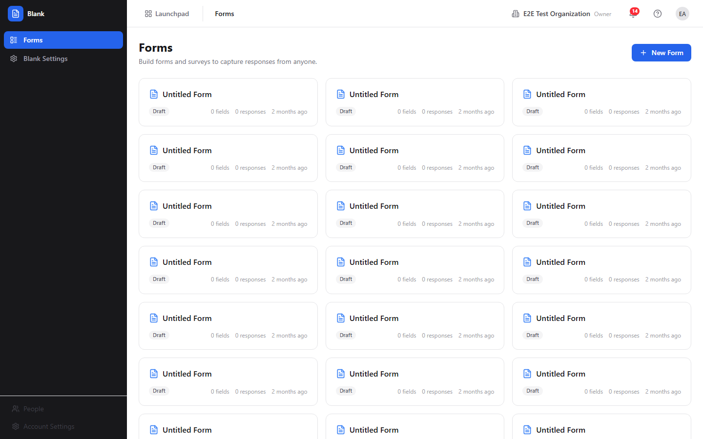
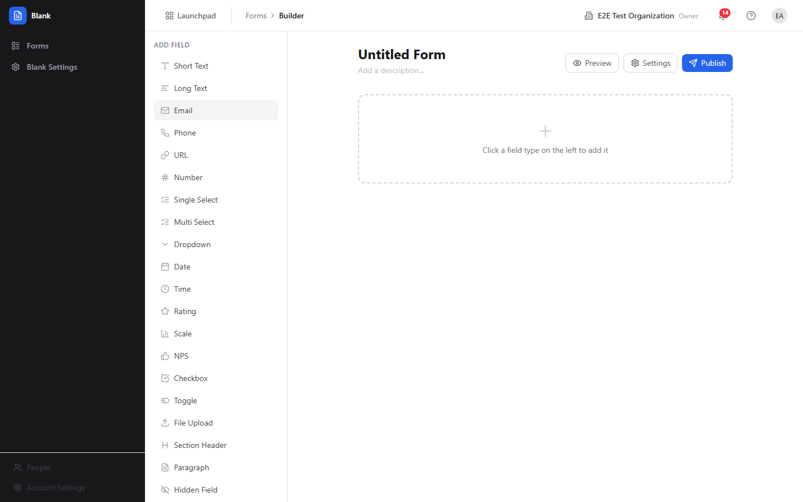
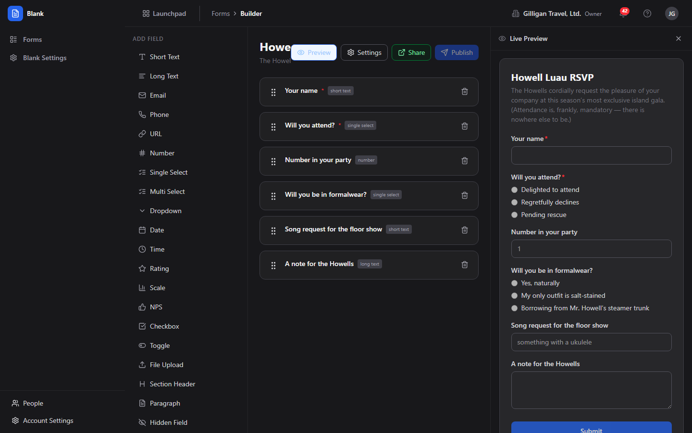
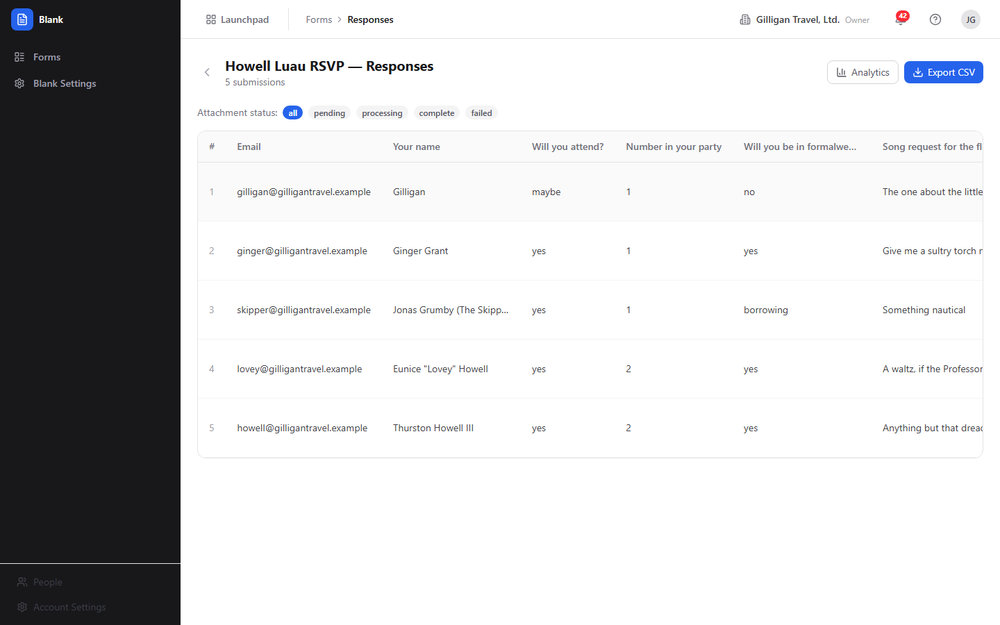
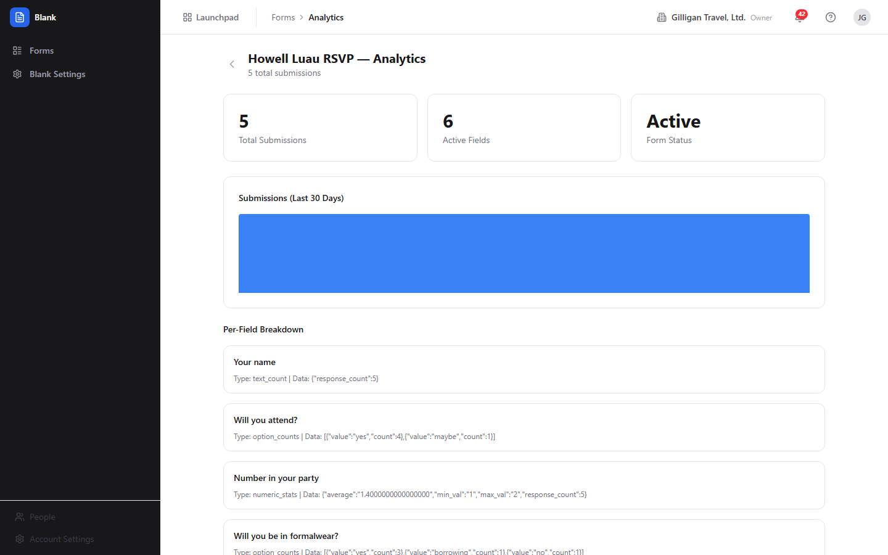
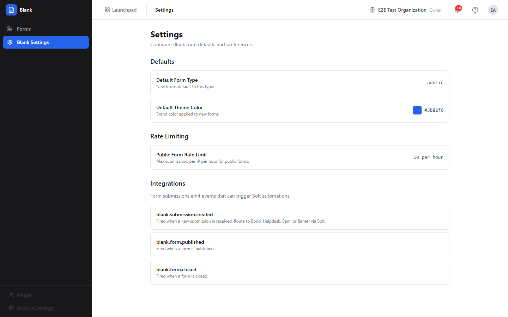
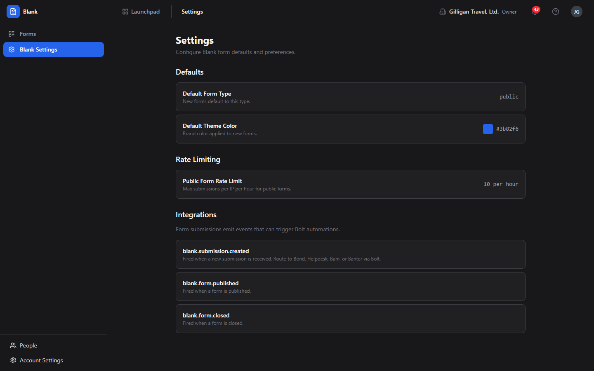

# Blank (Forms) Guide

# Blank - Forms & Surveys

Blank is BigBlueBam's form builder for creating surveys, feedback forms, registration pages, and data collection workflows with a visual drag-and-drop editor. Build a form from a palette of field types, publish it to a public URL, and review the responses that come back in a table and an analytics view, all without writing code.

## Key Features

- **Form Builder** with a drag-and-drop field palette, a live preview panel, and a per-field settings panel
- **Field Types** including short and long text, email, phone, URL, number, single and multi select, dropdown, date, time, rating, scale, NPS, checkbox, toggle, file upload, section header, paragraph, hidden fields, and page break
- **Real File Uploads** on File Upload fields: respondent files are stored in object storage (MinIO/S3), validated by a background worker against a type allowlist and size cap, and surfaced on the Responses table with a processing-status pill and a download link
- **Public Form Pages** served at a shareable URL that work without authentication for external respondents, with visibility scoping to public, organization, or a specific Bam project
- **Submission Gating** that can require sign-in and restrict submitters to an allowed set of email domains, enforced on the public submit and upload paths and stacked with visibility, per-email, max-response, and expiration limits
- **Submission Notifications** that email a confirmation to the respondent and a notification to your recipients on each submission (and optionally post to a Banter channel), delivered through SMTP where configured
- **Multi-Page Forms** built with page-break dividers or per-field page numbers, with Back and Next controls and a progress bar
- **Response Viewer** with attachment-status filtering and one-click CSV export
- **Form Analytics** with total submissions, a 30-day submission trend, and a per-field breakdown (option counts for choice fields, numeric statistics for rating and scale fields)
- **Form Settings** for visibility, expiration, sign-in and allowed-domain gating, confirmation behavior, theming, response limits, and submission notifications
- **AI Agent Tools** that let an agent generate a form from a description, edit its fields, publish it, and summarize the responses

## Integrations

Blank form submissions emit Bolt events (`submission.created`, `form.published`, `form.closed`) that can trigger Bolt automations. With routing configured at the API level, a submission can create a Bond contact or a Helpdesk ticket. Forms can be scoped to a Bam project, and emitted events flow into the suite-wide unified activity feed.

## Getting Started

Open Blank from the Launchpad. Create a new form in the builder, add fields from the palette, configure each field in the Field Settings panel, and set visibility in the Form Settings dialog. Click Publish to get a public form URL, and share it with respondents. Review submissions in the Responses view and read aggregate trends in Analytics. You can also delegate the whole flow to an AI agent that drafts, builds, and publishes the form for you.

## Working together

Like every app, Blank carries the persistent Bureau presence dock, so you can see who is around and start a voice or video huddle from anywhere in it; deeper per-record co-editing lives on the document, board, and task surfaces.

## Walkthrough

### Form List

### Form Builder

### Form Preview

### Responses

### Analytics

### Form Settings Dialog

### Access And Notifications

## MCP Tools

# blank MCP Tools

| Tool | Description | Parameters |
|------|-------------|------------|
| `blank_add_field` | Add a single field to an existing form.  | `form_id`, `field_key`, `label`, `field_type`, `placeholder`, `required`, `min_length`, `max_length`, `options`, `scale_min`, `scale_max`, `scale_min_label`, `scale_max_label`, `conditional_on_field_id`, `conditional_operator`, `conditional_value`, `sort_order`, `page_number`, `column_span`, `default_value` |
| `blank_close_form` | Close a published form to new submissions. Existing submissions are retained; the form stops accepting responses. | `id` |
| `blank_create_form` | Create a new form with optional inline field definitions. | `slug`, `form_type`, `fields`, `field_key`, `label`, `field_type`, `required`, `options`, `scale_min`, `scale_max`, `scale_min_label`, `scale_max_label` |
| `blank_delete_field` | Delete a single field from a form. This is destructive and removes the field definition. | `id` |
| `blank_delete_form` | Delete a form and all of its fields and submissions. This is destructive and cannot be undone. | `id` |
| `blank_delete_submission` | Delete a single form submission. This is destructive and cannot be undone. | `id` |
| `blank_duplicate_form` | Clone an existing form (including its fields) into a new draft form owned by the current user. | `id` |
| `blank_export_submissions` | Export all submissions for a form as CSV data. | `form_id` |
| `blank_generate_form` | AI generates a form from a natural-language description. Returns a form specification that can be passed to blank_create_form. | none |
| `blank_get_embed_code` | Get the HTML embed snippet (and public URL) for a published form, suitable for pasting into an external page. | `id` |
| `blank_get_form` | Get a form definition with all its fields. | `id` |
| `blank_get_form_analytics` | Get response aggregation data for a form, including per-field breakdowns, submission trends, and summary statistics. | `form_id` |
| `blank_get_submission` | Get a specific submission with all response data. | `id` |
| `blank_list_forms` | List available forms for the current organization. Supports filtering by status and project. | `status`, `project_id` |
| `blank_list_submissions` | List submissions for a form. Returns paginated results. | `form_id`, `cursor`, `limit` |
| `blank_publish_form` | Publish a draft form, making it available for submissions. | `id` |
| `blank_reorder_fields` | Bulk reorder the fields of a form by assigning each field a new sort_order. | `form_id`, `fields`, `id`, `sort_order` |
| `blank_summarize_responses` | Get analytics data for a form including response counts, field breakdowns, and trends. Useful for AI summarization of form results. | `form_id` |
| `blank_update_field` | Update a single form field. Provide only the fields you want to change. | `id`, `field_key`, `label`, `field_type`, `placeholder`, `required`, `min_length`, `max_length`, `options`, `scale_min`, `scale_max`, `scale_min_label`, `scale_max_label`, `sort_order`, `page_number`, `column_span`, `default_value` |
| `blank_update_form` | Update form metadata or settings. | `id`, `form_type`, `accept_responses`, `theme_color` |

## Related Apps

- [Board (Visual Collaboration)](../board/guide.md)
- [Bolt (Workflow Automation)](../bolt/guide.md)
