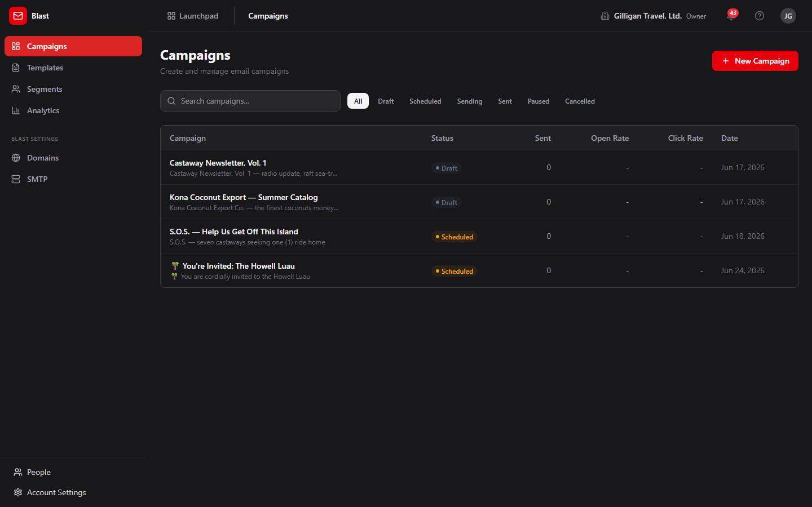
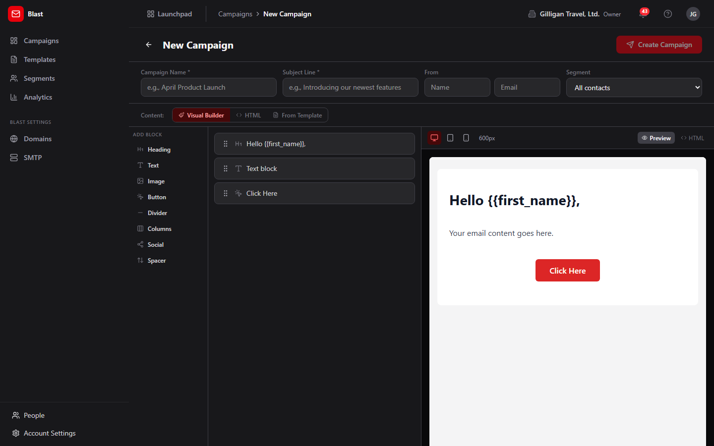
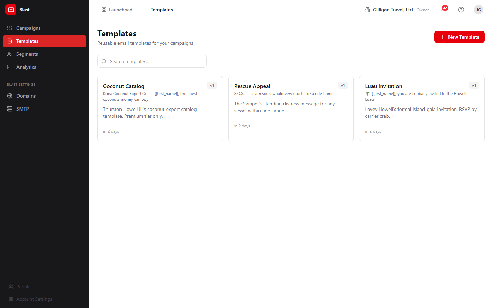
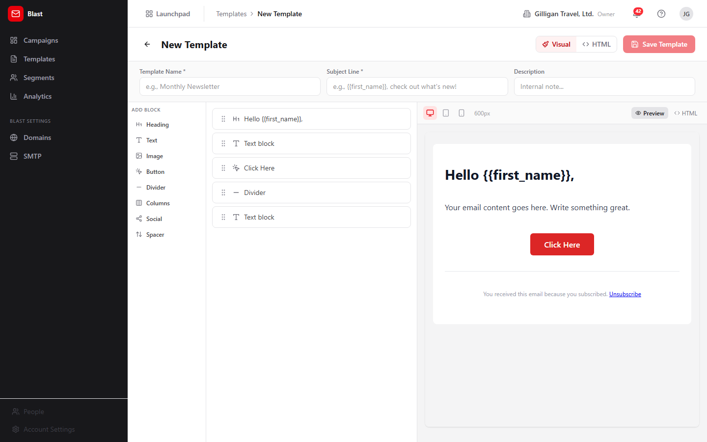
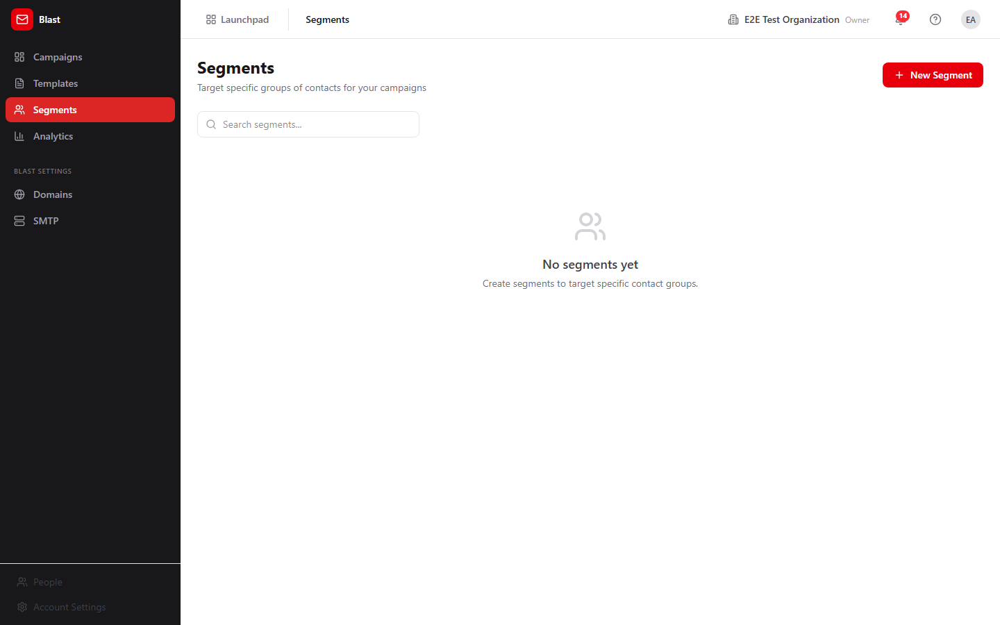
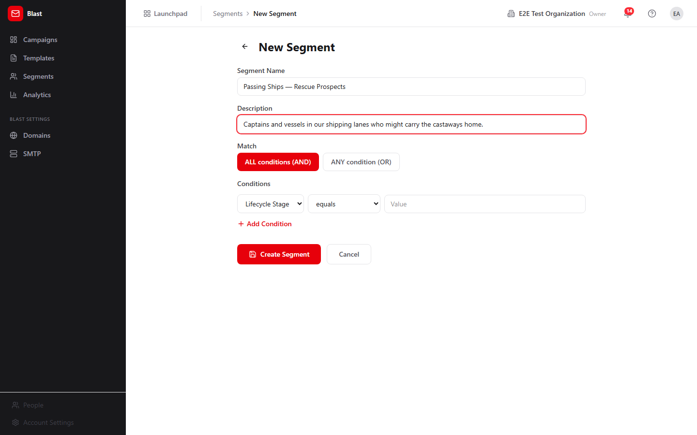
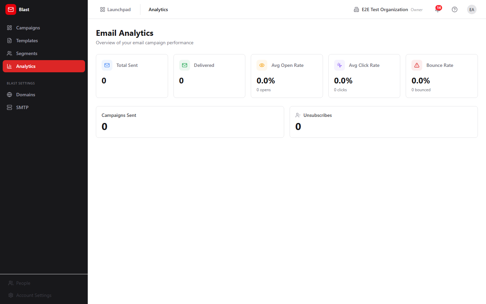

# Blast - Email campaigns

> Blast is the email campaign tool in the BigBlueBam suite. Marketers and operators use it to design HTML emails, target groups of Bond CRM contacts, send to those contacts, and track opens, clicks, bounces, and unsubscribes.

## Overview

Blast turns your Bond CRM contacts into an audience for bulk email. You write a message once (in a visual block editor, raw HTML, or from a saved template), pick who should receive it, and send. After a send, Blast records what happened to each recipient and rolls the results up into per-campaign and org-wide analytics.

The core objects you work with are **campaigns** (a single bulk send), **templates** (reusable email designs), **segments** (saved filters over Bond contacts), and **sender domains** (the domains you verify so mailbox providers trust your mail). Each campaign tracks counters for sent, delivered, opened, clicked, bounced, unsubscribed, and complained, and exposes a per-recipient delivery table.

Blast fits into the suite in two directions. It pulls its audience from **Bond** (contacts are the recipient pool, and segments filter on Bond contact fields), and it pushes activity into **Bolt** (every send and engagement event is published so automation rules can react). It shares its login and SMTP relay with the rest of the platform: there is no separate Blast account, and there is no Blast-specific email server.

Two things are worth knowing before you rely on Blast for production sending. First, outbound email goes through one platform-wide SMTP relay that a SuperUser configures in the Bam app, not in Blast. Second, the in-app campaign detail page only exposes **Send Now**; scheduling, pausing, cancelling, editing, and deleting a campaign are available through the API and MCP tools but are not wired into the campaign detail UI today.

### Key concepts

- **Campaign** - A single bulk email send. Has a name, subject, body (HTML), optional plain-text body, an optional template, an optional segment, From name/email, reply-to, and rollup counters.
- **Campaign status** - One of six states: `draft`, `scheduled`, `sending`, `paused`, `sent`, `cancelled`. A draft is editable, deletable, and sendable. A scheduled campaign can be sent or cancelled. A sending campaign can be paused or cancelled. `sent` is the terminal success state and the only one analytics counts. There is no "archived" state.
- **Template** - A reusable email design: name, subject template, HTML body, an optional visual block layout, and a description. Templates carry a version number that bumps automatically each time you save an edit.
- **Segment** - A saved filter over Bond contacts, built from one or more conditions joined by **ALL conditions (AND)** or **ANY condition (OR)**. Each segment caches a contact count so you can see roughly how many people match.
- **Recipient / send log** - One row per person per campaign. It tracks the status of that one email (queued, sent, delivered, bounced, complained, or failed) and drives the **Recipients** table on the campaign detail page.
- **Engagement event** - An append-only record of an open, click, unsubscribe, bounce, or complaint. These feed the analytics counters and are published to Bolt.
- **Unsubscribe** - An org-wide suppression keyed on email. Once an address unsubscribes (or files a spam complaint), it is excluded from future sends across the whole org.
- **Sender domain** - A domain you add and verify (SPF, DKIM, DMARC) so mailbox providers accept your mail.
- **Merge fields** - Placeholders the sender fills in per recipient: `{{first_name}}`, `{{last_name}}`, `{{email}}`, `{{company}}`, and `{{unsubscribe_url}}`.
- **CAN-SPAM gate** - A compliance check that runs when you send or schedule. The HTML body must contain both an unsubscribe mechanism and a physical mailing address, or the send is rejected.

### Where to find it

Blast is served at `/blast/`. It is a separate SPA but shares its login with the Bam app: there is no separate Blast sign-in. If you are not signed in to BigBlueBam, Blast shows a "Please log in to BigBlueBam first" screen that links to `/b3/`. Sign in there once and return to `/blast/`.

The left sidebar has two groups. The primary group is **Campaigns**, **Templates**, **Segments**, and **Analytics**. Below it, a **Blast Settings** group holds **Domains** and **SMTP**. The header carries the Launchpad trigger, breadcrumbs, the org switcher, the notifications bell, and the user menu. Press `?` anywhere to open in-app help.

Prerequisites:

- A BigBlueBam account and membership in an org (shared with Bam).
- Bond contacts in your org, since segments and sends draw from the contact pool.
- A configured platform SMTP relay for any real delivery (see the SMTP feature below).
- For sender-domain changes you need `admin` scope; most other write actions need `read_write` scope.

## Feature reference

### Campaigns list

The campaigns list is the home view of Blast, at `/blast/`. It shows every campaign in a table and is where you start a new one.

To browse and filter campaigns:

1. Open Blast at `/blast/`. The header reads **Campaigns** with the subtitle "Create and manage email campaigns".
2. Use the **Search campaigns...** box to filter the table by campaign name. This filter is applied in your browser to the names already loaded.
3. Click a status button to filter by state. The buttons are **All**, **draft**, **scheduled**, **sending**, **sent**, **paused**, and **cancelled**. Click the active status again to clear it.
4. Read each row: **Campaign** (name plus subject), **Status**, **Sent**, **Open Rate**, **Click Rate**, and **Date**. Open Rate and Click Rate show a dash until the campaign has sent.
5. Click any row to open that campaign's detail page.

To start a new campaign, click **New Campaign** at the top right. This opens the create form.

### Create a campaign

The create form is at `/blast/campaigns/new`. It collects the campaign settings and lets you build the email body in one of three ways. Creating a campaign always produces a `draft`; nothing is sent from this page.

To create a campaign:

1. From the campaigns list, click **New Campaign**. The header reads **New Campaign**.
2. Fill in **Campaign Name *** (for example, "April Product Launch") and **Subject Line ***. Both are required; the **Create Campaign** button stays disabled until they have values.
3. Under **From**, optionally enter a sender **Name** and **Email**.
4. Choose a **Segment**. The default is **All contacts**; the dropdown also lists your saved segments with their cached counts in parentheses.
5. Choose a content mode with the **Content:** toggle: **Visual Builder**, **HTML**, or **From Template**.
   - **Visual Builder** opens the drag-and-drop block editor (see "Visual builder" below).
   - **HTML** shows an **HTML Body** textarea on the left and a live iframe **Preview** on the right.
   - **From Template** shows a **Choose a template...** dropdown and a preview; the subject and body prefill from the chosen template. If you have no templates yet, use the **create a new template** link to make one.
6. Make sure the body includes an unsubscribe link and a physical mailing address (the new-template footer already includes an `{{unsubscribe_url}}` link). Without both, the campaign cannot be sent or scheduled later.
7. Click **Create Campaign**. The button reads "Creating..." while it saves, then returns you to the campaigns list with the new draft.

> Segment caveat: choosing a segment here records which segment the campaign is associated with, but the sender does not yet filter recipients by segment. See "Send a campaign (Send Now)" for what actually happens at send time.

### Campaign detail and Send Now

The detail page is at `/blast/campaigns/:id`. It is where you send a draft and where you review results after a send.

To open and read a campaign:

1. From the campaigns list, click the campaign row. The page shows the back arrow, the campaign name and subject, and a status badge.
2. Read the primary metrics: **Total Sent**, **Delivered**, **Opened** (with open rate), and **Clicked** (with click rate).
3. Read the secondary metrics: **Bounced**, **Unsubscribed**, and **Complaints**.
4. If the campaign has click data, read the **Top Clicked Links** table.
5. Under **Campaign Details**, read **From**, **Sent Date**, **Scheduled**, **Recipients**, and **Created**.
6. Scroll to the **Recipients** table for per-recipient delivery. It pages 25 rows at a time with **Prev** and **Next**. Each row shows **Email**, a **Status** icon (Delivered, Sent, Bounced, Failed, or Pending), and the **Sent**, **Delivered**, and **Bounced** times.

To send a campaign immediately:

1. Open a campaign whose status is `draft` or `scheduled`. The **Send Now** button appears at the top right only for these two states.
2. Click **Send Now**. The button reads "Sending..." while it submits.
3. The CAN-SPAM check runs first. If the HTML body is missing an unsubscribe mechanism or a physical address, the send is rejected with a validation error (see "Why a send was rejected" below).
4. If the check passes, the status flips to `sending`, the send job is queued in the background worker, and the campaign begins delivering.

> No screenshot exists for the campaign detail page or the **Send Now** button yet.

> What Send Now does not expose: scheduling, pausing, cancelling, editing, and deleting a campaign all exist in the API and MCP tools, but the detail page only renders **Send Now**. To schedule, pause, cancel, edit, or delete a campaign today you must use the API or an MCP tool (`blast_update_campaign`, `blast_pause_campaign`, `blast_cancel_campaign`, and the schedule path inside `blast_send_campaign`).

### Visual builder

The visual builder is the drag-and-drop email designer shared by the campaign create form and the template editor. It produces email-safe inline HTML so your message renders consistently across mail clients.

To build an email body visually:

1. In the campaign create form choose the **Visual Builder** content mode, or open the template editor and select the **Visual** mode.
2. From the left **palette**, click a block to add it. The blocks are **Heading**, **Text**, **Image**, **Button**, **Divider**, **Columns**, **Social**, and **Spacer**.
3. In the center list, reorder blocks by dragging the handle, and use each block's **Duplicate** and **Remove** controls.
4. Select a block to edit its properties in the right-hand editor.
5. Use the preview at the bottom to check the layout. Switch widths with the desktop, tablet, and mobile toggles (600, 480, and 320 pixels), and toggle between the rendered view and the source with the Code/Eye control.
6. Insert merge fields in text where you want them personalized, for example `Hello {{first_name}},`.

The block layout is saved alongside the email so you can reopen and keep editing it later.

### Templates

#### Template gallery

The gallery lists your reusable templates at `/blast/templates`.

To manage templates:

1. Open **Templates** from the sidebar. The header reads **Templates** with the subtitle "Reusable email templates for your campaigns".
2. Use the **Search templates...** box to find a template by name.
3. Each card shows the template name, the subject template, a version badge such as `v2`, the description, and the relative time it was last updated.
4. Hover a card to reveal **Duplicate** (copy) and **Delete** (trash). **Delete** asks "Delete this template?" before removing it.
5. Click a card to open it in the editor.

To start a new template, click **New Template** at the top right.

#### Template editor

The editor is at `/blast/templates/new` for a new template and `/blast/templates/:id/edit` for an existing one. Saving an edit bumps the template's version automatically.

To author a template:

1. Click **New Template** from the gallery, or click an existing template to edit it.
2. Fill in **Template Name *** and **Subject Line *** (the subject shows a live merge preview). Both are required; **Save Template** stays disabled until they have values. Optionally add a **Description**.
3. Build the body using the **Visual** / **HTML** toggle. **Visual** opens the block builder; **HTML** gives you a raw editor with a live iframe preview.
4. Click **Save Template**. The button reads "Saving..." while it saves.

New templates start with a default block layout that includes a footer with an `{{unsubscribe_url}}` link, which helps satisfy the CAN-SPAM check when a campaign uses the template.

### Segments

#### Segment list

The segment list is at `/blast/segments`. Segments are saved filters over your Bond contacts.

To manage segments:

1. Open **Segments** from the sidebar. The header reads **Segments** with the subtitle "Target specific groups of contacts for your campaigns".
2. Use the **Search segments...** box to find a segment by name.
3. Read each row: **Segment** (name plus description), **Contacts** (the cached count), **Conditions** (for example, "2 condition(s), match all"), and **Last Updated**.
4. Under **Actions**, click **Recalculate count** (refresh icon) to recompute how many contacts currently match. Click **Delete** (trash icon) to remove the segment; it asks "Delete this segment?" first.

To start a new segment, click **New Segment** at the top right.

#### Segment builder and preview

The builder is at `/blast/segments/new`. It is a create-only form; there is no edit page in the UI.

To build a segment:

1. Click **New Segment** from the segment list. The header reads **New Segment**.
2. Enter a **Segment Name** and an optional **Description**.
3. Choose a **Match** mode: **ALL conditions (AND)** to require every condition, or **ANY condition (OR)** to match any one.
4. Add one or more conditions. Each condition has a field, an operator, and a value:
   - **Field**: Lifecycle Stage, Lead Source, Lead Score, City, Country, or Last Contacted.
   - **Operator**: equals, does not equal, is one of, contains, greater than, less than, or older than (days). For "is one of", enter comma-separated values.
   - **Value**: type the value to match.
5. Click **Add Condition** to add another row, or the trash icon to remove a row.
6. Click **Create Segment** (it reads "Saving..." while it saves), or **Cancel** to discard.

After creating, return to the segment list and click **Recalculate count** to see how many Bond contacts match.

> The builder UI exposes six fields and seven operators. The backend supports more (it can also filter on `email`, `first_name`, `last_name`, and use the `is_set` and `is_not_set` operators), but those are reachable only through the API or the `blast_create_segment` / `blast_update_segment` MCP tools, not through the builder UI.

> Segments filter only on Bond contact columns. There is no targeting by tags, activity history, or custom fields.

### Analytics

The analytics dashboard is at `/blast/analytics`, titled **Email Analytics** with the subtitle "Overview of your email campaign performance". It rolls up performance across all sent campaigns in your org. Only campaigns in the `sent` state are counted.

To review org-wide email performance:

1. Open **Analytics** from the sidebar.
2. Read the stat cards: **Total Sent**, **Delivered**, **Avg Open Rate** (with total opens), **Avg Click Rate** (with total clicks), and **Bounce Rate** (with total bounced).
3. Read the tiles **Campaigns Sent** and **Unsubscribes**.
4. Read the **Weekly Engagement Trend** table for **Period**, **Campaigns**, **Sent**, **Open Rate**, and **Click Rate** by week.

For a single campaign's analytics, open its detail page instead (see "Campaign detail and Send Now").

### Sender Domains

The Sender Domains page is at `/blast/settings/domains`, under **Blast Settings**. Verifying a domain improves deliverability by proving to mailbox providers that you are authorized to send from it. Adding and removing domains needs `admin` scope.

To add and verify a sending domain:

1. Open **Domains** under **Blast Settings**. The header reads **Sender Domains** with the subtitle "Verify your sending domains for better deliverability".
2. In the add row, type your domain (for example, "company.com") and click **Add Domain**.
3. On the new domain's card, read the **Required DNS Records** list (each row shows a record type, name, and value) and add those records at your DNS host.
4. Click **Verify DNS** (refresh icon) to run live lookups. The **SPF**, **DKIM**, and **DMARC** indicators turn to a green check when each record is found.
5. To remove a domain, click **Remove** (trash icon) and confirm "Remove this domain?".

> No screenshot exists for the Sender Domains page yet.

### SMTP (platform relay)

The SMTP page is at `/blast/settings/smtp`, titled **SMTP Settings**. It is an information card, not a form. Blast keeps no SMTP credentials of its own. Every Blast campaign is sent through a single platform-wide relay stored in the platform settings and configured once in the Bam app under **Account Settings -> Integrations**. The same relay sends transactional email and Blast campaigns.

What you see depends on your role:

- **Platform SuperUser**: a blue info box and an **Open Account Settings** button that opens `/b3/settings`, where you open the **Integrations** tab to edit the relay.
- **Org owner or admin**: an amber box and a **View in Account Settings** button that opens `/b3/settings`. You can view the configuration there, but only a SuperUser can change it.
- **Other roles**: a neutral box telling you to contact your platform SuperUser or org admin.

To configure outbound email, a SuperUser opens **SMTP** under **Blast Settings**, clicks **Open Account Settings**, then opens the **Integrations** tab in the Bam app and enters the relay details. This is a prerequisite for any real send.

> No screenshot exists for the SMTP Settings page yet.

### Tracking and unsubscribe (automatic, no UI)

Blast handles opens, clicks, and unsubscribes through endpoints that run without any operator action and without a signed-in user. You do not configure these; they are described here so you understand the metrics.

- **Open tracking**: a 1x1 pixel embedded in each email records an open and increments the campaign's opened counter.
- **Click tracking**: links are rewritten so a click is recorded (with the destination URL) and then redirects to the real target. Only `http`/`https` links are allowed.
- **Unsubscribe**: the unsubscribe link in each email opens a confirmation page with a **Confirm Unsubscribe** button. Confirming suppresses that address across the whole org and increments the unsubscribed counter.

### Provider webhooks (automatic, no UI)

Your email provider can notify Blast of bounces and complaints. When a bounce arrives, Blast marks the recipient bounced and increments the bounced counter. When a spam complaint arrives, Blast marks the recipient complained, increments the complaints counter, and automatically unsubscribes that address org-wide. There is no UI for this; the results show up in your campaign and analytics counters.

### Why a send was rejected

When you click **Send Now** (or schedule a campaign through the API), Blast runs a CAN-SPAM compliance check before sending. The campaign is rejected with a validation error unless its HTML body contains both:

1. An unsubscribe mechanism (for example, an `{{unsubscribe_url}}` merge field, or text containing "unsubscribe" or "opt-out").
2. A physical mailing address (a recognizable street address, a P.O. box, or a `{{physical_address}}` merge field).

There is no warning before you click **Send Now**; the error surfaces from the send request. The simplest fix is to use the default template footer, which already includes an `{{unsubscribe_url}}` link, and to add your mailing address to the body.

### Working with AI agents

Agents drive Blast through 28 MCP tools backed by the same Blast API the UI uses. Most action tools resolve campaigns, templates, and segments by human-readable name as well as by UUID, so an agent can say "send the April Product Launch campaign" without knowing the ID. Name resolution prefers an exact match, accepts a single fuzzy match, and returns a clean error when a name is ambiguous.

Common agent actions and their tools:

- **Draft and reuse content**: `blast_create_template`, `blast_get_template`, `blast_list_templates`, `blast_update_template`, `blast_duplicate_template`, and `blast_preview_template` (renders a template with sample merge data without sending).
- **Create and edit a campaign draft**: `blast_draft_campaign` (resolves a template or segment by name or UUID and creates a `draft`), `blast_update_campaign`, `blast_list_campaigns`, and `blast_get_campaign`.
- **Build and check audiences**: `blast_create_segment` and `blast_update_segment` (full field and operator set, including the ones the builder UI hides), `blast_list_segments`, `blast_get_segment`, `blast_preview_segment` (first 50 matching contacts), `blast_evaluate_segment` (the full resolved send list, read-only), `blast_recalculate_segment_count`, and `blast_check_unsubscribed` (confirm an address is not suppressed before targeting it).
- **Send and control a send**: `blast_send_campaign`, `blast_pause_campaign`, and `blast_cancel_campaign`.
- **Review results**: `blast_get_campaign_analytics`, `blast_get_campaign_device_analytics`, `blast_list_campaign_recipients`, `blast_get_engagement_summary`, and `blast_get_engagement_trend`.

The key human-in-the-loop control is on sending. `blast_send_campaign` takes `require_human_approval`, which defaults to `true`. With the default, the tool does not send immediately; it schedules the campaign about an hour out and returns a note that a human must confirm before it goes. Only `require_human_approval: false` triggers an immediate send. When you review agent work, expect agent-initiated sends to land as scheduled campaigns awaiting a person, and treat any immediate send as an explicit override.

Two tools named like AI features are not wired to a model. `blast_draft_email_content` and `blast_suggest_subject_lines` return hard-coded templated strings, not model-generated copy. Use them as scaffolding, not as a writing assistant.

Blast agents also run on the platform-wide agentic surface that spans every app:

- **Identity and heartbeat**: every agent action is tagged with the actor's kind (`human`, `agent`, or `service`) on the activity log, and agent runners post `agent_heartbeat` so operators can see which agents are live.
- **Proposals (approval queues)**: an agent can stage a campaign send or a segment change as a durable proposal with `proposal_create`, and a human clears it with `proposal_decide`. This is the recommended pattern for sends beyond the per-tool `require_human_approval` gate.
- **Unified activity and search**: `activity_query`, `activity_by_actor`, and `search_everything` let an agent (or a reviewer) trace what an agent did across Blast, Bond, and the rest of the suite.
- **Visibility preflight**: before an agent posts campaign results into a shared surface, it calls `can_access` for each cited entity and drops anything the asking user is not allowed to see.
- **Agent policies and webhooks**: a per-agent kill switch and tool allowlist (the `blast.*` prefix) gate which Blast tools a given service account may call, and outbound webhooks push subscribed Blast Bolt events to agent runners.

For the full tool catalog and schemas, see [mcp-tools.md](./mcp-tools.md).

## Working together (live presence)

Like every BigBlueBam app, Blast carries the persistent Bureau presence dock, so collaboration is ambient rather than scheduled. From anywhere in Blast you can see who is around and ring, knock, or invite a teammate into a live voice or video huddle that follows you in a floating window as you both move through the suite. Voice and video here are the digital equivalent of bumping into someone in the hallway or stopping by their desk, not a booked meeting. The deeper per-record collaboration (a presence strip showing who is on a specific item, and real-time co-editing of the same record) lives on the document, board, diagram, and task surfaces, described in the Introduction; in Blast, the shared layer is the always-on Bureau dock.

## User Stories

### Story: Set up outbound email before your first send

**Who:** A platform SuperUser (or an org admin verifying the setup).
**Goal:** Make sure Blast can actually deliver mail before anyone sends a campaign.
**Before you start:** You are signed in to BigBlueBam. SMTP relay credentials are configured by a SuperUser; org admins can only view them.

**Steps**

1. Open Blast at `/blast/` and click **SMTP** under **Blast Settings** in the sidebar.
2. Read the **SMTP Settings** card. It explains that Blast uses one platform-wide relay, not its own credentials.
3. As a SuperUser, click **Open Account Settings**. (As an org admin, click **View in Account Settings** to confirm the relay is set, then ask a SuperUser if it is not.)
4. In the Bam app at `/b3/settings`, open the **Integrations** tab and enter or confirm the SMTP relay details.
5. Return to Blast.

**Result:** The platform relay is configured, so future **Send Now** actions can actually deliver email.

**Related:** "Verify a sending domain for deliverability" below, which improves deliverability once SMTP works.

### Story: Send a one-off campaign from scratch

**Who:** A marketer or operator.
**Goal:** Compose and send a single email to your contacts.
**Before you start:** You are signed in, the platform SMTP relay is configured, and your org has Bond contacts. You need `read_write` scope.

**Steps**

1. From the campaigns list at `/blast/`, click **New Campaign**.
2. Enter a **Campaign Name *** and a **Subject Line ***.
3. Optionally set the **From** Name and Email, and choose a **Segment** (or leave it on **All contacts**).
4. With the **Content:** toggle on **Visual Builder**, add blocks from the palette and edit them. Make sure the body has an unsubscribe link and your physical mailing address; the default template footer covers the unsubscribe link.
5. Click **Create Campaign**. You return to the campaigns list with a new `draft`.
6. Click the new campaign's row to open it, then click **Send Now**.
7. If the CAN-SPAM check passes, the status moves to `sending` and delivery begins. If it fails, add the missing unsubscribe link or address and try again.

**Result:** The campaign is sending, and its detail page begins filling in delivery and engagement metrics.

**Related:** "Review campaign performance" below. Agents do the same with `blast_draft_campaign` then `blast_send_campaign`.

> Recipient scope caveat: the sender currently delivers to your whole org's eligible contacts (excluding unsubscribed and empty-email contacts) regardless of which segment you chose. Segment-targeted sending is not yet honored by the sender.

### Story: Reuse a saved template for a campaign

**Who:** A marketer who has a house style.
**Goal:** Build a campaign from an existing template instead of starting blank.
**Before you start:** At least one template exists in **Templates**.

**Steps**

1. From the campaigns list, click **New Campaign**.
2. Enter a **Campaign Name *** (the subject prefills from the template, but you can edit it).
3. Set the **Content:** toggle to **From Template** and pick a template from **Choose a template...**. The subject and body load from the template.
4. Adjust the content as needed.
5. Click **Create Campaign**, open the new draft, and click **Send Now**.

**Result:** A campaign built on your template is sending.

**Related:** "Author and version a reusable template" below.

### Story: Author and version a reusable template

**Who:** A designer or marketer maintaining brand templates.
**Goal:** Create a reusable email design and keep it updated over time.
**Before you start:** You are signed in with `read_write` scope.

**Steps**

1. Open **Templates** and click **New Template**.
2. Enter a **Template Name *** and **Subject Line ***, and optionally a **Description**.
3. Build the body in **Visual** mode (or switch to **HTML**). Keep the footer's `{{unsubscribe_url}}` link so campaigns using this template pass the CAN-SPAM check.
4. Click **Save Template**.
5. To update later, open the template, edit it, and click **Save Template** again; the version badge bumps (for example, `v1` to `v2`).
6. To fork a template, hover its card in the gallery and click **Duplicate**.

**Result:** A versioned, reusable template is available in the gallery and selectable in **From Template** when creating a campaign.

**Related:** Agents do this with `blast_create_template`, `blast_update_template`, and `blast_duplicate_template`.

### Story: Build a targeted segment from CRM data

**Who:** A marketer who wants to target a subset of contacts.
**Goal:** Save a reusable filter over Bond contacts and see how many match.
**Before you start:** Your org has Bond contacts with the relevant fields populated.

**Steps**

1. Open **Segments** and click **New Segment**.
2. Enter a **Segment Name** and an optional **Description**.
3. Choose **ALL conditions (AND)** or **ANY condition (OR)**.
4. Add conditions, for example field **Lifecycle Stage**, operator **equals**, value `customer`. Use **Add Condition** for more rows.
5. Click **Create Segment**.
6. Back on the segment list, click **Recalculate count** on the new segment to see how many Bond contacts match.

**Result:** A saved segment with a contact count, selectable in the **Segment** dropdown on the campaign create form.

**Related:** Agents do this with `blast_create_segment` (which also exposes the `email`, `first_name`, `last_name` fields and the `is_set`/`is_not_set` operators) and can preview matches with `blast_preview_segment` or resolve the full send list with `blast_evaluate_segment`. Remember the sender does not yet honor the chosen segment at send time.

### Story: Review campaign performance

**Who:** A marketer or manager.
**Goal:** Understand how a send performed, both per campaign and across the org.
**Before you start:** At least one campaign has reached the `sent` state.

**Steps**

1. For a single campaign, open it from the campaigns list and read **Total Sent**, **Delivered**, **Opened** (with open rate), and **Clicked** (with click rate), plus the secondary **Bounced**, **Unsubscribed**, and **Complaints**.
2. Read the **Top Clicked Links** table to see which links drew clicks.
3. Page through the **Recipients** table with **Prev** and **Next** to inspect per-recipient delivery status.
4. For an org-wide view, open **Analytics** and read **Total Sent**, **Delivered**, **Avg Open Rate**, **Avg Click Rate**, and **Bounce Rate**, plus the **Weekly Engagement Trend** table.

**Result:** You can see open, click, bounce, and unsubscribe performance for one campaign and for the org as a whole.

**Related:** Agents read the same data with `blast_get_campaign_analytics`, `blast_get_campaign_device_analytics`, `blast_get_engagement_summary`, and `blast_get_engagement_trend`.

### Story: Verify a sending domain for deliverability

**Who:** An org admin.
**Goal:** Prove your sending domain is authorized so more mail reaches inboxes.
**Before you start:** You have `admin` scope and access to your domain's DNS settings.

**Steps**

1. Open **Domains** under **Blast Settings**.
2. Type your domain (for example, "company.com") and click **Add Domain**.
3. On the domain card, copy each row from **Required DNS Records** into your DNS host.
4. Click **Verify DNS** (refresh icon). The **SPF**, **DKIM**, and **DMARC** indicators turn green when verification succeeds.

**Result:** A verified sender domain that improves deliverability for your campaigns.

**Related:** "Set up outbound email before your first send" (SMTP must work first).

### Story: A recipient unsubscribes or a message bounces (automatic)

**Who:** No operator; the system handles this.
**Goal:** Honor unsubscribes and record bounces and complaints without manual work.
**Before you start:** A campaign has sent and your provider can post bounce/complaint notifications.

**Steps**

1. A recipient clicks the unsubscribe link, lands on the confirmation page, and clicks **Confirm Unsubscribe**. Their address is suppressed org-wide.
2. When your provider reports a bounce, Blast marks the recipient bounced and increments the bounced counter.
3. When your provider reports a spam complaint, Blast marks the recipient complained, increments the complaints counter, and auto-unsubscribes the address.

**Result:** Suppressions and bounce/complaint counts update automatically and appear in the campaign and analytics metrics. Suppressed addresses are excluded from future sends.

**Related:** "Review campaign performance" to see the resulting counters. An agent can confirm an address is not suppressed before targeting it with `blast_check_unsubscribed`.

### Story: Let an agent draft a campaign for your approval

**Who:** An operator working with an AI agent.
**Goal:** Have an agent assemble a campaign draft and a target audience, then approve the send yourself.
**Before you start:** The agent's service account has the `blast.*` tool allowlist enabled, the SMTP relay works, and your org has Bond contacts.

**Steps**

1. Ask the agent to build the audience. It calls `blast_create_segment` over Bond contact fields and can sanity-check the size with `blast_preview_segment` or `blast_evaluate_segment`.
2. Ask the agent to draft the campaign. It calls `blast_draft_campaign`, resolving your template and segment by name, and the campaign lands as a `draft`.
3. The agent calls `blast_send_campaign` with the default `require_human_approval: true`. The campaign is scheduled about an hour out and the tool returns a note that a human must confirm.
4. You review the draft in Blast (open it from the campaigns list), check the body for the unsubscribe link and physical address, then either click **Send Now** to send it now or let the scheduled time pass after confirming.

**Result:** The agent did the assembly work, but no mail left the system without your review. The audit log shows the agent as the actor on the draft and you as the actor on the send.

**Related:** "Send a one-off campaign from scratch". Agents can also stage the send as a `proposal_create` for an explicit approval queue, and you clear it with `proposal_decide`.

### Story: Nurture a Bond contact group, then react in Bolt

**Who:** An operator (or an agent) wiring email into cross-app automation.
**Goal:** Email a group of Bond contacts and have Bolt automation react to the engagement.
**Before you start:** You have Bond contacts, a Blast segment over them, a working SMTP relay, and at least one Bolt rule listening for Blast events.

**Steps**

1. In Blast, build a segment over your Bond contacts (see "Build a targeted segment from CRM data").
2. Create a campaign and send it (see "Send a one-off campaign from scratch").
3. As the campaign sends and recipients open, click, unsubscribe, or bounce, Blast publishes events from source `blast`: `campaign.created`, `campaign.sent`, `campaign.completed`, and the `engagement.opened`, `engagement.clicked`, `engagement.unsubscribed`, and `engagement.bounced` events.
4. In Bolt, a rule that listens for one of these events runs its action, for example creating a Bam task to follow up or updating the contact's record. Bond contact activity timelines also reflect the campaign engagement.

**Result:** Email activity in Blast drives downstream automation in Bolt and shows up against contacts in Bond, closing the loop from CRM data to email to follow-up.

**Related:** See the Bond and Bolt help docs. An agent can drive the Blast side end to end with `blast_create_segment`, `blast_draft_campaign`, and `blast_send_campaign`, gating the actual send behind a human via `require_human_approval`.

## Related

- **Bond** - The CRM that owns the contacts Blast sends to. Segments filter on Bond contact fields, and campaign engagement flows back to Bond contact activity timelines.
- **Bolt** - The automation engine that reacts to Blast events (`campaign.sent`, `engagement.opened`, and the rest) to create tasks or update records.
- **Bam (the core app)** - Hosts your login and the platform SMTP relay. Configure outbound email at `/b3/settings` under **Account Settings -> Integrations**.
- [Blast MCP tools reference](./mcp-tools.md) - The full catalog of the 28 Blast MCP tools agents use.
- [Blast guide](./guide.md) - Additional product context. Note: the guide mentions an "archived" campaign state and "A/B testing" that the current build does not implement; treat this help doc's feature list as authoritative.
