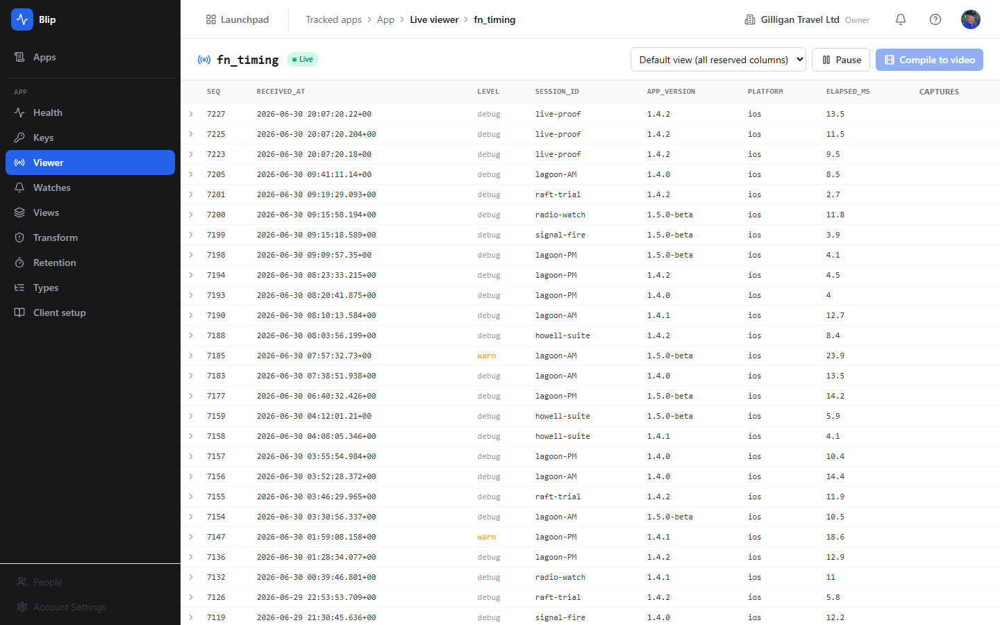

# Blip (Telemetry)

Runtime telemetry intake for your own apps: ship JSON, watch it live, query the history, all inside the suite.

- Embed one ingest key, POST any JSON report, and Blip discovers the types and fields for you, with no schema to declare
- Live tail over WebSocket while you debug, plus forensic query, JSONL freeze to Bin, and latency-percentile dashboards in Bench
- Edge PII redaction, per-app and per-key rate limiting, and a 14-day retention default that never silently grows unbounded
- Watches turn a slow frame or an error spike into a throttled Bolt event, routed straight to a chat channel, never a per-entry firehose
- Attach screenshots to a report and stitch a session into a one-click timelapse video
- A full blip_* MCP surface lets agents declare apps, mint keys, query and tail entries, manage watches, and freeze collections

## See It in Action

---

Part of the [BigBlueBam](/) productivity suite.
