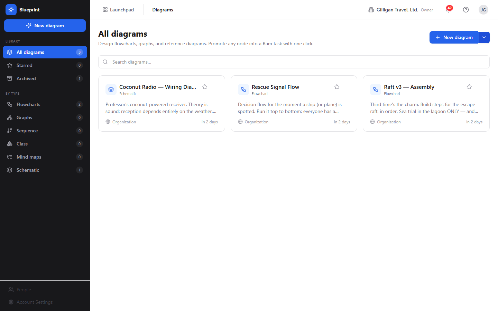
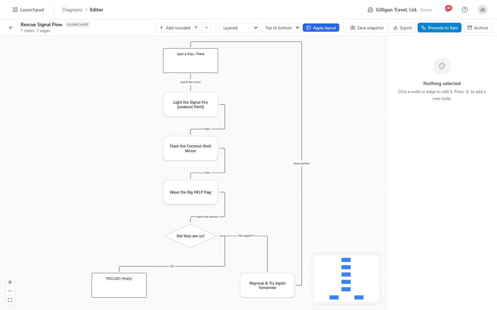
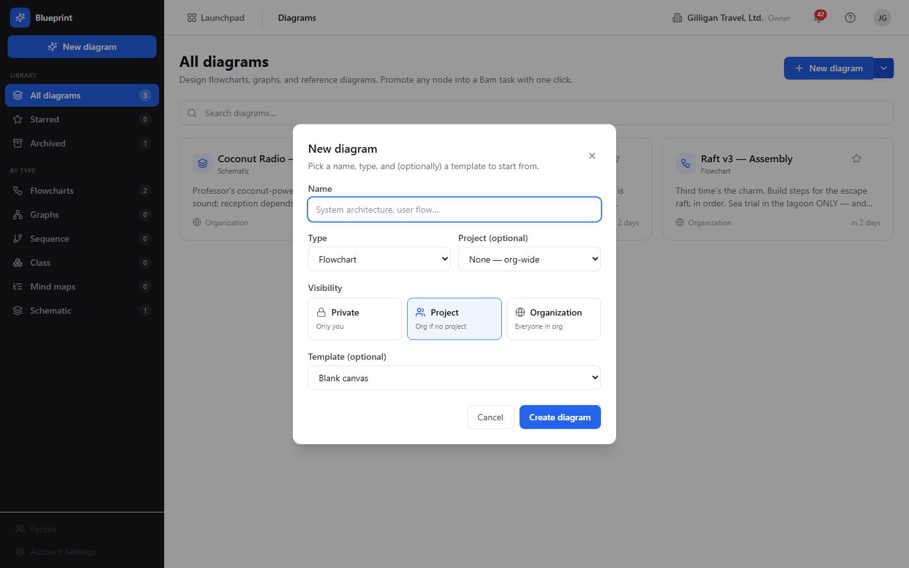
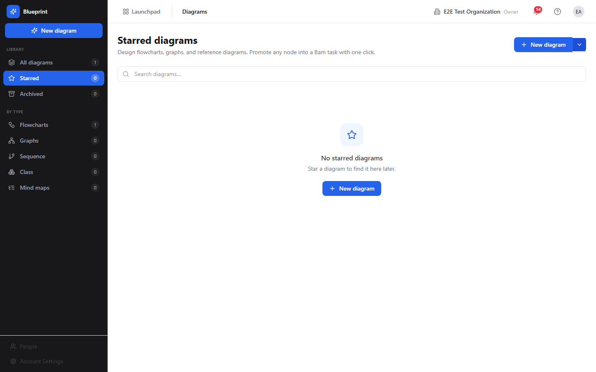
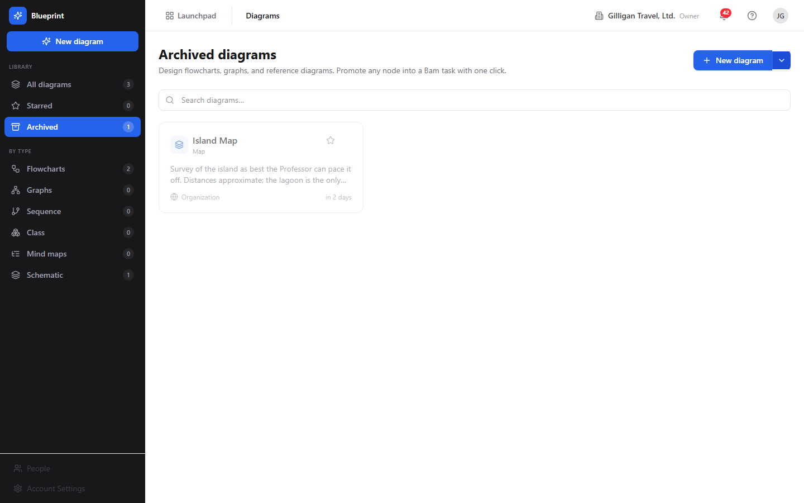

# Blueprint Guide

# Blueprint - Structured Diagrams

Blueprint is the BigBlueBam suite's diagramming tool, and it is built differently from a freeform whiteboard. Every diagram is a typed relational graph: a diagram record, one row per node, and one row per edge, stored in real tables rather than as an opaque drawing blob. Because the graph is structured, every change is an ordinary, auditable action, and the same actions are exposed to AI agents as named tools. A node is a first-class object you can style, nest, link to a task in Bam, promote into a new task, or generate from an existing one.

You draw on an infinite React Flow canvas with a shape palette, a property inspector, and a top toolbar. Diagrams come in five types: Flowchart, Graph, Sequence, Class, and Mind map. Nodes carry a shape, a markdown description, a size, a fill color, and an optional cross-product link; edges carry a kind and arrow markers. Server-side ELK auto-layout arranges the graph in one click, and snapshots let you save and roll back the whole graph.

The headline idea is that anything a person can do to a diagram, an agent can do too, with the same permissions and the same audit trail. An agent can read a process description and emit a fully wired, laid-out diagram in a single call.

## Key Features

- Typed node/edge graph stored in relational tables, so every structural mutation is an auditable API call and an MCP tool, not an edit to an opaque image.
- React Flow editor with a shape palette (Rounded, Rectangle, Diamond, Ellipse, Hexagon), a property inspector, drag-to-connect edges, an add-connected-node palette, snap-to-grid, and resize handles.
- Five diagram types: Flowchart, Graph, Sequence, Class, and Mind map.
- Server-side ELK auto-layout (Layered and Force-directed in the UI; mrtree, radial, and rectpacking through the API or an agent), with pinned nodes excluded.
- Versions: save immutable snapshots of the whole graph and restore an earlier one.
- Mermaid and JSON export, and Mermaid import that materializes a Mermaid block into the editable graph.
- Comments anchored to a node or the whole diagram, with a resolved flag, and explicit per-diagram collaborators at owner / editor / commenter / viewer roles.
- Star and archive for organizing the library; archive is a soft delete that preserves nodes, edges, comments, and snapshots.
- Visibility controls (Private, Project, Organization) and live multi-editor refresh with a presence strip.

## Integrations

- **Bam** - Generate a diagram from a Bam project (one node per task, edges from parent/child links), promote a node or a whole graph into Bam tasks, and keep a node and its linked task in two-way sync on title and description.
- **Beacon, Bearing, Bond, Helpdesk** - Nodes can carry cross-product links to a Beacon entry, a Bearing goal, a Bond deal or contact, or a Helpdesk ticket.
- **Brief** - Mermaid export produces an embeddable source string, and Mermaid import turns a Mermaid block from a Brief or an LLM draft back into an editable graph.
- **Agentic platform** - All 36 MCP tools run under the platform's agent identity, heartbeat, unified activity feed, proposal queue, and `agent_policies` kill switch plus `blueprint.*` allowlist; agents call `can_access` before citing entities, and destructive tools require a confirm step.

## Getting Started

Blueprint is served at `/blueprint/`, reachable from the Launchpad in any BigBlueBam app. You need a signed-in account; for the Bam-integration features you also need a Bam project with tasks.

1. Open `/blueprint/` and click **New diagram**.
2. Name it, pick a **Type** and a **Visibility**, and click **Create diagram**.
3. In the editor, press **N** to add a node, drag between handles to connect nodes, and edit properties in the Inspector.
4. Choose **Layered** in the layout dropdown and click **Apply layout** to tidy it up.
5. Click **Save snapshot** to capture a restore point, and use **Export** for Mermaid or JSON.

To start from existing work, use the chevron next to **New diagram** and choose **From Bam project tasks...**.

## Walkthrough

### Diagram List

### Diagram Editor

### New Diagram Dialog

### Starred Filter

### Archived Filter

## MCP Tools

# blueprint MCP Tools

| Tool | Description | Parameters |
|------|-------------|------------|
| `blueprint_add_collaborator` | Grant a user explicit access to a Blueprint diagram at a given role.  | `id`, `user_id`, `role` |
| `blueprint_add_comment` | Add a comment to a Blueprint diagram. Anchor it to a specific node by passing  | `id`, `body`, `body_plain`, `node_id` |
| `blueprint_add_edge` | Connect two Blueprint nodes with an edge.  | `id`, `source_node_id`, `target_node_id`, `source_handle`, `target_handle`, `kind`, `label`, `marker_start`, `marker_end`, `style`, `waypoints` |
| `blueprint_add_node` | Add a node to a Blueprint diagram.  | `id`, `shape`, `label`, `parent_node_id`, `position_x`, `position_y`, `width`, `height`, `z_index`, `pinned`, `style`, `data`, `ref_entity_type`, `ref_entity_id` |
| `blueprint_apply_layout` | Run ELK auto-layout on a Blueprint diagram.  | `id`, `algorithm`, `direction`, `spacing`, `node_node_spacing`, `layer_spacing` |
| `blueprint_archive` | Archive a Blueprint diagram (soft delete — sets is_archived=true on blueprint_diagrams). Destructive — requires confirm_action=true to actually proceed. Call once with confirm_action: false (or omit) to preview the action, then call again with confirm_action: true to commit. Requires the caller | `id`, `confirm_action` |
| `blueprint_create` | Create a new Blueprint diagram.  | `project_id`, `diagram_type`, `layout_algorithm`, `visibility`, `layout_options`, `canvas_settings`, `template_id` |
| `blueprint_delete_edge` | Delete an edge from a Blueprint diagram. Destructive — requires confirm_action=true to actually proceed. Call once with confirm_action: false (or omit) to preview, then call again with true to commit. | `id`, `edge_id`, `confirm_action` |
| `blueprint_delete_node` | Delete a node from a Blueprint diagram. CASCADE-deletes every edge that references the node as source or target. Destructive — requires confirm_action=true to actually proceed. Call once with confirm_action: false (or omit) to preview, then call again with true to commit. | `id`, `node_id`, `confirm_action` |
| `blueprint_duplicate_node` | Duplicate a Blueprint node in the same diagram. The clone copies every visual attribute (label, shape, dimensions, style, data, cross-product entity ref) and is offset from the original so it doesn | `id`, `node_id`, `offset_x`, `offset_y` |
| `blueprint_export` | Export a Blueprint diagram in the requested format.  | `id`, `format` |
| `blueprint_generate` | Build or extend an entire Blueprint diagram from a structured node/edge spec in ONE call. This is the headline agent surface: read a process doc or roster, emit a list of {ref, label, shape, parent_ref, ref_entity_type, ref_entity_id} node specs plus {source_ref, target_ref, label, kind} edge specs, and the server materializes uuids, wires up parent containers, then auto-layouts.  | `diagram_id`, `nodes`, `ref`, `label`, `shape`, `parent_ref`, `ref_entity_type`, `ref_entity_id`, `edges`, `source_ref`, `target_ref`, `label`, `kind`, `auto_layout`, `replace` |
| `blueprint_generate_from_bam` | Materialize a brand-new Blueprint diagram from a Bam project | `project_id`, `include_completed`, `sprint_id`, `visibility`, `auto_layout` |
| `blueprint_get` | Get a Blueprint diagram | `id` |
| `blueprint_import_mermaid` | Import a Mermaid source string into a Blueprint diagram, materializing its nodes and edges into the typed graph. Set  | `id`, `source`, `replace` |
| `blueprint_link_entity` | Attach a cross-product reference to a Blueprint node so the renderer can show live status from the linked entity (e.g. a task | `id`, `node_id`, `ref_entity_type`, `ref_entity_id` |
| `blueprint_list` | List Blueprint diagrams visible to the caller, optionally filtered by project, diagram type, starred-by-me, or include-archived. Blueprint diagrams are typed graphs (nodes, edges, ports) backed by relational tables — distinct from Board (freeform whiteboard). Returns metadata only; use blueprint_get / blueprint_read_nodes / blueprint_read_edges for the graph payload. | `project_id`, `diagram_type`, `starred`, `include_archived` |
| `blueprint_list_collaborators` | List the explicit collaborators on a Blueprint diagram and their per-diagram roles (owner / editor / commenter / viewer). These are direct share grants on top of any project- or org-level visibility. Use this to see who has been granted access before adding or removing a collaborator. | `id` |
| `blueprint_list_comments` | List the comments on a Blueprint diagram in chronological order. Comments may be anchored to a specific node (node_id set) or attached to the diagram as a whole (node_id null), and carry a resolved flag. Use this to read review feedback before acting on it, or to find unresolved threads. | `id` |
| `blueprint_list_templates` | List the Blueprint diagram templates available to the caller | none |
| `blueprint_list_versions` | List the saved version snapshots of a Blueprint diagram, newest first. Each version is an immutable point-in-time snapshot of the full graph (nodes + edges), captured by blueprint_snapshot_version or by the SPA. Use the version_number with blueprint_restore_version to roll the live diagram back. Returns metadata only — the snapshot payload is not inlined here. | `id` |
| `blueprint_move_node` | Reposition a Blueprint node to a specific (position_x, position_y). Optionally pin the node against future auto-layout passes by setting pinned=true. Broadcasts a blueprint.node.moved event over WebSocket so collaborators see the move live. | `id`, `node_id`, `position_x`, `position_y`, `pinned` |
| `blueprint_promote_graph_to_tasks` | Compile a Blueprint diagram into a Bam-tasks-creation plan. Returns the structured list of tasks to create (one per node) plus parent/child links to set up (one per edge), under the chosen edge-direction convention. The blueprint-api deliberately does NOT create the tasks itself — the caller (SPA or agent) drives the actual  | `id`, `project_id`, `phase_id`, `sprint_id`, `edge_direction` |
| `blueprint_promote_node_to_task` | Generate a Bam-task payload from a Blueprint node and suggest back-linking the node to the new task. Returns a structured payload the caller can POST to /b3/api/projects/:id/tasks (the second hop is not yet executed server-side — wire-up is on the Wave 5 roadmap). Use this when a node represents work to be tracked in Bam (e.g. a swimlane step or a deliverable). | `id`, `node_id`, `project_id`, `phase_id`, `sprint_id`, `title` |
| `blueprint_read_edges` | Read every edge in a Blueprint diagram. Edges connect nodes by uuid (source_node_id, target_node_id) and carry kind, label, markers, style, and optional waypoints for routed paths. Pair with blueprint_read_nodes to materialize the graph. | `id` |
| `blueprint_read_nodes` | Read every node in a Blueprint diagram. Returns full node rows with positions, sizes, parent_node_id (for container nesting), style/data JSONB, and any cross-product ref_entity_type / ref_entity_id linkage (e.g. bam.task, beacon.entry, bond.deal). Use this together with blueprint_read_edges to reconstruct the full graph payload. | `id` |
| `blueprint_remove_collaborator` | Revoke a user | `id`, `user_id`, `confirm_action` |
| `blueprint_restore_version` | Roll a Blueprint diagram | `id`, `version_number`, `confirm_action` |
| `blueprint_search` | Search Blueprint diagrams by case-insensitive substring on name and description. NOTE (MVP limitation): the blueprint-api does not yet expose a server-side search filter, so this tool fetches the visible diagram list and filters client-side. Result counts are capped by the visible list size and node-label search is not yet supported. The Wave 5 plan upgrades this to a server-side ILIKE + node-label search; until then, prefer blueprint_list with project_id / diagram_type filters when you know them. | `query`, `project_id`, `include_archived` |
| `blueprint_snapshot_version` | Capture the current graph (nodes + edges) of a Blueprint diagram as a new immutable version snapshot, auto-numbered one higher than the latest. An optional  | `id`, `label` |
| `blueprint_star` | Star a Blueprint diagram for the calling user, so it surfaces in their starred list (blueprint_list with starred=true). Idempotent — starring an already-starred diagram is a no-op. Personal bookmark only; does not affect other users. | `id` |
| `blueprint_unstar` | Remove the calling user | `id` |
| `blueprint_update` | Update a Blueprint diagram | `id`, `project_id`, `diagram_type`, `layout_algorithm`, `visibility`, `layout_options`, `canvas_settings` |
| `blueprint_update_comment` | Edit a Blueprint comment | `id`, `comment_id`, `body`, `body_plain`, `resolved` |
| `blueprint_update_edge` | Update fields on a Blueprint edge. Provide only the fields to change. Pass  | `id`, `edge_id`, `source_handle`, `target_handle`, `kind`, `label`, `marker_start`, `marker_end`, `style`, `waypoints` |
| `blueprint_update_node` | Update fields on a Blueprint node. Provide only the fields to change. Does NOT update position — use blueprint_move_node for that. To re-target the cross-product link, prefer blueprint_link_entity (single-purpose tool with cleaner semantics). | `id`, `node_id`, `shape`, `label`, `parent_node_id`, `width`, `height`, `z_index`, `pinned`, `style`, `data`, `ref_entity_type`, `ref_entity_id` |
