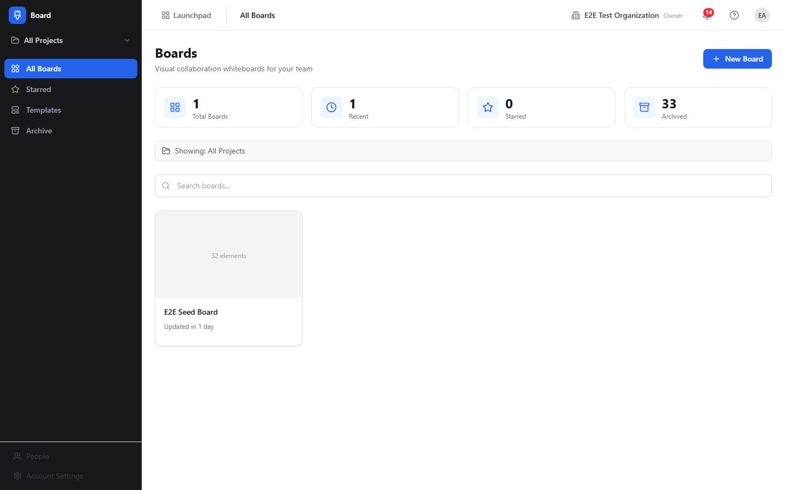
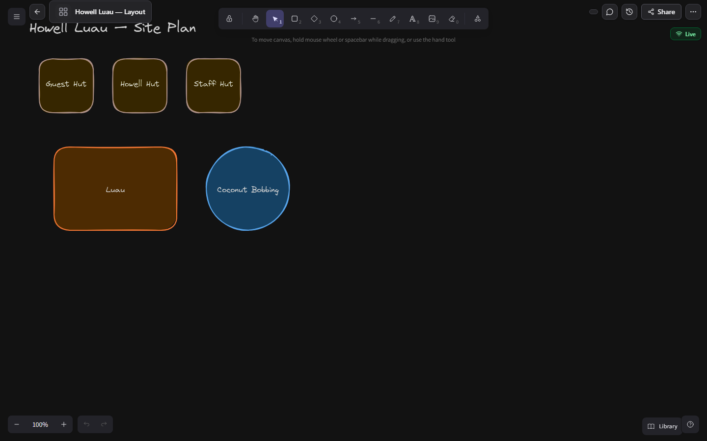
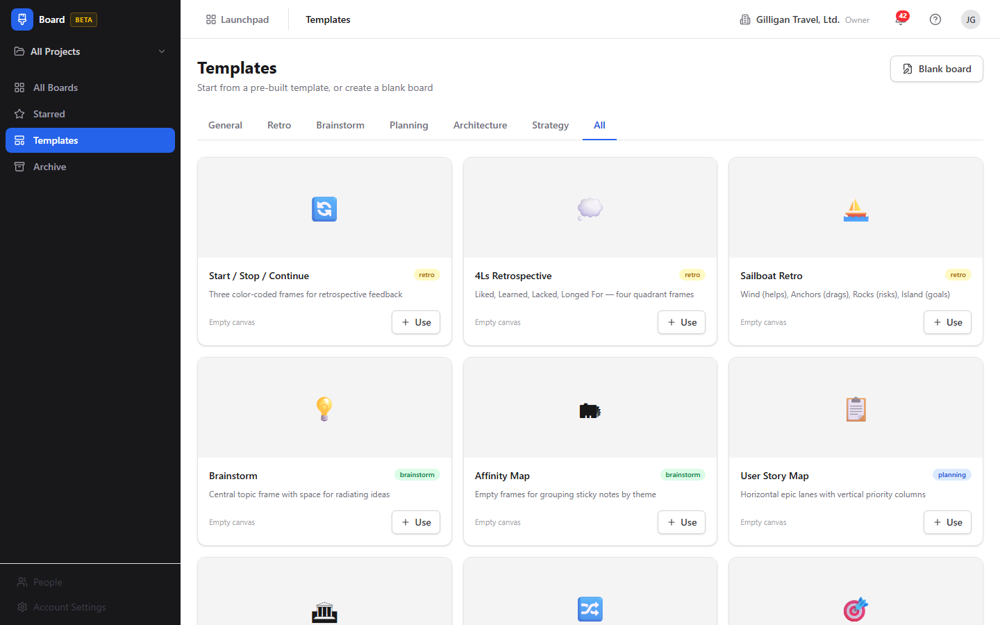
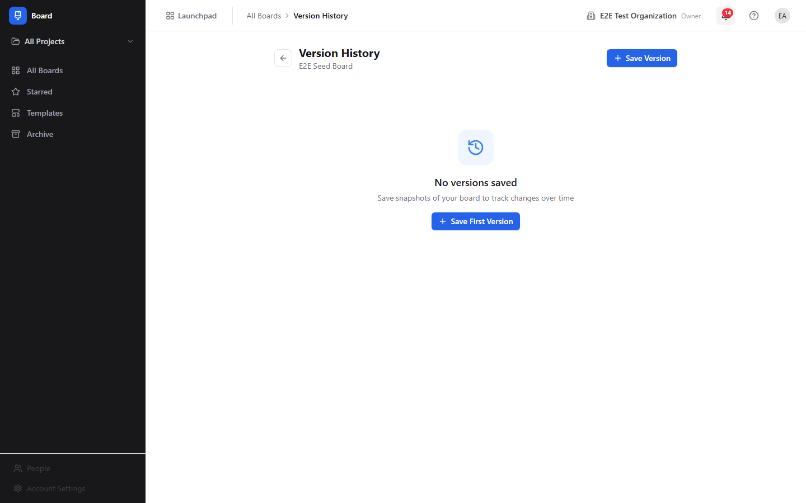

# Board (Visual Collaboration) Guide

# Board - Visual Collaboration

Board is BigBlueBam's infinite canvas whiteboard for real-time visual collaboration, brainstorming, diagramming, and team workshops. Each board is one Excalidraw-powered canvas where you place sticky notes, text, shapes, connectors, freehand drawings, frames, and images, and everything auto-saves as you work. Board is in beta.

## Key Features

- **Infinite Canvas** with shapes, sticky notes, connectors, freehand drawing, text, and frames, all from Excalidraw's native toolbar
- **Real-Time Collaboration** with live cursors, presence indicators, reconnect replay, and WebSocket-powered scene sync
- **Templates** for common workshop formats like retrospectives, brainstorms, planning, and architecture diagrams, across General, Retro, Brainstorm, Planning, Architecture, and Strategy categories
- **Version History** with named snapshots you can save before a big change and restore later
- **Starred Boards, Archive, and Duplicate** for organizing and managing your library, with a project scope selector to filter by Bam project
- **Promote to Bam tasks** that turns brainstorm sticky notes into tracked Bam tasks in a named project and phase, linked back to the source stickies (an agent and API flow today)
- **Voice huddles on a board** provided by the platform-wide presence system the toolbar surfaces, so teammates can talk while they whiteboard

## Integrations

Board shares authentication with all BigBlueBam apps and reads your Bam session and permissions directly. Boards can be scoped to a Bam project, and brainstorm stickies promote into Bam tasks. Bolt automations can react to `board.created`, `board.updated`, `board.locked`, and `board.elements_promoted` events. AI agents work the canvas through 40 Board MCP tools: creating boards, dropping stickies and text, reading and summarizing elements, promoting stickies to tasks, and managing templates, versions, collaborators, and lifecycle. Agent actions run on the shared platform surface with identity tagging, approval queues, unified activity, visibility preflight, and per-agent policies.

## Getting Started

Open Board from the Launchpad at `/board/`. You land on All Boards. Click New Board to pick a template, or start a Blank board with a name and icon. Open a board to reach the full-screen canvas; use Excalidraw's toolbar to add shapes, connectors, sticky notes, and frames. The canvas supports zoom, pan, and multi-select and saves automatically. Press `?` for in-app help.

## Working together

The canvas is co-edited live with shared cursors and a presence bar, and the board carries audio conferencing so collaborators can talk while they draw.

## Walkthrough

### All Boards

### Canvas Populated

### Templates

### Version History

## MCP Tools

# board MCP Tools

| Tool | Description | Parameters |
|------|-------------|------------|
| `board_add_collaborator` | Add a collaborator to a board with a view or edit permission.  | `board_id`, `user_id`, `permission` |
| `board_add_sticky` | Add a sticky note to a board.  | `board_id`, `text`, `x`, `y`, `color` |
| `board_add_text` | Add a text element to a board.  | `board_id`, `text`, `x`, `y` |
| `board_archive` | Archive a board (soft delete).  | `id` |
| `board_check_integrity` | Run a per-board integrity check, returning the list of structural issues (e.g. a project_id referencing a project outside the org).  | `id` |
| `board_create` | Create a new visual collaboration board.  | `project_id`, `template_id`, `background`, `visibility` |
| `board_create_template` | Create a board template, optionally seeded from an existing board\ | `category`, `icon`, `board_id` |
| `board_create_version` | Capture a named snapshot of a board\ | `board_id` |
| `board_delete_link` | Delete a single element-to-task link by its link UUID (get it from board_list_links). This does not delete the underlying task or element, only the association. | `link_id` |
| `board_delete_permanent` | Permanently hard-delete a board and ALL of its elements, collaborators, stars, and versions (cascade). This is irreversible — distinct from board_archive which only soft-deletes.  | `id` |
| `board_delete_template` | Delete a board template.  | `id` |
| `board_duplicate` | Duplicate a board, copying its elements into a new board.  | `id` |
| `board_export` | Export a board as SVG or PNG.  | `id`, `format` |
| `board_get` | Get board metadata by ID. | `id` |
| `board_instantiate_template` | Create a new board from a template.  | `id`, `project_id` |
| `board_list` | List boards with optional filters and pagination. | `project_id`, `visibility`, `cursor`, `limit` |
| `board_list_collaborators` | List the collaborators (and their view/edit permission) on a board.  | `id` |
| `board_list_links` | List the element-to-Bam-task links on a board (created when stickies are promoted to tasks).  | `id` |
| `board_list_recent` | List the boards most recently updated by or visible to the caller. | none |
| `board_list_starred` | List the boards the calling user has starred. | none |
| `board_list_templates` | List the board templates available to the org (system + org-defined), optionally filtered by category. | `category` |
| `board_list_versions` | List the saved version snapshots of a board.  | `id` |
| `board_org_stats` | Get org-level board statistics (counts, activity rollups across all boards in the organization). | none |
| `board_post_chat` | Post a chat message into a board\ | `board_id`, `body` |
| `board_promote_to_tasks` | Promote sticky notes to Bam tasks in a project.  | `board_id`, `element_ids`, `project_id`, `phase_id` |
| `board_read_chat` | Read the recent chat messages on a board (most recent first, capped server-side).  | `id` |
| `board_read_elements` | Read all elements on a board. Returns structured data with positions, text, and types.  | `id` |
| `board_read_frames` | Read frames with their contained elements from a board. | `id` |
| `board_read_stickies` | Read only sticky note elements from a board. | `id` |
| `board_remediate_integrity` | Apply a fix for a board integrity issue:  | `id`, `action`, `project_id` |
| `board_remove_collaborator` | Remove a collaborator from a board.  | `collaborator_id` |
| `board_restore` | Restore a previously archived board.  | `id` |
| `board_restore_version` | Restore a board to a previously captured version snapshot, replacing its current scene.  | `board_id`, `version_id` |
| `board_search` | Search across board element text content. | `query`, `project_id` |
| `board_star_toggle` | Toggle the calling user\ | `id` |
| `board_stats` | Get statistics for a single board (element counts, collaborator counts, last activity).  | `id` |
| `board_summarize` | Get a board summary grouped by frames, including element counts and text content.  | `id` |
| `board_update` | Update board metadata. Provide only the fields to change.  | `id`, `background`, `visibility`, `locked`, `icon` |
| `board_update_collaborator` | Change a collaborator\ | `collaborator_id`, `permission` |
| `board_update_template` | Update a board template\ | `id`, `category`, `icon`, `sort_order` |

## Related Apps

- [Bam (Project Management)](../bam/guide.md)
- [Bench (Analytics)](../bench/guide.md)
- [Bolt (Workflow Automation)](../bolt/guide.md)
- [Bond (CRM)](../bond/guide.md)
- [Bureau](../bureau/guide.md)
- [Introduction to BigBlueBam](../introduction/guide.md)
