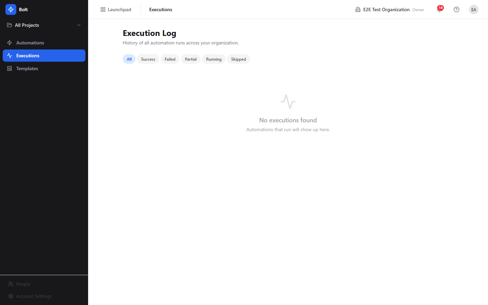
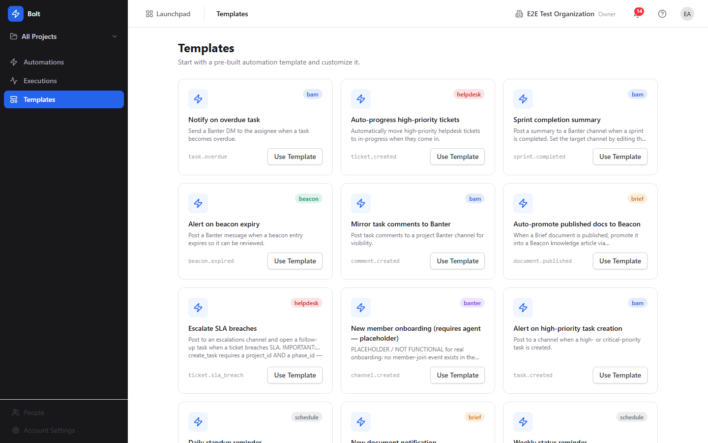

# Bolt (Workflow Automation) Guide

# Bolt - Workflow Automation

Bolt is BigBlueBam's event-driven automation engine and the suite's event hub. You build rules of the form WHEN an event happens, IF conditions hold, THEN run an ordered list of actions. Every other app in the suite reports its activity to Bolt, so a single place watches the whole suite and reacts to it without anyone writing code.

## Key Features

- **Trigger, condition, action builder** with a Simple stacked editor (WHEN / IF / THEN) and a Visual node-graph canvas, switchable per rule. The graph is compiled to a linear ordered action list on save.
- **Event catalog** of over 130 trigger events across Bam (task and sprint changes), Bond (deal stage moves), Helpdesk (tickets and SLA breaches), Blast, Beacon, Brief, Board, Bearing, Bill, Book, Blank, Bench, Banter, and a Schedule (cron) source.
- **Conditions and filters** with 13 operators and AND/OR grouping that gate whether a rule runs, plus variable interpolation between steps (`{{ event.* }}`, `{{ step[N].result.* }}`).
- **Execution Log** with per-automation and organization-wide views, per-step traces (trigger event, condition evaluation, step timeline), retry of failed runs, and single-event tracing.
- **Templates** with 16 pre-built automation blueprints for common workflows, instantiated and customized in the editor.
- **Guards** including per-rule hourly rate limits, cooldowns, and an internal chain-depth limit that prevents rules from triggering each other in a loop.

## Integrations

Bolt is the integration hub of BigBlueBam. Every app publishes its events to Bolt through a shared helper using bare-name-plus-explicit-source naming (the event is `deal.rotting` with source `bond`, not `bond.deal.rotting`). Bolt listens to those events and performs actions back across the suite: creating Bam tasks, posting Banter messages, updating records, sending emails and webhooks, and more. Each action is an MCP tool call executed by the background worker, so automations reach into any app without hand-wired integrations.

Bolt is also built for AI agents. It exposes 26 MCP tools that let an agent author, operate, test, and observe automations, and it rides the suite's shared agentic platform: agent identity and heartbeat, approval proposals, a unified cross-app activity view, visibility checks (`can_access`), per-agent policy kill switches and allowlists, and HMAC-signed outbound webhooks that fan subscribed events to agent runners.

## Getting Started

Open Bolt from the app switcher at `/bolt/`. Browse Templates for a head start or click New Automation to build from scratch. Pick a trigger source and event, add conditions to filter which events should proceed, then add the actions to run. Save the rule as a draft or save and enable it, then watch it run in the Execution Log and open any run to see its trigger event, condition evaluation, and step-by-step results.

## Working together

Like every app, Bolt carries the persistent Bureau presence dock, so you can see who is around and start a voice or video huddle from anywhere in it; deeper per-record co-editing lives on the document, board, and task surfaces.

## Walkthrough

### Automations

### Editor

### Automation Detail

### Executions

### Templates

## MCP Tools

# bolt MCP Tools

| Tool | Description | Parameters |
|------|-------------|------------|
| `bolt_actions` | List available MCP tools that can be used as automation actions. | none |
| `bolt_create` | Create a new workflow automation with trigger, conditions, and actions. | `project_id`, `trigger_source`, `trigger_event`, `trigger_filter`, `conditions`, `actions`, `max_executions_per_hour`, `cooldown_seconds`, `enabled` |
| `bolt_delete` | Delete a workflow automation. | `id` |
| `bolt_disable` | Disable a workflow automation. | `id` |
| `bolt_duplicate` | Duplicate an automation. Creates a disabled copy (with its conditions and actions) under a new name so you can safely modify it before enabling. | `id` |
| `bolt_enable` | Enable a workflow automation. | `id` |
| `bolt_events` | List available trigger events, optionally filtered by source. | `source` |
| `bolt_execution_detail` | Get detailed information about a single execution, including action results. | `id` |
| `bolt_executions` | List execution history for an automation. | `automation_id`, `status`, `limit` |
| `bolt_explain` | Explain an automation definition in plain English using the org\ | `automation`, `trigger_source`, `trigger_event`, `conditions`, `actions`, `project_id` |
| `bolt_generate` | Generate a draft automation definition from a natural-language prompt using the org\ | `prompt`, `context`, `project_id` |
| `bolt_get` | Get a single automation with its conditions and actions. | `id` |
| `bolt_get_automation_by_name` | Resolve an automation by its name within the caller\ | none |
| `bolt_instantiate_template` | Create a new automation from a built-in template (see bolt_list_templates for ids). Optional overrides let you set the name, description, project, and cron schedule on the new automation. | `template_id`, `project_id`, `cron_expression`, `cron_timezone` |
| `bolt_list` | List workflow automations with optional filters and pagination. | `project_id`, `trigger_source`, `enabled`, `cursor`, `limit` |
| `bolt_list_executions` | List execution history across all automations in the org (not scoped to a single automation — use bolt_executions for that). Org-admin scoped. | `status`, `cursor`, `limit` |
| `bolt_list_templates` | List the built-in automation templates available for instantiation (pre-built trigger/condition/action blueprints). | none |
| `bolt_list_versions` | List the saved version history for an automation. Each version is a point-in-time snapshot of the trigger, conditions, and actions captured on update/restore. | `id` |
| `bolt_patch` | Partial metadata update of an automation. Only touches name, description, and/or enabled — does not modify the trigger, conditions, or actions (use bolt_update for those). Provide only the fields to change. | `id`, `enabled` |
| `bolt_restore_version` | Restore an automation to a previously saved version. The current state is snapshotted first, then the named version becomes the live definition. | `id`, `version_id` |
| `bolt_retry_execution` | Retry a failed (or partial) execution. Re-runs the automation against the original event payload and creates a new execution row. | `id` |
| `bolt_stats` | Get aggregate automation statistics for the org (totals, enabled count, execution counts). Pass project_id to scope the numbers to a single project so they line up with a filtered list view. | `project_id` |
| `bolt_test` | Dry-run an automation against a simulated event payload. This evaluates ONLY the automation\ | `id`, `event` |
| `bolt_update` | Update an existing automation. Provide only the fields to change. | `id`, `trigger_source`, `trigger_event`, `trigger_filter`, `conditions`, `actions`, `enabled` |

## Related Apps

- [Bam (Project Management)](../bam/guide.md)
- [Banter (Team Messaging)](../banter/guide.md)
- [Beacon (Knowledge Base)](../beacon/guide.md)
- [Bearing (Goals & OKRs)](../bearing/guide.md)
- [Bench (Analytics)](../bench/guide.md)
- [Bill (Invoicing)](../bill/guide.md)
- [Blank (Forms)](../blank/guide.md)
- [Blast (Email Campaigns)](../blast/guide.md)
- [Board (Visual Collaboration)](../board/guide.md)
- [Bond (CRM)](../bond/guide.md)
- [Book (Scheduling)](../book/guide.md)
- [Brief (Documents)](../brief/guide.md)
- [Bureau](../bureau/guide.md)
- [Helpdesk (Support Portal)](../helpdesk/guide.md)
- [Introduction to BigBlueBam](../introduction/guide.md)
