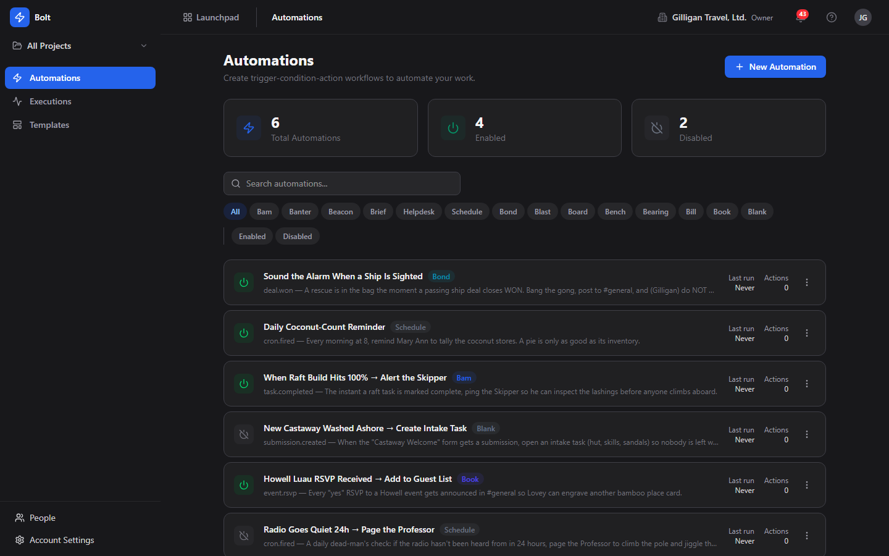
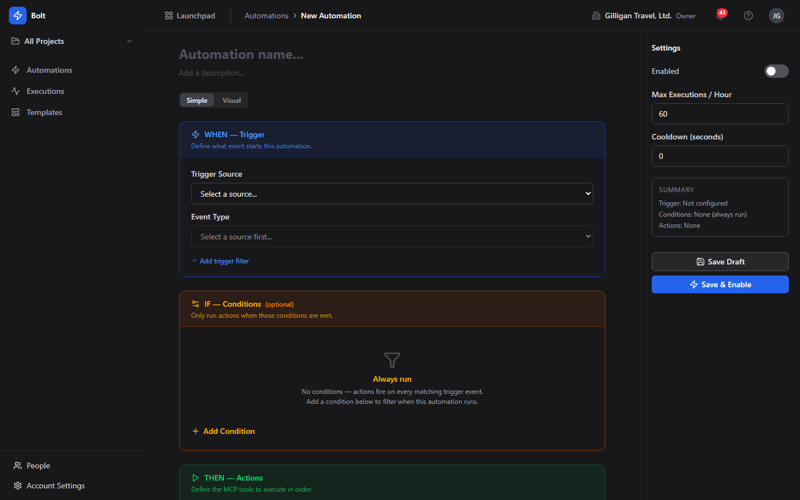
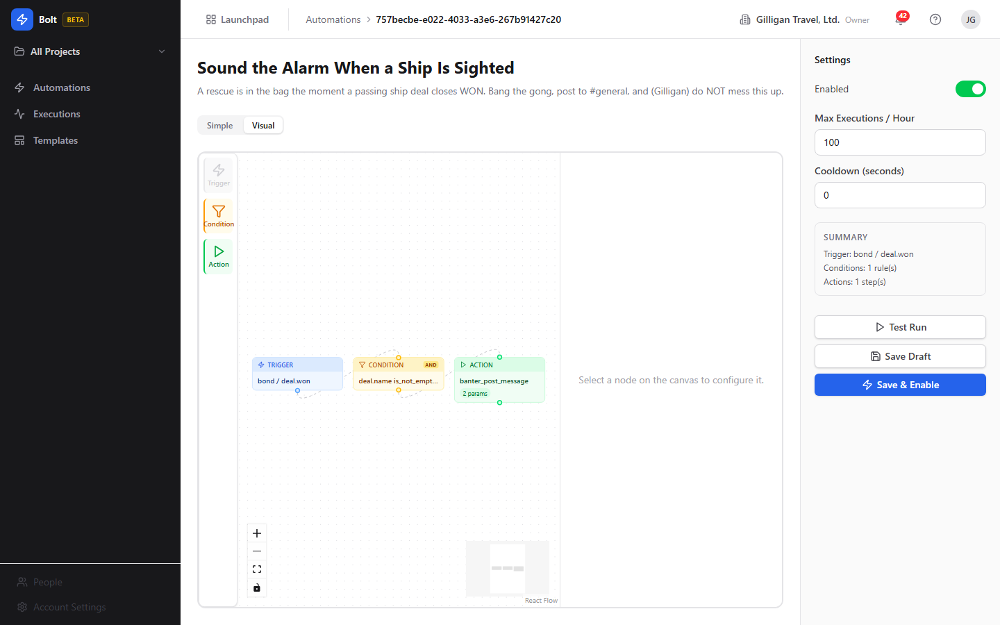

# Bolt (Workflow Automation)

Event-driven workflow automation that connects every BigBlueBam app: WHEN this happens, IF these hold, THEN run these steps.

- Build rules with a Simple WHEN / IF / THEN editor or a Visual node-graph canvas, no code required
- Trigger off over 130 events across the suite and run cross-app action chains with variable interpolation between steps
- Detailed execution logs with per-step traces, single-event tracing, and one-click retry of failed runs
- Built for AI agents too: 26 MCP tools to author, test, and observe automations, with policy guardrails and approvals
- Reach your team without scheduling: the persistent Bureau presence dock lets you see who is around and start a voice or video huddle from anywhere in Bolt

## See It in Action

---

Part of the [BigBlueBam](/) productivity suite.
