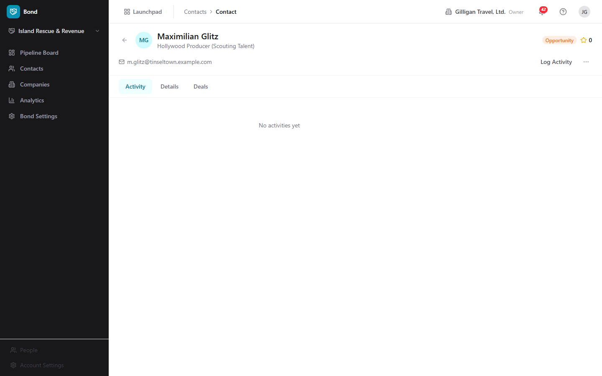
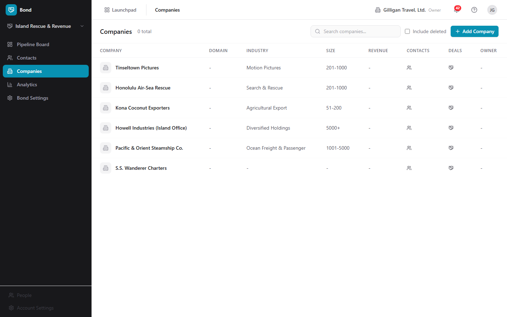
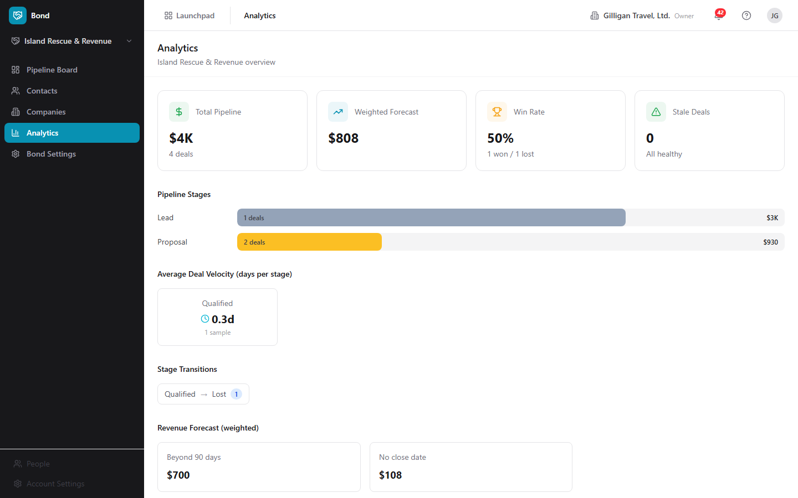

# Bond - CRM for contacts, companies, and deals

> Bond is the BigBlueBam CRM. It tracks the people and companies you sell to, moves deals through a configurable pipeline, and reports on forecast, win rate, and stale deals. Reach for it when you need to manage relationships and close revenue.

## Overview

Bond organizes your sales work around four core objects: contacts (people), companies (organizations), deals (revenue opportunities), and pipelines (the ordered stages a deal passes through). You log activities against any of these, score leads with rules you define, and watch deals age so nothing rots unattended.

The pipeline board is the daily working surface. Each deal is a card in a stage column; you drag cards between columns to move a deal forward, mark it Won or Lost, and group cards into swimlanes by owner or close month. The Contacts and Companies lists are your address book, and the Analytics page rolls everything up into forecast, velocity, and win/loss numbers.

Bond is org-scoped and connects to the rest of the suite. A deal's Related panel surfaces Bill invoices, Book events, and Bam tasks tied to that deal. Bond also emits events (deal won, deal lost, deal rotting, contact created) that Bolt automation rules and other apps can react to, and its contacts feed Blast email segments and Bench reports.

This document describes what the Bond web app actually does today. Where an action exists only through the API or an MCP tool (not the in-app UI), that is called out explicitly so you do not go looking for a button that is not wired up yet.

### Key concepts

- **Contact** - a person you track. Holds name, email, phone, job title, avatar, lifecycle stage, lead source, lead score, address, custom fields, and an owner.
- **Company** - an organization. Holds name, domain, industry, company size bucket, annual revenue, phone, website, logo, address, custom fields, and an owner. Contacts and deals can be linked to a company.
- **Deal** - a revenue opportunity in a pipeline. Holds a name, value, currency, expected close date, probability, and a computed weighted value (value times probability). A deal is Open until it is closed Won or Lost.
- **Lifecycle stage** - where a contact sits in your funnel: Lead, Subscriber, MQL (marketing qualified), SQL (sales qualified), Opportunity, Customer, Evangelist, or Other. New contacts default to Lead.
- **Lead score** - a number from 0 to 100 cached on each contact. Scoring rules add or subtract points based on contact attributes.
- **Pipeline** - an ordered set of stages plus a currency. One pipeline can be the default. The default pipeline is selected automatically when you open the board; you can switch to another from the sidebar scope selector.
- **Stage** - a column on the board. Has a name, a type (Active, Won, or Lost), a probability percentage, an optional rotting threshold in days, and a color.
- **Activity** - a timeline entry logged against a contact, company, and/or deal. Types include Note, Email Sent, Email Received, Call, Meeting, and Task, plus system-generated entries like stage changes and deal created/won/lost.
- **Rotting (stale) deal** - an open deal whose days in its current stage exceed that stage's rotting threshold. The card turns orange, and red when it is more than 1.5 times over.
- **Custom field** - an extra field you define per entity type (Contact, Company, or Deal). These are org-wide for that entity type, not per pipeline.
- **Lead scoring rule** - a condition (field, operator, value) plus a point delta. Rules are org-wide and evaluated together to compute each contact's score.
- **Soft delete** - contacts, companies, and deals are not erased when deleted. They are hidden and can be restored from their list with Include deleted.

### Where to find it

Bond lives at `/bond/`. Open it from the Launchpad app switcher in the top-left chrome, or go straight to the URL.

Prerequisites:

- You must be signed in to BigBlueBam. If you are not, Bond shows "Please log in to BigBlueBam first to access Bond." with a "Go to BigBlueBam Login" button that sends you to `/b3/`.
- At least one pipeline must exist before you can create deals. If your org has no pipeline at all, the board shows "No pipeline selected" and a Create Pipeline button. Once a pipeline exists, the board selects it for you automatically (see Choosing the active pipeline below).
- Bond is org-scoped. Use the OrgSwitcher in the header to change which organization's data you see.

Roles and visibility:

- Members and viewers see only the deals and contacts they own. Admins and owners see everything in the org. This "own only" filtering applies to deal and contact lists, deal detail, stage history, duplicates, and related lookups.
- Most create and edit actions require read/write access. Administering pipelines, stages, scoring rules, custom fields, and import mappings requires admin access. Bulk contact import requires admin access.

The sidebar nav has five items: **Pipeline Board**, **Contacts**, **Companies**, **Analytics**, and **Bond Settings**. A pipeline scope selector sits at the top of the sidebar (showing the active pipeline name, or "Default Pipeline"); it sets the active pipeline used across the board and Analytics. Press the `?` key anywhere in Bond to open the in-app Help viewer.

## Feature reference

### Choosing the active pipeline

The pipeline scope selector at the top of the sidebar sets which pipeline the board and Analytics use. When pipelines exist, Bond auto-selects one for you on first load (the one marked default, or the first pipeline if none is marked default), so the board opens straight onto deals instead of an empty "No pipeline selected" screen. You only see that empty state when the org genuinely has no pipelines yet.

To switch pipelines:

1. Click the scope selector at the top of the sidebar (it shows the current pipeline name, or "Default Pipeline").
2. Pick a pipeline from the dropdown. The active one is marked with a check.
3. The Pipeline Board and Analytics now reflect that pipeline. If no pipelines exist yet, the dropdown reads "No pipelines found".

### Pipeline Board

The board (`/`) shows every deal in the active pipeline as a card in a stage column. The header shows the pipeline name and a summary: "N deals", "Total: $X", and "Weighted: $Y".

To read the board:

1. Open **Pipeline Board** from the sidebar. The default pipeline loads automatically.
2. Each column is a stage, with a color dot, the stage name, a deal count, and the stage's total value.
3. Each card shows the deal name, company, value, close date, days in stage, and the owner's avatar. Orange cards are rotting; red cards are severely overdue (more than 1.5 times the rotting threshold).

To move a deal to another stage:

1. Drag the deal card from its current column and drop it on the target stage column.
2. The deal's stage updates, the move is recorded in stage history, and a stage-changed event is emitted.

To search the board:

1. Type into the "Search deals..." box in the board header.
2. The board filters to deals whose name or company name matches.

To group deals into swimlanes:

1. In the board header, find the **Group** control.
2. Click **None**, **Owner**, or **Close month**.
3. Owner groups deals into a lane per owner name, with "Unassigned" last. Close month groups by close date (YYYY-MM), with "No close date" for deals lacking one.

### Creating a deal

Deals are created from the board. The Create Deal dialog collects a name, an optional value, and an optional expected close date. It does not collect company, owner, probability, currency, or linked contacts; set those by editing the deal afterward (see Deal detail and outcomes), or through an MCP tool or the REST API (see Working with AI agents). You can also create a deal already linked to a contact from the contact's page (see Contact detail).

To add a deal at the first stage:

1. On the Pipeline Board, click **Add Deal** in the top-right.
2. In the "Create Deal" dialog, type a **Deal Name** (required), for example "Acme Corp - Enterprise Plan".
3. Optionally enter a **Value ($)** and an **Expected Close Date**.
4. Click **Create Deal**. The deal appears in the first stage of the pipeline.

To add a deal directly to a specific stage:

1. Hover the stage column header and click the **+** button ("Add deal to <stage>").
2. Fill in the same fields and click **Create Deal**. The deal lands in that stage.

### Deal detail and outcomes

Open a deal card to see its full record at `/deals/:id`: the header with the deal name and a status badge (**Open**, **Won**, or **Lost**), value, company link, close date, days in stage, and owner. The left side shows the description, an inline Log Activity form, and the Activity timeline. The right side shows Details (Probability, Weighted Value, Created, Closed, Close Reason, Lost To), the Related panel, and Stage History.

To edit a deal:

1. Open the deal and click the overflow menu (the "..." button).
2. Choose **Edit Deal**. The "Edit Deal" dialog opens, pre-filled with the deal's current values.
3. Update the **Deal Name**, **Description**, **Value ($)**, **Expected Close Date**, and other fields, then click **Save Changes**. The change is saved through the API and the deal updates in place.

To close a deal as won:

1. Open the deal.
2. Click **Won** (the trophy button). The deal moves to a Won-type stage, its probability is set to 100, and a deal-won event is emitted.

To close a deal as lost:

1. Open the deal.
2. Click **Lost** (the X-circle button). The "Mark Deal as Lost" dialog opens.
3. Enter a **Reason** for the loss and, optionally, the **Lost to Competitor** you lost to.
4. Click **Mark as Lost**. The deal moves to a Lost-type stage, its probability is set to 0, and the reason and competitor are recorded (they show in the deal's Details under Close Reason and Lost To, and feed the Analytics "Top Loss Reasons" and "Top Competitors" sections).

To delete a deal:

1. Open the deal and click the overflow menu (the "..." button).
2. Choose **Delete Deal**. The deal is soft-deleted and you return to the board. It can be restored later through the API or MCP.

### Stage History and Related items

On a deal's detail page:

- **Stage History** lists each transition (from stage to stage), when it happened, who made it, and how long the deal spent in the prior stage.
- **Related** surfaces cross-app links: Bill invoices (by number and status), Book events, and Bam tasks (by their human-readable ID). Each source is best-effort and simply shows nothing if it is unavailable. If there are no links, the panel reads "No related items".

### Contacts list

The Contacts list (`/contacts`) is your people directory. The header shows "Contacts", an "N total" count, a "Search contacts..." box, an **Include deleted** checkbox, and an **Add Contact** button.

To browse and filter contacts:

1. Open **Contacts** from the sidebar.
2. Click a lifecycle pill to filter: **All**, **Lead**, **Subscriber**, **MQL**, **SQL**, **Opportunity**, **Customer**, or **Evangelist**.
3. Type into "Search contacts..." to match by name, email, or phone.
4. Each row shows Name (with avatar and title), Email, Company, the lifecycle Stage badge, Score (star and number), Owner, and Last Contact.

To see deleted contacts and restore one:

1. Check **Include deleted**. Deleted rows appear struck through.
2. Click **Restore** on a deleted row to bring it back.

### Creating a contact

To add a contact:

1. On the Contacts list, click **Add Contact** (also available from the empty-state "No contacts found").
2. In the "Create Contact" dialog, fill in any of **First Name**, **Last Name**, **Email**, **Phone**, and **Job Title**. At least one of first name, last name, or email is required.
3. Choose a **Lifecycle Stage** (Lead, Subscriber, MQL, SQL, Opportunity, Customer, Evangelist, or Other). It defaults to Lead.
4. Click **Create Contact**. The contact is added and you land on its detail page.

### Bulk-importing contacts

Bond can import many contacts at once. Bulk import takes a JSON body with a `contacts` array (1 to 5000 records), not a spreadsheet upload, so there is no in-app CSV file picker; the import is driven through the REST API (`POST /contacts/import`) or an agent and requires admin access. Unmatched companies referenced by the records are resolved by the importer. For a single idempotent ingest by email, use the `bond_upsert_contact` tool instead (see Working with AI agents).

### Contact detail

A contact's page (`/contacts/:id`) shows the avatar, name, title, a link to the company, the lifecycle badge, and the lead score. Below are the email (mailto), phone (tel), and deal count. Three tabs organize the body: **activity**, **details**, and **deals**.

To work a contact:

1. Open the contact.
2. Click **Log Activity** to record a note, call, meeting, or email (see Logging activity).
3. Use the **details** tab to read Lead Source, Owner, City, State/Region, Country, Created, and Last Contacted.
4. The **deals** tab shows a text summary of the contact's deals.

To edit a contact:

1. Click the overflow menu ("...") and choose **Edit Contact**. The "Edit Contact" dialog opens, pre-filled.
2. Update **First Name**, **Last Name**, **Email**, **Phone**, **Job Title**, or the **Lifecycle Stage**, then click **Save Changes**. The change is saved through the API.

To create a deal linked to this contact:

1. Click the overflow menu ("...") and choose **Create Deal**. The "Create Deal" dialog opens.
2. Type a **Deal Name**, an optional **Value ($)**, and pick a **Pipeline** (it defaults to your org's default pipeline).
3. Click **Create Deal**. The deal is created at the pipeline's first active stage and is linked to this contact.

To delete a contact:

1. Click the overflow menu ("...") and choose **Delete Contact**. The contact is soft-deleted; restore it from the Contacts list with Include deleted.

### Companies list

The Companies list (`/companies`) holds the organizations you work with. The header shows "Companies", an "N total" count, a "Search companies..." box, an **Include deleted** checkbox, and an **Add Company** button.

To browse companies:

1. Open **Companies** from the sidebar.
2. Type into "Search companies..." to match by name or domain.
3. Each row shows the Company (logo and name), Domain, Industry, Size, Revenue, Contacts count, Deals count, and Owner.
4. Check **Include deleted** to see soft-deleted companies, each with a Restore action.

### Creating a company

To add a company:

1. On the Companies list, click **Add Company** (also on the empty-state "No companies found").
2. In the "Create Company" dialog, type a **Company Name** (required).
3. Optionally fill in **Domain**, **Industry**, **Company Size** (a bucket: 1-10, 11-50, 51-200, 201-1000, 1001-5000, 5000+), and **Website**.
4. Click **Create Company**. The company is added and you land on its detail page.

### Company detail

A company's page (`/companies/:id`) shows the logo, name, industry badge, and employee count, plus the domain link, phone, location, contact count, deal count, and revenue. Four tabs organize the body: **activity**, **details**, **contacts**, and **deals**.

To work a company:

1. Open the company.
2. Click **Log Activity** to record an activity against it.
3. Use the **details** tab to read Website, Owner, Address, and Created.
4. The **contacts** and **deals** tabs show text summaries.

To edit a company:

1. Click the overflow menu ("...") and choose **Edit Company**. The "Edit Company" dialog opens, pre-filled.
2. Update the company's fields and click **Save Changes**. The change is saved through the API.

To delete a company:

1. Click the overflow menu ("...") and choose **Delete Company**. The company is soft-deleted; restore it from the Companies list with Include deleted.

### Logging activity

The Log Activity form appears on contact, company, and deal detail pages. Use it to keep a running timeline of your touches.

To log an activity:

1. On a contact, company, or deal detail page, click **Log Activity**.
2. Choose a type: **Note**, **Email Sent**, **Email Received**, **Call**, **Meeting**, or **Task**.
3. Enter a Subject and optional details in the "Add details..." box.
4. Click **Log Activity**. The entry appears in the Activity timeline with an icon and label for its type.

### Analytics

The Analytics page (`/analytics`) reports on the effective pipeline (the active one, falling back to the default, then the first). The header reads "Analytics" with "<pipeline> overview".

To read your numbers:

1. Open **Analytics** from the sidebar.
2. The top stat cards show **Total Pipeline**, **Weighted Forecast**, **Win Rate** (a percent with won and lost counts), and **Stale Deals** ("Needs attention" or "All healthy").
3. **Pipeline Stages** shows a bar per active stage with deal count and value.
4. **Average Deal Velocity (days per stage)** shows cards with average days in each stage and the sample size.
5. **Stage Transitions** shows from-stage to to-stage with a count badge.
6. **Revenue Forecast (weighted)** breaks the weighted total into Next 30 days, Next 60 days, Next 90 days, Beyond 90 days, and No close date (only non-zero buckets show).
7. **Stale Deals (N)** lists clickable rows (name, stage, an X-of-Y days badge, value). Click a row to open that deal.
8. **Top Loss Reasons** and **Top Competitors** summarize why deals were lost and to whom (populated from the reason and competitor you enter when you mark a deal Lost).

### Bond Settings: Pipelines

Settings opens at `/settings/pipelines`. The Pipelines tab lists your pipelines; expand one to see and edit its stages.

To create a pipeline:

1. Open **Bond Settings**, then the **Pipelines** tab.
2. Click **New Pipeline**.
3. In the "Create Pipeline" dialog, type a **Pipeline Name** and click **Create**.
4. The new pipeline is seeded with six default stages: Prospect (10%), Qualified (25%), Proposal (50%), Negotiation (75%), Closed Won (100%, Won), and Closed Lost (0%, Lost).

To inspect and manage stages:

1. Click a pipeline row to expand it.
2. Each stage row shows a color dot, the stage name, a type badge (Active, Won, or Lost), the probability percent, and "Nd rot" if a rotting threshold is set.
3. To add a stage, use the inline **Add stage** form: type a name, pick a type (Active, Won, or Lost), and click **Add**.
4. To delete a stage, hover the row and click the trash icon.

Note: each stage row shows a drag handle, but reordering stages is not wired in the Settings UI. Stage reordering, and editing a stage's probability, rotting days, or color, are available through the REST API or the `bond_reorder_stages` and `bond_update_stage` MCP tools. The Add stage form sets only the name and type.

### Bond Settings: Custom Fields

Custom fields extend contacts, companies, or deals with extra data. They are defined per entity type and apply org-wide for that type (not per pipeline).

To add a custom field:

1. Open **Bond Settings**, then the **Custom Fields** tab.
2. Optionally narrow the list with the entity filter (All Types, Contact, Company, or Deal).
3. Click **New Field**.
4. In the "Create Custom Field" dialog, choose an **Entity Type** (Contact, Company, or Deal) and a **Field Type** (Text, Number, Date, Select, Multi Select, URL, Email, Phone, or Boolean).
5. Enter a **Label**; the **Field Key** is generated from it automatically (you can adjust it).
6. Check **Required field** if the field is mandatory.
7. For Select or Multi Select, build the **Options** list by entering a Value and Label and clicking **Add** for each option.
8. Click **Create Field**. Fields are grouped by entity type, each showing its label, key, type badge, and option count.

To delete a custom field:

1. Hover its row and click the trash icon.

### Bond Settings: Lead Scoring

Lead scoring rules adjust each contact's lead score. Rules are org-wide and evaluated together; each matching enabled rule adds or subtracts its delta, and the final score is clamped to 0-100.

To create a scoring rule:

1. Open **Bond Settings**, then the **Lead Scoring** tab.
2. Click **New Rule**.
3. In the "Create Scoring Rule" dialog, enter a **Rule Name** and an optional **Description**.
4. Build the **Condition**: pick a Field (for example Lifecycle Stage, Lead Source, Job Title, City, Country, Current Score, or a custom field), an Operator (Equals, Not Equals, Contains, Greater Than, Less Than, Greater or Equal, Less or Equal, Exists, Not Exists), and a Value (the Value box hides for Exists and Not Exists).
5. Set a **Score Delta** (from -100 to 100) and leave **Enabled** checked to make the rule active.
6. Click **Create Rule**. Each rule row reads as a plain sentence, shows its +/- point delta, and offers edit and delete.

To edit a scoring rule:

1. Hover a rule row and click the edit (pencil) icon.
2. Adjust fields in the "Edit Scoring Rule" dialog and click **Save Changes**.

Note: there is no in-app button to recalculate scores. Recalculation runs through the REST endpoint or the `bond_score_lead` MCP tool (see Working with AI agents).

### Restoring deleted records

Contacts, companies, and deals are soft-deleted, so a delete is recoverable.

To restore a deleted contact or company:

1. Open the **Contacts** or **Companies** list.
2. Check **Include deleted**.
3. Find the struck-through row and click **Restore**.

Deleted deals are restored through the REST API or the `bond_restore_deal` MCP tool, not from the board UI.

### Working with AI agents

Bond exposes a large MCP catalog (over 70 tools across `bond-tools.ts`, plus the cross-cutting `bond_find_duplicates`), so an AI agent can do everything a salesperson does in the app, plus the admin configuration the current UI does not expose. Most write tools accept a name or a UUID (a pipeline or stage name, a contact email or name, a company name or domain, a deal title fragment, an owner email); an ambiguous or missing match returns a clean error instead of mutating data.

What agents commonly drive:

- **Contacts:** `bond_create_contact`, `bond_update_contact`, `bond_list_contacts`, `bond_get_contact`, `bond_search_contacts`, `bond_merge_contacts`, `bond_delete_contact`, and `bond_restore_contact`. `bond_update_contact` does the same edit the in-app Edit Contact dialog does, including lifecycle stage.
- **Idempotent contact ingestion:** `bond_upsert_contact` upserts by email. It is part of the platform's idempotent write plane and returns a `created` flag and an idempotency key, so repeated ingestion does not create duplicates. It also resurrects a soft-deleted contact with the same email.
- **Companies:** `bond_create_company`, `bond_update_company`, `bond_list_companies`, `bond_get_company`, `bond_search_companies`, `bond_delete_company`, `bond_restore_company`, `bond_list_company_contacts`, and `bond_list_company_deals`. `bond_update_company` matches the in-app Edit Company dialog.
- **Deals:** `bond_create_deal` (collects fields the in-app board dialog omits at creation, such as company, owner, and probability), `bond_update_deal` (the same edit the in-app Edit Deal dialog does), `bond_list_deals`, `bond_get_deal`, `bond_move_deal_stage`, `bond_close_deal_won`, and `bond_close_deal_lost` (records a close reason and the competitor you lost to, just like the in-app Mark Deal as Lost dialog). `bond_duplicate_deal`, `bond_delete_deal`, and `bond_restore_deal` round out the lifecycle, and `bond_list_deal_contacts`, `bond_add_deal_contact`, `bond_remove_deal_contact`, `bond_get_deal_stage_history`, `bond_list_deal_activities`, and `bond_get_deal_related` cover the deal detail surface.
- **Activities:** `bond_log_activity` mirrors the Log Activity form; `bond_list_activities`, `bond_get_activity`, `bond_update_activity`, and `bond_delete_activity` manage the timeline.
- **Pipelines and stages (admin):** `bond_list_pipelines`, `bond_get_pipeline`, `bond_create_pipeline`, `bond_update_pipeline`, `bond_delete_pipeline`, and the stage tools `bond_list_stages`, `bond_create_stage`, `bond_update_stage`, `bond_delete_stage`, and `bond_reorder_stages`. `bond_reorder_stages` and `bond_update_stage` do the stage reordering and the probability/rotting/color edits the Settings UI cannot.
- **Custom fields (admin):** `bond_list_custom_fields`, `bond_get_custom_field`, `bond_create_custom_field`, `bond_update_custom_field`, and `bond_delete_custom_field`.
- **Lead scoring:** `bond_list_scoring_rules`, `bond_create_scoring_rule`, `bond_update_scoring_rule`, and `bond_delete_scoring_rule` manage the rules; `bond_score_lead` recalculates a contact's score, the action the Settings UI has no button for.
- **Reporting:** `bond_get_pipeline_summary`, `bond_get_stale_deals`, `bond_get_forecast`, `bond_get_conversion_rates`, `bond_get_deal_velocity`, and `bond_get_win_loss` return the data the Analytics page renders.
- **Deduplication:** `bond_find_duplicates` returns ranked likely-duplicate contacts with confidence and signals (full-name trigram similarity, exact email match, exact normalized-phone match), and pairs with the platform `dedupe_record_decision` and `dedupe_list_pending` tools (entity type `bond.contact`) plus `bond_merge_contacts` to resolve them. There is no in-app dedupe screen; this loop is API and tool only.
- **Import mappings and settings:** `bond_create_import_mapping` and `bond_list_import_mappings` record external-system-to-Bond lookups for dedup; `bond_get_user_settings` and `bond_update_user_settings` manage per-user Bond preferences such as reply-to email.

Cross-cutting agent platform: Bond data is reachable through the platform read plane too. `search_everything` fans out across apps (including Bond) with optional asker-mode `can_access` filtering, and composite views like `account_view` assemble a contact or company picture across apps. Agents run with an identity (`users.kind` of `agent` or `service`), send `agent_heartbeat`, and are gated by `agent_policies` (per-agent kill switch plus glob tool allowlists such as `bond.*`); risky changes can be routed through the proposal queue (`proposal_create` / `proposal_decide`) for human approval, and outbound webhooks push subscribed Bolt events to agent runners. Before an agent cites a Bond entity in a shared surface, it should preflight with `can_access(asker_user_id, 'bond.contact', id)` (or the relevant entity type) and drop anything not allowed.

Event-driven automation: Bond emits Bolt events on the `bond` source for `deal.created`, `deal.updated`, `deal.stage_changed`, `deal.won`, `deal.lost`, `contact.created`, `contact.upserted`, `activity.logged`, and `deal.rotting`. A daily worker job emits `deal.rotting` for open deals that have aged past their stage's rotting threshold, so downstream Bolt rules can nudge an owner or hand off to another app.

Reviewing agent work: own-only visibility is enforced server-side, so a member or viewer service account only sees and acts on records it owns.

For the full tool catalog and schemas, see the Bond MCP-tools reference and guide in `docs/apps/bond/`.

## User Stories

### Story: Set up your first sales pipeline

**Who:** An org admin or owner setting up Bond.
**Goal:** Have a working pipeline with the stages your team sells through.
**Before you start:** You need admin access to Bond. A fresh org has no pipeline, so the board shows "No pipeline selected".

**Steps**

1. Open **Bond Settings** from the sidebar (or click **Create Pipeline** on the empty board, which takes you there).
2. On the **Pipelines** tab, click **New Pipeline**.
3. In the "Create Pipeline" dialog, type a **Pipeline Name** such as "Enterprise Sales" and click **Create**.
4. The pipeline is seeded with six stages: Prospect, Qualified, Proposal, Negotiation, Closed Won, and Closed Lost. Click the pipeline row to expand it.
5. Add any stages your team needs with the inline **Add stage** form (name plus type), and delete any you do not want with the trash icon on a stage row.

**Result:** A pipeline exists with its stages. Because at least one pipeline now exists, the Pipeline Board auto-selects it and renders columns instead of the "No pipeline selected" message, and you can start adding deals.

**Related:** Tune stage probability, rotting days, color, or order through the `bond_update_stage` and `bond_reorder_stages` MCP tools or the REST API; the Settings UI sets only stage name and type. See .

### Story: Add and qualify a contact

**Who:** A salesperson or SDR capturing a new lead.
**Goal:** Get a person into Bond, classify them, and start a history of touches.
**Before you start:** You need read/write access. You are on the Contacts list.

**Steps**

1. Click **Add Contact**.
2. In the "Create Contact" dialog, fill in **First Name**, **Last Name**, **Email**, **Phone**, and **Job Title** (at least one of first name, last name, or email is required).
3. Choose a **Lifecycle Stage**, for example **Lead** or **MQL**, then click **Create Contact**.
4. On the contact's detail page, click **Log Activity**, pick **Call** or **Note**, write a subject and details, and click **Log Activity**.
5. To reclassify the contact later, open the overflow menu ("..."), choose **Edit Contact**, change the **Lifecycle Stage**, and click **Save Changes**.

**Result:** The contact exists with a lifecycle stage and a first activity in its timeline, and you can update its details and stage at any time.

**Related:** Agents can do the same with `bond_create_contact` and `bond_update_contact`. See .

### Story: Create a deal and move it to close

**Who:** A salesperson working an opportunity.
**Goal:** Track a deal from creation through Won or Lost.
**Before you start:** You need read/write access and at least one pipeline. You are on the Pipeline Board, which has the default pipeline already selected.

**Steps**

1. Click **Add Deal** (or the **+** on a specific stage column).
2. In the "Create Deal" dialog, type a **Deal Name**, an optional **Value ($)**, and an optional **Expected Close Date**, then click **Create Deal**.
3. To set a company, owner, or other fields the create dialog omits, open the deal, use the overflow menu's **Edit Deal**, and **Save Changes**.
4. As the deal progresses, drag its card from one stage column to the next. Each move is recorded in Stage History.
5. Open the deal and use **Log Activity** to record calls and meetings along the way.
6. When the deal closes, open it and click **Won**, or click **Lost** and enter a **Reason** (and optional **Lost to Competitor**) in the "Mark Deal as Lost" dialog.

**Result:** The deal shows an **Open**, **Won**, or **Lost** badge, its probability is set (100 for won, 0 for lost), and a lost deal records its reason and competitor for reporting.

**Related:** Agents can create deals with more fields up front via `bond_create_deal`, edit them with `bond_update_deal`, and close them with `bond_close_deal_won` / `bond_close_deal_lost`. See .

### Story: Work the board with swimlanes

**Who:** A sales manager scanning the pipeline.
**Goal:** See deals grouped by who owns them or when they close, and spot the ones going stale.
**Before you start:** You are on the Pipeline Board with deals in the active pipeline.

**Steps**

1. In the board header, use the **Group** control and click **Owner** to lane deals by owner, or **Close month** to lane them by close date.
2. Type into "Search deals..." to narrow to a name or company.
3. Scan for orange cards (rotting) and red cards (severely overdue, more than 1.5 times past the rotting threshold).
4. Click **None** to return to the flat board.

**Result:** The board is reorganized into swimlanes and you can see, at a glance, which owner or month is loaded and which deals are aging.

**Related:** Triage stale deals (next story) for a focused list.

### Story: Triage stale deals

**Who:** A sales manager or rep keeping deals from rotting.
**Goal:** Find deals stuck too long in a stage and re-engage them.
**Before you start:** You are signed in with access to the pipeline's deals.

**Steps**

1. Open **Analytics** from the sidebar.
2. Read the **Stale Deals** stat card ("Needs attention" or "All healthy").
3. Scroll to the **Stale Deals (N)** section and click a row to open that deal.
4. On the deal, click **Log Activity** and record a follow-up call or note to re-engage it.

**Result:** Each stale deal is reviewed and gets a fresh touch, which resets its activity history.

**Related:** Agents can pull the same list with `bond_get_stale_deals`. A daily worker also emits `deal.rotting` to Bolt so automation rules can nudge owners. See .

### Story: Forecast revenue

**Who:** A sales leader planning the quarter.
**Goal:** Understand expected revenue and where deals are being lost.
**Before you start:** You have a pipeline with open and closed deals.

**Steps**

1. Open **Analytics** from the sidebar.
2. Read **Weighted Forecast** and **Win Rate** at the top.
3. Review the **Revenue Forecast (weighted)** buckets: Next 30 days, Next 60 days, Next 90 days, Beyond 90 days, and No close date.
4. Read **Average Deal Velocity (days per stage)** to see where deals slow down, and **Top Loss Reasons** and **Top Competitors** to see why and to whom you lose.

**Result:** You have a weighted forecast, a win rate, velocity per stage, and a breakdown of losses.

**Related:** Agents can fetch the same figures with `bond_get_forecast`, `bond_get_pipeline_summary`, `bond_get_deal_velocity`, and `bond_get_win_loss`.

### Story: Manage companies

**Who:** An account manager organizing accounts.
**Goal:** Create a company, edit its details, and tie contacts and deals to it.
**Before you start:** You need read/write access. You are on the Companies list.

**Steps**

1. Click **Add Company**.
2. In the "Create Company" dialog, type a **Company Name**, and optionally a **Domain**, **Industry**, **Company Size**, and **Website**, then click **Create Company**.
3. On the company's detail page, open the overflow menu ("...") and choose **Edit Company** to update its fields; click **Save Changes**.
4. Use the **contacts** and **deals** tabs to see linked records (shown as summaries), and **Log Activity** to record touches against the account.

**Result:** The company exists with its linked contact and deal counts, its details are editable in place, and its activity timeline is started.

**Related:** Agents can manage the same record with `bond_create_company` and `bond_update_company`. See .

### Story: Configure lead scoring

**Who:** A marketing or sales ops admin.
**Goal:** Automatically prioritize contacts by scoring their attributes.
**Before you start:** You need admin access to Bond.

**Steps**

1. Open **Bond Settings**, then the **Lead Scoring** tab.
2. Click **New Rule**.
3. Enter a **Rule Name**, build the **Condition** (Field, Operator, Value), set a **Score Delta** between -100 and 100, and keep **Enabled** checked.
4. Click **Create Rule**. Repeat for each scoring signal you want.
5. To change a rule later, hover its row, click the edit icon, adjust it, and click **Save Changes**.

**Result:** Enabled rules combine to produce each contact's lead score, clamped to 0-100. The score shows as a star and number on contact rows and detail pages.

**Related:** There is no recalculate button in the app; trigger recalculation with the `bond_score_lead` MCP tool or the `/scoring/recalculate` REST endpoint. Agents can also manage the rules themselves with `bond_create_scoring_rule` and `bond_update_scoring_rule`.

### Story: Extend the schema with custom fields

**Who:** An admin who needs to capture data Bond does not have a built-in field for.
**Goal:** Add a custom field to contacts, companies, or deals.
**Before you start:** You need admin access to Bond.

**Steps**

1. Open **Bond Settings**, then the **Custom Fields** tab.
2. Click **New Field**.
3. Choose the **Entity Type** and **Field Type**, enter a **Label** (the **Field Key** auto-fills), and check **Required field** if needed.
4. For Select or Multi Select fields, add **Options** by entering a Value and Label and clicking **Add** for each.
5. Click **Create Field**.

**Result:** The new field appears grouped under its entity type. Custom fields are org-wide for that entity type, not tied to a single pipeline.

**Related:** Agents can manage the same definitions with `bond_create_custom_field`, `bond_update_custom_field`, and `bond_delete_custom_field`.

### Story: Restore a deleted record

**Who:** Anyone who deleted a contact or company by mistake.
**Goal:** Bring back a soft-deleted record.
**Before you start:** You are on the Contacts or Companies list.

**Steps**

1. Check **Include deleted** in the list header.
2. Find the struck-through row for the record you deleted.
3. Click **Restore** on that row.

**Result:** The record returns to the active list. (Deleted deals are restored with the `bond_restore_deal` MCP tool or the REST API rather than the board.)

### Story: Deduplicate contacts (agent-assisted)

**Who:** An ops admin or an AI agent cleaning the contact database.
**Goal:** Find and merge duplicate contacts.
**Before you start:** This flow runs through MCP tools and the REST API; there is no in-app dedupe screen.

**Steps**

1. Run `bond_find_duplicates` (or call `GET /contacts/:id/duplicates`) to get ranked likely duplicates with confidence and signals.
2. Review the candidates and record a decision with the platform `dedupe_record_decision` tool.
3. When two records are truly the same person, merge them with `bond_merge_contacts` (or `POST /contacts/:id/merge`). The target absorbs the source's deals, activities, and company links, and the source is soft-deleted.

**Result:** Duplicate contacts are consolidated into a single record, and your decision is recorded so the pair is not re-flagged.

**Related:** This is the platform dedup loop for entity type `bond.contact`. Pending pairs are listed with `dedupe_list_pending`.

### Story: Hand a deal off across the suite

**Who:** A rep coordinating delivery after a win.
**Goal:** See and follow the invoices, events, and tasks tied to a deal.
**Before you start:** You are on a deal's detail page, and related records exist in Bill, Book, or Bam.

**Steps**

1. Open the deal.
2. In the right-side **Related** panel, review linked Bill invoices (with number and status), Book events, and Bam tasks (with their human-readable IDs).
3. Click any related item to jump to it in the other app.

**Result:** You can move from the deal straight to the invoice, meeting, or task that continues the work, without searching for it.

**Related:** Bond contacts also feed Blast email segments, and Bond data is queryable in Bench reports.

## Related

- **Bill** - invoices linked to a deal appear in its Related panel.
- **Book** - scheduled events linked to a deal appear in its Related panel.
- **Bam** - project tasks linked to a deal appear in its Related panel, by human-readable ID.
- **Blast** - pulls Bond contacts into email segments.
- **Bench** - reports and dashboards can query Bond data.
- **Bolt** - reacts to Bond events (`deal.created`, `deal.updated`, `deal.stage_changed`, `deal.won`, `deal.lost`, `contact.created`, `contact.upserted`, `activity.logged`, `deal.rotting`) on the `bond` source.
- Bond MCP-tools reference and guide in `docs/apps/bond/`.
