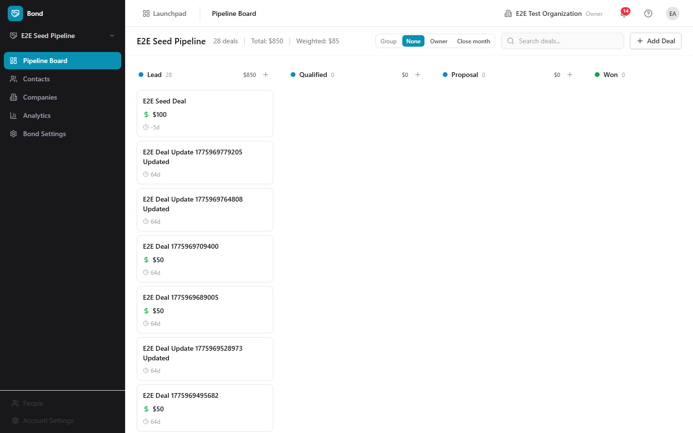
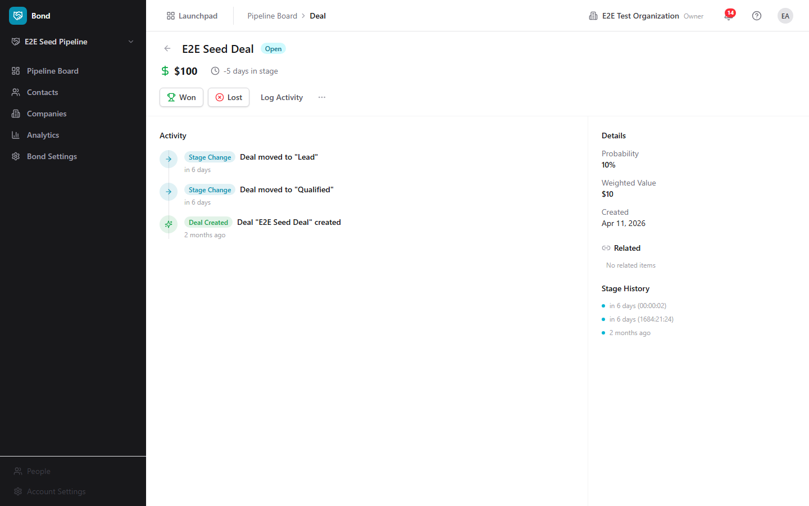
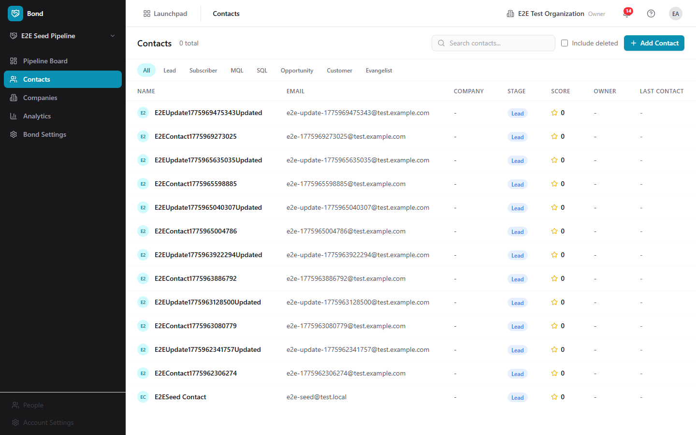

# Bond (CRM)

A lightweight CRM with visual pipelines, stale-deal detection, and an AI-agent surface.

- Drag-and-drop pipeline board that auto-loads your default pipeline, with swimlanes by owner or close month
- Contact and company profiles with lifecycle stages, lead scoring, and cross-app activity timelines
- Stale-deal alerts and duplicate detection so no opportunity sits idle and no contact is entered twice
- Over 70 MCP tools let agents run the whole CRM: create and move deals, log activities, dedupe contacts, and forecast revenue
- See who else is on a deal and pull them into a live huddle in one tap

## See It in Action

---

Part of the [BigBlueBam](/) productivity suite.
