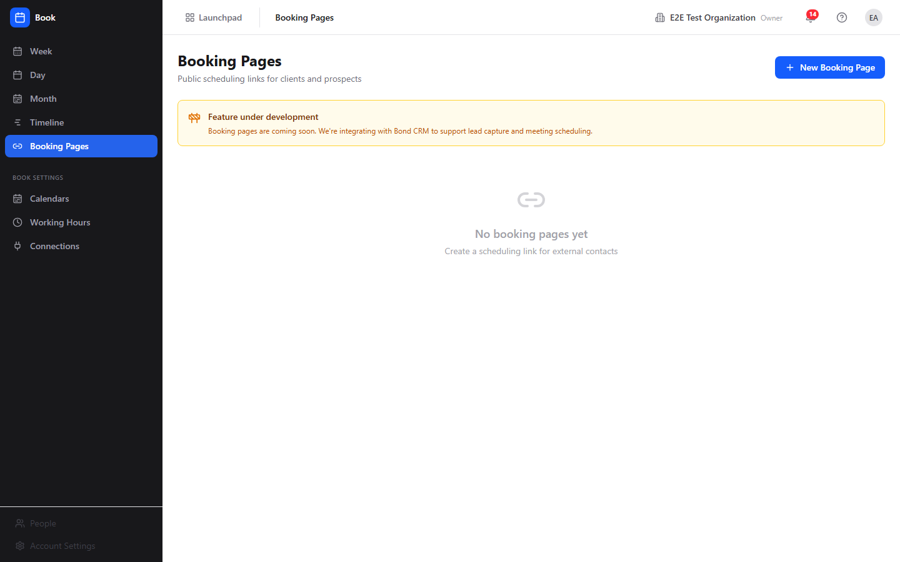
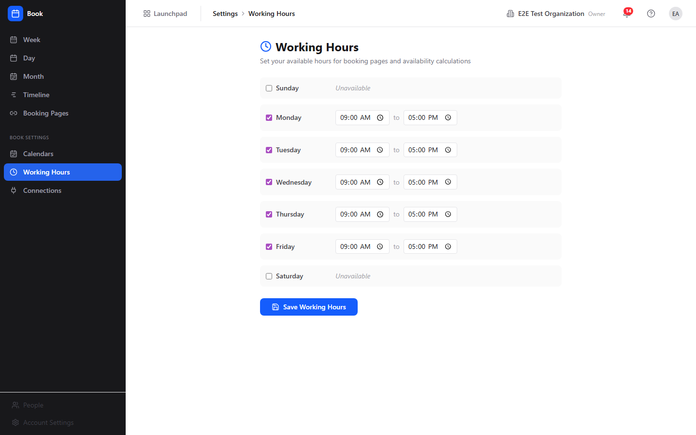
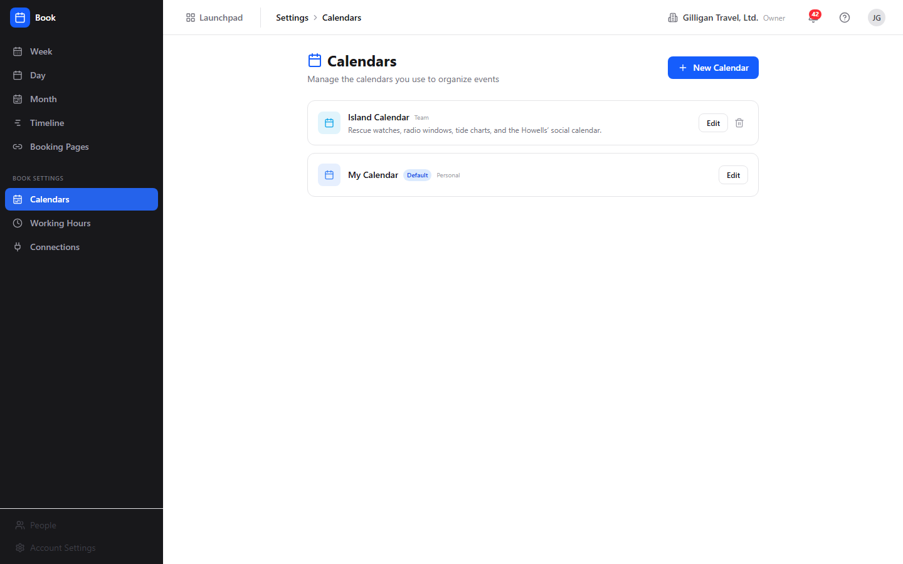

# Book (Scheduling) Guide

# Book - Scheduling

Book is BigBlueBam's scheduling and calendar app. It manages events across multiple calendars, computes availability from your working hours, publishes public booking pages, and gathers Book events alongside Bam task due dates and Bond deal close dates on a cross-app timeline. Every user gets a personal **My Calendar** automatically on first use, so there is nothing to set up before adding events.

## Key Features

- **Calendar views** in week, day, and month layouts, plus a cross-app timeline that groups Book events, Bam task due dates, and Bond deal close dates by day.
- **Events** with title, time, location, description, status, and a Show as (free/busy/tentative/out-of-office) setting that drives availability. Cancelling is a soft delete, and every Book-native event gets a LiveKit huddle room.
- **Multiple calendars** per user, each with a type, color, and timezone. The default **My Calendar** cannot be deleted.
- **Working hours** set per day of the week. These windows minus your busy events produce the free slots used for availability and booking pages.
- **Booking pages** that publish a public scheduling link at `/book/meet/<slug>` with duration, buffers, and brand styling. Creating, listing, editing, and deleting pages all work, and the public booking flow lets a visitor pick a slot and book; each booking creates or updates a matching Bond contact by email.
- **Availability and find-a-meeting-time**, including multi-person and mixed human-plus-agent rosters, exposed through MCP tools.
- **iCal feed** that exposes a single calendar as a token-authenticated `.ics` URL through the API.

## Integrations

Events can link to a Bam task, a Bond deal, or a Helpdesk ticket. The timeline pulls Bam task due dates and Bond deal close dates next to Book events. A public booking creates or updates a matching Bond contact by email when the page has `auto_create_bond_contact` on (the default). Book publishes five Bolt automation events from source `book` (`event.created`, `event.updated`, `event.cancelled`, `event.rsvp`, `booking.created`), so Bolt rules can react when an event changes or a booking arrives, for example by posting to a Banter channel. AI agents drive Book through 24 MCP tools and the shared agentic platform (identity and heartbeat, approval queues, visibility preflight, and policy-governed tool access), letting them create events, find meeting times across people, and manage booking pages. External calendar connections (Google, Microsoft) are modeled in the backend but two-way sync is not yet implemented.

## Getting Started

Open Book from the Launchpad at `/book/`. Sign in to BigBlueBam first if prompted; Book has no login of its own. Your **My Calendar** is created automatically. Set your working hours under **Book Settings > Working Hours**, then create events from any calendar view with **New Event**. Publish a booking page under **Booking Pages** when you want outside people to schedule time, and use the **Timeline** to see the week across Book, Bam, and Bond.

## Walkthrough

### Week View

### Month View

### Timeline

### Booking Pages

### Working Hours

### Calendars

## MCP Tools

# book MCP Tools

| Tool | Description | Parameters |
|------|-------------|------------|
| `book_cancel_event` | Cancel a calendar event (sets status to cancelled).  | `id` |
| `book_create_booking_page` | Create a public booking page (scheduling link). | `slug`, `title`, `duration_minutes` |
| `book_create_calendar` | Create a calendar in the caller\ | `color`, `calendar_type`, `timezone`, `project_id` |
| `book_create_event` | Create a calendar event with optional attendees.  | `calendar_id`, `title`, `start_at`, `end_at`, `location`, `meeting_url`, `all_day`, `attendees`, `email`, `user_id` |
| `book_delete_booking_page` | Delete a public booking page (scheduling link). | `id` |
| `book_delete_calendar` | Delete a calendar.  | `id` |
| `book_delete_connection` | Remove an external calendar connection (Google/Microsoft). | `id` |
| `book_find_meeting_time` | AI-assisted: find optimal meeting times for a set of attendees. Returns up to 3 suggested slots. Each entry in  | `user_ids`, `duration_minutes`, `start_date`, `end_date` |
| `book_find_meeting_time_for_users` | Find meeting-time slots across a mixed roster of humans and agents/service accounts. Agents/service accounts have no calendars; when respect_working_hours_for_humans_only is true (default) they are treated as unconditionally available and skipped from conflict detection. Each entry in user_ids accepts a UUID or an email address. Returns slots with per-attendee availability annotations so the caller can render  | `user_ids`, `duration_minutes`, `window`, `since`, `until`, `respect_working_hours_for_humans_only`, `timezone` |
| `book_get_availability` | Get available time slots for a user in a date range.  | `user_id`, `start_date`, `end_date` |
| `book_get_event` | Get a single calendar event by ID, including attendees and linked-entity context. | `id` |
| `book_get_team_availability` | Get available time slots for multiple users to find common free times. Each entry in  | `user_ids`, `start_date`, `end_date` |
| `book_get_timeline` | Get aggregated cross-product timeline with Book events, Bam tasks, sprints, and more. | `start_date`, `end_date` |
| `book_get_working_hours` | Get the caller | none |
| `book_list_booking_pages` | List the caller | none |
| `book_list_calendars` | List the caller | `calendar_type` |
| `book_list_connections` | List the caller | none |
| `book_list_events` | List calendar events in a date range, optionally filtered by calendar IDs. | `start_after`, `start_before`, `calendar_ids`, `limit` |
| `book_rsvp_event` | Accept, decline, or mark tentative for a calendar event on behalf of the current user.  | `event_id`, `response_status` |
| `book_set_working_hours` | Replace the caller | `hours`, `day_of_week`, `start_time`, `end_time`, `timezone`, `enabled` |
| `book_sync_connection` | Force an immediate sync of an existing external calendar connection. | `id` |
| `book_update_booking_page` | Update a public booking page. Provide only the fields to change. Set  | `id`, `slug`, `title`, `duration_minutes`, `buffer_before_min`, `buffer_after_min`, `max_advance_days`, `min_notice_hours`, `color`, `logo_url`, `confirmation_message`, `redirect_url`, `auto_create_bond_contact`, `auto_create_bam_task`, `bam_project_id`, `enabled` |
| `book_update_calendar` | Update a calendar\ | `id`, `color`, `timezone` |
| `book_update_event` | Update an existing calendar event.  | `id`, `title`, `start_at`, `end_at`, `location`, `status` |

## Related Apps

- [Bolt (Workflow Automation)](../bolt/guide.md)
- [Bond (CRM)](../bond/guide.md)
- [Bureau](../bureau/guide.md)
