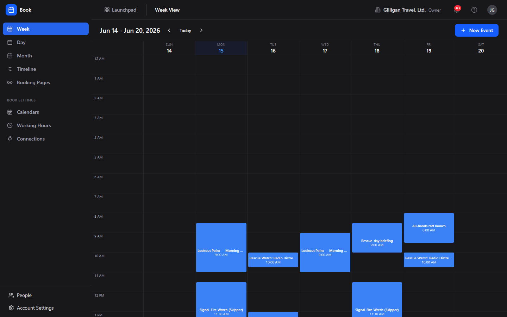
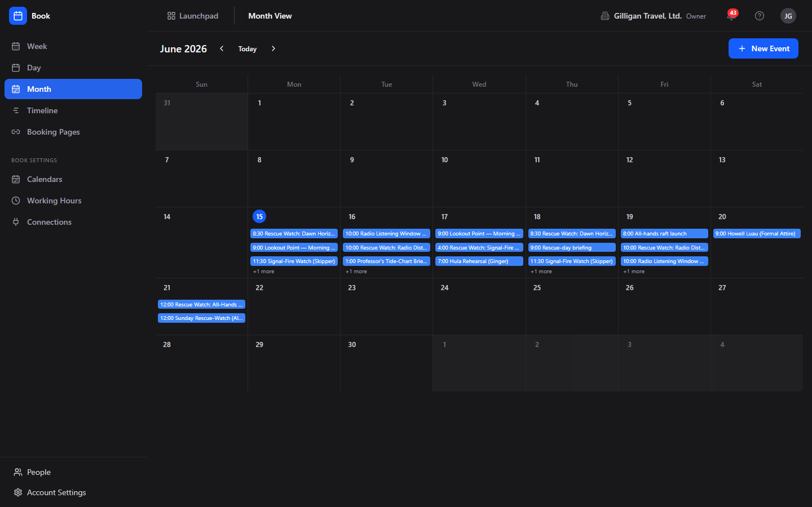
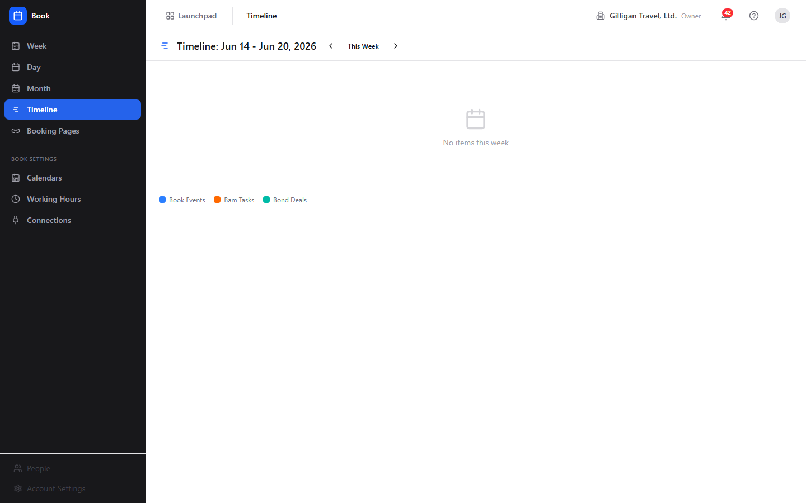

# Book (Scheduling)

Team calendars, availability, and public booking links in one place.

- Week, day, month, and a cross-app timeline that pulls Book events alongside Bam task and Bond deal dates
- Working hours that feed availability and public booking pages at /book/meet/<slug>
- Find-a-meeting-time across several people, including mixed human-and-agent rosters
- Subscribe to any external `.ics` calendar feed and have its events flow into Book automatically
- Driven by 25 MCP tools so AI agents can create events, find times, and manage booking pages
- Reach your team without scheduling: the persistent Bureau presence dock lets you see who is around and start a voice or video huddle from anywhere in Book

## See It in Action

---

Part of the [BigBlueBam](/) productivity suite.
