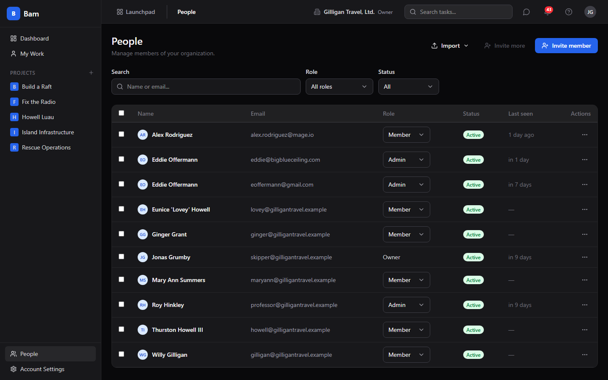
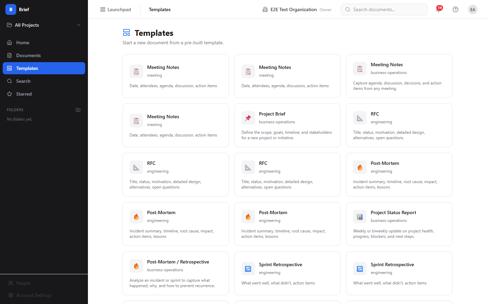
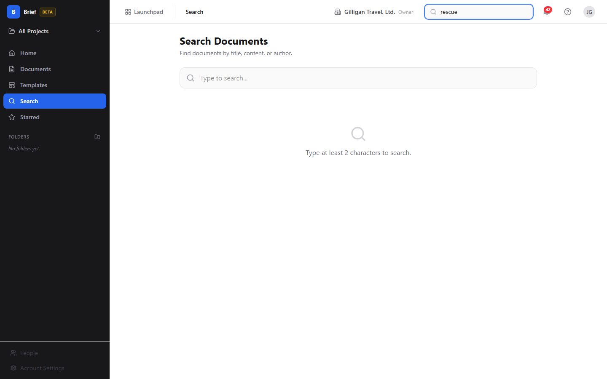

# Brief - Collaborative documents with real-time editing

> Brief is your team's collaborative document editor: a place to write, format,
> co-edit, comment on, and organize documents, then promote the ones that
> matter into your knowledge base. Reach for it when you need a shared,
> structured document that more than one person works on at once.

## Overview

Brief stores your team's writing as **Documents**. Each document has a title, a
URL slug, an optional icon, a rich-text body, a status, a visibility level, an
optional project, and an optional folder. Documents are edited in a rich-text
editor (built on Tiptap) with a formatting toolbar and slash commands, and two
or more people can type in the same document at the same time with live cursors.

Beyond writing, Brief organizes documents into **Folders** and scopes them to
**Projects**, keeps numbered **Versions** as you publish, supports threaded and
text-anchored **Comments** for review, lets you **Star** documents for quick
access, and can **Promote** a finished document into a Beacon knowledge-base
article. Documents can also be **Linked** to Bam tasks and Beacon articles so
related work stays connected.

Brief is part of the BigBlueBam suite. It shares your platform login with Bam
and the other apps, pulls its project list from Bam, and publishes events to
Bolt so automations can react when a document is created, updated, published, or
promoted. Search runs as keyword search over titles and body text, with optional
semantic search when a vector store is configured.

Brief is currently in BETA. The sidebar header shows a `beta` badge.

### Key concepts

- **Document** - A single piece of writing. It has a title, a globally unique
  slug, an optional icon (up to 2 characters), a rich-text body, a word count, a
  status, a visibility, an optional project, and an optional folder.
- **Editor** - The Tiptap rich-text surface where you write. It has a formatting
  toolbar, slash commands (type `/`), a live word count, a Table of Contents
  built from your headings, and a Settings sidebar for icon, visibility,
  project, and starting template.
- **Status** - The document's place in its lifecycle. The four statuses are
  **Draft**, **In Review**, **Approved**, and **Archived**. New documents start
  as Draft. Saving a draft keeps it Draft; publishing sets it to Approved. There
  is no button in the editor that sets In Review today; that status is set only
  through the API or an agent (see Working with AI agents).
- **Visibility** - Who can see the document. There are three valid levels:
  **Organization** (all org members), **Project** (the creator, collaborators,
  or members of that project), and **Private** (the creator and collaborators
  only). The editor's Visibility menu also lists a "Public" option, but Public
  is not a valid setting and selecting it produces a validation error; choose
  Organization, Project, or Private instead (see Set visibility).
- **Folder** - A named container for documents. Folders can be nested and can be
  scoped to a project. You create folders from the sidebar; renaming and deleting
  folders is not available in the UI today (an agent can do both, see Working
  with AI agents).
- **Project scope** - A filter in the sidebar that limits the documents and
  folders you see to one project, or shows everything with "All Projects".
- **Version** - A numbered snapshot of a document. Versions are listed read-only
  in the document detail sidebar; creating and restoring versions is done through
  the API or an agent (see Working with AI agents).
- **Comment** - A note on a document. Comments can be threaded (a reply to
  another comment) and can be anchored to a span of text. Comments can be marked
  resolved and appear in the detail sidebar.
- **Star** - A per-user bookmark on a document. Starred documents show on the
  Home and Starred screens.
- **Template** - A pre-built starting point for a new document. You pick a
  template from the Templates screen and the editor pre-fills with its content.
- **Link** - A typed connection from a document to a Bam task or a Beacon
  article. Links show read-only under "Linked Items" in the detail sidebar;
  creating links is done through an agent or the API (see Linked Items).
- **Promote to Beacon** - Graduating a finished document into a Beacon
  knowledge-base article. This is one-way: once promoted, the document records
  the Beacon it became.
- **Real-time collaboration** - Two or more people editing the same document at
  once. You see other editors' cursors and presence while you type, and readers
  on the detail page see edits appear live.

### Where to find it

Brief lives at `/brief/`. You must be logged in to BigBlueBam first; Brief has
no login of its own and uses the shared platform session. If you are not signed
in, Brief shows a gate page with a link to the BigBlueBam login at `/b3/`.

The left sidebar has five navigation items: **Home** (`/`), **Documents**
(`/documents`), **Templates** (`/templates`), **Search** (`/search`), and
**Starred** (`/starred`). Below the nav is a **Folders** section with a button
to add a folder, and a project-scope selector at the top of the sidebar that
shows the active project name or **"All Projects"**.

What you can do depends on your role and on each document's visibility. Editing a
document requires edit access: you are the document's creator, or a SuperUser, or
an org Admin or Owner (admins and owners can edit any document in the org).
Creating documents, folders, and links, and promoting to Beacon, each require
the matching permission and the `read_write` scope on your session or API key.

Press the `?` key (when your cursor is not in a text field) to open the in-app
help from any Brief screen.

## Feature reference

### Home

The Home screen welcomes you and gives quick entry points into Brief. It lives at
`/brief/` and shows three stat cards, four quick-action cards, and lists of your
recent and starred documents.

What you see:

1. A header reading "Brief" and "Welcome to Brief, your team's collaborative
   document editor."
2. Three stat cards: **Total Documents**, **In Review**, and **Recently
   Updated**. Each card links to the Documents list when clicked. Note: the
   "Recently Updated" card always reads 0 today; use the Documents list sorted by
   update time to find recent work.
3. Four quick-action cards: **New Document** (opens the editor at `/new`),
   **Browse** (opens the Documents list), **Search** (opens Search), and
   **Templates** (opens the Templates browser).
4. A **Recent Documents** list of up to 8 documents and a **Starred Documents**
   list of up to 5, each row showing the icon, title, author, and status.

### Browse the document list

The Documents list shows every document you can see, with filters. It lives at
`/documents`.

To browse and filter documents:

1. Open **Documents** from the sidebar.
2. Use the **"Search documents..."** box in the toolbar to filter the visible
   cards by title text.
3. Use the status chips - **All**, **Draft**, **In Review**, **Approved**,
   **Archived** - to filter by status.
4. The toolbar shows the current scope as "Showing docs for: &lt;project&gt;" or
   "Showing all org documents", set by the sidebar project-scope selector. If you
   arrived through a folder, a folder filter chip appears with an X to clear it.
5. Click any document card to open its detail page. Each card shows the icon,
   title, a star if pinned, the author, a relative time, the word count, and a
   status badge.
6. If there are more results, click **Load more** to page through them.

If no documents match, the list shows "No documents yet. Create your first one."

### Create a document

You create documents in the editor, either blank or from a template.

To create a new document:

1. Click **New Document** on Home, or **New Document** in the Documents toolbar.
   This opens the editor at `/new`.
2. Type a title in the **"Document title..."** field at the top.
3. Write your content in the body. Use the toolbar, slash commands, or both (see
   Write and format).
4. Optionally set the icon, visibility, project, and starting template in the
   right sidebar (see Set visibility, Choose a project, and Start from a
   template).
5. Click **Save Draft** to save it as a Draft, or **Publish** to save it as
   Approved.

When you save, Brief takes you to the new document's detail page.

### Write and format

The editor gives you a formatting toolbar, slash commands, and inline embeds.

To format text with the toolbar:

1. In the editor, select the text you want to format.
2. Use the toolbar to apply a block style (**Paragraph**, **Heading 1** through
   **Heading 4**), inline styles (**Bold**, **Italic**, **Underline**,
   **Strikethrough**, **Inline code**), alignment (**left**, **center**,
   **right**), **Highlight**, lists (**Bullet**, **Ordered**, **Task** list),
   **Blockquote**, or **Code block**.
3. To add a link, click the link button, type a URL, and click **Add**. To add
   an image, click the image button and provide a URL when prompted. Use
   **Insert table (3x3)** to drop in a table and the horizontal-rule button for a
   divider.
4. Use **Undo** and **Redo** to step backward or forward.

To use slash commands:

1. In the body, type `/` on a new line.
2. Pick from the menu: **Heading 1**, **Heading 2**, **Heading 3**, **Bullet
   List**, **Numbered List**, **Task List**, **Code Block**, **Blockquote**,
   **Horizontal Rule**, **Table**, or **Image**.

The footer shows a live word count as you type. The right sidebar shows a
**Table of Contents** built from your headings.

Note: the editor renders task-embed, mention, callout, beacon-embed, and
channel-link nodes if a document already contains them, but the toolbar and slash
menu do not include a control to insert a Beacon embed or a mention.

### The "Brief summary (optional)" field

Below the toolbar the editor shows a **"Brief summary (optional)..."** input.
This field is not stored by Brief today; anything you type in it is dropped on
save and will not appear on the document later. Treat it as non-functional and
put any summary text in the document body instead.

### Set visibility

Visibility controls who can open a document. You set it in the editor's right
sidebar under **Settings**.

To set visibility:

1. In the editor, find the **Visibility** menu in the right sidebar.
2. Choose **Organization** (all org members), **Project** (creator,
   collaborators, or project members), or **Private** (creator and collaborators
   only).
3. Save or publish the document.

Do not choose **Public**. The menu lists it, but Public is not a valid value and
selecting it makes the save fail with a validation error. The three valid
choices are Organization, Project, and Private. New documents default to
Organization in the editor.

### Set an icon

To give a document an icon:

1. In the editor's right sidebar under **Settings**, find **Icon (emoji)**.
2. Type a short emoji or up to 2 characters.
3. Save or publish. The icon shows on cards, lists, and the detail header.

### Choose a project

You can scope a new document to a project so it appears under that project's
filter.

To choose a project for a new document:

1. In the editor's right sidebar, find **Project (optional)** (shown only when
   creating, not when editing an existing document).
2. Choose a project, or choose **Organization-wide (no project)** to leave it
   unscoped.
3. Save or publish.

### Start from a template

Templates give you a pre-built starting point.

To start a document from a template:

1. Open **Templates** from the sidebar. Each card shows an icon, name, category,
   and description.
2. Click a template card. Brief opens the editor pre-filled with that template's
   content.
3. Finish writing and click **Save Draft** or **Publish**.

Alternatively, when creating a blank document you can pick a template from the
**Start from template** menu in the editor sidebar (choose **Blank document** for
none).

If there are no templates, the Templates screen shows "No templates available
yet." with "Templates can be created by administrators." There is no
template-authoring screen in Brief today; templates come from the API, an agent,
or seed data. An agent can create, update, and delete org-level templates (see
Working with AI agents).

### Save a draft and publish

The editor has two save buttons in the header.

- **Save Draft** keeps the document's status as Draft.
- **Publish** sets the document's status to Approved.

To publish a document:

1. In the editor, finish your title and content.
2. Click **Publish**. The status becomes Approved and Brief returns you to the
   document detail page.

A title is required before either button is enabled.

### Read a document

The document detail page shows the document and its metadata. It lives at
`/documents/:idOrSlug`.

What you see:

1. A header with the icon, title, status badge, a star toggle, and an **Edit**
   button that opens the editor.
2. The document body. While someone is editing, readers see edits appear live.
   If a document has no content, the body shows "No content yet."
3. An action bar with **Duplicate**, **Export**, **Promote to Beacon**, and
   **Archive** (or **Restore** when the document is archived).
4. A right sidebar with **Status**, **Author**, **Project** (or
   "Organization-wide" if none), **Created**, **Last Updated**, **Published**
   (when present), **Word Count**, **Version**, **Linked Items**, and
   **Comments**.

Note: the **Published** date and the **Version** number are not stored by Brief
today, so the Published row may be absent and the Version button can read
"vundefined". The version list that expands underneath it is populated only if
versions were created through the API or an agent.

### Edit an existing document and co-edit in real time

To edit a document:

1. Open the document and click **Edit**, or open it directly at
   `/documents/:idOrSlug/edit`.
2. Make your changes. Your edits sync live to anyone else in the same document.
3. The header shows presence chips for everyone currently editing.
4. Click **Save Draft** or **Publish** when done.

When two or more people open the same document's editor, each sees the others'
cursors and presence, and readers on the detail page see the changes as they
happen. Brief uses a conflict-free shared editing model (Yjs) over the
`/brief/ws` WebSocket, so concurrent edits merge without overwriting each other.

### Comments

Comments let your team review a document in the detail sidebar. A comment can be
a top-level note, a threaded reply, or anchored to a span of text.

To add a comment:

1. Open the document.
2. In the right sidebar under **Comments (N)**, type into the **"Add a
   comment..."** box.
3. Click **Comment**.

To resolve a comment, use the **Resolve** control on the comment. The comment's
author, or an org Admin or Owner or SuperUser, can delete a comment.

### Star a document

Starring bookmarks a document for quick access from Home and Starred.

To star or unstar a document:

1. Open the document.
2. Click the star button in the header. Its tooltip reads **Star document** when
   not starred and **Remove star** when it is.
3. Find your starred documents on the **Starred** screen and in the Starred list
   on Home.

### Duplicate a document

To make a copy:

1. Open the document.
2. Click **Duplicate** in the action bar. Brief creates a Draft copy named
   "&lt;title&gt; (copy)" and opens it.

### Export a document

To export a document to a file:

1. Open the document (or open it in the editor).
2. Click **Export** in the action bar or editor header.
3. Choose **Markdown (.md)** or **HTML (.html)**. The file downloads.

### Archive and restore

Archiving hides a document from normal lists; you can restore it later.

To archive a document:

1. Open the document.
2. Click **Archive** in the action bar.

To restore an archived document:

1. Filter the Documents list by the **Archived** status chip and open the
   document, or open it by URL.
2. Click **Restore** in the action bar. The document returns to Draft status.

### Promote to Beacon

When a document is ready to become lasting knowledge, promote it into a Beacon
article.

To promote a document:

1. Open the document.
2. Click **Promote to Beacon** in the action bar.
3. Brief creates a Beacon article from the document and takes you to it at
   `/beacon/<id>`.

Promotion is one-way; a document that has already been promoted cannot be
promoted again.

### Linked Items

The detail sidebar shows a read-only **Linked Items** section listing the Bam
tasks and Beacon articles connected to the document. Task links open in Bam at
`/b3/tasks/:id` and Beacon links open in Beacon.

There is no button in the Brief UI to create or remove a link. Links are created
and removed through an agent or the API (see Working with AI agents).

### Folders and project scope

Folders and the project-scope selector live in the sidebar and filter what you
see.

To create a folder:

1. In the sidebar **Folders** section, click the add (+) button.
2. Type a name in the inline **"Folder name"** input.
3. Press Enter to save, or Escape to cancel.

To filter by project scope:

1. Click the project-scope selector at the top of the sidebar.
2. Choose **All Projects** or a specific project. Documents and folders filter to
   that scope.

Renaming, moving, and deleting folders are not available in the Brief UI today;
an agent or the API can do all three (see Working with AI agents).

### Search

Search finds documents by title, body content, or author.

To search:

1. Open **Search** from the sidebar, or click the **"Search documents..."** box
   in the header (which opens the Search screen).
2. Type at least 2 characters in the **"Type to search..."** box.
3. Results list each document's title, creator, time, and status. Click a result
   to open it.

If you type fewer than 2 characters, Search shows "Type at least 2 characters to
search." If nothing matches, it shows "No documents found for &quot;&lt;query&gt;&quot;."

Note: search results do not currently show a body excerpt under each title.
Keyword search matches against the title and body text.

### Working with AI agents

Agents work with Brief through the Model Context Protocol (MCP). Brief exposes 48
MCP tools that span the entire app: documents, search, comments, versions, links,
collaborators, embeds, templates, and folders. Each tool forwards your bearer
token, so an agent can only do what your account is allowed to do, and write
tools require the `read_write` scope. Brief enforces Organization, Project, and
Private visibility on the server regardless of how a tool is called.

Many of these tools have no human button in Brief. They are the only way to do
things like append content, set the **In Review** status, create or remove links,
manage collaborators, author templates, or rename and delete folders.

Authoring and maintenance:

- `brief_create` creates a document (title, project, folder, template, markdown
  content, visibility).
- `brief_update_content` replaces the document body; `brief_append_content` adds
  to the end of it. `brief_append_content` has no human button, so appending is
  agent or API only.
- `brief_update` changes metadata such as title, status, visibility, folder,
  icon, and pinned. This is the only way to set the **In Review** status, which
  has no control in the editor.
- `brief_archive`, `brief_restore`, `brief_duplicate`, and `brief_star` cover the
  lifecycle and bookmarking actions.

Search and reading:

- `brief_list`, `brief_get`, `brief_recent`, `brief_starred`, and `brief_stats`
  cover listing, opening, and counting documents. `brief_search` runs the keyword
  search; `brief_semantic_search` runs vector search and falls back to full-text
  search when the vector index is unavailable. Brief is also a registered source
  for the platform-wide `search_everything` tool.

Review:

- `brief_comment_list`, `brief_comment_add`, `brief_comment_resolve`,
  `brief_comment_edit`, and `brief_comment_delete` cover reading, adding,
  resolving, editing, and deleting comments. `brief_comment_react` and
  `brief_comment_unreact` add and remove emoji reactions, which have no UI.

Versions:

- `brief_versions` lists versions, `brief_version_get` fetches one,
  `brief_version_create` records a named snapshot, `brief_version_restore`
  restores a version, and `brief_version_diff` computes a line-by-line diff
  between two versions. There is no human button to create, restore, or diff
  versions, so version management is agent or API only.

Export:

- `brief_export_markdown` and `brief_export_html` return the document as Markdown
  or as a standalone styled HTML page, the same content the **Export** button
  downloads.

Cross-app links and graduation:

- `brief_links_list` lists every task and Beacon link on a document.
  `brief_link_task` creates a link to a Bam task (by UUID or by a human reference
  like FRND-42); `brief_link_beacon` creates a link to a Beacon article;
  `brief_link_remove` removes either kind. These tools are the only way to create
  or remove links, since "Linked Items" is read-only in the UI.
- `brief_promote_to_beacon` graduates a document into a Beacon article, the same
  action as the **Promote to Beacon** button.

Sharing, organizing, and templates:

- `brief_collaborators_list`, `brief_collaborator_add`,
  `brief_collaborator_update`, and `brief_collaborator_remove` manage per-document
  collaborators with **view**, **comment**, or **edit** permission. Brief has no
  share dialog, so collaborator management is agent or API only; to share a single
  document with specific people, use these tools or set the document's visibility
  to Project or Organization.
- `brief_folders_list`, `brief_folder_create`, `brief_folder_update`, and
  `brief_folder_delete` manage the folder tree. The UI can only create folders, so
  renaming, moving, and deleting are agent or API only.
- `brief_templates_list`, `brief_template_create`, `brief_template_update`, and
  `brief_template_delete` manage org-level templates. There is no
  template-authoring screen, so template CRUD is agent or API only.
- `brief_embeds_list` and `brief_embed_delete` read and remove embedded file
  records.

Cross-cutting agent platform. Brief plugs into the suite-wide agentic surfaces
that every app shares:

- **Identity and heartbeat.** Agent and service accounts are first-class:
  `agent_heartbeat`, `agent_self_report`, and `agent_audit` let a runner announce
  itself and report its activity, and every write an agent makes is stamped with
  its actor type in the unified activity log.
- **Approvals.** When a change should pause for a human, agents file it with
  `proposal_create`; a reviewer lists and decides with `proposal_list` and
  `proposal_decide`. This is the safe path for an agent to draft a sensitive
  document, comment, or promotion and wait for sign-off before it lands.
- **Cross-app read plane.** `search_everything` fans out across Brief and the
  other apps, and `resolve_references` turns mentions into resolved entities.
  Brief contributes documents to both.
- **Visibility preflight.** Before posting a Brief document link into a shared
  surface in another app, an agent should call `can_access` for the reader and
  drop anything the reader is not allowed to see. Brief still enforces visibility
  on the server, so this is a courtesy check that avoids dangling links.
- **Policies and webhooks.** Per-agent kill switches and tool allowlists
  (`agent_policies`) gate which `brief.*` tools a given service account may call,
  and outbound webhooks push subscribed Bolt events (such as `document.published`
  and `document.promoted`) to agent runners.

For the full tool catalog see `docs/apps/brief/mcp-tools.md`.

## Working together (live presence)

BigBlueBam treats collaboration as ambient, not as a scheduled meeting. Documents are co-edited live, with each other's cursors and changes appearing as they happen, a presence strip showing who is in the document, and a live call you can start without leaving it. Your location in Brief shows in the Bureau office. Voice and video here are the digital version of bumping into a colleague in the hallway or stopping by their desk: a quick question, a shared look at the same thing, then back to work. Your presence travels with you across the suite through the Bureau virtual office. The Introduction covers the full pervasive-presence model.

## User Stories

### Story: Write your first document and publish it

**Who:** A team member new to Brief.
**Goal:** Create a document, write some content, and publish it.
**Before you start:** You are signed in to BigBlueBam and have the `read_write`
scope.

**Steps**

1. Open Brief at `/brief/`.
2. Click **New Document** on the Home screen.
3. Type a title in the **"Document title..."** field.
4. Write your content in the body, using the toolbar or typing `/` for slash
   commands.
5. In the right sidebar, set **Visibility** to **Organization**, **Project**, or
   **Private**. Do not choose **Public**.
6. Click **Publish**.

**Result:** The document is saved with status Approved and Brief opens its detail
page.

**Related:** Save a draft and publish; Set visibility. An agent can do the same
with `brief_create` followed by `brief_update_content`.

### Story: Start from a template

**Who:** Anyone who wants a structured starting point.
**Goal:** Create a document pre-filled from a template.
**Before you start:** At least one template exists. You have `read_write` scope.

**Steps**

1. Open **Templates** from the sidebar.
2. Click the template card you want.
3. The editor opens pre-filled with the template's content. Add a title and your
   own content.
4. Click **Save Draft** or **Publish**.

**Result:** A new document exists based on the template.

**Related:** Start from a template; Create a document. An agent can author the
template itself with `brief_template_create`.

### Story: Organize documents with folders and project scope

**Who:** Someone keeping a growing set of documents tidy.
**Goal:** Create a folder and scope work to one project.
**Before you start:** You have folder-create permission and `read_write` scope.

**Steps**

1. In the sidebar **Folders** section, click the add (+) button.
2. Type a name in the **"Folder name"** input and press Enter.
3. Click the project-scope selector at the top of the sidebar and choose a
   project so the list and folders filter to it.
4. Create documents while that scope is active; choose the project in the
   editor's **Project (optional)** menu when creating.

**Result:** Your documents are grouped by folder and project and easy to find
through the sidebar filters.

**Related:** Folders and project scope; Browse the document list. An agent can
rename, move, or delete a folder with `brief_folder_update` and
`brief_folder_delete`, which the UI cannot do.

### Story: Co-edit a document in real time

**Who:** Two teammates drafting together.
**Goal:** Edit the same document at the same time and see each other's changes.
**Before you start:** Both have edit access to the document and `read_write`
scope.

**Steps**

1. The first person opens the document and clicks **Edit**.
2. The second person opens the same document and clicks **Edit**.
3. Both type. Each sees the other's cursor and a presence chip in the header.
4. Anyone reading the document on its detail page sees the edits appear live.
5. When finished, click **Save Draft** or **Publish**.

**Result:** Both edits merge into one document with no overwriting, and readers
saw the changes as they happened.

**Related:** Edit an existing document and co-edit in real time.

### Story: Find a document

**Who:** Anyone who knows roughly what they are looking for.
**Goal:** Locate a document by title, content, or author.
**Before you start:** You are signed in.

**Steps**

1. Open **Search** from the sidebar, or click the **"Search documents..."** box
   in the header.
2. Type at least 2 characters in the **"Type to search..."** box.
3. Read the results and click the one you want.

**Result:** Brief opens the matching document.

**Related:** Search; Browse the document list. An agent can search with
`brief_search`, or `brief_semantic_search` for a meaning-based match.

### Story: Review a document with comments

**Who:** A reviewer giving feedback.
**Goal:** Leave a comment and have it resolved.
**Before you start:** You can see the document. The author or an admin can
resolve.

**Steps**

1. Open the document.
2. In the right sidebar under **Comments**, type into the **"Add a comment..."**
   box.
3. Click **Comment**.
4. When the feedback is addressed, the author or an admin clicks **Resolve** on
   the comment.

**Result:** The comment is recorded on the document and marked resolved when
done.

**Related:** Comments. An agent can use `brief_comment_add` and
`brief_comment_resolve`, and can anchor a comment to a span of text with the
`anchor_text` option.

### Story: Star a document for quick access

**Who:** Anyone with documents they return to often.
**Goal:** Bookmark a document so it is one click away.
**Before you start:** You can see the document.

**Steps**

1. Open the document.
2. Click the star button in the header (tooltip **Star document**).
3. Open the **Starred** screen, or the Starred list on Home, to find it again.

**Result:** The document appears in your Starred views.

**Related:** Star a document. An agent can toggle the star with `brief_star`.

### Story: Duplicate a document to reuse its structure

**Who:** Someone who wants to start from an existing document.
**Goal:** Make an editable copy.
**Before you start:** You can see the source document.

**Steps**

1. Open the document.
2. Click **Duplicate** in the action bar.
3. Brief opens the new copy, named "&lt;title&gt; (copy)" and set to Draft.

**Result:** A draft copy exists for you to edit independently.

**Related:** Duplicate a document. An agent can use `brief_duplicate`, optionally
copying into a different project.

### Story: Export a document to a file

**Who:** Anyone who needs the document outside Brief.
**Goal:** Download the document as Markdown or HTML.
**Before you start:** You can see the document.

**Steps**

1. Open the document, or open it in the editor.
2. Click **Export**.
3. Choose **Markdown (.md)** or **HTML (.html)**.

**Result:** The file downloads to your machine.

**Related:** Export a document. An agent can fetch the same content with
`brief_export_markdown` or `brief_export_html`.

### Story: Archive a document and restore it later

**Who:** Someone clearing out finished or obsolete documents.
**Goal:** Remove a document from normal views without deleting it, then bring it
back.
**Before you start:** You have edit access to the document.

**Steps**

1. Open the document and click **Archive** in the action bar.
2. To find it later, filter the Documents list by the **Archived** status chip.
3. Open the archived document and click **Restore**.

**Result:** The document is hidden while archived and returns to Draft status
when restored.

**Related:** Archive and restore. An agent can use `brief_archive` and
`brief_restore`.

### Story: Promote a document into Beacon knowledge

**Who:** Someone graduating a finished document into the knowledge base.
**Goal:** Turn a Brief document into a Beacon article.
**Before you start:** The document is not already promoted, and you have the
promote permission and edit access.

**Steps**

1. Open the document.
2. Click **Promote to Beacon** in the action bar.
3. Brief creates the Beacon article and opens it at `/beacon/<id>`.

**Result:** The document is recorded as promoted and a matching Beacon article
exists.

**Related:** Promote to Beacon. An agent can use `brief_promote_to_beacon`.

### Story: Link a spec document to a task (agent driven)

**Who:** An agent connecting a specification document to the work that
implements it.
**Goal:** Attach a Brief document to a Bam task so it shows under Linked Items.
**Before you start:** The agent has `read_write` scope and access to both the
document and the task. Linking has no human UI.

**Steps**

1. The agent calls `brief_link_task` with the document (by UUID, slug, or exact
   title) and the task (by UUID or a human reference like FRND-42), choosing a
   link type such as `spec`.
2. The link is created.
3. A human opening the document sees it under **Linked Items** in the detail
   sidebar; clicking it opens the task in Bam.

**Result:** The document and task are connected and the relationship is visible
to readers.

**Related:** Linked Items; Working with AI agents. An agent can also link a
Beacon article with `brief_link_beacon` and remove either link with
`brief_link_remove`.

### Story: Snapshot and restore a version (agent driven)

**Who:** An agent or integration maintaining version history.
**Goal:** Record a numbered snapshot of a document and roll back to it later.
**Before you start:** The agent has edit access and `read_write` scope. There is
no human button for this.

**Steps**

1. The agent calls `brief_version_create` with an optional label and change
   summary to record a snapshot.
2. A human opening the document sees the snapshot listed read-only under
   **Version** in the detail sidebar.
3. To roll back, the agent calls `brief_version_restore` with the target version,
   which restores the content and records a "Restored from version N" snapshot.

**Result:** The document has a versioned history and can be returned to an
earlier state.

**Related:** Read a document; Working with AI agents. An agent can compare two
snapshots with `brief_version_diff`.

### Story: Agent authors a document end to end

**Who:** An automation that produces and files a document.
**Goal:** Create, fill, link, and graduate a document without a human in the
editor.
**Before you start:** The agent has `read_write` scope and the relevant
permissions.

**Steps**

1. The agent calls `brief_create` with a title and visibility.
2. It fills the body with `brief_update_content`, or builds it incrementally with
   `brief_append_content`.
3. It connects the document to related work with `brief_link_task`.
4. When the document is ready as knowledge, it calls `brief_promote_to_beacon`.

**Result:** A complete, linked document exists, and a Beacon article was created
from it, all without manual editing.

**Related:** Working with AI agents; Promote a document into Beacon knowledge. If
the promotion should pause for review, the agent can file a `proposal_create`
first and wait for a human `proposal_decide`.

## Related

- **Bam** - Brief pulls its project list from Bam and links documents to Bam
  tasks. Linked tasks open in Bam at `/b3/tasks/:id`.
- **Beacon** - Documents promote into Beacon knowledge-base articles, and
  documents can be linked to Beacon articles. See `docs/apps/beacon/help.md`.
- **Bolt** - Brief publishes `document.created`, `document.updated`,
  `document.published`, and `document.promoted` events (source `brief`) so Bolt
  automations can react.
- Brief's MCP tool catalog: `docs/apps/brief/mcp-tools.md`.
- Brief's product guide: `docs/apps/brief/guide.md`.
</content>
