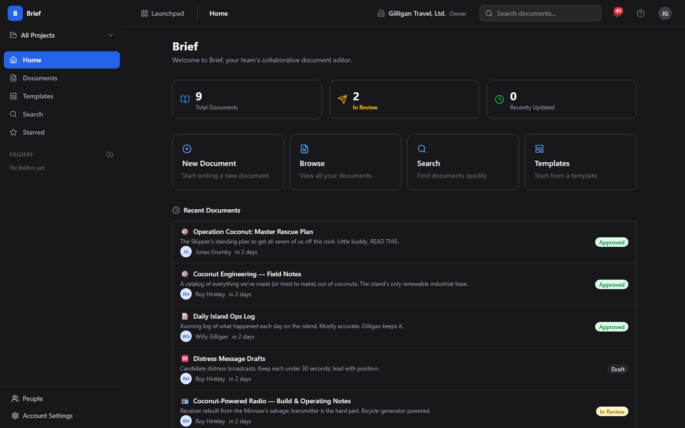
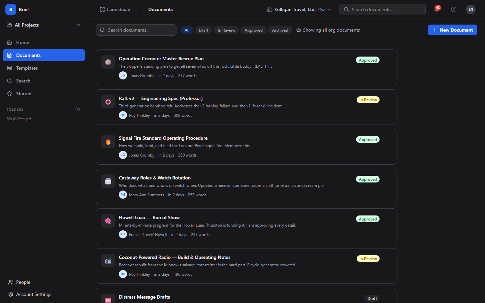
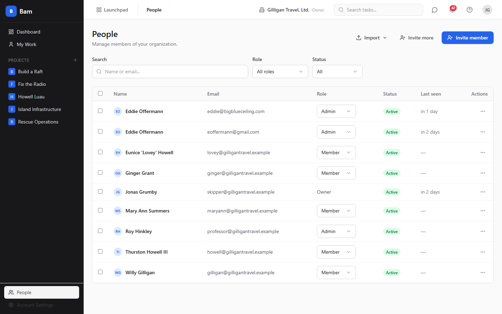

# Brief (Documents)

Real-time collaborative documents that graduate into your knowledge base.

- Rich text editor with slash commands, tables, and a live Table of Contents
- Real-time co-editing with live cursors and presence chips
- Threaded, text-anchored comments and numbered version history for review
- One-click Promote to Beacon, plus 48 MCP tools so agents can author and link documents end to end
</content>

## See It in Action

---

Part of the [BigBlueBam](/) productivity suite.
