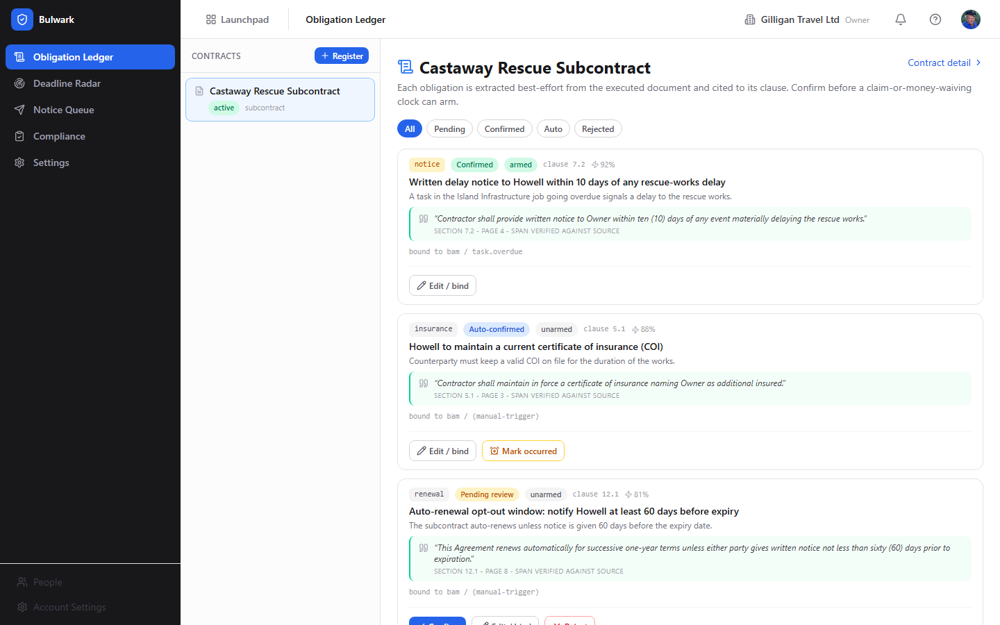
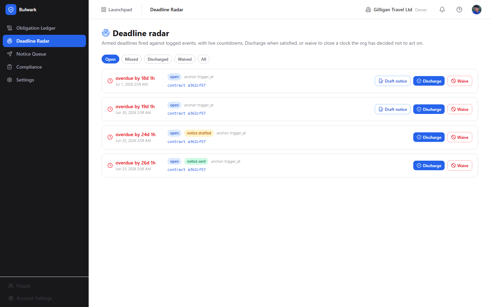

# Bulwark (AI Contract-Obligation Monitor) Guide

# Bulwark - Contract obligations on a live clock

Bulwark is BigBlueBam's contract-obligation monitor: it turns a dense executed contract into a clause-cited ledger of what each party owes and by when, arms a live clock on the obligations that matter, and drafts (never auto-sends) the notices and vendor-compliance chases a human then approves. A signed subcontract buries a five-day claim-notice window and a thirty-day retention release on page nine, and nothing in the suite reads them or starts a countdown. Bulwark is the reader and the clock. Its flagship operation, extract, reads an executed document out of Bin and returns an obligation ledger cited back to the exact clause it came from, so every deadline you watch traces to a verifiable span of the contract. Bulwark owns none of the source data: the document lives in Bin, the counterparty is a Bond or Braid record, the source events come from Bill, Book, and Bam, and outbound mail goes through Blast. It maintains a separate obligation layer that points back at the contract it reads. Reach for it when a missed notice window or a lapsed insurance certificate would cost you a claim.

## Key Features

- **Clause-cited obligation ledger from AI extraction.** Bulwark pulls an executed document out of Bin, uses the internal AI provider to extract every duty each party owes, and cites each obligation back to its clause with a quoted span marked "span verified against source" or "span not verified". A human reviews, edits, confirms, or rejects each one before it can drive anything.
- **Obligations armed against reality, not a guess.** A confirmed obligation binds to a real-world signal - a Bolt event pattern (for example a task going overdue), a manual "this happened" trigger you start by hand, or a fixed contract date - so its deadline clock starts against events as they are actually logged. The card shows an `armed` or `unarmed` badge.
- **Timezone-correct deadlines on a live radar.** When a bound obligation's trigger occurs, Bulwark materializes a deadline anchored in the contract's IANA timezone and counts it down on the Deadline Radar, turning red when it goes overdue. Missed and Voided statuses are set by background sweeps, never by a button.
- **AI-drafted notices in a human approval queue.** Bulwark drafts the notice you would send to protect a claim and lands it in the Notice Queue for a person to approve and send. The model writes only the subject and body; Bulwark fixes the recipient and attachments deterministically at send time, and notice send fails closed until a counterparty is set.
- **Vendor-compliance chasing.** The same drafting pattern tracks the certificates and waivers your lower-tier vendors owe (COI, W-9, lien waiver, certified payroll) on a compliance matrix, and drafts the chase when a document is missing or expiring. Compliance is not its own obligation type; it derives from `flow_down` obligations plus the vendor tiers you define.
- **Safety posture built for claims, not just convenience.** Five claim-or-money-waiving obligation types (`notice`, `lien`, `retention`, `indemnity`, `payment`) never arm on model confidence alone - a human must confirm them. Discharge and waive are deliberately distinct actions, and the whole thing assists but does not replace counsel.
- **AI agent surface** of 16 `bulwark_*` MCP tools covering extract, read, review, bind, trigger, draft, and chase, with `asker_user_id` gating on source-scoped reads, two-step confirmation on destructive tools, and `agent_policies` fail-closed allowlisting. There is no send tool: approving and sending is human-only.

## Integrations

Bulwark reads the executed document owned by **Bin** and never edits it; it references the document by Bin asset id. The counterparty and every lower-tier vendor are **Bond** contacts or companies, resolved to a golden identity by **Braid** where one exists; set the counterparty before any notice can send. Obligations bind to the source Bolt events emitted by **Bill**, **Book**, and **Bam** - the beachhead `task.overdue` binding fires via the durable state-reconcile path because no live `task.overdue` publisher exists yet. Approved notices and chases deliver through **Blast** as transactional sends that bypass unsubscribe. Obligation-lifecycle changes publish `contract.extracted`, `obligation.extracted`, `deadline.approaching`, `waiver.risk_detected`, `notice.drafted`, and `compliance.expiring` events on the `bulwark` source to **Bolt**, so an automation rule can route them into a **Banter** channel, an email, or a webhook. Every drafted notice and chase routes to the shared **agent_proposals** human-in-the-loop queue, where a person approves and sends under a decider kill-switch and a permission re-check. Agents reach Bulwark under an identity with `agent_policies` gating, and reads that surface source records require the human's `asker_user_id` so per-record visibility is enforced for the person the agent acts for.

## Getting Started

1. Open **Bulwark** from the Launchpad (or go to `/bulwark/`). You are signed in already if you are signed in to the suite.
2. On the **Settings** page, set the **Default timezone (IANA)** and the radar lead times, and decide whether to enable **Auto-draft notices during radar sweeps** (off by default). These are owner/admin tunables.
3. On the **Obligation Ledger** page, click **Register** in the **Contracts** rail, give the contract a **Title** and its **Bin asset id**, and set the **Counterparty (bond.company id)** and **Project (job)**. Extraction runs asynchronously; obligations appear in the ledger when it finishes.
4. Work the ledger: read each clause-cited card, **Confirm** the ones that are correct (claim-or-money-waiving types must be confirmed by a human), then **Edit / bind** to arm each obligation against a Bolt event, a manual trigger, or a contract date. Watch the resulting clocks on the **Deadline Radar**, approve notices in the **Notice Queue**, and chase vendors on the **Compliance** matrix.

For the full click-by-click walkthroughs, key concepts, and user stories, see the in-app Help Center (the **?** button), sourced from `docs/apps/bulwark/help.md`.

## Related

- **Bin** - stores the executed contract document and any collected compliance bytes; Bulwark reads it by asset id and never edits it.
- **Bond / Braid** - provide the counterparty and vendor identities (the golden company id); set the counterparty before sending notices.
- **Bill, Book, Bam** - emit the source Bolt events obligations bind to; the beachhead `task.overdue` binding fires via the durable state-reconcile path.
- **Blast** - delivers approved notices and chases as transactional sends.
- **Bolt** - receives Bulwark's obligation-lifecycle events so they can be routed anywhere in the suite, and can fire the events obligations watch.
- **agent_proposals** - the shared human-in-the-loop queue where drafted notices and chases wait for approval.
- **Bulwark MCP-tools reference** - the full `bulwark_*` tool catalog and confirmation behavior; see `docs/reference/mcp-endpoint-mapping.md`.
