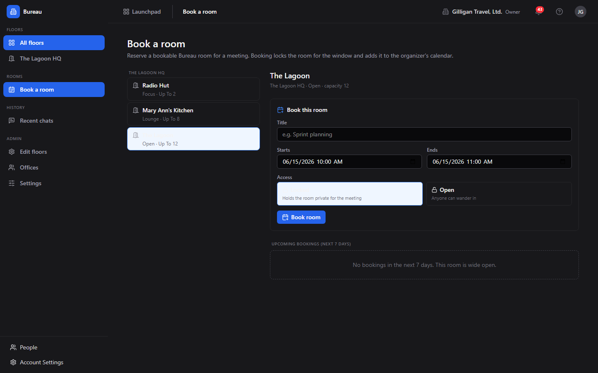
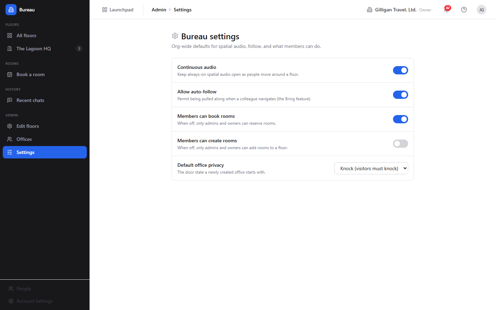
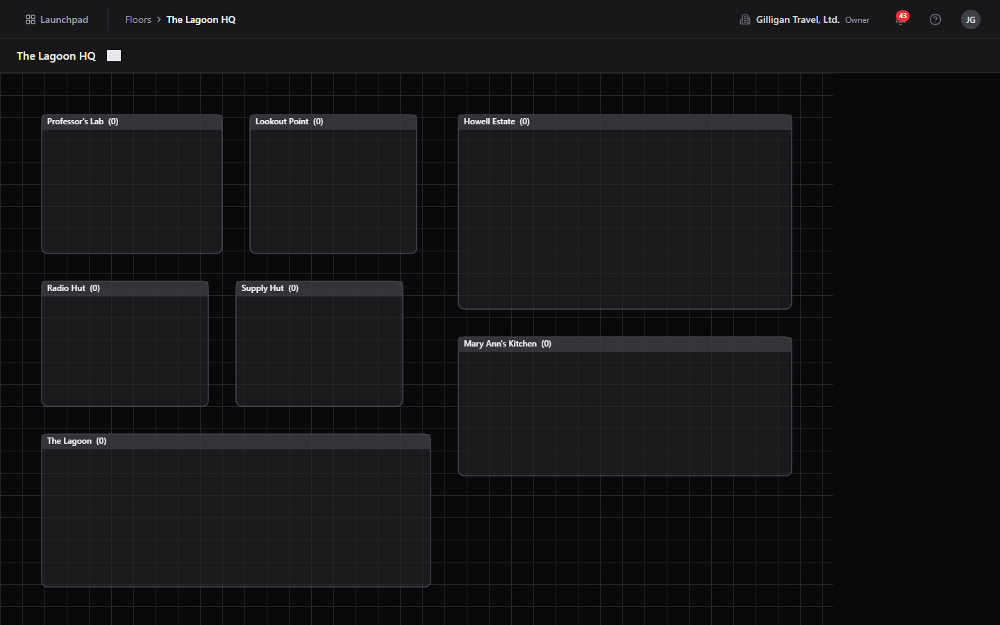

# Bureau Guide

# Bureau - Virtual Office

Bureau is the spatial-presence layer of the BigBlueBam suite. It gives a remote team the feel of a shared office: a set of floors laid out on a canvas, rooms you can walk into, live occupant dots for everyone who is around, and a floating presence widget that follows you into every other app. Where chat tells you what was said, Bureau tells you who is here, whether you can interrupt them, and whether you can all jump to the same screen right now.

The product is built around a small set of objects. A **floor** is one navigable office map. A **room** is an addressable space on a floor, mapped one-to-one to a real-time audio room, in one of eight types from a one-person **office** to a **conference** room or an open **lounge**. Your **presence** is your live state - which room you are in, your status, and the page you are viewing - and it lives on the server, so moving between pages never drops your session. **Door states** (Open, Knock, Private) decide who can walk in, and **knocks**, **summons**, **rings**, and **hunts** are the social moves that connect people across the office.

Bureau is the source of the floating docked box that the rest of the suite shows. That widget is what makes a voice huddle follow you from a Board canvas to a Brief doc, what shows you the "X others here" on any surface, and what carries the one-click Bring everyone here, Invite, and Hunt actions wherever you are.

## Key Features

- **Floor directory and live floor maps.** Browse floors with live occupancy counts, then drop into a Canvas2D map that draws one rectangle per room with a dot for each occupant. Click a room to enter it; the map updates in real time as people move and change status.
- **Move, knock, and admit.** Enter Open rooms freely, knock on closed offices (auto-timed-out after 30 seconds), and triage knocks at your own door with Let in, Not now, or Decline. Head-down DND blocks knocks and offers visitors a leave-a-note path.
- **Summon, Ring, and Hunt.** Bring everyone in your room to a resource in another app, ring one specific person to your screen, or hunt a teammate and jump to wherever they are. Every action is access-checked, so no one is sent a link they cannot open and no one's location leaks through a surface you could not see.
- **Cross-app docked box.** A draggable presence and call console rendered inside every SPA, with mic, camera, screen share, ephemeral room chat, the live door-privacy toggle, and the DND switch.
- **Room booking.** A dedicated Room booking screen lists the org's bookable rooms by floor; pick one, see its upcoming reservations, and book a window with open or locked access. The reservation mirrors to a Book event and schedules jobs that flip the room private at the start and clear it at the end.
- **Live presence and status.** Your status (available, busy, away, dnd, focus, in_meeting) and the room and floor you are in are tracked live, surfaced on the floor map and the docked box, and persisted on the server so they survive a reconnect and apply even when you have no live web session.
- **Recent chats with retention.** Room chats are ephemeral (24 hours by default), but participants can recover transcripts, and admins can extend retention up to a week or pin a thread permanently.
- **Floor and office administration, and org settings.** Org admins build floors on a canvas editor, place rooms and offices, set door defaults and capacities, upload a background underlay, and assign or reassign who owns each personal office. A Bureau settings screen controls org-wide defaults: continuous audio, auto-follow, whether members can book or create rooms, and the default office privacy.

## Integrations

- **Board, Brief, and Bond** are the common summon and ring destinations; each surface carries a huddle the docked box auto-joins, and Board renders the same widget so the canvas call follows you in.
- **Banter** surfaces the same docked box and is the delivery channel for the leave-a-note DND fallback, posting "[Bureau knock note] " direct messages.
- **Book** mirrors every Bureau booking as a calendar event and is cancelled best-effort when the booking is cancelled.
- **Bolt** receives Bureau events (room entry and exit, status changes, knocks, room booked, room locked, summon issued) on the `bureau` source for automation.
- **Bench** rolls up daily floor utilization for reporting.
- **AI agents** treat Bureau as a place they can occupy. Through over 30 `bureau_*` MCP tools they locate people, knock, summon, manage floors and offices, book rooms, and recover chats - all under the same server-side permission checks as the UI, the suite-wide `agent_policies` kill switch and allowlists, and the `can_access` visibility preflight before any cross-app result is posted.

## Getting Started

1. Sign in to BigBlueBam, then open Bureau at `/bureau/`. Bureau shares your Bam session.
2. On the **Floors** landing, click a floor card to open its live map.
3. Click an Open room rectangle to enter it; your dot appears inside and your audio connects. Use **Leave room** to step out.
4. Watch the docked box: it names your room, who is with you, and the page you are viewing, and it exposes Bring everyone here, Invite, Hunt, and the DND toggle.
5. To reserve a meeting space, open **Book a room** (under Rooms), pick a bookable room, and book a window with locked or open access.
6. If you are an org admin, open **Edit floors** to build a floor on the canvas editor, **Offices** to assign who owns each personal office, and **Settings** to set org-wide defaults for audio, auto-follow, and member booking and room creation.

## Working together

Bureau is the virtual office and the presence layer the rest of the suite plugs into: live floors and rooms, and a presence and location that follow you across every app.

## Walkthrough

### Floor Directory

### Live Floor

### Recent Chats

### Admin Floors

### Admin Offices

### Room Booking

### Admin Settings

### Presence On Floor

## MCP Tools

# bureau MCP Tools

| Tool | Description | Parameters |
|------|-------------|------------|
| `bureau_assign_office` | Assign a Bureau room (office) to a user as its owner — the user becomes the room | `room_id`, `user_id` |
| `bureau_book_room` | Reserve a Bureau room for a time window. The booking writes a bureau_bookings row, anchors it to a Book event (best-effort — falls back to a self-minted uuid if book-api is down), and schedules two BullMQ jobs: one at starts_at that flips the room privacy override to  | `id`, `title`, `starts_at`, `ends_at`, `access`, `book_event_id`, `confirm_action` |
| `bureau_cancel_booking` | Cancel a Bureau booking (sets cancelled_at, removes the lifecycle jobs, best-effort cancels the linked Book event). Cancellation is a soft delete — the row stays for auditability.  | `id`, `confirm_action` |
| `bureau_create_floor` | Create a new Bureau floor. Org admins/owners only (gated server-side; non-admins receive 403).  | `slug`, `layout`, `background_url`, `building_id`, `position`, `is_default` |
| `bureau_create_room` | Create a new Bureau room on an existing floor.  | `type`, `floor_id`, `capacity`, `privacy_default`, `bookable`, `zone_id`, `owner_id`, `metadata` |
| `bureau_delete_floor` | Soft-delete (archive) a Bureau floor. Org admins/owners only (gated server-side). This is a soft delete — the row stays and can be restored with bureau_update_floor (archived_at: null). Archiving a floor hides it and its rooms from the floor view.  | `id`, `confirm_action` |
| `bureau_delete_room` | Soft-delete (archive) a Bureau room. Org admins/owners only (gated server-side). This is a soft delete — the row is retained for auditability but the room disappears from the floor and can no longer be entered, booked, or knocked on.  | `id`, `confirm_action` |
| `bureau_get_chat_messages` | Recover the transcript of a Bureau room chat by its room key. Access is gated by participation: you can re-read what you were present for; org admins/owners and SuperUsers can additionally read any thread they can name. Returns up to  | `room_key`, `before`, `limit` |
| `bureau_get_floor` | Fetch a single Bureau floor by id, including its rooms array (with live per-room occupancy), background image, and layout JSON. Use this to render the floor view or to enumerate rooms before bureau_who_is_in_room / bureau_move_self. | `id` |
| `bureau_get_presence` | Snapshot the full org-wide Bureau presence map: every user with a live session in the caller | none |
| `bureau_get_settings` | Get the org-wide Bureau settings (continuous_audio, allow_auto_follow, default_office_privacy, members_can_book, members_can_create_rooms). Creates and returns a default row if none exists yet. Readable by any member; mutating requires bureau_update_settings (admin/owner). | none |
| `bureau_get_summon` | Fetch a summon audit row by id: who summoned, from which room, the target URL/app, and the eligible/denied recipient lists. Only the original summoner (or an org admin/owner) may read it. Use this after bureau_summon to inspect who was eligible vs denied, then optionally bureau_summon_grant_access to grant the denied users and re-summon them. | `id` |
| `bureau_knock` | Knock on an office door — creates a pending bureau_knocks row, emits a knock.requested Bolt event, and schedules a 30s timeout that flips the knock to  | `room_id`, `message` |
| `bureau_knock_inbox` | List the pending knocks where the caller is the office owner — i.e. visitors currently waiting at the caller | none |
| `bureau_leave_note` | Leave a note for an office owner who is in Do Not Disturb — the DND fallback for bureau_knock (which returns 423 Locked when the owner is in DND). Delivers the message as a Banter DM to the owner, prefixed  | `room_id`, `message` |
| `bureau_list_bookings` | List the active (non-cancelled) bookings for a Bureau room that overlap the given window. Defaults to the next 7 days from now. Returned bookings include the book_event_id back-link so the caller can cross-reference Book calendar entries. | `id`, `from`, `to` |
| `bureau_list_chats` | List the Bureau room-chat threads the caller participated in (the recovery half of room chat — the live half is WS-only). Optional  | `search` |
| `bureau_list_floors` | List every Bureau floor in the caller | none |
| `bureau_list_offices` | List every type= | none |
| `bureau_list_rooms` | List rooms across the caller | `bookable`, `floor_id` |
| `bureau_locate_user` | Locate a user inside Bureau: returns their current room_id and floor_id (plus status and the surface URL they are on) if they have a live presence session in the caller | `user_id` |
| `bureau_move_self` | Move the caller into a Bureau room: mints a LiveKit access token for  | `id` |
| `bureau_my_office` | Return the Bureau room owned by the caller (their personal office), or { data: null } if they have none. Use this to find the caller | none |
| `bureau_respond_knock` | Resolve a pending knock as the office owner:  | `id`, `decision` |
| `bureau_set_chat_retention` | Set the retention policy on a Bureau room chat. Org admins/owners and SuperUsers only (gated server-side; others get 403). Provide retention_hours (1..168, i.e. up to one week) to extend, OR retain_forever: true to keep the transcript indefinitely. At least one must be given. | `room_key`, `retention_hours`, `retain_forever` |
| `bureau_set_door_state` | Update the durable default privacy ( | `id`, `privacy` |
| `bureau_set_floor_background` | Set a Bureau floor | `id`, `background_url` |
| `bureau_set_status` | Set AND persist the caller | `status` |
| `bureau_summon` | Summon every eligible occupant of the caller | `target_url`, `target_app`, `target_label`, `lk_room_hint`, `confirm_action` |
| `bureau_summon_grant_access` | §4.4 grant-and-summon follow-up: for users who were DENIED on a prior summon (because they lacked access to the target URL), grant them access AND re-summon them in one step. Only the original summoner may call this on their own summon. Get the summon id and the denied user ids from bureau_get_summon.  | `id`, `user_ids`, `confirm_action` |
| `bureau_update_booking` | Update a Bureau booking | `id`, `title`, `starts_at`, `ends_at`, `access` |
| `bureau_update_floor` | Update a Bureau floor | `id`, `layout`, `background_url`, `position`, `is_default`, `archived_at` |
| `bureau_update_room` | Update fields on a Bureau room. Provide only the fields to change. Server-side gate: org admins/owners, the office | `id`, `type`, `capacity`, `privacy_default`, `bookable`, `zone_id`, `owner_id`, `metadata` |
| `bureau_update_settings` | Update the org-wide Bureau settings. Org admins/owners only (gated server-side; non-admins get 403). Provide only the fields to change.  | `continuous_audio`, `allow_auto_follow`, `default_office_privacy`, `members_can_book`, `members_can_create_rooms` |
| `bureau_where_is_user` | Locate a specific user ( | `user_id` |
| `bureau_who_is_here` | Co-presence by URL: list OTHER users currently on the same content surface (the given canonical URL) according to their live Bureau session — for the  | `url` |
| `bureau_who_is_in_room` | Get a room | `id` |

## Related Apps

- [Bam (Project Management)](../bam/guide.md)
- [Banter (Team Messaging)](../banter/guide.md)
- [Bearing (Goals & OKRs)](../bearing/guide.md)
- [Bench (Analytics)](../bench/guide.md)
- [Bill (Invoicing)](../bill/guide.md)
- [Blank (Forms)](../blank/guide.md)
- [Blast (Email Campaigns)](../blast/guide.md)
- [Bolt (Workflow Automation)](../bolt/guide.md)
- [Bond (CRM)](../bond/guide.md)
- [Book (Scheduling)](../book/guide.md)
- [Brief (Documents)](../brief/guide.md)
- [Introduction to BigBlueBam](../introduction/guide.md)
