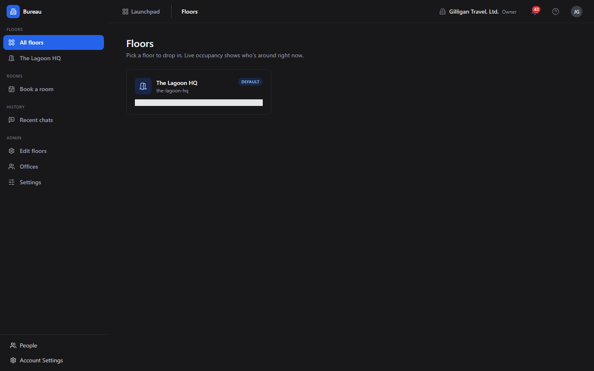
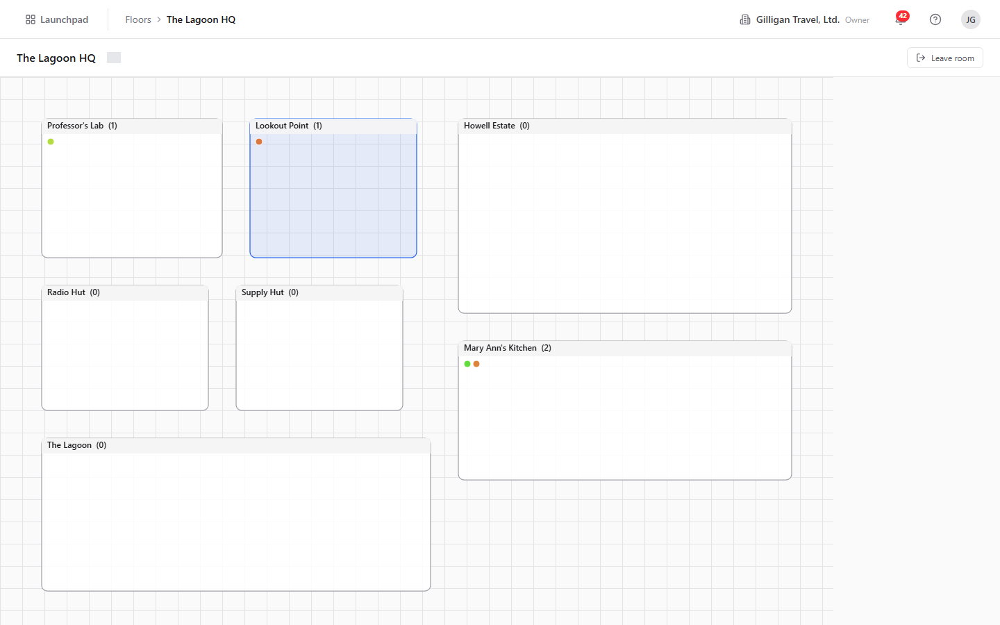
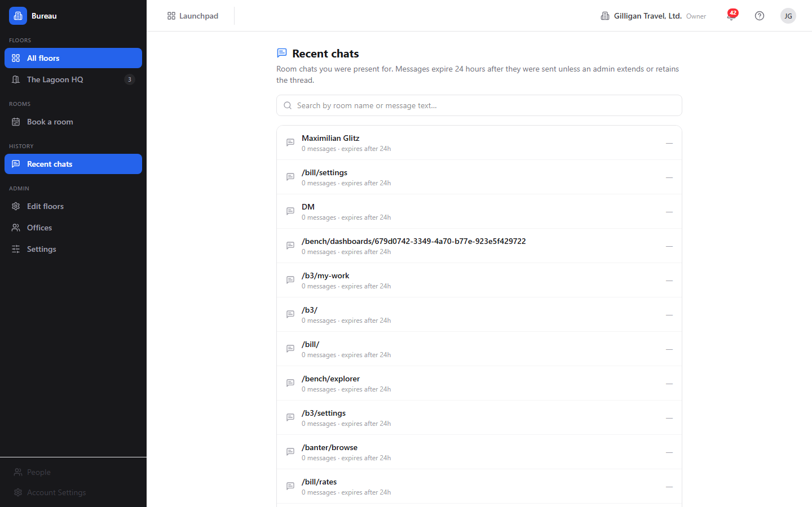
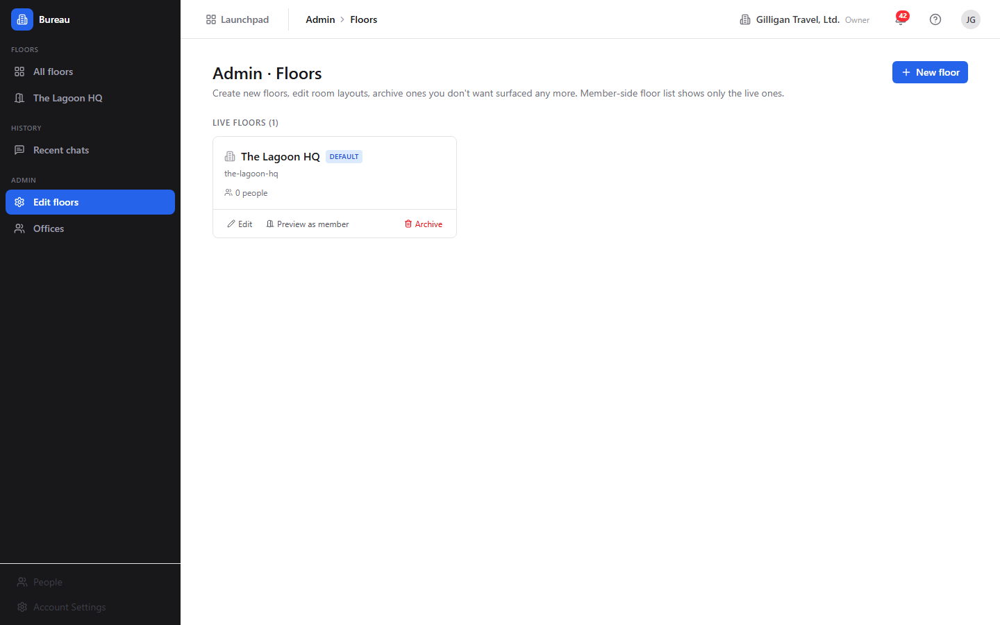
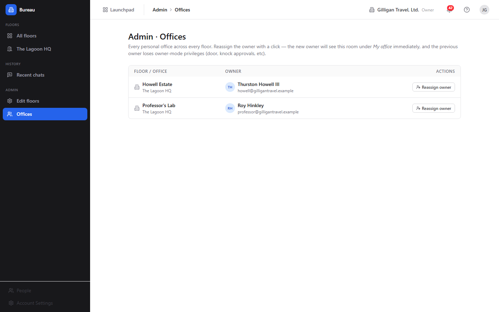

# Bureau - Virtual office and presence

> Bureau is a virtual office layer that stays open around everything else you do in the suite, so that "who is around right now" and "let's all go look at this together" are one click away no matter which app you are in. Reach for it when you want a sense of presence, a quick huddle, or a way to pull your teammates onto the same screen.

## Overview

Bureau gives your org a spatial office. You browse **floors**, drop into **rooms**, and see live occupant dots for everyone who is around. Each room maps to a real-time audio room, so entering a room can start or join a voice huddle. Around all of that, a floating docked box rides along inside every app in the suite, showing where you are, who else is on the same page, and giving you one-click actions to invite, hunt, or pull everyone to where you are looking.

Bureau solves the "remote office" feel for small-to-medium teams. It answers three questions that are otherwise hard to answer over chat alone: who is available right now, can I interrupt them, and can we all jump to the same place. Knocking on a colleague's office, summoning a room to a Board canvas, and booking a conference room are all first-class actions.

Bureau is woven into the rest of the suite rather than standing alone. The docked box is surfaced by Board and Banter (and every other SPA) so audio huddles follow you across products. Summons and rings jump people to a URL in Board, Brief, Bond, and others. Bookings mirror to Book events. Door states, knocks, and status changes emit events that Bolt can automate against, and daily floor utilization rolls up into Bench.

The core objects you work with are floors, rooms (including personal **offices**), your **presence** (a status plus where you currently are), **knocks** on closed doors, **summons** that pull a room to a destination, and **bookings** that reserve a room for a window.

### Key concepts

- **Floor** - One navigable office map. A floor owns a layout, an optional background image, a slug used in its URL, and a position in the list. One floor can be marked the default.
- **Building** - An optional grouping of floors for multi-site orgs. It exists in the data model and a new floor can carry a `building_id`, but there is no building management screen in the app today.
- **Room** - An addressable space on a floor. Each room maps one-to-one to an audio room. Rooms come in 8 types: **Office (single owner)**, **Huddle**, **Conference**, **Meeting**, **Open space**, **Lounge**, **Focus**, and **Lobby**.
- **Office** - A room of type Office that has an owner. The owner can be knocked on, sets the door, and admits or declines visitors. Think of it as a personal office.
- **Door state (privacy)** - How a room treats visitors. Three values: **Open** (anyone can enter), **Knock** (visitors must knock to be let in), and **Private** (only people on the room's access list). The room stores a durable default; live overrides such as a short do-not-disturb window apply on top of it.
- **Room access list (ACL)** - Per-user grants for private rooms, with role **member** or **manager**. Managers can edit the room and manage its access list.
- **Presence** - Your live state: which floor and room you are in, your status, and the page you are currently viewing. Your presence lives on the server, so moving between pages never drops your session.
- **Presence status** - One of 6 values: **available**, **busy**, **dnd**, **focus**, **away**, **in_meeting**. The docked box exposes a head-down **DND** toggle that flips between available and DND.
- **Knock** - An async request to enter a closed office. A knock auto-times-out after 30 seconds if the owner does not respond.
- **Summon (Bring everyone here)** - Pulls every eligible co-occupant of your current room to a URL in another app. Each recipient is access-checked first, so people who cannot see the destination are not pinged with a dead link.
- **Ring (Invite)** - Pushes an incoming-call overlay to one specific person on a content surface. It respects DND. An admin can Force Invite, which bypasses the accept prompt with a 3-second cancellable auto-navigate.
- **Hunt** - Locate one org member and jump to wherever they are. It respects DND and filters out destinations you cannot access.
- **Booking** - A reservation of a bookable room for a window, mirrored to a Book event. Access is **open** (non-attendees may wander in) or **locked** (private for the meeting).
- **Surface huddle** - The audio room attached to any content surface (a Board canvas, a Brief doc, a Bond deal). The docked box auto-joins it when you navigate to that surface.
- **Docked box** - The floating Bureau overlay rendered inside every SPA. It shows your room, your co-occupants, the page you are viewing, the call controls, and the Bring everyone here / Invite / Hunt actions.
- **Room chat** - Ephemeral text chat scoped to a room or surface, kept 24 hours by default and recoverable later under Recent chats.

### Where to find it

Bureau is served at **`/bureau/`**. You must be logged in to BigBlueBam first; Bureau shares the Bam session. If you are not logged in you will see "Please log in to BigBlueBam first to access Bureau." with a **"Go to BigBlueBam Login"** link.

The sidebar (brand label **"Bureau"**) groups navigation under:

- **Floors**: **"All floors"** (the Floors landing), then one row per floor with a live occupancy badge.
- **History**: **"Recent chats"**.
- **Admin** (org admin, owner, or SuperUser only): **"Edit floors"** and **"Offices"**.

Floor and office administration require org admin, owner, or SuperUser. Audio huddles require LiveKit to be configured and the platform calling switch to be on; if calling is disabled, joining a room's audio returns a "calling disabled" error.

## Feature reference

### Browse floors

The Floors landing is where you pick a place to drop in.

To browse floors:

1. Open `/bureau/`. The page heading is **"Floors"** with the subtitle "Pick a floor to drop in. Live occupancy shows who's around right now."
2. Each floor card shows the floor name, its slug, a **"Default"** pill on the default floor, and a live count such as "3 people here now".
3. Click a floor card to open its live view.

If no floors exist yet you will see **"No floors yet"** and "Ask an org admin to create the first floor under Admin to Floors."

### The live floor view (presence canvas)

The floor view is the spatial map. It draws one rectangle per room over a grid background, with a dot for each occupant. It is a Canvas2D scene (the canvas carries the class `floor-canvas`), so occupant dots are painted, not DOM elements.

To use the floor view:

1. From the Floors landing, click a floor. The URL becomes `/floors/:id`.
2. Read the status bar at the top: it shows the floor name and a connection chip that reads **"Live"** when the real-time link is healthy, or the raw connection status otherwise.
3. Click a room rectangle to enter it. Entering a room mints your audio token and places your dot inside that room. Rooms without an assigned layout zone are auto-arranged in a 4-column grid so the floor still navigates.
4. When you are inside a room, a **"Leave room"** button appears in the status bar. Click it to step back out.

The live map updates as people enter, leave, and change status, over the Bureau real-time connection.

### Recent chats

Room chats are ephemeral, but you can recover what was said for rooms you were present in.

To review past room chat:

1. In the sidebar, under History, click **"Recent chats"**. The heading is **"Recent chats"** with the subtitle "Room chats you were present for. Messages expire 24 hours after they were sent unless an admin extends or retains the thread."
2. Use the search box ("Search by room name or message text...") to filter the thread list.
3. Each thread shows its room label, message count, retention text, and last-message time. A shield icon marks a thread that has been retained.
4. Click a thread to open its transcript dialog. Expired messages show "All messages in this chat have expired."

If you are an admin, the transcript dialog offers a **"Retention"** dropdown with the options "24 hours (default)", "2 days", "3 days", "1 week (max)", and "Retain permanently". Choose one to extend or pin the thread.

If you have no threads yet, you will see "No room chats yet - open the chat panel on the Bureau widget anywhere in the suite."

### Move yourself between rooms

Moving rooms is how you change where you are standing and which audio huddle you are in.

To move:

1. Open a floor at `/floors/:id`.
2. Click the destination room rectangle. You enter that room and your audio reconnects to it.
3. To leave without entering another room, click **"Leave room"**.

Door state is enforced on entry. You can always enter an Open room. A Knock room requires you to knock first (see below). A Private room requires you to be on its access list; otherwise entry is refused.

**AI agent note:** an agent moves itself with **`bureau_move_self`**, which mints the room token and registers the agent's session so it appears in `bureau_who_is_in_room` and on the floor. Private rooms the agent is not on the access list for return a permission error.

### See who is in a room

Before knocking, summoning, or joining, you often want to know who is already there.

To see occupants:

1. On the floor view, look at the dots inside each room rectangle.
2. Enter a room, then read the docked box: the **"In:"** row names the room and the people-here count, and the occupants list names everyone present (or **"Just you"** when you are alone). Agent occupants are prefixed "(A) ".

**AI agent note:** **`bureau_who_is_in_room`** returns a room's detail and its live occupant ids. It is access-filtered, so private rooms you cannot see return not-found. Use it before `bureau_summon` or `bureau_knock` to decide who would actually be pulled or disturbed. For co-presence by URL rather than by room, use **`bureau_who_is_here`**, which lists the other users on a given content surface.

### Knock and respond to a knock

A knock is the polite way into a closed office.

To knock on an office:

1. On the floor, click the office whose door is set to Knock (or whose live override blocks direct entry).
2. The owner receives an incoming-knock toast in their docked box.
3. Wait for the owner's decision. If no one answers within 30 seconds the knock auto-times-out.

Only office rooms with an owner can be knocked on. You cannot knock on your own office, and you cannot knock on an office that has no owner.

To respond when someone knocks on your office, use the incoming-knock toast in your docked box:

1. **"Let in"** admits the visitor; they receive a fresh token and join your room.
2. **"Not now"** defers the knock; the visitor is told you are busy.
3. **"Decline"** politely rejects the visitor.

If you are in DND when someone tries to knock, the knock is blocked (the server returns 423) and the visitor is offered a leave-a-note path that delivers a Banter direct message prefixed "[Bureau knock note] ".

**AI agent note:** **`bureau_knock`** creates the knock; if the owner is in DND it returns a 423 with a leave-a-note pointer, which an agent should surface rather than retry. **`bureau_respond_knock`** resolves a knock as the owner with `admit`, `defer`, or `decline`. **`bureau_knock_inbox`** lists the pending knocks waiting at the agent's own door, and **`bureau_leave_note`** sends the DND fallback DM.

### Summon (Bring everyone here)

A summon pulls everyone in your current room to whatever you are looking at in another app.

To bring everyone here:

1. Be in a Bureau room with at least one other person.
2. Navigate to the resource you want to share (for example a Board canvas, a Brief doc, or a Bond deal). The docked box **"Viewing:"** row shows your current location.
3. Click **"Bring everyone here"** in the docked box. Bureau access-checks each co-occupant against that destination, then sends a summon to everyone who can reach it.
4. Each recipient sees a **"Summon"** toast that names you and the destination, with **Join** and **Stay here** buttons. If auto-follow is enabled, the toast shows a "Going in Ns..." countdown with a "cancel" link, then navigates automatically.
5. Anyone who lacks access lands on the denied list, so you can follow up by granting access and re-summoning.

**AI agent note:** **`bureau_summon`** is high-impact and uses the `confirm_action` two-step. Call it once to preview the planned recipients, then again with `confirm_action: true` to send. The caller must be in a Bureau room or the call fails with 400. After sending, **`bureau_get_summon`** inspects who was eligible versus denied, and **`bureau_summon_grant_access`** grants access to denied users and re-summons them in one step (also a two-step confirm).

### Ring (Invite)

Ring calls one specific person to a surface, like ringing their phone.

To invite one person:

1. On any located page, click **"Invite..."** in the docked box. The Invite popover opens.
2. Pick the member to ring. They receive an incoming-call overlay.
3. When they accept, they are navigated to your surface and auto-join the huddle.

DND is respected: if the recipient is head-down, a normal ring does not get through. Admins can right-click **"Invite..."** to Force Invite, which bypasses the accept prompt with a 3-second cancellable auto-navigate.

### Hunt

Hunt finds one teammate and takes you to them.

To hunt a teammate:

1. Click **"Hunt..."** in the docked box. The Hunt popover opens.
2. Pick the member you want to find.
3. You jump to wherever they currently are.

Hunt is org-scoped: the teammate must share your active org. It respects DND (a head-down member cannot be located) and runs a destination-access preflight, so if you cannot see the surface they are on, the result is the same as "not located" - their location is never leaked through a URL you could not open.

**AI agent note:** **`bureau_where_is_user`** is the real, implemented Hunt tool. It returns `{ located: true, url, app, label, status }` or `{ located: false }` when the target is offline, in DND, in a different org, or on a surface the caller cannot see. Prefer it over the legacy `bureau_locate_user` stub.

### Book and cancel a room

Bookable rooms can be reserved for a window; the reservation mirrors to a Book event.

To book a room:

1. The room must be marked bookable. Booking is gated by the org's `members_can_book` setting.
2. Create a booking with a title, start time, and end time, and choose access: **open** lets non-attendees wander in, **locked** holds the room private for the meeting.
3. Bureau writes the booking, anchors it to a Book event, and schedules lifecycle jobs that flip the room's privacy at the start time and clear it at the end time.

To cancel a booking, the organizer or an admin removes it. Cancellation is a soft delete that drops the scheduled jobs and makes a best-effort attempt to cancel the linked Book event.

There is no dedicated booking screen in the Bureau SPA today; booking and cancellation run through the Bureau API and the MCP tools.

**AI agent note:** **`bureau_book_room`** and **`bureau_cancel_booking`** both use the `confirm_action` two-step: preview first, then confirm. **`bureau_list_bookings`** lists active bookings for a room over a window (default next 7 days), including the Book event back-link, and **`bureau_update_booking`** edits a booking's title, window, or access (organizer or admin only).

### Door states (set a room's privacy)

A room's door state controls who can walk in.

The three states are **Open**, **Knock**, and **Private**. The durable default is set on the room, and live overrides (a lock or a short DND window) apply on top of it.

To change the durable default in the app, edit the room in the Floor editor and set its **Door default** (see Admin - Floor editor below). To change it directly, the office owner, a room manager, or an org admin can patch the room's door.

The Bureau SPA's room inspector only sets the durable default. Live lock and DND overrides are driven through the docked box and the real-time connection. The door button in the docked box (tooltip **"Toggle door privacy"**) flips the live override while you are in a room.

**AI agent note:** **`bureau_set_door_state`** sets a room's durable default privacy. It is restricted server-side to the office owner (for offices), a room manager, or org admins and owners.

### Set your status and DND

Your status tells teammates whether you can be interrupted.

The canonical status set is **available**, **busy**, **dnd**, **focus**, **away**, and **in_meeting**. The surface for changing it is the docked box and the live connection, not a settings page.

To go head-down:

1. In the docked box header, click the **"DND"** toggle (its tooltip reads "Go head-down: block invites and hunts (DND)").
2. While DND is on, invites ring as blocked (callers get the leave-a-note path to your Banter direct messages) and hunts cannot locate you. Only an admin or SuperUser Force Invite gets through.
3. Click **"DND"** again to return to available.

There is no separate in-app status menu in the Bureau SPA beyond the docked box DND toggle. Status changes flow over the live connection.

> Known gap: the MCP **`bureau_set_status`** tool is a stub that targets an endpoint which does not yet exist, so an agent cannot change your status today. Its accepted values (`active`, `dnd`, `away`) also do not match the canonical status set above. Real status changes happen over the live connection through the docked box.

### The cross-app docked box (audio huddles, mic, cam, screen)

The docked box is the floating Bureau overlay that rides inside every app, including Board and Banter. It is your portable presence and call console.

The box header shows a status dot and the **"Bureau"** label, plus:

- **"CHAT"** toggle - opens the ephemeral room chat panel (its tooltip reads "Open room chat (ephemeral - 24h)"); a badge shows unread messages.
- **"DND"** toggle - the head-down switch described above.
- A popout (picture-in-picture) button and a collapse chevron.

Below the header:

- The **"In:"** row names your current room (or **"No room"**) and the people-here count.
- The occupants list names who is with you, or shows **"Just you"**. Agents are prefixed "(A) ".
- The **"Viewing:"** row shows a human-readable name of the page you are on.
- **"Bring everyone here"** appears when you are in a room with others on a located page.
- **"Invite..."** and **"Hunt..."** are available on located pages.

When you are in an audio huddle, the call strip shows your controls:

- The mic button reads **"mic"** when muted and **"mic on"** when live. Click to toggle.
- The cam button reads **"cam"** when off and **"cam on"** when on. Click to toggle.
- The screen button reads **"screen"** when you are not sharing and **"share"** when you are. Click to start or stop a screen share.
- The door button (tooltip **"Toggle door privacy"**), shown only while you are in a room, flips that room's live privacy override between Private and Open.
- Video tiles render for participants with camera or screen on.

The box is draggable by its header and collapsible. Because your presence lives on the server, navigating between pages does not drop your room or your call; the box re-attaches to the surface huddle of wherever you land.

### Admin - Floors list

Admins manage the org's floors here.

To manage floors:

1. In the sidebar Admin group, click **"Edit floors"**. The heading is **"Admin · Floors"**.
2. The page lists "Live floors (n)" and "Archived (n)".
3. Live floor cards offer **"Edit"**, **"Preview as member"**, and **"Archive"**. Archived rows offer **"Restore"**.
4. To add a floor, click **"New floor"**. In the dialog, enter a **Name** (placeholder "e.g. Engineering 3F") and a **Slug** (auto-generated, lowercase letters, numbers, and dashes; helper "Used in the floor URL: /floors/{slug}"). Click **"Create + open editor"**.

Archiving a floor prompts a confirmation and hides it from the member-side floor list; you can restore it later from this page. Non-admins see **"Floor administration requires admin or owner"**.

### Admin - Floor editor

The Floor editor is the canvas where you place rooms on a floor.

To lay out a floor:

1. Open a floor in the editor (via "New floor" or "Edit"). The top toolbar shows a Back arrow, an editable floor-name input, a "{n} zones · WxH" readout, the tool selector **"Select" / "New room" / "New office"**, the image-underlay control, and **"Save"**.
2. To add a space, pick **"New room"** or **"New office"** and click-drag on the canvas. The empty-inspector hint reads "Click a zone to edit it, or pick "New room" / "New office" and click-drag on the floor."
3. Select a zone to open the room inspector on the right. Set:
   - **Name** (placeholder "e.g. War Room").
   - **Type**: "Office (single owner)", "Huddle", "Conference", "Meeting", "Open space", "Lounge", "Focus", or "Lobby".
   - **Capacity (people)** (blank means "(unlimited)").
   - **Door default**: "Open", "Knock", or "Private" (helper "The default - visitors override this at runtime via the docked box").
   - **Bookable** ("Allow reservations via Book").
   - **Owner** (offices only): a people picker ("Choose owner...") plus a "View owner in People" link.
   - **Geometry (world units)**: x, y, w, h, with a read-only **Zone id**.
4. To delete a room, use **"Remove zone"** in the inspector footer. On save it soft-deletes the room and "Live occupants are evicted to the lobby."
5. To set a background underlay, use the image-underlay control to upload an image; you can later Replace or Remove it.
6. Click **"Save"**. Bureau writes the layout and floor name, then creates, updates, or deletes rooms to match the canvas.

### Admin - Offices

The Offices screen is where you assign or reassign who owns each personal office.

To assign an office owner:

1. In the sidebar Admin group, click **"Offices"**. The heading is **"Admin · Offices"**.
2. The table has columns **"Floor / Office"**, **"Owner"** (avatar, name, and email, or **"Unassigned"**), and **"Actions"**.
3. Click **"Reassign owner"** on a row. In the "Reassign {office}" dialog, search by name or email (placeholder "Search name or email..."); the current owner carries a "Current" tag.
4. Pick the new owner to assign the office to them. The new owner sees this room under "My office" immediately, and the previous owner loses owner-mode privileges (door, knock approvals).

Non-admins see **"Office administration requires admin or owner"**.

### Org settings (API and MCP only)

Bureau has org-level settings - `continuous_audio`, `allow_auto_follow`, `default_office_privacy`, `members_can_book`, and `members_can_create_rooms` - that affect who can book and create rooms and how auto-follow behaves. These materially change behavior, but there is no settings screen in the Bureau SPA today. They are reachable only through the Bureau API and the **`bureau_get_settings`** / **`bureau_update_settings`** MCP tools.

### Working with AI agents

Agents are first-class spatial occupants in Bureau. An agent that enters a room shows up on the floor and in the occupants list with an "(A) " prefix. Agents drive Bureau through over 30 `bureau_*` MCP tools, all forwarding the calling user's token and gated by the same server-side permission checks as the UI.

What agents commonly do:

- **Perceive the office** with `bureau_list_floors`, `bureau_get_floor`, `bureau_who_is_in_room`, and `bureau_who_is_here` (co-presence by URL).
- **Move into a room** with `bureau_move_self` (the canonical "appear in the room" action).
- **Find a person** with `bureau_where_is_user` (the real Hunt; returns the user's current surface or `{ located: false }`).
- **Socialize** with `bureau_knock`, `bureau_respond_knock`, `bureau_knock_inbox`, and `bureau_leave_note`. On a DND block, surface the leave-a-note hint rather than retrying.
- **Teleport a room** with `bureau_summon` (high-impact, two-step confirm; caller must be in a room), then inspect or recover with `bureau_get_summon` and `bureau_summon_grant_access`.
- **Book and manage rooms** with `bureau_book_room` (two-step confirm), `bureau_list_bookings`, `bureau_update_booking`, and `bureau_cancel_booking` (two-step confirm).
- **Set a door** with `bureau_set_door_state`.
- **Administer floors and rooms** with `bureau_create_floor`, `bureau_update_floor`, `bureau_set_floor_background`, `bureau_delete_floor` (two-step confirm), `bureau_create_room`, `bureau_update_room`, and `bureau_delete_room` (two-step confirm), all admin/owner gated server-side.
- **Manage offices** with `bureau_list_offices`, `bureau_assign_office`, and `bureau_my_office`.
- **Recover chats** with `bureau_list_chats`, `bureau_get_chat_messages`, and `bureau_set_chat_retention`.
- **Read or change org settings** with `bureau_get_settings` and `bureau_update_settings`.

Six high-impact tools use the `confirm_action` two-step (call once to preview, then again with `confirm_action: true` to commit): `bureau_summon`, `bureau_summon_grant_access`, `bureau_book_room`, `bureau_cancel_booking`, `bureau_delete_floor`, and `bureau_delete_room`.

Three tools are stubs that hit endpoints which are not yet built, and an agent should treat them as not-yet-functional:

- **`bureau_locate_user`** returns a null "not located" envelope. Use the implemented `bureau_where_is_user` instead.
- **`bureau_get_presence`** returns an empty list. It cannot snapshot the org-wide presence map yet.
- **`bureau_set_status`** returns a stub and changes nothing. Its enum (`active`, `dnd`, `away`) also does not match the canonical status set (`available`, `busy`, `dnd`, `focus`, `away`, `in_meeting`). Real status is set over the live connection through the docked box, not through this tool.

Bureau participates in the suite-wide agentic platform alongside its own tools. Service-account agents are bound by the §15 `agent_policies` kill switch and tool allowlists (the `bureau.*` prefix), and every action is written to the unified activity view with the actor's kind (human, agent, or service). Cross-app result posting must pass the platform `can_access` visibility preflight, which is exactly the check Bureau already runs internally before a summon, hunt, or co-presence read reveals a destination. High-impact spatial actions can be routed through the platform approval queue (`proposal_create` / `proposal_decide`), and agents can subscribe to Bureau's Bolt events through outbound webhooks. Agents should also call `agent_heartbeat` so their session is treated as live.

A human reviewing agent work in Bureau should know that a summon DMs every eligible co-occupant in real time, that a hunt reveals where a teammate is, and that a booking can create or anchor a Book calendar event and can flip a room private for its window. The confirm step exists so these are previewed before they fire. For the full catalog and signatures, see the MCP-tools reference in `docs/apps/bureau/`.

## User Stories

### Story: Drop into the office and join a room

**Who:** Any logged-in team member, first time in Bureau.
**Goal:** Get into a room and be present with whoever is around.
**Before you start:** You are logged in to BigBlueBam. At least one floor exists.

**Steps**

1. Open `/bureau/`. The **"Floors"** landing lists the available floors with live occupancy counts.
2. Click a floor card to open its live view at `/floors/:id`.
3. On the canvas, click an Open room rectangle to enter it. Your dot appears inside, and your audio connects.
4. Read the docked box: the **"In:"** row names your room and the occupants list shows who is with you (or **"Just you"**).
5. When you are done, click **"Leave room"** in the floor view status bar.

**Result:** You are present in a room, joined to its audio huddle, and visible to teammates on the floor.

**Related:** See who is in a room; The cross-app docked box. An agent does the same move with `bureau_move_self`.

### Story: Knock on a busy colleague's office

**Who:** A team member who needs a quick word.
**Goal:** Get into a colleague's closed office without barging in.
**Before you start:** The colleague has a personal office with an owner; its door is Knock or otherwise closed.

**Steps**

1. Open the floor and click the colleague's office.
2. Bureau sends a knock to the owner; their docked box shows an incoming-knock toast.
3. Wait. If they click **"Let in"** you are admitted and join their room. If they click **"Not now"** the knock is deferred; if they click **"Decline"** it is rejected.
4. If no one answers within 30 seconds, the knock times out.

**Result:** You are either admitted to the office or told to come back later, without interrupting work uninvited.

**Related:** Triage knocks at your own office. If the owner is in DND, you are offered a leave-a-note path that lands in their Banter DMs. Agents use `bureau_knock` and, on a DND block, `bureau_leave_note`.

### Story: Triage knocks at your own office

**Who:** An office owner who wants to manage interruptions.
**Goal:** Decide who gets in and when, and block interruptions during focus time.
**Before you start:** You own an office (a room of type Office assigned to you).

**Steps**

1. When someone knocks, an incoming-knock toast appears in your docked box.
2. Click **"Let in"** to admit, **"Not now"** to defer, or **"Decline"** to reject.
3. To stop interruptions entirely, click the **"DND"** toggle in the docked box header to go head-down. Knocks are then blocked and visitors are offered the leave-a-note path.
4. Click **"DND"** again when you are ready to be reachable.

**Result:** You control who enters your office, and head-down mode shields you while still letting people leave a note.

**Related:** Set your status and DND. Agents resolve knocks with `bureau_respond_knock` and review waiting visitors with `bureau_knock_inbox`.

### Story: Bring everyone here (teleport the room)

**Who:** A facilitator standing in a room with teammates.
**Goal:** Pull everyone to a specific resource in another app so you are all looking at the same thing.
**Before you start:** You are in a Bureau room with at least one other person, and you can open the destination resource.

**Steps**

1. Stay in your room and navigate to the resource (for example a Board canvas or a Brief doc). The docked box **"Viewing:"** row reflects your location.
2. Click **"Bring everyone here"** in the docked box.
3. Bureau access-checks each co-occupant and sends a **"Summon"** toast to everyone who can reach the destination, with **Join** and **Stay here** buttons.
4. If a teammate appears on the denied list because they lack access, grant them access to the destination and bring everyone here again.

**Result:** Eligible teammates land on the same URL and join the same huddle; people without access are not sent a dead link.

**Related:** Ring (Invite) for one person. Agents use `bureau_summon` with the `confirm_action` two-step, then `bureau_summon_grant_access` to grant and re-summon the denied users.

### Story: Invite one person to your screen

**Who:** Anyone who needs one specific colleague, now.
**Goal:** Ring a single person and bring them to your surface.
**Before you start:** You are on a located page (a content surface that supports ring).

**Steps**

1. Click **"Invite..."** in the docked box.
2. In the Invite popover, pick the member to ring. They get an incoming-call overlay.
3. When they accept, they are navigated to your surface and auto-join the huddle.
4. If you are an admin and the call cannot wait, right-click **"Invite..."** to Force Invite, which auto-navigates them after a 3-second cancellable countdown.

**Result:** The colleague is ringing-and-joined to exactly where you are.

**Related:** Hunt to go to them instead of pulling them to you. Ring respects DND unless an admin forces it.

### Story: Hunt a teammate

**Who:** Someone trying to find where a colleague is working.
**Goal:** Jump to wherever a specific teammate currently is.
**Before you start:** The teammate is online and not head-down, shares your active org, and you can access where they are.

**Steps**

1. Click **"Hunt..."** in the docked box.
2. In the Hunt popover, pick the member.
3. You are navigated to their current location.

**Result:** You arrive where the teammate is, ready to join them.

**Related:** A head-down (DND) teammate cannot be located, and a surface you cannot access reads as "not located". Invite pulls them to you instead. Agents use `bureau_where_is_user`.

### Story: Book the conference room

**Who:** An organizer planning a meeting.
**Goal:** Reserve a bookable room for a window and have it appear on the calendar.
**Before you start:** The target room is marked bookable, and your org allows you to book (`members_can_book`).

**Steps**

1. Create a booking for the room with a title, start time, and end time.
2. Choose access: **locked** to hold the room private for the meeting, or **open** to let others wander in.
3. Confirm. Bureau writes the booking, anchors it to a Book event, and schedules the privacy flip at the start and the clear at the end.
4. To cancel, remove the booking as the organizer or an admin; the lifecycle jobs drop and the linked Book event is cancelled best-effort.

**Result:** The room is reserved for your window and mirrored to Book; a locked booking holds it private when it starts.

**Related:** Booking runs through the Bureau API and MCP today. Agents use `bureau_book_room`, `bureau_list_bookings`, `bureau_update_booking`, and `bureau_cancel_booking`; the book and cancel tools use the `confirm_action` two-step.

### Story: Recover what was said in a room

**Who:** Anyone who needs to revisit a room conversation.
**Goal:** Read back ephemeral room chat before it expires, or pin it.
**Before you start:** You were present in the room when the messages were sent. Room chats are kept 24 hours by default.

**Steps**

1. In the sidebar, click **"Recent chats"**.
2. Use the search box to find the room by name or message text.
3. Click a thread to open its transcript dialog.
4. If you are an admin, set the **"Retention"** dropdown to "2 days", "3 days", "1 week (max)", or "Retain permanently" to extend or pin the thread.

**Result:** You read the past conversation, and an admin can keep it from expiring.

**Related:** Room chat is opened live from the docked box **"CHAT"** toggle. Agents use `bureau_list_chats`, `bureau_get_chat_messages`, and `bureau_set_chat_retention`.

### Story: Build a floor (admin)

**Who:** An org admin or owner setting up the office.
**Goal:** Create a floor and place its rooms and offices.
**Before you start:** You are an org admin, owner, or SuperUser.

**Steps**

1. In the sidebar Admin group, click **"Edit floors"**, then **"New floor"**.
2. Enter a **Name** and confirm the auto-generated **Slug**, then click **"Create + open editor"**.
3. In the Floor editor, pick **"New room"** or **"New office"** and click-drag on the canvas to place spaces.
4. Select each zone and set its **Name**, **Type**, **Capacity (people)**, **Door default**, **Bookable**, and (for offices) **Owner** in the inspector.
5. Optionally upload an image underlay for the floor background.
6. Click **"Save"**.

**Result:** A new floor exists with its rooms and offices, ready for people to drop in. Removed zones evict any live occupants to the lobby.

**Related:** Assign an office owner; Door states. Agents use `bureau_create_floor`, `bureau_create_room`, and `bureau_update_room`.

### Story: Assign an office owner (admin)

**Who:** An org admin or owner.
**Goal:** Give a personal office an owner so it can be knocked on and managed.
**Before you start:** You are an org admin, owner, or SuperUser, and at least one office room exists.

**Steps**

1. In the sidebar Admin group, click **"Offices"**.
2. Find the office in the **"Floor / Office"** column.
3. Click **"Reassign owner"** in the **"Actions"** column.
4. Search by name or email in the dialog and pick the new owner.

**Result:** The office shows the new owner in the **"Owner"** column, and that owner now receives knocks and controls the door.

**Related:** Build a floor; Knock and respond to a knock. Agents use `bureau_list_offices` and `bureau_assign_office`.

### Story: Agent staffs a room and pulls humans in

**Who:** An AI agent acting for a user.
**Goal:** Appear in a room, see who is there, and summon the right people to a resource.
**Before you start:** The agent has the user's token and the target room is reachable.

**Steps**

1. Call `bureau_get_floor` to enumerate rooms on the floor.
2. Call `bureau_move_self` on the target room so the agent appears as an occupant.
3. Call `bureau_who_is_in_room` to confirm who is present.
4. Call `bureau_summon` with `confirm_action: false` to preview the eligible recipients, then again with `confirm_action: true` to send everyone to the destination URL.
5. Optionally call `bureau_get_summon`, then `bureau_summon_grant_access` to grant access to anyone on the denied list and re-summon them.

**Result:** The agent is present in the room and the eligible co-occupants are pulled to the shared resource. Recipients who lack access are reported in the denied count.

**Related:** Bring everyone here; See who is in a room. The agent must be in a room before `bureau_summon` will succeed, and cross-app result posting should pass the platform `can_access` preflight.

## Related

- **Board** - Summons and rings commonly land people on a Board canvas, and Board surfaces the same docked box so the canvas huddle follows you in.
- **Brief** - A Brief doc is a frequent summon and ring destination; each doc has a surface huddle the docked box auto-joins.
- **Bond** - Bond deals are valid summon and ring destinations for pulling the room onto a record.
- **Banter** - Surfaces the same docked box, and is the fallback delivery channel for the leave-a-note path when someone is in DND ("[Bureau knock note] " direct messages).
- **Book** - Bureau bookings mirror to Book events; cancelling a booking cancels the linked Book event best-effort.
- **Bolt** - Bureau emits events (entering and leaving rooms, status changes, knocks, room booked, room locked, summon issued) on the `bureau` source for automation.
- **Bench** - Daily floor utilization rolls up for reporting in Bench.
- MCP tools: this app exposes over 30 `bureau_*` tools. `bureau_summon`, `bureau_summon_grant_access`, `bureau_book_room`, `bureau_cancel_booking`, `bureau_delete_floor`, and `bureau_delete_room` use the `confirm_action` two-step. `bureau_locate_user`, `bureau_get_presence`, and `bureau_set_status` are stubs and do not yet change state (use `bureau_where_is_user` for Hunt instead of `bureau_locate_user`). See the MCP-tools reference in `docs/apps/bureau/`.
