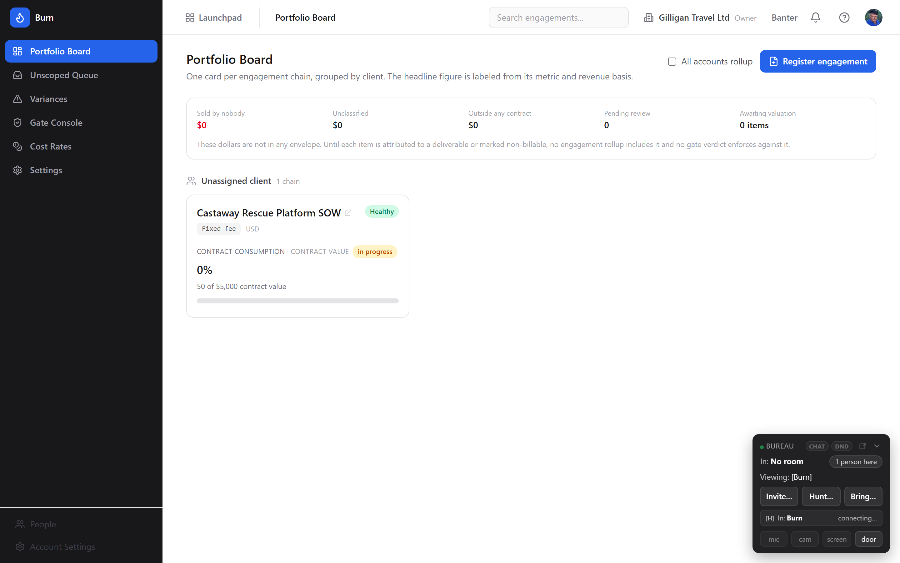
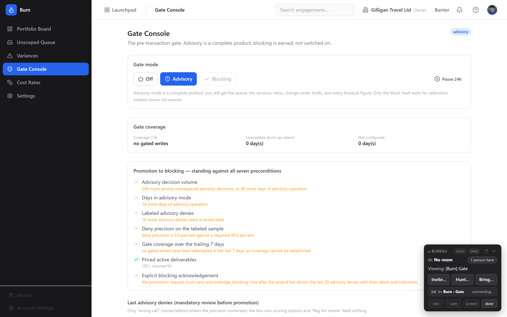

# Burn (AI Contract-Scope & Margin Monitor) Guide

# Burn - Turn a signed contract into a live margin monitor

Burn is BigBlueBam's contract-scope and margin monitor: it reads a signed proposal or SOW into a clause-cited ledger of what was sold with a priced envelope, then classifies every unit of work against that ledger in dollars, so the work nobody sold shows up before it turns into an unbilled surprise. A services firm sells a fixed-scope engagement, and then scope creep and unpriced work quietly erode the margin, and nobody sees it until the invoice is already wrong. Burn is the reader and the meter. You register a contract that already lives in Bin as an asset, the internal AI provider extracts the deliverables it promised with a clause cite for each, a human confirms a priced envelope on the ones that carry a number, and from then on every Bam task or time entry and every Bill expense, line item, or invoice is classified against that ledger. The bucket it cares about most is the work that maps to no priced deliverable: the unscoped bucket is the product. Its flagship operation is a fail-open pre-transaction gate that vets a billable Bill expense against contract scope before it posts, so an out-of-scope charge can be caught before it ever reaches a client invoice. Burn owns none of the source data: the document lives in Bin, the work lives in Bam and Bill, and the client is a Bond or Braid record. Reach for it when you deliver against fixed-scope contracts and need to answer, continuously, which client is burning its contract fastest and why.

## Key Features

- **Clause-cited deliverable ledger from AI extraction.** Burn reads a signed engagement document out of Bin, uses the internal AI provider to extract every deliverable it promised, and cites each one back to its clause. Each extracted deliverable lands as **Pending review** with no envelope, and a human confirms and prices it before it can gate anything.
- **Priced envelopes, not guesses.** A confirmed envelope is the priced ceiling on a deliverable, in one of three states: **Envelope priced** (a confirmed number that can drive a deny), **Envelope unpriced** (tracks hours only and can never deny), or **Envelope unconfirmed** (extracted but not yet a gate input). Only a confirmed, priced envelope gates. Confirming and pricing an envelope is owner/admin only and deliberately not reachable by any agent.
- **Every unit of work classified in dollars.** Burn classifies each work item (a Bam time entry or task, a Bill expense, line item, or invoice) against the ledger and labels each engagement chain with a headline figure whose meaning is stated exactly: **Margin** (shown only when cost rates cover the hours), **Contract consumption**, or the suppressed **Consumption** variant when you are not cleared to see cost. A field name is a claim, so Burn never labels a consumption number as margin.
- **The unscoped queue surfaces work nobody sold.** Three distinct buckets, never summed: **Sold by nobody** (work inside a tracked contract that no deliverable covers), **Unclassified** (the classifier could not place it with enough confidence), and **Outside any tracked contract** (work on a project with no active engagement). They have opposite remedies, so Burn shows three figures and never one total.
- **A fail-open pre-transaction gate.** The gate vets a billable Bill expense against contract scope before it posts. It ships as **advisory** (a complete product that warns but never blocks) and is promoted to **blocking** only after it earns seven calibration preconditions. When it blocks it returns HTTP 409 with four ways forward (**Map to deliverable**, **Record absorbed cost**, **Raise change order**, **Override**) rather than a wall.
- **Fail-open by design.** The gate blocks an enforced out-of-scope charge, but it never blocks because something broke. If burn-api is unreachable, unconfigured, timing out, or Redis is down, the charge posts anyway and the outcome is recorded. Availability fails open; authorization fails closed. A verdict (**Allow**, **Allow w/ note**, **Needs mapping**, **Deny**) is distinct from a fail-open reason (`gate_unavailable`, `gate_not_configured`, `redis_unavailable`) that appears in the precheck log's Reason column.
- **Drafted change orders in a human approval queue.** When scope really grew, Burn drafts a change order from the variance. It is never sent from Burn: drafting it creates a pending row in the platform approval queue, and approving it there raises the base deliverable's effective envelope so the next precheck allows the charge that was blocked.
- **A money floor that protects cost.** Without `burn.financials.read_all`, cost and margin are structurally absent rather than blanked, and a member sees contract consumption percent only. Cost rates (effective-dated USD per hour, per person and project) live in one owner/admin-only place, and cost aggregates are suppressed below the contributor floor so an individual rate cannot be reverse-solved.
- **AI agent surface** of 17 `burn_*` MCP tools covering triage, attribution, precheck, financials, extraction, variances, and change-order drafting, with `asker_user_id` flooring on money-bearing reads, two-step confirmation on destructive and gate-weakening tools, and `agent_policies` fail-closed allowlisting. Envelope pricing, rule authoring, and cost-rate writes are human-only.

## Integrations

Burn reads the signed contract bytes owned by **Bin** and never edits them; it references the document by Bin asset id and re-reads it on extraction. The work Burn classifies comes from **Bam** (task and time-entry work items) and **Bill** (expense, line-item, and invoice work items), and **Bill** is also where the flagship gate lives, as the `BurnGateNotice` on the expense create and approve flows. Client identity is a **Bond** contact or company, resolved to a golden identity by **Braid** where one exists, so chains group under the right account. Scope-and-margin lifecycle changes publish events on the `burn` source to **Bolt**, so an automation rule can route them into a **Banter** channel, an email, or a webhook. Every drafted change order routes to the shared **agent_proposals** human-in-the-loop queue, where a person approves it under a decider kill-switch and a permission re-check, and approval is what actually raises the effective envelope. Agents reach Burn under an identity with `agent_policies` gating, and money-bearing reads take the human's `asker_user_id` so burn-api floors both row visibility and financial detail to the intersection of the bearer's and the asker's capabilities. Burn does not read Basis metrics and does not read Bulwark obligations; those are out of scope for v1.

## Getting Started

1. Open **Burn** from the Launchpad (or go to `/burn/`). You are signed in already if you are signed in to the suite. Press `?` from any Burn screen to open the in-app Help Center.
2. Make sure the prerequisites exist: an organization, the signed engagement document stored as a **Bin** asset, and the work in **Bam** and **Bill** that Burn will classify against it.
3. Register the engagement from its Bin asset. Today this is an API or agent action: use the `burn_extract_deliverables` MCP tool (supply the title, envelope basis, contract value, and currency) or call `POST /burn/api/v1/engagements`. The chain appears on the **Portfolio Board** in the **extracting** state, then **active** once extraction completes.
4. Price the deliverables. Open the chain from its Portfolio Board card to reach the **engagement detail** page, and in the **Deliverable ledger** click **Confirm envelope** on each **Pending review** row. Read the clause quote, enter the **Envelope amount (minor units / cents)** (or tick **Confirm as unpriced (tracks hours only; can never deny)**), and click **Confirm envelope**. Pricing is owner/admin only.
5. Add **Cost Rates** (`/burn/settings/cost-rates`, owner/admin only) if you want true **Margin** rather than **Contract consumption**. Saving a rate enqueues a background revalue that reprices uncosted work items in place with no re-classification.
6. Work the loop. Triage work nobody sold on the **Unscoped Queue**, review drift on the **Variances & Change Orders** inbox, and run the gate on the **Gate Console**. Leave the gate in **Advisory** until its **Gate coverage** and the mandatory review of recent advisory denies satisfy all seven promotion preconditions, then switch it to **Blocking**.

For the full click-by-click walkthroughs, key concepts, and user stories, see the in-app Help Center (the **?** button), sourced from `docs/apps/burn/help.md`.

## Related

- **Bin** - stores the signed contract bytes that Burn registers and extracts deliverables from; Burn reads it by asset id and never edits it.
- **Bam** - the source of task and time-entry work items Burn classifies against the ledger.
- **Bill** - the source of expense, line-item, and invoice work items, and the home of the pre-transaction gate (the `BurnGateNotice` on the expense create and approve flows).
- **Bond / Braid** - resolve client identity to a golden company id so chains group by the right account.
- **Bolt** - receives Burn's scope-and-margin lifecycle events so they can be routed anywhere in the suite.
- **agent_proposals** - the shared human-in-the-loop queue where change-order drafts wait for a person to approve and send.
- **Burn MCP-tools reference** - the full `burn_*` tool catalog and confirmation behavior; see `docs/apps/burn/` and `docs/reference/mcp-endpoint-mapping.md`.
