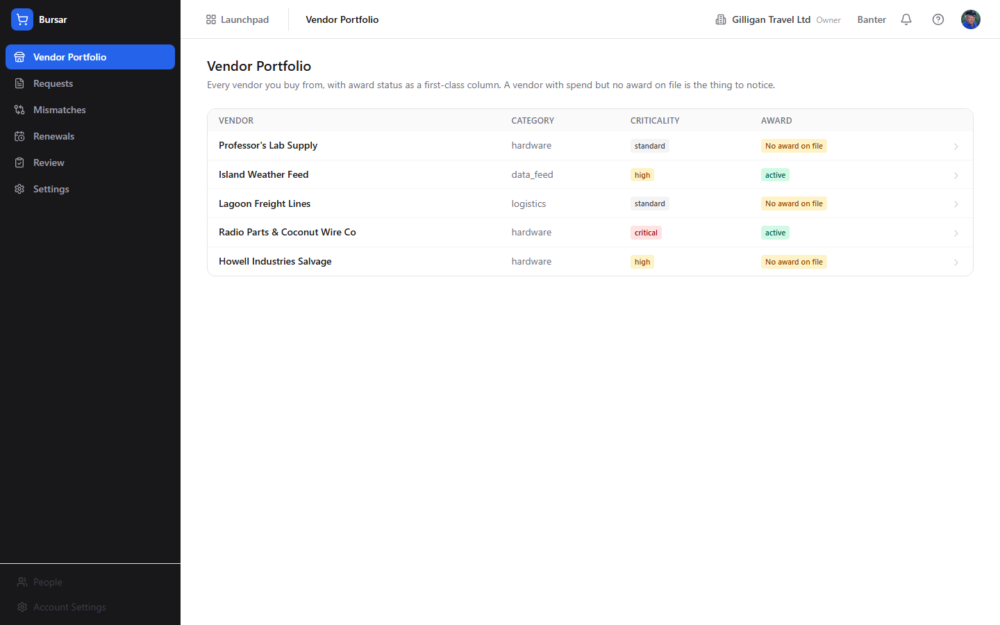
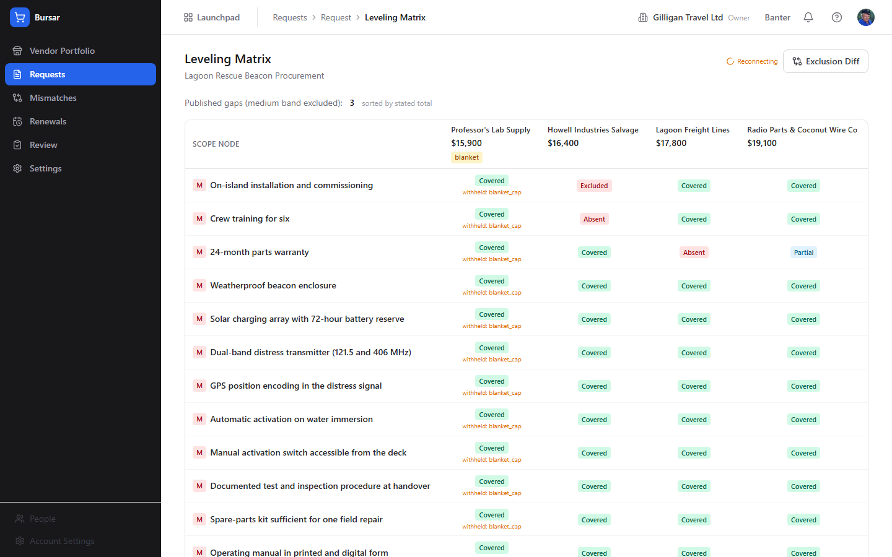

# Bursar (Vendor-side Procurement and Absence Detection) Guide

# Bursar - Turn a request into a ruler and measure every offer against it

Bursar is BigBlueBam's vendor-side procurement and absence-detection tool: it reads a request into a scope tree, then levels every competing offer against that tree and tells you, node by node, what each offer leaves out. A buyer takes in several quotes, one of them quietly omits a mandatory requirement or claims to cover everything without itemizing it, and nobody notices until the work is underway and the omission is a bill. Bursar is the reader and the referee. You create a request, derive and confirm its scope tree, and from then on every offer under that request is classified line by line into a coverage verdict for each scope node: covered, partial, explicitly excluded, or absent. The product is the absence: the requirement a vendor left out. After you award an offer, Bursar freezes its priced baseline and watches real spend against it, raising mismatches when billing drifts and renewal notices before a contract rolls over. Bursar owns none of the source data: the documents live in Bin, spend comes from Bill, and the vendor is a Bond or Braid record. Reach for it when you compare vendor quotes and need to know, with evidence, which offer omits the thing you actually require.

## Key Features

- **A confirmed scope tree as the ruler.** Bursar derives a tree of scope nodes from a request, each with a normative strength (mandatory, should_have, nice_to_have, informational) and a cited span, and a human confirms it. Only the confirmed tree measures offers, and only mandatory nodes appear in the Exclusion Diff. Rival-derived nodes lifted from competing offers are proposals only; a human promotes them after seeing the supporting offers.
- **A coverage verdict for every node and offer.** The Leveling Matrix classifies each offer against each scope node into Covered, Partial, Excluded, Absent, Ambiguous, or N/A. An absent verdict must carry evidence, so "we could not read it" never becomes "absent". Click any cell to open its cited span, matched lines, and, for an absent verdict, the rejected candidates the engine dropped.
- **The absence is never silently dropped.** The Exclusion Diff lists every mandatory node for every offer exactly once, in one of three states that always sum to the mandatory-node count: published, needs review, or unverified. If any node is needs review or unverified, a blocking banner appears and no clean or fully-covered conclusion is offered anywhere for that offer.
- **Blanket claims are treated as claims.** An offer that asserts it covers everything is rendered as "this offer claims blanket coverage; here is what it does not itemize", listing the unsubstantiated nodes, rather than passed as covered.
- **Honest comparable totals.** Offers are ranked by a gap-adjusted total only when every gap can be valued; otherwise Bursar shows the stated total plus an unpriced-gap count and never fabricates a number. A medium-confidence verdict is shown distinctly and left out of every headline count, because a medium result is the one a human should look at rather than tally.
- **Frozen baselines and drift detection.** Awarding an offer freezes a priced baseline. Bursar then watches spend against it and raises mismatches when billing drifts. A mismatch the detector cannot put in dollars reads as "not quantified", never as a number. An award whose chain is broken is flagged orphaned custody.
- **A renewal radar.** Awards approaching rollover are grouped by lead band with their renewal and notice-by dates, so a contract never rolls over unnoticed.
- **A human-in-the-loop review queue.** Coverage rows the engine held for review, payee strings between the match thresholds, and drafted correspondence all land on the Review page for a person to settle. Drafts approved there route into the platform approval queue rather than being sent.
- **AI agent surface** of `bursar_*` MCP tools covering requests, scope trees, offers, the matrix, totals, coverage, the exclusion diff, vendor and spend reads, mismatches, renewals, baselines, awards, and leveling runs, with `asker_user_id` flooring that takes the intersection of the agent's and the human's access. Confirming scope, promoting rivals, awarding, freezing a baseline, overriding a verdict, and marking a mismatch wrong are human-only by design.

## Integrations

Bursar reads request and offer document bytes owned by **Bin** and never edits them; it references each document by Bin asset id, access-checks it at attach and at read, and pins the exact parsed version. A vendor is linked to a **Bond** company and resolved to a golden identity by **Braid** where one exists, so payee strings and spend line up with the right vendor. Awarded spend originates in **Bill**, and mismatches are measured against the frozen baseline. Absence and lifecycle events publish on the `bursar` source to **Bolt**, so an automation rule can route them into a **Banter** channel, an email, or a webhook. Drafted clarifications and negotiation briefs route to the shared `agent_proposals` human-in-the-loop queue, where a person approves them before anything goes out. Agents reach Bursar under an identity with `agent_policies` gating, and money-bearing reads take the human's `asker_user_id` so bursar-api floors both row visibility and financial detail to the intersection of the bearer's and the asker's capabilities.

## Getting Started

1. Open **Bursar** from the Launchpad (or go to `/bursar/`). You are signed in already if you are signed in to the suite. Press `?` from any Bursar screen to open the in-app Help Center.
2. Add a vendor. On the **Vendor Portfolio**, click **Add vendor**, enter a name and criticality, and save. The **Award** column shows **No award on file** until an award exists.
3. Create a request. On **Requests**, click **New request**, give it a title and currency, and save.
4. Derive and confirm the scope tree. On the Scope Tree editor, click **Derive scope**, review the nodes and their cited spans, apply any library entries, then click **Confirm scope**. If the request shows **Request manipulation suspected**, clear the flagged spans first.
5. Level the offers. Once offers exist under the request, open the **Leveling Matrix** and click **Level offers**. Watch the "offer n/N, node m/M, window w/W" progress, then read the verdicts. Open the **Exclusion Diff** for the buyer-facing summary.
6. Work the stewardship loop. After an award, watch the **Mismatch Inbox** for billing drift, the **Renewal Radar** for upcoming rollovers, and the **Review** page for verdicts, payee links, and drafts that need a human decision.
