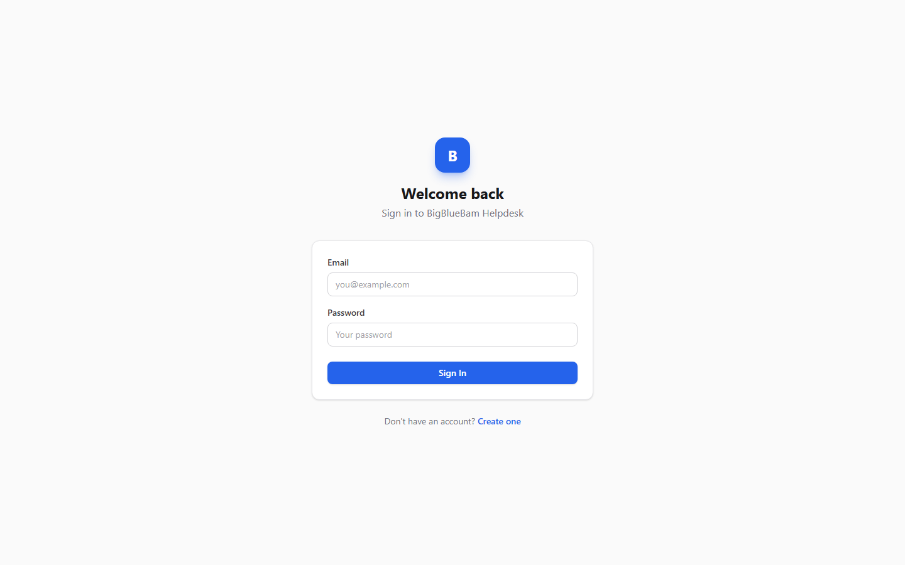
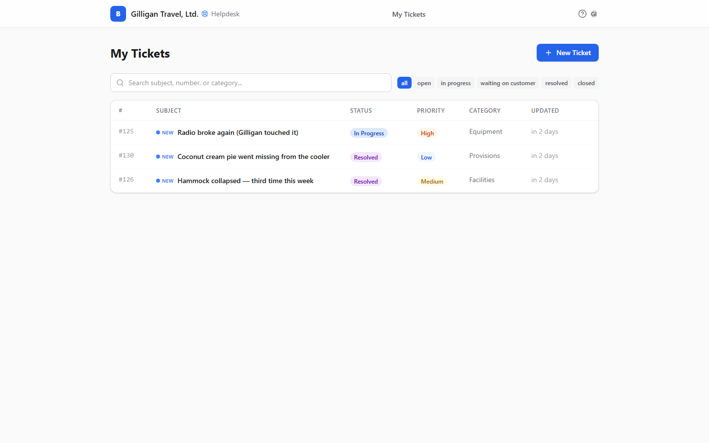
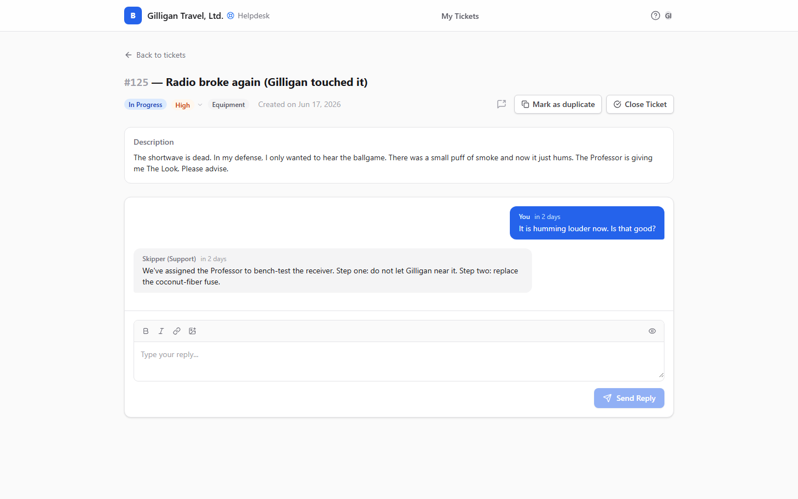
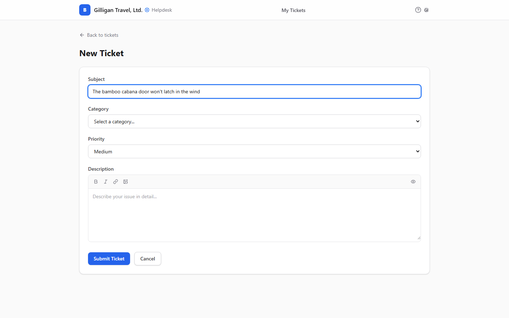

# Helpdesk (Support Portal) Guide

# Helpdesk - Customer Support

Helpdesk is BigBlueBam's customer-facing support portal. Each organization gets its own portal at `/helpdesk/<org-slug>/` where end users register with their own email and password, file support tickets, and track each one as a threaded conversation. Customer sign-in is completely separate from the suite single sign-on that staff use, so a customer never needs a Bam account. Support agents work the same tickets from the agent surface and from Bam, where every ticket is mirrored to a project task.

## Key Features

- **Org-scoped portals** at `/helpdesk/<org-slug>/`, with optional per-project portals at `/helpdesk/<org-slug>/<project-slug>/`. Any org with a Helpdesk settings row is live.
- **Separate customer authentication** with self-registration, login, optional email verification, allowed-domain restrictions, and a per-org signup-disabled switch.
- **Ticket lifecycle** through five statuses (Open, In Progress, Waiting on Customer, Resolved, Closed) with Low, Medium, High, and agent-only Critical priorities and optional categories.
- **Threaded conversations** with customer replies, agent replies, internal agent notes hidden from customers, inline images, and owner-scoped file attachments.
- **Duplicate handling**, both a customer-side annotative "mark as duplicate" and a true agent-side merge that moves messages onto the primary and closes the source.
- **Ticket to task mirroring**: every ticket spawns a Bam task in the portal's default project, and closures move that task to a terminal state.
- **Agent queue and settings** over REST and MCP, including SLA badges, similar-ticket search, and per-org configuration of default project, categories, welcome message, and verification.
- **Browser notifications** and **offline support** for reliable ticket tracking from the customer portal.

## Integrations

Helpdesk tickets become Bam tasks in the default project, so internal teams triage and assign support work alongside other project work. Agents authenticate on the agent surface with a per-agent agent API key (prefixed `hdag_`), distinct from the suite single sign-on. Customers and agents can share a ticket into a Banter channel for internal discussion. Bolt automations react to ticket lifecycle events (created, message posted, status changed, closed, reopened, user upserted, and SLA breached). Helpdesk also feeds the cross-suite unified activity view, and its MCP tools let agents triage, search, find similar tickets, upsert users, and read or edit settings. The actual knowledge base product is the separate Beacon app; Helpdesk has none of its own.

## Getting Started

Customers go to their organization's portal (for example `/helpdesk/your-org/`), create an account or sign in, then click **New Ticket** to file an issue with a subject, priority, optional category, and a rich-text description. They follow the ticket on **My Tickets** and reply in its conversation. Agents pick up incoming tickets from the agent queue or from Bam's ticket views, reply or add internal notes, and move the ticket through its statuses to Resolved or Closed. Admins configure each portal's default project, categories, welcome message, and verification settings before going live.

## Walkthrough

### Portal Entry

### Ticket List

### Ticket Detail

### New Ticket

## MCP Tools

# helpdesk MCP Tools

| Tool | Description | Parameters |
|------|-------------|------------|
| `get_ticket` | Get detailed information about a helpdesk ticket including messages | `ticket_id` |
| `helpdesk_get_public_settings` | Get public helpdesk settings (no auth required). Returns email verification requirement, categories, and welcome message. | none |
| `helpdesk_get_settings` | Get full helpdesk configuration. Requires admin authentication — the caller\ | none |
| `helpdesk_get_ticket_by_number` | Resolve a helpdesk ticket by its human-readable ticket number (e.g. 1234 or #1234). Leading  | `number` |
| `helpdesk_search_tickets` | Fuzzy search helpdesk tickets by subject and body within the caller\ | `query`, `status`, `assignee_id` |
| `helpdesk_set_default_project` | Set the default project for incoming helpdesk tickets for a specific organization. Identifies the org by slug (e.g.  | `org_slug`, `project_slug` |
| `helpdesk_update_settings` | Update helpdesk settings. Requires admin authentication. | `categories`, `welcome_message`, `require_email_verification`, `allowed_email_domains` |
| `helpdesk_upsert_user` | Idempotent create-or-update of a helpdesk end-user by email. Natural key is (org_id, email); the tool resolves the org via the provided org_slug. Returns { data, created, idempotency_key }. SECURITY: the update path ignores the password field, so calling this tool on an existing email cannot change that user\ | `org_slug`, `email`, `display_name`, `password`, `email_verified`, `is_active` |
| `list_tickets` | List helpdesk tickets with optional filters | `status`, `assignee_id`, `client_id`, `cursor`, `limit` |
| `reply_to_ticket` | Send a message on a helpdesk ticket (public reply or internal note) | `ticket_id`, `body`, `is_internal` |
| `update_ticket_status` | Update the status of a helpdesk ticket | `ticket_id`, `status` |

## Related Apps

- [Bam (Project Management)](../bam/guide.md)
- [Banter (Team Messaging)](../banter/guide.md)
- [Bench (Analytics)](../bench/guide.md)
- [Blank (Forms)](../blank/guide.md)
- [Blueprint](../blueprint/guide.md)
- [Bolt (Workflow Automation)](../bolt/guide.md)
- [Book (Scheduling)](../book/guide.md)
