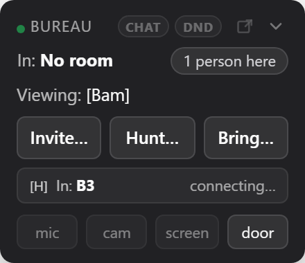

# Introduction to BigBlueBam

Sixteen apps that behave like one product, built for people and AI agents together.

- One login, one organization, one permission model across project management, CRM, chat, help desk, docs, whiteboard, knowledge, scheduling, invoicing, analytics, forms, automation, goals, diagrams, and email
- Work crosses apps without re-keying: a deal becomes a project, a sticky note becomes a task, a won deal becomes an invoice
- Pervasive presence: every app is a live, shared space where you can see who's here and pull a teammate into voice or video in one tap, the way you'd bump into them in the hallway instead of booking a meeting
- Agent-ready by design: 847 MCP tools let an AI assistant work the same boards, with the same permissions and audit trail as a teammate
- Event-driven automation connects every app, so when this happens, the next thing just happens
- Open source and self-hostable: run the whole stack on your own hardware and export your data with plain SQL

## See It in Action

---

Part of the [BigBlueBam](/) productivity suite.
