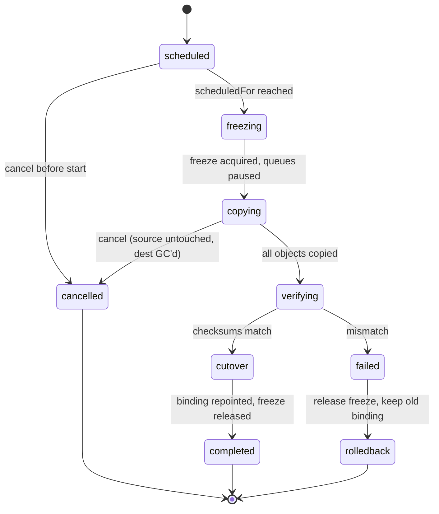
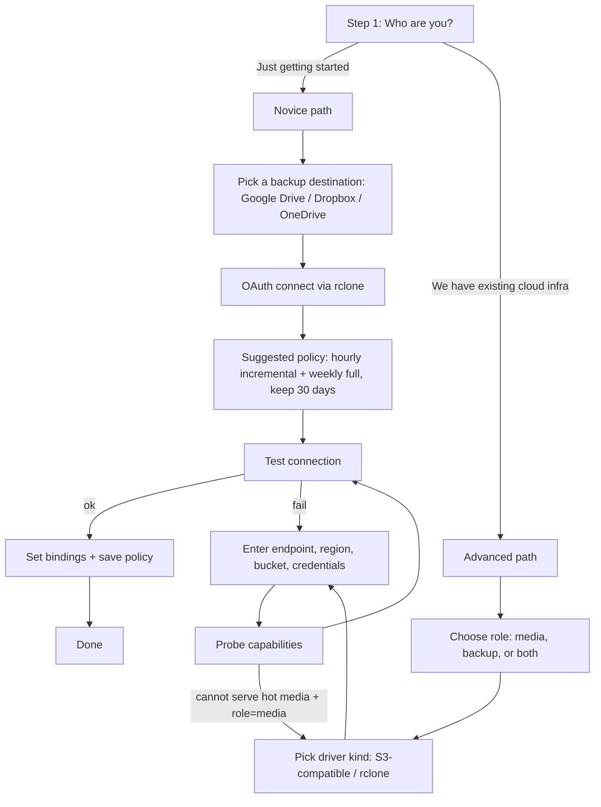

# Bin: Storage Providers, Backups, and Provider Migration

Status: design (Wave 2 candidate).
Audience: anyone building the Bin storage substrate, the backup engine, or the
provider-migration flow on top of the BigBlueBam platform.

This document specifies how Bin manages third-party storage providers for both
live media and backups, how those providers are configured (org admins, owners,
and SuperUser installation defaults), how scheduled provider migrations freeze
the instance safely, and the backup policy model. It follows suite conventions
(Fastify v5, Drizzle, Zod, React 19 + Radix, PostgreSQL 16, Redis, BullMQ,
nginx, sequential port registry).

---

## 1. Goals and non-goals

### Goals

- One configuration home (Bin) for every storage decision: which provider holds
  live media, which holds backups, and what the backup cadence is.
- Maximum openness. An enterprise should be able to point Bin at storage infra
  it already runs (its own S3 bucket, its own MinIO, its own GCS) rather than
  signing up for anything new.
- A novice path that is a short wizard ending in a working "back up to my Google
  Drive" configuration with no infrastructure knowledge required.
- Bin is the universal media interface: upload, browse, and access media across
  the suite, backed by whatever provider the org configured.
- Safe, scheduled, reversible provider migration with a hard write freeze and a
  live monitor.
- Standard backup controls: independent cadences for incremental and
  full/consolidated runs, plus retention duration.

### Non-goals

- Bin does not become a sync client (no two-way continuous mirror of a consumer
  drive). Consumer drives are backup targets, not live-media stores.
- Bin does not replace per-cloud lifecycle tooling. If an enterprise wants
  Glacier transitions, Bin writes to the bucket and the customer's S3 lifecycle
  rule handles tiering. Bin exposes the hook, not a reimplementation.
- No model-layer or app-layer changes to how other apps reference files beyond
  pointing them at the shared storage package.

---

## 2. Where this lives in the codebase

Two concerns, two homes. This split matters because the freeze has to be
enforced at the shared write path, which is core infrastructure, while the
media browser is an app.

| Concern | Home | Why |
|---|---|---|
| Storage driver abstraction | `packages/storage` (`@bigbluebam/storage`) | Shared by core api, bin-api, and worker. Single driver implementation. |
| Provider config, backup engine, migration, freeze | `apps/api` (+ `worker`) | Platform infrastructure. Sits beside `visibility`, `superuser`, `attachments`, platform settings. Freeze must hook the shared auth/write middleware. |
| Media browser, asset/folder CRUD, upload UI | `apps/bin-api` + `/bin/` frontend route | Bin is an app like Board or Bond. Registers `bin.*` entity types. |

Two attachment layers already exist and Bin reconciles with both rather than
replacing them wholesale. There is the original task-scoped `attachments` table
(`task_id`, `uploader_id`, `filename`, `content_type`, `size_bytes`,
`storage_key`, `thumbnail_key`, plus the `scan_status` / `scan_signature` /
`scanned_at` / `scan_error` columns added in migration 0131), and the later
federated cross-app substrate exposed through `GET /v1/attachments/:id` and
`GET /v1/attachments` plus the `attachment_get` / `attachment_list` /
`attachment_meta` tools, which carries supported parent types and surfaces that
same per-object scan status. The federated substrate is the seam: its tools become
thin consumers of `@bigbluebam/storage`, so every app's attachments transparently
land on whatever provider the org configured, which is the "Bin as universal
storage backbone" outcome. The task-scoped table keeps working unchanged; its
`storage_key` resolves through the active media binding like any other asset.

nginx already exposes `/files/`, proxied to the core api (`api:4000/files/`),
which presigns and streams from MinIO (it is not a direct nginx-to-MinIO route).
Bin does not remove that route; presigned reads (Section 6.1) supersede it for
new media, and `/files/` remains as the proxied-read fallback path.

`bin-api` is assigned the next free port from the sequential registry. The
committed registry is fully packed 4000-4015 today: mcp-server 3001, api 4000,
helpdesk-api 4001, banter-api 4002, voice-agent 4003, beacon-api 4004, brief-api
4005, bolt-api 4006, bearing-api 4007, board-api 4008, bond-api 4009, blast-api
4010, bench-api 4011, book-api 4012, blank-api 4013, bill-api 4014, blueprint-api
4015 (and bureau-api, which deliberately re-uses container-internal 4015 in its
own network namespace, routed by hostname not port). So bin-api takes **4016**,
the next free value. Use the registry value, not the placeholder `40NN` used in
examples below. nginx routes `/bin/` to the bin-api SPA and `/bin/api/*` to the
service, matching the other apps.

---

## 3. Driver abstraction

Almost every provider worth supporting speaks the S3 API. The ones that do not
(consumer drives) are exactly the ones that should only ever be backup targets.
That gives three driver kinds, not N integrations.

| Driver kind | Covers | Hot media | Backup target |
|---|---|---|---|
| `s3` | AWS S3 (+ tiers), Cloudflare R2, GCS (interop), Backblaze B2, Wasabi, DigitalOcean Spaces, Storj, MinIO, Ceph/Garage, any S3-compatible endpoint | Yes | Yes |
| `rclone` | Google Drive, Dropbox, OneDrive, Box, and 70+ other backends | No (refused at bind time) | Yes |
| `local` | Bundled MinIO / on-disk default | Yes | Yes (dev/small) |

`rclone` runs as a binary in the `worker` image (and an optional `rclone rcd`
sidecar for streaming progress). The api and bin-api never stream user bytes
through rclone; it is invoked only by backup and migration jobs. This keeps the
hot path on presigned S3 URLs and keeps consumer-drive quirks off the request
path.

### 3.1 Driver interface

```ts
// packages/storage/src/driver.ts

/**
 * Static description of what a driver instance can do. Bin uses these flags to
 * decide which roles a provider may be bound to (a provider that cannot serve
 * presigned GETs may not back a hot-media binding) and which backup strategies
 * are available (manifest-diff incremental needs listObjects + a stable etag).
 */
export interface StorageCapabilities {
  /** Can serve user reads directly via a time-limited signed URL. */
  supportsPresignedGet: boolean;
  /** Can accept direct browser uploads via a signed URL (offloads the API). */
  supportsPresignedPut: boolean;
  /** Server-side multipart upload for large media. */
  supportsMultipart: boolean;
  /** Server-side copy within the same provider (fast same-family migration). */
  supportsServerSideCopy: boolean;
  /** Per-object versioning is available (affects incremental + rollback). */
  supportsVersioning: boolean;
  /** Stable per-object integrity token (etag/crc) for manifest diffing. */
  integrityToken: 'etag' | 'crc32c' | 'md5' | 'none';
  /** Whether the driver may be bound to a live-media role at all. */
  canServeHotMedia: boolean;
}

export interface PutResult { key: string; size: number; integrity: string; }
export interface ObjectStat { key: string; size: number; integrity: string; modifiedAt: Date; }

/**
 * A configured, ready-to-use storage backend. One instance per
 * storage_providers row. Construction is cheap; credentials are injected
 * already-decrypted by the provider factory, never read from the row directly.
 */
export interface StorageDriver {
  readonly kind: 's3' | 'rclone' | 'local';
  readonly capabilities: StorageCapabilities;

  /** Validate credentials + reachability. Used by test-connection and the wizard. */
  healthCheck(): Promise<{ ok: boolean; latencyMs: number; detail?: string }>;

  put(key: string, body: NodeJS.ReadableStream, opts?: { contentType?: string }): Promise<PutResult>;
  getStream(key: string): Promise<NodeJS.ReadableStream>;
  stat(key: string): Promise<ObjectStat | null>;
  delete(key: string): Promise<void>;

  /** Required for hot media when supportsPresignedGet is true. */
  presignGet?(key: string, ttlSeconds: number): Promise<string>;
  presignPut?(key: string, ttlSeconds: number, opts?: { contentType?: string }): Promise<string>;

  /** Paginated listing for backup manifests and migration enumeration. */
  list(prefix: string, cursor?: string): Promise<{ objects: ObjectStat[]; cursor?: string }>;

  /** Same-provider fast copy when supportsServerSideCopy is true. */
  copyTo?(destKey: string, sourceKey: string): Promise<void>;
}
```

The factory resolves a `storage_providers` row to a driver, decrypting secrets
through the secrets service (Section 6.3) at construction time only.

---

## 4. Data model

All tables are Drizzle-defined in `apps/api/src/db/schema/storage.ts`. Migration
files follow the existing numbered convention and pass `pnpm lint:migrations`
and `pnpm db:check`.

### 4.1 Providers

```ts
/**
 * A configured storage backend. org_id is null for platform-level providers
 * configured by a SuperUser (installation defaults / managed-host providers).
 * Org-level rows have a concrete org_id and are only visible/editable to that
 * org's admins and owners.
 */
export const storageProviders = pgTable('storage_providers', {
  id: uuid('id').primaryKey().defaultRandom(),
  orgId: uuid('org_id').references(() => organizations.id, { onDelete: 'cascade' }), // null = platform
  name: text('name').notNull(),                 // human label, e.g. "Prod S3 (us-east-1)"
  kind: text('kind').notNull(),                 // 's3' | 'rclone' | 'local'  (CHECK constrained)
  // Non-secret config: endpoint, region, bucket, rclone remote type, base path.
  config: jsonb('config').notNull(),            // validated by a per-kind Zod schema
  capabilitiesCache: jsonb('capabilities_cache'),// last probed capabilities
  status: text('status').notNull().default('unverified'), // unverified|healthy|degraded|error
  lastCheckedAt: timestamp('last_checked_at'),
  createdBy: uuid('created_by').references(() => users.id),
  createdAt: timestamp('created_at').notNull().defaultNow(),
}, (t) => ({
  // A provider name is unique within its scope (org or platform).
  uniqName: uniqueIndex('storage_providers_scope_name').on(t.orgId, t.name),
}));
```

### 4.2 Secrets (separate table, encrypted, never returned)

```ts
/**
 * Envelope-encrypted credential material for a provider. Kept out of the
 * providers row so the providers row can be returned to the UI freely. The
 * ciphertext never leaves the server; the API returns only a fingerprint and
 * the last 4 characters of the access key for display.
 */
export const storageProviderSecrets = pgTable('storage_provider_secrets', {
  providerId: uuid('provider_id').primaryKey().references(() => storageProviders.id, { onDelete: 'cascade' }),
  ciphertext: text('ciphertext').notNull(),     // AES-256-GCM of the secret bundle
  iv: text('iv').notNull(),
  keyId: text('key_id').notNull(),              // which master key / KMS key wrapped this
  fingerprint: text('fingerprint').notNull(),   // sha256(access key id), shown in UI
  displayHint: text('display_hint'),            // e.g. "AKIA…7Q3F"
  updatedAt: timestamp('updated_at').notNull().defaultNow(),
});
```

### 4.3 Bindings (what each provider is used for)

```ts
/**
 * Binds a provider to a role. Decoupling assets from providers via a binding
 * pointer (rather than writing the provider id onto every asset row) is what
 * makes migration a single repoint instead of a mass row rewrite.
 *
 * role values:
 *   'media'   - the live-media + attachment store for this scope (exactly one active)
 *   'backup'  - the backup destination for this scope (exactly one active)
 */
export const storageBindings = pgTable('storage_bindings', {
  id: uuid('id').primaryKey().defaultRandom(),
  orgId: uuid('org_id').references(() => organizations.id, { onDelete: 'cascade' }), // null = platform default
  role: text('role').notNull(),                 // 'media' | 'backup'
  providerId: uuid('provider_id').notNull().references(() => storageProviders.id),
  isActive: boolean('is_active').notNull().default(true),
  // Old binding kept as read fallback during/after migration until torn down.
  supersededBy: uuid('superseded_by'),
  createdAt: timestamp('created_at').notNull().defaultNow(),
}, (t) => ({
  // At most one active binding per (scope, role).
  oneActive: uniqueIndex('storage_bindings_one_active')
    .on(t.orgId, t.role).where(sql`is_active = true`),
}));
```

### 4.4 Asset reference shape

Bin assets (and the federated attachment rows) store `(binding_id, object_key,
size, integrity, content_type)`. They do not store the provider id directly.
Reads resolve `binding_id -> active provider`, with a fallback to
`superseded_by` if the object has not yet been confirmed present on the new
provider. This is the mechanism that makes cutover atomic and rollback free.

### 4.5 Backup policy and runs

```ts
/**
 * A backup schedule for a scope. Two independent cadences, exactly as a typical
 * operator wants: e.g. hourly incremental + weekly full. Retention is expressed
 * as a duration plus a minimum count so a quiet week never prunes the last good
 * full.
 */
export const backupPolicies = pgTable('backup_policies', {
  id: uuid('id').primaryKey().defaultRandom(),
  orgId: uuid('org_id').references(() => organizations.id, { onDelete: 'cascade' }), // null = platform
  enabled: boolean('enabled').notNull().default(true),
  targetBindingId: uuid('target_binding_id').notNull().references(() => storageBindings.id),
  incrementalCron: text('incremental_cron'),    // e.g. '0 * * * *'  (hourly)  null = none
  fullCron: text('full_cron'),                  // e.g. '0 3 * * 0'  (Sun 03:00) null = none
  retainDays: integer('retain_days').notNull().default(30),
  minFullCount: integer('min_full_count').notNull().default(2), // never prune below this many fulls
  includeDatabase: boolean('include_database').notNull().default(true),
  includeObjects: boolean('include_objects').notNull().default(true),
  verifyMode: text('verify_mode').notNull().default('thorough'), // 'thorough' | 'quick' (Section 8.5.4)
  createdAt: timestamp('created_at').notNull().defaultNow(),
});

export const backupRuns = pgTable('backup_runs', {
  id: uuid('id').primaryKey().defaultRandom(),
  policyId: uuid('policy_id').notNull().references(() => backupPolicies.id, { onDelete: 'cascade' }),
  type: text('type').notNull(),                 // 'incremental' | 'full'
  state: text('state').notNull().default('queued'), // queued|running|verifying|completed|failed
  basePrefix: text('base_prefix').notNull(),    // destination prefix, timestamped
  manifestKey: text('manifest_key'),            // object listing + checksums for this run
  parentRunId: uuid('parent_run_id'),           // incremental chain pointer to prior run
  objectsCopied: integer('objects_copied').default(0),
  bytesCopied: bigint('bytes_copied', { mode: 'number' }).default(0),
  dbDumpKey: text('db_dump_key'),
  schemaHead: text('schema_head'),              // last applied migration id at capture (Section 8.7)
  appVersion: text('app_version'),              // platform version that took the backup
  pgMajor: integer('pg_major'),                 // PostgreSQL major version at capture
  scope: text('scope').notNull().default('org'),// 'org' (logical export) | 'platform' (full cluster)
  startedAt: timestamp('started_at'),
  finishedAt: timestamp('finished_at'),
  error: text('error'),
});
```

### 4.6 Migration jobs

```ts
/**
 * A scheduled or running provider migration. Scope is the org (org_id set) or
 * the whole instance (org_id null, SuperUser-initiated). The state machine in
 * Section 7 drives both the freeze and the monitor.
 */
export const storageMigrations = pgTable('storage_migrations', {
  id: uuid('id').primaryKey().defaultRandom(),
  orgId: uuid('org_id').references(() => organizations.id, { onDelete: 'cascade' }), // null = platform-wide
  role: text('role').notNull(),                 // 'media' | 'backup'
  fromProviderId: uuid('from_provider_id').notNull().references(() => storageProviders.id),
  toProviderId: uuid('to_provider_id').notNull().references(() => storageProviders.id),
  state: text('state').notNull().default('scheduled'),
  scheduledFor: timestamp('scheduled_for').notNull(),
  retainSourceDays: integer('retain_source_days').notNull().default(7),
  verifyMode: text('verify_mode').notNull().default('thorough'), // 'thorough' | 'quick' (Section 8.5.4)
  objectsTotal: integer('objects_total').default(0),
  objectsDone: integer('objects_done').default(0),
  bytesTotal: bigint('bytes_total', { mode: 'number' }).default(0),
  bytesDone: bigint('bytes_done', { mode: 'number' }).default(0),
  startedAt: timestamp('started_at'),
  frozenAt: timestamp('frozen_at'),
  cutoverAt: timestamp('cutover_at'),
  finishedAt: timestamp('finished_at'),
  cancelRequestedBy: uuid('cancel_requested_by'),
  error: text('error'),
  createdBy: uuid('created_by').references(() => users.id),
  createdAt: timestamp('created_at').notNull().defaultNow(),
});
```

---

## 5. Configuration access control

Bin uses the platform's granular permission system (`@bigbluebam/permissions`),
not hardcoded role gates. There is no `requireOrgRole` helper in the codebase;
every app gates routes with the `requireCan(permissionId)` Fastify middleware over
a catalog of `app.resource.verb` permission ids resolved per-user by
`packages/permissions/src/resolver.ts`. Authority is therefore **delegatable, not
level-locked**: each storage permission ships with a sensible default grant on the
builtin Owner/Admin groups, but an Org Owner/Admin can grant any of them to an
individual member through a per-account override (`account_permissions`, surfaced
in the People > Access UI) without promoting that member's role. This is exactly
the requested model — gated to Owner/Admin by default, but tweakable so a specific
member can be given, say, backup-and-restore authority and nothing else.

**The permission catalog Bin adds.** Seeded via a new
`NNNN_permissions_seed_actions_delta_009.sql` migration (the catalog is
append-only; migrations 0144-0194 are the pattern) and regenerated into
`packages/permissions/src/generated/permissions.ts`:

| Permission id | Default builtin grant | Flags | Backs |
|---|---|---|---|
| `bin.provider.list` | Admin, Owner | read | List providers (secrets never returned) |
| `bin.provider.create` | Admin, Owner | — | Create a provider |
| `bin.provider.update` | Admin, Owner | — | Edit config / rotate secret |
| `bin.provider.test` | Admin, Owner | read | Health + capability probe |
| `bin.binding.list` | Admin, Owner | read | View media/backup bindings |
| `bin.binding.set` | Owner | destructive, requires_confirmation | Repoint a role's active binding |
| `bin.backup_policy.set` | Admin, Owner | — | Cadences + retention |
| `bin.backup.run` | Admin, Owner | — | Trigger an ad-hoc backup |
| `bin.backup.list` | Admin, Owner | read | Run history + restore points |
| `bin.restore.run` | Owner | destructive, requires_confirmation | Restore from a point (freeze-gated) |
| `bin.migration.schedule` | Owner | destructive, requires_confirmation | Schedule a provider migration |
| `bin.migration.get` | Admin, Owner | read | Monitor (freeze-exempt) |
| `bin.migration.cancel` | Owner | destructive | Cancel / roll back (freeze-exempt) |

The platform-scope variants (the installation-defaults panel, platform providers,
and instance-wide migration/restore under `/superuser/storage/*`) are flagged
`requires_superuser: true` in the catalog, so the resolver allows them only for
SuperUsers regardless of group or override — these are intentionally **not**
delegatable to org members. The resolver short-circuits to `superuser_bypass` for
SuperUsers and returns a `requires_superuser` deny for everyone else.

**Defaults, delegation, and rank.**

- *Default*: a fresh org's builtin Owner and Admin groups carry the grants above;
  member/viewer/guest groups do not. This reproduces the "gated to Owner/Admin"
  behavior with zero extra configuration.
- *Delegation*: an Owner/Admin grants an individual the specific permission via an
  `account_permissions` override (`granted = true`) at org scope. The resolver
  reads account overrides before group defaults (`org_override` beats
  `org_group_default`), so the member gains exactly that one action. Revocation is
  the inverse override or its removal.
- *Rank*: the existing `checkRankAbove(callerRole, targetRole, …)` rule
  (`apps/api/src/services/org.service.ts`) still governs operations that act on
  another principal's work — e.g. an Admin cannot cancel a migration an Owner
  scheduled unless they are an Owner or SuperUser.

All SuperUser storage actions write to `superuser_audit_log`; all org-scoped
actions write to `activity_log` with the appropriate action string (e.g.
`storage.provider.created`, `storage.migration.scheduled`).

### 5.1 SuperUser installation-defaults panel

A panel under the existing `/superuser` area, not visible to org admins. It sets
platform-level rows (`org_id = null`) that new orgs inherit and that constrain
what orgs may do:

- Default media provider and default backup provider for new orgs.
- A default backup policy template applied to new orgs.
- An allowlist of permitted driver kinds (e.g. a managed SaaS deployment may
  disable `local` and require `s3`; an air-gapped deployment may permit only
  `local`/on-prem MinIO).
- A toggle: may orgs configure their own providers, or are they locked to
  platform-provided storage? (Managed multi-tenant hosts typically lock this;
  self-hosted single-tenant leaves it open.)
- A toggle: **allow Convenience recovery mode for S3-style backup destinations**
  (Section 8.6.3), default ON. When on, an org backing up to an S3 bucket may
  choose Convenience mode, warned in plain language that anyone who can read the
  bucket can restore the data. When off, S3 destinations are forced to Protected
  mode. The default is ON deliberately: small teams sometimes run on S3 for
  unrelated reasons, and forcing them into a higher-security scheme they are not
  equipped to operate produces backups they cannot restore, which is the worse
  outcome. (OAuth/consumer destinations are unaffected by this toggle; their
  Convenience mode is always available because re-authentication is the anchor.)

These defaults are read through the same provider/binding resolution path, so a
new org with no rows of its own transparently uses the platform binding.

---

## 6. Bin media interface

### 6.1 Upload

```
Client                bin-api                 active media provider
  | request upload      |                            |
  |-------------------->| resolve media binding      |
  |                     | -> provider.presignPut()   |
  |   signed PUT url     |<---------------------------|
  |<--------------------|                            |
  |---- PUT bytes -------------------------------------->|   (browser to provider, bytes skip the API)
  | confirm complete    |                            |
  |-------------------->| stat() to verify size/etag |
  |                     | INSERT bin asset row       |
  |   asset metadata     |                            |
  |<--------------------|                            |
```

When the active provider lacks `supportsPresignedPut` (rare, and never the case
for a hot binding since `rclone` is refused there), bin-api falls back to a
proxied multipart upload. Reads are symmetric: `presignGet` for a time-limited
URL, proxied stream only as a fallback.

### 6.1.1 Upload limits and virus scanning

Bin inherits and centralizes the upload safety rules the suite already applies
(Section 19 of the core design document): a configurable maximum object size
(currently 25 MB, raised per binding for media-heavy orgs), content-type
validation, and a storage location with no public access (presigned URLs only,
never a public bucket).

Scanning reuses the federated attachment substrate's existing scan-status
*field* rather than inventing a parallel one, but it must supply the scanner that
field has always anticipated. As-built today the `scan_status` column (on the
task `attachments` table, migration 0131, CHECK-constrained to `pending` |
`clean` | `infected` | `error`) is a **placeholder that nothing writes**: it is
only ever read, defaults to `pending`, and the suite ships no AV worker job. The
helpdesk attachment code says so explicitly ("a future ClamAV job would flip
it"). Bin is therefore the first part of the suite to actually populate it, not a
consumer of an existing scanner. Bin adds the column to its own `bin_assets` row
with the same value set plus a new `skipped` value (an additive migration to the
shared CHECK), and ships the AV worker job for the whole suite. The flow:

1. On upload completion, bin-api inserts the asset with `scan_status = 'pending'`
   and enqueues a new AV scan job (ClamAV by default, a cloud scanner where
   configured). This worker job is net-new: it is the first scanner in the suite,
   and once it exists the pre-existing `attachments.scan_status` placeholder can
   be wired to the same job.
2. A `pending` asset is uploadable and listable but is not served by a presigned
   GET; reads return a "scan in progress" state so an unscanned object is never
   handed to another user.
3. On `clean`, the asset becomes readable. On `infected`, the object is
   quarantined (kept for audit, never served) and the uploader and org admins are
   notified. On `error` (scan could not complete), the asset is treated as
   unreadable and retried, never served on a failed scan.
4. `skipped` (the new value) covers deployments that disable scanning (an
   explicit SuperUser choice), and behaves like `clean` for serving while
   remaining visible in audit as unscanned.

Backups copy assets regardless of scan status, but the manifest records the
status, so a restore never silently promotes a quarantined object to readable.

### 6.2 Entity-type registration (required gate)

Per the agent conventions, every entity an agent can cite or surface must be
registered in `SUPPORTED_ENTITY_TYPES`
(`apps/api/src/services/visibility.service.ts`) with a `can_access` branch.
Unregistered types deny by default. Bin registers:

| entity_type | physical table | visibility rule (summary) |
|---|---|---|
| `bin.asset` | `bin_assets` | org-scoped; if `project_id` set, project member or org admin/owner; if `visibility='Private'`, owner only |
| `bin.folder` | `bin_folders` | inherits its parent folder/project rule; org admin/owner override |

The preflight predicate mirrors Bin's own access predicate, and the two are kept
in lockstep exactly as `documentVisibilityPredicate` and the brief preflight
are. Until these branches exist, agents must not surface Bin entities.

---

## 7. Provider migration and the write freeze

This is the part with teeth. A migration copies everything from the source
provider to the destination, then atomically repoints the binding. While it
runs, writes are frozen so nothing is written to the source after the manifest
is taken.

### 7.1 State machine



Migration is always copy-then-cutover, never move. The source is retained as a
read fallback for `retainSourceDays` after cutover, which makes rollback free
and lets you defer teardown until you trust the new provider.

### 7.2 Sequence

1. Scheduled. Admins/owners (or SuperUser for platform) pick from/to provider,
   a time, and source retention. Affected users get advance notices (Section
   7.5). The destination provider must already be `healthy`.
2. Freezing. At `scheduledFor`, a worker job sets the freeze flag (Section 7.3),
   pauses all write-bearing BullMQ queues except the migration queue, and waits
   a short grace period for in-flight writes to drain.
3. Copying. Enumerate the source into a manifest. Copy with `copyTo` when source
   and destination share a provider family (fast, server-side); otherwise stream
   via the worker (S3-to-S3 or rclone for cross-family). Parallelized,
   resumable, and progress (`objectsDone`, `bytesDone`) is written continuously
   for the monitor and ETA.
4. Verifying. Compare size + integrity token for every object (or a sampled
   subset for very large stores, configurable). Any mismatch fails the run.
5. Cutover. In one transaction: mark the new binding active, set the old
   binding `superseded_by`, leave the old binding readable. Asset rows are
   untouched because they point at the binding, not the provider.
6. Release. Clear the freeze, resume queues, record `cutoverAt`/`finishedAt`.
7. Teardown (later, optional). After `retainSourceDays`, a job may delete source
   objects and deactivate the old binding. This is a separate, reversible step.

### 7.3 The freeze mechanism

Source of truth is a row; the hot check is Redis so it costs nothing per
request.

- Org freeze: `organizations.write_frozen_until` + `write_freeze_reason` +
  `write_freeze_migration_id`, mirrored to Redis key `freeze:org:{orgId}`.
- Platform freeze: a `platform_settings` row mirrored to `freeze:platform`.

Freeze scope follows operation scope, with no exceptions. An org-scoped
operation (an org migration or an org full-restore) freezes only that org via
`freeze:org:{orgId}`; other orgs on a multi-tenant instance keep working and
never see a notice. Only a SuperUser platform-scoped operation sets
`freeze:platform`, which blocks writes everywhere. The preHandler checks the
caller's active org against `freeze:org:{orgId}` first, then `freeze:platform`,
and a request is frozen if either matches. For worker queues this means an org
operation pauses only that org's queued write jobs (by org tag on the job),
rather than draining the whole worker.

A `preHandler` in the shared auth plugin runs on every non-idempotent route
(POST/PATCH/PUT/DELETE). If the caller's scope is frozen and the route is not on
the migration-control allowlist, it returns:

```
HTTP 423 Locked
{
  "error": "STORAGE_OPERATION_IN_PROGRESS",
  "operation": "migration" | "restore",
  "scope": "platform" | "organization",
  "operation_id": "…",
  "eta_seconds": 540,
  "message": "A storage operation is in progress. Writes are temporarily disabled."
}
```

This single chokepoint covers more than it looks:

- API writes: blocked directly.
- MCP write tools: the mcp-server proxies to the API (`API_INTERNAL_URL`), so the
  423 propagates. The MCP layer additionally maps it to a friendly tool error so
  an agent sees "the platform is in a maintenance migration, writes are paused"
  rather than a raw status.
- Bolt automations: Bolt actions compile to MCP tool calls, so they inherit the
  same 423 with no extra work. In-flight rules fail closed and are retried after
  the freeze clears.
- Worker jobs: write-bearing queues are paused in step 2, so background writers
  do not bypass the freeze. The migration queue itself stays active.

Reads (GET) are never frozen. Media GETs continue to resolve through the binding
(source still readable pre-cutover, new provider post-cutover).

### 7.4 Monitor and cancel

The migration-control allowlist exempts exactly these from the freeze:

- `GET  /…/storage/migrations/:id` (monitor: state, progress, ETA, recent log)
- `POST /…/storage/migrations/:id/cancel`

Org migrations: gated to that org's admin/owner. Platform migrations: gated to
SuperUser. Everyone else hitting any write route gets the 423 payload, which the
frontend renders as a full-screen blocking notice: "A backend data migration is
in progress" with the live ETA from `eta_seconds`. The estimate is recomputed
from `bytesDone / elapsed` and refreshed over the monitor's polling or WebSocket
channel.

Cancel behavior depends on phase, per the state machine: before cutover it is
always safe (source untouched, partial destination is garbage-collected); after
cutover the operation is a re-point back to the old binding (still intact),
surfaced in the UI as "roll back" rather than "cancel".

### 7.5 User-facing notices

- On schedule: a banner and notification to all affected users with the window
  and expected duration.
- 24h / 1h / 15m before: reminder notifications (configurable).
- During: the blocking 423 screen with live ETA.
- After: a completion notice; on rollback, a "migration was rolled back, no data
  was lost" notice.

---

## 8. Backups

This backup engine supersedes the earlier approach (Section 20.8 of the core
design document and the `backup.sh` script in `docs/guides/operations.md`). As
built today that approach is a six-hourly `pg_dump` to S3, a direct copy of the
MinIO data volume (not a tar), and a Redis `BGSAVE` + RDB copy, with MinIO
cross-region replication for objects; the design doc additionally specifies Redis
AOF persistence plus hourly RDB snapshots with 7-day retention. That approach
stays valid as a floor for a bare deployment, but Bin replaces it with scheduled,
policy-driven, provider-targeted backups that a non-engineer can configure and,
crucially, restore (Sections 8.5 to 8.7).

Two deliberate choices, both of which diverge from the as-built floor and so are
called out explicitly rather than presented as carried over:

- **Redis is not included in Bin backups**, even though the current `backup.sh`
  *does* snapshot it. Bin treats Redis as cache, sessions, and queue state — all
  reconstructable — and accepts session loss on restore. This is a new decision
  for Bin, not an inheritance.
- **A post-restore consistency check.** There is no existing
  `node dist/cli.js verify-integrity` command (the CLI's actual subcommands are
  `create-admin`, `create-user`, `grant-superuser`, `create-api-key`,
  `create-service-account`, `reset-password`, `list-orgs`, and the revoke
  variants). Bin ships this check as net-new — a `node dist/cli.js restore`
  companion that runs the consistency pass — invoked automatically at the end of a
  full restore and offered after a selective one.

The stated targets from 20.8 (RPO under 6 hours; RTO under 1 hour for Tier 1-2
deployments, under 15 minutes for Tier 3+ with orchestration) are a ceiling, not
a floor: a policy with hourly incrementals takes the achievable RPO well below
that.

### 8.1 What a backup contains

- Database. What gets captured depends on the backup's scope, and the
  distinction matters for restore (Section 8.7):
  - A platform backup captures the whole cluster as a `pg_dump` (custom format,
    compressed), including the `schema_migrations` tracking table.
  - An org backup captures an org-scoped logical export: the rows belonging to
    that `org_id` across every table, in a restorable order, plus the schema
    head it was taken at. It is not a whole-cluster dump (that would leak other
    tenants and bloat every org's backup).
  In both cases the DB is captured whole each run rather than diffed, because it
  is the small, consistency-critical part. Enterprises needing point-in-time
  recovery enable WAL archiving (Section 8.4) as the DB-level incremental path.
- Objects: the contents of the media provider, captured per the run type below.
- Manifest: a per-run object listing with sizes and integrity tokens, a pointer
  to the parent run, and the captured schema head, app version, and PostgreSQL
  major version (Section 8.7 uses these to decide whether and how to restore).

### 8.2 Incremental vs full

- Incremental run: copies only objects new or changed since the parent run
  (manifest diff by integrity token / version / mtime) plus the DB dump. Cheap
  and frequent.
- Full / consolidated run: copies the complete object set into a fresh,
  self-contained prefix, collapsing the prior incremental chain into one restore
  point, then applies retention pruning. This is the run you can restore from
  without walking a chain.

The two cadences are independent, exactly as requested. Example policy: hourly
incremental (`0 * * * *`) plus weekly full (`0 3 * * 0`). Both are BullMQ
repeatable jobs keyed off the policy's cron fields.

### 8.3 Retention

`retainDays` sets the duration; `minFullCount` guarantees a floor (never prune
below N fulls even if all are older than `retainDays`). Pruning runs after each
full and removes incrementals orphaned by a pruned full. An optional GFS
(grandfather-father-son) preset can be offered in the wizard for operators who
want daily/weekly/monthly tiers.

### 8.4 Enterprise PITR (optional)

When Postgres is self-managed (not a managed RDS/Cloud SQL where the provider
owns this), an operator can enable WAL archiving to the backup binding. Bin then
treats the logical dump as the periodic base and the archived WAL as the
incremental DB stream, enabling restore to an arbitrary moment. This is an
advanced toggle, off by default, surfaced only when the deployment supports it.

### 8.5 Restore (system still running)

This section is the restore experience for the common case: Bin is up, and
someone needs to get data back. Section 8.6 handles the other case (the system
itself is gone). The two share an engine but differ entirely in how a person
reaches them.

The single most important design point: most real restore needs are surgical,
not catastrophic. "I deleted a folder, get it back" is routine and must not
freeze anyone. "Roll the whole org back to Sunday" is rare and dangerous and
must be hard to do by accident. Bin therefore exposes two distinct restore
modes, and the entry point makes you choose deliberately.

Entry point: Bin > Backups & Recovery > Restore (org `admin`/`owner`; platform
restores under `/superuser/storage`). The screen opens on a restore timeline: a
reverse-chronological list of restore points built from `backup_runs` and their
manifests, each labelled with its time, type (full or incremental), and size,
e.g. "Sun 03:00 full, 12.4 GB" then "Mon 09:00 incremental." Picking a point is
the first action in both modes.

#### 8.5.1 Selective restore (the routine case, no freeze)

For recovering specific things without disturbing the rest of the system. This
covers the overwhelming majority of restores and is deliberately low-ceremony.

1. Pick a restore point from the timeline.
2. Browse or search the snapshot. Bin reads that point's manifest and presents a
   read-only view of what existed then (folders, assets, and recoverable
   entities such as a deleted project or document), with a search box for "I know
   the name, find it."
3. Select what to bring back.
4. Choose how: **Restore alongside current** (items come back into a clearly
   labelled "Restored YYYY-MM-DD" location, nothing existing is touched) or
   **Replace current versions** (the selected items overwrite their live
   counterparts). Alongside is the default, because it is non-destructive.
5. Confirm.

A selective restore runs as a background job, not a freeze. It re-inserts the
chosen rows (or clears their soft-delete) and copies the underlying objects from
the backup destination into the org's current active media provider, so restored
assets point at today's binding, not the binding that was active when the backup
was taken. Progress and a per-item result are shown. Because it only adds or
overwrites the named items, the rest of the org keeps working throughout.

#### 8.5.2 Full / point-in-time restore (the rollback, freeze-gated)

For corruption, a bad bulk operation, ransomware, or any "put everything back to
how it was at time T" situation. This is destructive: it replaces current state,
so it is gated, scoped, and reversible by default.

1. Pick a restore point (or, if WAL archiving is enabled, a precise moment via
   point-in-time recovery).
2. Choose scope: this organization, or (SuperUser only) the whole instance.
3. Read the consequence, stated plainly: "This replaces all data in
   [organization] with its state at [time]. Anything created or changed since
   then will be removed." The screen shows what that means concretely (e.g.
   "approximately 340 items created since then will be removed").
4. Safety snapshot (default ON, strongly recommended): "Back up the current state
   first, so this rollback can itself be undone." Leaving it on means the
   rollback is reversible; turning it off requires acknowledging that current
   state will be unrecoverable.
5. Type-to-confirm the organization (or instance) name, the same friction GitHub
   uses for destructive actions. Owner authority plus the `confirm_action` token.
6. Bin acquires the write freeze scoped to the chosen scope (Section 7.3): org
   rollback freezes only that org; instance rollback freezes the platform. It
   then takes the safety snapshot if requested, restores the DB dump (replaying
   WAL to the chosen moment for PITR), forward-migrates to the current schema
   head (Section 8.7), restores objects from the restore point, verifies, cuts
   over, and releases the freeze.
7. Admins and owners watch the same monitor component used for migration (state,
   progress, ETA) and can cancel before cutover. Everyone else sees the blocking
   423 notice with the live ETA. Sessions are invalidated at completion, so
   everyone signs in again into the restored state.

A full restore is, mechanically, migration run in reverse against a backup
source: freeze, copy, verify, cutover, release, with the same cancel-before-
cutover safety and the same copy-then-cutover guarantee (the safety snapshot is
the "source retained" equivalent that makes the rollback reversible).

#### 8.5.3 Safety rails (both modes)

- Backups never freeze. A backup is a consistent point-in-time copy taken off a
  live system, so reads and writes continue normally while it runs. Only restores
  and migrations freeze, and only at full-restore scope.
- Verification depth is the operator's explicit choice, surfaced wherever a copy
  is verified (backup runs, migrations, restores) as **Thorough** versus
  **Quick**, with the tradeoff spelled out in plain words (Section 8.5.4).
- Every restore is logged (org `activity_log`, platform `superuser_audit_log`)
  with actor, mode, scope, restore point, item count, and outcome. A full restore
  also records the safety-snapshot id so the rollback's reversal is one click.

#### 8.5.4 Verification depth, explained to the operator

Backups, migrations, and restores all copy objects and then check that the copies
are intact. How hard they check is a setting, presented in the UI with this
explanation rather than jargon:

- **Thorough (default): slow but certain.** Bin reads back the integrity token of
  every single object and compares it. If even one byte differs anywhere, it is
  caught. The cost is time and read bandwidth, which grows with the size of the
  store.
- **Quick: fast but probabilistic.** Bin verifies a random sample of objects plus
  every object's size. A targeted single-object corruption can slip through; a
  systemic failure (wrong bucket, truncated transfer, auth error mid-copy) is
  still caught. The cost is much lower and roughly flat regardless of store size.

The control is `verify_mode` on `backup_policies` and on `storage_migrations`
(and chosen inline for a one-off restore), defaulting to `thorough`. `Quick`
maps to the existing `BACKUP_VERIFY_SAMPLE` sampling percentage. Thorough is the
default precisely because a backup or restore you cannot trust is worse than one
that took longer.

### 8.6 Disaster recovery (bare install, no surviving system)

This is the case the design has to get right for the small team: two or three
people, possibly no engineers, who set up Bin once, have not thought about it
since, and have just lost the machine. The answer cannot be a runbook that
assumes they kept anything.

#### 8.6.1 The trap we are avoiding

A backup is only as good as your ability to read it after everything is gone.
The objects and the DB dump live at the backup destination, but two secrets are
needed to use them, and both normally live in the `.env` on the machine that
just died:

1. The credentials to reach the backup destination.
2. The master key (`BIN_SECRETS_KEY`) that decrypts the provider credentials
   stored inside the DB dump.

If recovery depends on those, the honest answer to the small team is "you needed
a copy three years ago," which is unacceptable. So the recovery path must anchor
to something the team still has after losing the machine, and must not require
them to have understood any of this in advance.

#### 8.6.2 The anchor: recover from what they already have

The key move is that the thing which unlocks recovery is something the team can
still reach without the dead machine. Two anchors, by provider type:

- OAuth/consumer backup (the novice path, e.g. Google Drive): the anchor is
  their Google login. On a fresh install they click "Sign in with Google," which
  re-grants access to the same Drive, which is where the backups are. No stored
  credential survives the machine, and none needs to. They already know how to
  sign in to Google.
- S3-style backup (the enterprise path): the anchor is the Recovery Kit (8.6.4),
  a small off-system artifact emailed and downloadable at setup. Enterprises keep
  it in a password manager; that is a normal habit for that audience.

Everything else needed for recovery is written into the backup destination
itself, gated behind the anchor, so the team never has to have saved it.

#### 8.6.3 The keybundle (what lets the dump be read)

Every backup destination carries a `recovery/` area written and refreshed by the
backup engine:

- `recovery/keybundle.enc` contains the master key plus a plaintext-relative copy
  of the active provider coordinates (so bootstrap never depends on first
  decrypting the DB dump). It is encrypted with AES-256-GCM under a key derived
  (Argon2id) from a recovery secret.
- `recovery/manifest.json` is an unencrypted, human-readable pointer file: which
  restore points exist, when each was taken, format version, and the recovery
  security level. This is what the first-run restore screen reads to show the
  team what it found.

The recovery secret that unlocks the keybundle is governed by one explicit
choice made at setup. This is the single decision that determines whether the
small team can ever be locked out:

| Recovery security level | What unlocks the keybundle | What the team must keep | Default for |
|---|---|---|---|
| **Convenience** | A key stored beside the keybundle in the backup destination (`recovery/autounlock.key`). Possession of the destination is sufficient. | Nothing beyond access to the backup destination (their Google login, or the Recovery Kit for S3). | Novice / small team |
| **Protected** | A key derived from a human-held Recovery Code. The destination alone is not enough. | The Recovery Code, off-system. | Enterprise / regulated |

Convenience mode is the deliberate, honest tradeoff for the small team: anyone
who can read your backup destination can restore your data. When that
destination is the team's own private Google Drive, that is usually exactly the
property they want, and it means there is no separate secret to lose. Protected
mode is for operators who accept holding a code in exchange for a destination
breach not being sufficient to read the data. The two modes share all machinery;
the only difference is whether `autounlock.key` is written.

Availability of Convenience mode is itself governed. For OAuth/consumer
destinations it is always offered, because re-authentication is the recovery
anchor and there is no standalone credential to leak. For S3-style destinations
it is offered by default but can be disabled platform-wide by a SuperUser
(Section 5.1), since "anyone who can read the bucket can restore" carries
different weight for a shared bucket than for a personal Drive. The default is
to allow it with a plain-language warning rather than to forbid it, because a
small team that happens to run on S3 should not be pushed into a security scheme
it cannot operate at the cost of a backup it cannot restore.

#### 8.6.4 The Recovery Kit (for non-OAuth destinations)

When the backup destination is not something the team can re-authenticate into
by logging in (i.e. S3-style credentials rather than OAuth), Bin generates a
Recovery Kit at setup and whenever its contents change:

- A one-page artifact (download, print, and emailed to all org owners) holding
  the backup destination coordinates (endpoint, bucket, region, access key) and,
  in Protected mode, the Recovery Code, shown once with forced "I have saved
  this" confirmation.
- Plain-language instructions: "If your system is ever lost, install BigBlueBam
  on any machine, choose Restore, and follow the steps with this page in hand."

For OAuth destinations the kit is optional, because "Sign in with Google" already
reaches the backups. Bin still records the destination so the first-run screen
can name it ("We will look for backups in your Google Drive").

#### 8.6.5 First-run restore (the actual flow a non-engineer follows)

A fresh `docker compose up` on a new machine detects an empty database and shows
a first-run screen with two choices: **Start fresh** or **Restore from a
backup**. Restore is a wizard, not a CLI runbook.

Novice path (OAuth/Drive, Convenience mode), which is the worst-realistic case
done gently:

1. Choose "Restore from a backup," then choose Google Drive.
2. "Sign in with Google." (The thing they still have.)
3. Bin scans for the BigBlueBam backup folder, reads `recovery/manifest.json`,
   and shows what it found: "Latest full backup: Sunday 3:00 AM. Most recent
   change captured: 47 minutes ago." In Convenience mode it unlocks the
   keybundle automatically from `autounlock.key`.
4. "Restore to this point?" One confirmation.
5. Bin restores the DB dump, forward-migrates it to the current schema (Section
   8.7), re-wraps the recovered provider credentials under the new install's
   freshly generated master key, then restores objects from the media provider
   using the recovered coordinates. Progress and ETA shown throughout (same
   monitor component as migration).
6. Done. Everyone signs in again (sessions are not restored, by design). The
   system is back.

Enterprise path (S3, Protected mode): identical, except step 2 is "enter the
backup destination from your Recovery Kit" and step 3 prompts for the Recovery
Code to unlock the keybundle.

A headless CLI equivalent (`node dist/cli.js restore --from-backup`) exists for
operators who prefer it, but the UI wizard is the supported path for the audience
this section is written for.

#### 8.6.6 Keeping recovery trustworthy over time

Because the small team will not think about this again until they need it, Bin
does the thinking for them:

- Recovery status is surfaced on the Bin dashboard next to backup status: "Last
  backup: 2h ago. Recovery: Convenience mode via Google Drive, reachable." If the
  backup destination becomes unreachable, this turns into a visible warning and a
  notification to owners, because a silent broken backup is the real disaster.
- The keybundle and Recovery Kit are regenerated automatically whenever their
  contents change (provider credential rotation, master-key rotation, backup
  destination change). On regeneration in Protected mode, owners are re-prompted
  to save the new kit and the old one is marked stale.
- An optional periodic "recovery check" job verifies that the keybundle and the
  latest restore point are present and readable at the destination, and reports
  the result, so "the backup was quietly failing" is caught before it matters.

#### 8.6.7 The one honest limit

In Protected mode, if the team loses both the backup destination access and the
Recovery Code, the data is unrecoverable by design, because that is what
encryption means. The mitigations are all in 8.6.4 and 8.6.6 (email the kit to
every owner, force a save confirmation, allow escrow with a second teammate, nag
when status degrades). Convenience mode removes this failure entirely for teams
who accept its tradeoff, which is why it is the novice default. The product
should never present Protected mode to a non-technical team without making this
limit explicit in the wizard.

### 8.7 Restoring across schema versions

A backup taken a year ago was taken against a year-old schema. The software it is
being restored into may have applied dozens of migrations since. This section
says exactly what works and what does not, because the honest answer differs by
restore type and the previous draft of this spec glossed over it.

The governing principle: backups are forward-restorable, never backward.
BigBlueBam migrations are forward-only, numbered, append-only, and idempotent
(the suite already lints for this with `pnpm lint:migrations`). That regime is
precisely what makes old backups restorable, and it is also the precondition.

#### 8.7.1 Why a whole-database restore just works

A `pg_dump` includes the `schema_migrations` table (which records each applied
migration's `id`, `checksum`, and `applied_at`), so a year-old dump carries its
own record of which migrations had been applied at capture time. The restore
sequence exploits this:

1. Restore the dump into an empty database. The database is now at the old schema
   head, e.g. `0247`, and its `schema_migrations` rows say so.
2. Run the standard migrate runner. It compares `schema_migrations` against the
   migration files shipped in the current image, sees `0247` as the last applied,
   and applies `0248` through the current head (say `0289`) in order.
3. The database is now at the current schema with the year-old data carried
   forward through every intervening migration, exactly as a continuously running
   install would have arrived there.

This is the same path a fresh `docker compose up` already trusts; restore simply
seeds the starting point. Platform full restore (Section 8.5.2) and bare-install
disaster recovery (Section 8.6) both use it and both handle arbitrarily old
dumps.

Two ordering rules the restore engine must enforce, or this breaks:

- Do not auto-migrate before restoring. On a normal boot the migrate service runs
  automatically, which would create a fresh current-schema database that the old
  dump then collides with. The first-run restore wizard and the restore engine
  bring services up in a restore mode that defers migration, restore the dump
  into the empty database, then trigger migration, then verify the head equals
  current.
- Refuse newer-than-code dumps. If the dump's schema head is higher than the
  highest migration in the running image (someone is restoring a newer backup
  into older software), there is no forward-only path. The restore is refused
  with a clear message: "This backup was taken with a newer version (schema
  0312). This installation only has migrations through 0289. Upgrade to at least
  version X, then restore." WAL replay for PITR lands at the schema of the
  replayed moment and then forward-migrates identically.

#### 8.7.2 Why an org-level restore from an old backup is harder

An org-level restore does not pg_restore a whole cluster; it deletes and
re-inserts one org's rows inside a live database that is already at the current
schema and full of other tenants' data. An org backup is an org-scoped logical
export (Section 8.1), and a year-old export holds rows in the year-old table
shapes. You cannot insert old-shaped rows into new-shaped tables, and you cannot
run a global migration against one org's row subset inside a live cluster. The
earlier draft implied org restore would "just work" across versions. It will not,
and pretending otherwise would corrupt the live database.

The robust general solution is stage-and-forward, which reuses the
whole-database path that already works:

1. Spin up a throwaway scratch database (the restore worker provisions one;
   ephemeral, isolated).
2. Restore the org export into the scratch database and run the migrate runner
   against it, bringing that scratch copy to the current schema by the exact
   mechanism in 8.7.1.
3. Both sides are now at the current schema. Do the logical org-row copy from the
   scratch database into the live instance (delete the org's current rows inside
   the freeze, insert the now-current rows from scratch), then tear the scratch
   database down.

Stage-and-forward means org-level restore across schema versions is supported
without per-table backward-compatibility shims and without ever exposing the live
database to old-shaped rows. It costs a temporary database and the migration time
for one org's data, which is acceptable for what is a rare, deliberate operation.
A fast path skips staging when the backup's schema head already equals the live
head (the common case of a recent backup), going straight to the logical copy.

#### 8.7.3 Selective restore and objects

Objects are schema-independent: bytes in the media provider have no migration
state, so restoring a deleted file is unaffected by how old the backup is. The
metadata row that points at that object does have a shape, so selective restore
of an entity routes through the per-app "restore entity from snapshot" hook
(the same cross-app boundary noted for selective restore). That hook is the
correct place to map an old snapshot row to the current schema for a single
entity, since the owning app knows its own history. For non-trivial version
gaps the hook may itself use the scratch-database staging from 8.7.2 to forward
the entity's data before insertion.

#### 8.7.4 The preconditions, stated plainly

This all holds only if the migration discipline holds:

- Migration history is append-only and immutable. Once released, a migration file
  is never edited or renumbered. Editing an old migration in place would make a
  forward-migrated old dump diverge from a fresh install. This is partly self-
  guarding: `schema_migrations` stores a per-migration `checksum`, so an
  edited-in-place migration can be detected by checksum mismatch at restore time
  rather than relying purely on discipline. The runner should treat a checksum
  mismatch on an already-applied migration as a hard error, not a silent skip.
  Beyond that detection, immutability remains a release-engineering invariant.
- Migrations are data-safe against historical data, not only against
  last-week's data. A migration that backfills or transforms data must operate on
  whatever the column actually contained, never on a point-in-time assumption
  about the data's state when the migration was authored. Structural migrations
  are inherently safe; data-transform migrations need test fixtures that include
  genuinely old shapes.
- Migrations are idempotent (already linted), which keeps a partially-applied or
  retried restore safe to re-run.

A CI check should restore the oldest still-supported backup format into a scratch
database and forward-migrate it to head on every release, so "can we still
restore a year-old backup" is answered by the build, not discovered during an
outage.

---

## 9. The optional wizard

A Radix-based stepper at `/bin/storage/setup`, launchable any time, that
produces a working configuration. Two front doors off step 1.



Recommendations the wizard surfaces (mapping the cold-to-hot landscape to
roles):

- Novice backup: Google Drive (zero infra, OAuth, rclone-backed).
- Hot media, cost-sensitive: Cloudflare R2 or Backblaze B2 + CDN (low/zero
  egress).
- Hot media, enterprise reference: AWS S3 + CloudFront.
- Backups, enterprise: any S3 bucket with a customer-side Glacier/Archive
  lifecycle rule.
- Sovereign / air-gapped: bundled MinIO or on-prem S3 (Ceph/Garage).

The SuperUser variant of the wizard writes platform defaults and the driver-kind
allowlist instead of org bindings.

---

## 10. API surface and MCP tools

REST under `/bin/api/storage/*` (org) and `/superuser/storage/*` (platform).
Every write tool inherits the 423 freeze behavior. The "Authority" column below
names the **default** grant; each row is enforced by `requireCan` against the
matching `bin.<resource>.<verb>` permission from Section 5, so "org admin" / "org
owner" are the builtin-group defaults, not hard level gates — any row can be
delegated to a specific member via an account override (Section 5).

| REST endpoint | MCP tool | Authority | Purpose |
|---|---|---|---|
| `GET /storage/providers` | `storage_provider_list` | org admin | List providers in scope (secrets never returned) |
| `POST /storage/providers` | `storage_provider_create` | org admin | Create a provider (secret bundle write-only) |
| `PATCH /storage/providers/:id` | `storage_provider_update` | org admin | Edit non-secret config; rotate secret |
| `POST /storage/providers/:id/test` | `storage_provider_test` | org admin | Health check + capability probe |
| `GET /storage/bindings` | `storage_binding_list` | org admin | Current media/backup bindings |
| `POST /storage/bindings` | `storage_binding_set` | org owner | Set active binding for a role |
| `GET /storage/backup-policy` | `backup_policy_get` | org admin | Current policy |
| `POST /storage/backup-policy` | `backup_policy_set` | org admin | Set cadences + retention |
| `POST /storage/backups/run` | `backup_run_now` | org admin | Trigger an ad-hoc full/incremental |
| `GET /storage/backups` | `backup_run_list` | org admin | Run history + restore points |
| `POST /storage/restore` | `backup_restore` | org owner | Restore from a point (freeze-gated) |
| `POST /storage/migrations` | `storage_migration_schedule` | org owner | Schedule a provider migration |
| `GET /storage/migrations/:id` | `storage_migration_status` | org admin | Monitor (freeze-exempt) |
| `POST /storage/migrations/:id/cancel` | `storage_migration_cancel` | org owner | Cancel/rollback (freeze-exempt) |

Destructive tools (`backup_restore`, `storage_migration_schedule`,
`storage_binding_set` onto a different provider) route through the existing
`confirm_action` token dance.

---

## 11. Deployment and configuration

New/changed env on the api and worker (additive; existing `S3_*` becomes the
bootstrap/default `local` provider):

| Variable | Default | Notes |
|---|---|---|
| `BIN_SECRETS_KEY` | required in prod | 32-byte master key for envelope encryption; back with KMS in cloud |
| `BIN_SECRETS_KEY_ID` | `local-1` | Key identifier stored on each secret for rotation |
| `RCLONE_BIN` | `/usr/local/bin/rclone` | Path in the worker image |
| `MIGRATION_COPY_CONCURRENCY` | `16` | Parallel object copies during migration |
| `BACKUP_VERIFY_SAMPLE` | `full` | `full` or an integer percentage for large stores |
| `FREEZE_GRACE_SECONDS` | `15` | In-flight write drain window before copy starts |

The `worker` image gains the `rclone` binary. A new `migration` BullMQ queue and
a `backup` repeatable-job registrar are added to the worker. nginx gains `/bin/`
routes mirroring the other apps. No changes to the data services themselves;
providers are swapped through Bin config, not env edits, which is the whole
point.

---

## 12. Security notes

- Secrets are envelope-encrypted, stored apart from the provider row, and never
  returned. The UI shows a fingerprint and a masked hint only. Test-connection
  is the only way to confirm credentials, and it returns a boolean plus latency,
  not the secret.
- A provider that fails its capability probe for the role it is being bound to
  is rejected at bind time. An `rclone` provider can never be bound to `media`.
- Cross-org isolation: org-scoped providers and bindings are filtered by
  `org_id` and the binding resolver fails closed if the active org does not
  match. Only SuperUsers cross the boundary, and only through `/superuser/*`.
- The freeze fails closed: if the Redis mirror is unavailable, the preHandler
  falls back to the DB row rather than assuming "not frozen".
- All migration and restore operations are logged (org `activity_log`, platform
  `superuser_audit_log`) with actor, scope, from/to provider, and outcome.
- The master key is recoverable by design through the keybundle (Section 8.6.3),
  not left to chance in a lost `.env`. The recovery security level (Section
  8.6.3) is the explicit confidentiality-vs-recoverability tradeoff: Convenience
  mode co-locates the unlock key with the backup, so destination access is
  sufficient to restore; Protected mode gates it behind a human-held Recovery
  Code. Convenience is the small-team default precisely because, for that
  audience, permanent data loss is a graver threat than a backup-destination
  breach. The choice is surfaced in plain language, never assumed.

---

## 13. Build sequencing

1. `@bigbluebam/storage` package: driver interface, `s3` driver, `local` driver,
   capability probe. This package does not exist yet; the MinIO/S3 client logic is
   currently triplicated across `apps/api/src/services/upload.service.ts`,
   `apps/blank-api/src/lib/storage.ts`, and `apps/worker/src/utils/storage.ts`,
   each instantiating its own `Minio.Client` from the `S3_*` env vars. Step 1 is
   to consolidate those three into the package, then repoint the existing
   `attachment_*` substrate at it (no behavior change, validates the abstraction).
2. Provider + binding data model and the org config UI (no migration yet).
   Resolver reads bindings; everything keeps working on the bootstrap `local`
   provider.
3. `rclone` driver in the worker + the novice wizard (Google Drive backup path).
4. Backup engine: policy model, BullMQ repeatable jobs, incremental manifest
   diff, full/consolidated runs, retention pruning, run history UI. Ships with
   the keybundle writer and the recovery security-level choice (Section 8.6),
   because a backup that cannot be read later is not a backup.
5. Freeze mechanism: the shared preHandler, Redis mirror, queue pausing, the 423
   contract, and the blocking frontend notice.
6. Migration engine on top of the freeze: state machine, copy/verify/cutover,
   monitor + cancel, source retention/teardown.
7. SuperUser installation-defaults panel + platform-wide migration + driver-kind
   allowlist.
8. Restore flow (reuses freeze): in-place restore first, then the first-run
   disaster-recovery wizard (Section 8.6.5) including OAuth re-auth bootstrap and
   the recovery-status dashboard. Optional WAL-archiving PITR last.

Steps 1 and 2 are independently shippable and immediately useful (enterprises
can point at their own S3 on day one). The freeze (step 5) is the prerequisite
for both migration and restore, so it lands before either. The keybundle (step
4) must ship with the very first backup, never bolted on later, or early
adopters will have backups they cannot recover from.

---

## 14. Resolved decisions

1. **Verification depth.** Operator-selectable per backup policy, migration, and
   one-off restore, presented as Thorough (slow but certain, reads back every
   object's integrity token) versus Quick (fast but probabilistic, samples
   objects plus checks every size). Default Thorough. Mechanics and the
   plain-language UI copy are in Section 8.5.4; the control is the `verify_mode`
   column.
2. **Freeze scope follows operation scope.** Org migrations and org full-restores
   freeze only that org; platform-scoped SuperUser operations freeze the
   instance. A backup never freezes at all. Detail in Section 7.3.
3. **Source/snapshot teardown is manual by default**, with an opt-in
   auto-teardown after `retainSourceDays`, so a forgotten migration or rollback
   never deletes the only remaining copy.
4. **Convenience recovery mode for S3 destinations is allowed by default**,
   disablable platform-wide by a SuperUser, and always accompanied by a
   plain-language warning rather than being forbidden. OAuth/consumer
   destinations always offer it. Rationale and the governing toggle are in
   Sections 5.1 and 8.6.3.

No open decisions remain at the spec level. The remaining choices are
implementation-time (e.g. the exact Argon2id parameters for the recovery-code
KDF, and the copy concurrency tuning per provider family).
